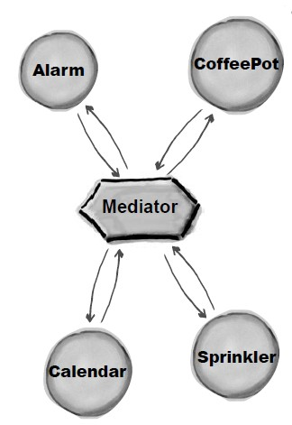

# 行为型 - 中介者(Mediator)

> 中介者模式(Mediator pattern) : 使用中介者模式来集中相关对象之间复杂的沟通和控制方式。@pdai


## 意图

集中相关对象之间复杂的沟通和控制方式。


## 实现

Alarm(闹钟)、CoffeePot(咖啡壶)、Calendar(日历)、Sprinkler(喷头)是一组相关的对象，在某个对象的事件产生时需要去操作其它对象，形成了下面这种依赖结构：


使用中介者模式可以将复杂的依赖结构变成星形结构：




- Mediator: 中介者，定义一个接口用于与各同事(Colleague)对象通信。
- Colleague: 同事，相关对象

```java
// 中介者
public abstract class Mediator {
    public abstract void doEvent(String eventType);
}
```

```java
// 同事
public abstract class Colleague {
    public abstract void onEvent(Mediator mediator);
}
```

```java
public class Alarm extends Colleague {

    @Override
    public void onEvent(Mediator mediator) {
        mediator.doEvent("alarm");
    }

    public void doAlarm() {
        System.out.println("doAlarm()");
    }
}
```

```java
public class CoffeePot extends Colleague {
    @Override
    public void onEvent(Mediator mediator) {
        mediator.doEvent("coffeePot");
    }

    public void doCoffeePot() {
        System.out.println("doCoffeePot()");
    }
}
```

```java
public class Calender extends Colleague {
    @Override
    public void onEvent(Mediator mediator) {
        mediator.doEvent("calender");
    }

    public void doCalender() {
        System.out.println("doCalender()");
    }
}
```

```java
public class Sprinkler extends Colleague {
    @Override
    public void onEvent(Mediator mediator) {
        mediator.doEvent("sprinkler");
    }

    public void doSprinkler() {
        System.out.println("doSprinkler()");
    }
}
```

```java
public class ConcreteMediator extends Mediator {
    private Alarm alarm;
    private CoffeePot coffeePot;
    private Calender calender;
    private Sprinkler sprinkler;

    public ConcreteMediator(Alarm alarm, CoffeePot coffeePot, Calender calender, Sprinkler sprinkler) {
        this.alarm = alarm;
        this.coffeePot = coffeePot;
        this.calender = calender;
        this.sprinkler = sprinkler;
    }

    @Override
    public void doEvent(String eventType) {
        switch (eventType) {
            case "alarm":
                doAlarmEvent();
                break;
            case "coffeePot":
                doCoffeePotEvent();
                break;
            case "calender":
                doCalenderEvent();
                break;
            default:
                doSprinklerEvent();
        }
    }

    public void doAlarmEvent() {
        alarm.doAlarm();
        coffeePot.doCoffeePot();
        calender.doCalender();
        sprinkler.doSprinkler();
    }

    public void doCoffeePotEvent() {
        // ...
    }

    public void doCalenderEvent() {
        // ...
    }

    public void doSprinklerEvent() {
        // ...
    }
}
```

```java
public class Client {
    public static void main(String[] args) {
        Alarm alarm = new Alarm();
        CoffeePot coffeePot = new CoffeePot();
        Calender calender = new Calender();
        Sprinkler sprinkler = new Sprinkler();
        Mediator mediator = new ConcreteMediator(alarm, coffeePot, calender, sprinkler);
        // 闹钟事件到达，调用中介者就可以操作相关对象
        alarm.onEvent(mediator);
    }
}
```


## JDK中的实现

- All scheduleXXX() methods of [java.util.Timer](http://docs.oracle.com/javase/8/docs/api/java/util/Timer.html)
- [java.util.concurrent.Executor#execute()](http://docs.oracle.com/javase/8/docs/api/java/util/concurrent/Executor.html#execute-java.lang.Runnable-)
- submit() and invokeXXX() methods of [java.util.concurrent.ExecutorService](http://docs.oracle.com/javase/8/docs/api/java/util/concurrent/ExecutorService.html)
- scheduleXXX() methods of [java.util.concurrent.ScheduledExecutorService](http://docs.oracle.com/javase/8/docs/api/java/util/concurrent/ScheduledExecutorService.html)
- [java.lang.reflect.Method#invoke()](http://docs.oracle.com/javase/8/docs/api/java/lang/reflect/Method.html#invoke-java.lang.Object-java.lang.Object...-)


> 著作权归https://pdai.tech所有。   
> 链接：https://www.pdai.tech/md/dev-spec/pattern/24_mediator.html


扩展阅读：

[重学 Java 设计模式：实战中介者模式「按照Mybatis原理手写ORM框架，给JDBC方式操作数据库增加中介者场景」](https://bugstack.cn/itstack-demo-design/2020/06/27/%E9%87%8D%E5%AD%A6-Java-%E8%AE%BE%E8%AE%A1%E6%A8%A1%E5%BC%8F-%E5%AE%9E%E6%88%98%E4%B8%AD%E4%BB%8B%E8%80%85%E6%A8%A1%E5%BC%8F.html)

[菜鸟教程-中介者模式](https://www.runoob.com/design-pattern/mediator-pattern.html)

