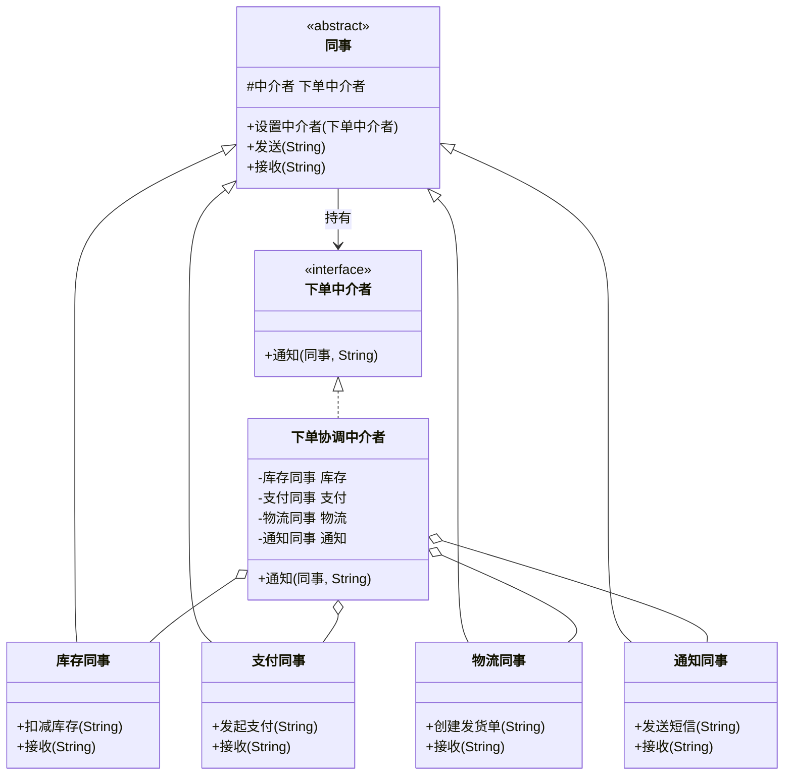

# 行为型 - 中介者(Mediator)

> 本文用「电商下单」业务主线统一重构，便于理解。来源：整理自 pdai.tech、bugstack.cn。

## 一句话定义

中介者模式：用**一个中间人**把一组对象之间错综复杂的「互相调用」收拢起来，让对象之间不再直接耦合，而是都通过中介者通信，把网状依赖变成星形依赖。

## 业务痛点：没有它会怎样

电商「下单成功」后要一连串动作：扣减库存、创建物流单、发短信通知用户、更新营销积分……

如果不引入中介者，这些服务会**互相直接依赖**：

```java
// 支付服务里直接 new 了三个兄弟服务，耦合爆表
class 支付服务 {
    void 支付成功(订单号) {
        库存服务.扣减(订单号);
        物流服务.创建发货单(订单号);
        通知服务.发短信(订单号, "已支付");
        积分服务.加积分(订单号);
    }
}
```

问题一大堆：

- **网状依赖、改一处炸一片**：支付服务直接认识库存、物流、通知、积分四个服务。哪天物流接口改签名，支付服务也得改；新增"风控校验"，又得回支付服务里加调用。
- **责任混乱**：支付服务本该只管收钱，却要操心"付完钱后面该怎么办"这一整套流程编排。
- **难复用、难测试**：想单独复用支付服务？不行，它硬绑着另外四个服务；单测支付还得把四个兄弟都 mock 上。

中介者模式的解法：让支付服务付完钱，**只告诉中介者「我支付成功了」**，具体"接下来扣库存、建物流、发短信"由中介者来协调。所有服务只认识中介者一个人，彼此互不认识——依赖从网变成星，改动被关进中介者内部。

## 结构


```mermaid
classDiagram
    class 同事 {
        <<abstract>>
        #中介者 下单中介者
        +设置中介者(下单中介者)
        +发送(String)
        +接收(String)
    }
    class 下单中介者 {
        <<interface>>
        +通知(同事, String)
    }
    class 下单协调中介者 {
        -库存同事 库存
        -支付同事 支付
        -物流同事 物流
        -通知同事 通知
        +通知(同事, String)
    }
    class 库存同事 {
        +扣减库存(String)
        +接收(String)
    }
    class 支付同事 {
        +发起支付(String)
        +接收(String)
    }
    class 物流同事 {
        +创建发货单(String)
        +接收(String)
    }
    class 通知同事 {
        +发送短信(String)
        +接收(String)
    }
    同事 <|-- 库存同事
    同事 <|-- 支付同事
    同事 <|-- 物流同事
    同事 <|-- 通知同事
    下单中介者 <|.. 下单协调中介者
    同事 --> 下单中介者 : 持有
    下单协调中介者 o-- 库存同事
    下单协调中介者 o-- 支付同事
    下单协调中介者 o-- 物流同事
    下单协调中介者 o-- 通知同事
```

| 角色 | 对应类 | 职责 |
| --- | --- | --- |
| 中介者接口 | `下单中介者` | 定义 `通知(同事, 事件)`，各同事通过它通信 |
| 具体中介者 | `下单协调中介者` | 持有所有同事引用，按事件编排协作流程（核心控制逻辑所在） |
| 同事抽象 | `同事` | 持有中介者引用，提供 `发送()`、`接收()` |
| 具体同事 | `库存同事`、`支付同事`、`物流同事`、`通知同事` | 各自只做自己的事；需要联动时只 `发送()` 给中介者，不直连兄弟 |

## 代码实现

用「支付成功后由中介者统一协调：扣库存、建物流、发短信」演示。注意支付同事**完全不认识**库存/物流/通知，它只认识中介者。

```java
// 中介者接口
interface 下单中介者 {
    void 通知(同事 来源, String 事件);
}

// 同事抽象
abstract class 同事 {
    protected 下单中介者 中介者;
    void 设置中介者(下单中介者 中介者) { this.中介者 = 中介者; }
    abstract void 发送(String 事件);
    abstract void 接收(String 消息);
}

// 支付同事：付完钱只通知中介者，不管后续
class 支付同事 extends 同事 {
    void 发起支付(String 订单号) {
        System.out.println("[支付] 订单 " + 订单号 + " 支付成功");
        发送("支付成功:" + 订单号);
    }
    @Override void 发送(String 事件) { 中介者.通知(this, 事件); }
    @Override void 接收(String 消息) { System.out.println("[支付] 收到中介者消息：" + 消息); }
}

// 库存同事
class 库存同事 extends 同事 {
    void 扣减库存(String 订单号) { System.out.println("[库存] 扣减订单 " + 订单号 + " 的库存"); }
    @Override void 发送(String 事件) { 中介者.通知(this, 事件); }
    @Override void 接收(String 消息) { System.out.println("[库存] 收到中介者消息：" + 消息); }
}

// 物流同事
class 物流同事 extends 同事 {
    void 创建发货单(String 订单号) { System.out.println("[物流] 为订单 " + 订单号 + " 创建发货单"); }
    @Override void 发送(String 事件) { 中介者.通知(this, 事件); }
    @Override void 接收(String 消息) { System.out.println("[物流] 收到中介者消息：" + 消息); }
}

// 通知同事
class 通知同事 extends 同事 {
    void 发送短信(String 订单号) { System.out.println("[通知] 向订单 " + 订单号 + " 用户发送支付成功短信"); }
    @Override void 发送(String 事件) { 中介者.通知(this, 事件); }
    @Override void 接收(String 消息) { System.out.println("[通知] 收到中介者消息：" + 消息); }
}

// 具体中介者：编排"支付成功"后的连带动作
class 下单协调中介者 implements 下单中介者 {
    private 库存同事 库存;
    private 支付同事 支付;
    private 物流同事 物流;
    private 通知同事 通知;

    void 注册(库存同事 库存, 支付同事 支付, 物流同事 物流, 通知同事 通知) {
        this.库存 = 库存; this.支付 = 支付; this.物流 = 物流; this.通知 = 通知;
    }

    @Override
    public void 通知(同事 来源, String 事件) {
        if (事件.startsWith("支付成功:") && 来源 instanceof 支付同事) {
            String 订单号 = 事件.split(":")[1];
            库存.扣减库存(订单号);
            物流.创建发货单(订单号);
            通知.发送短信(订单号);
        }
        // 其他事件（如"退款成功"）在此扩展即可，同事类无需改动
    }
}

// 演示
public class 中介者演示 {
    public static void main(String[] args) {
        下单协调中介者 中介者 = new 下单协调中介者();
        库存同事 库存 = new 库存同事();
        支付同事 支付 = new 支付同事();
        物流同事 物流 = new 物流同事();
        通知同事 通知 = new 通知同事();

        库存.设置中介者(中介者);
        支付.设置中介者(中介者);
        物流.设置中介者(中介者);
        通知.设置中介者(中介者);
        中介者.注册(库存, 支付, 物流, 通知);

        // 支付成功，后续流程全由中介者协调
        支付.发起支付("NO2024");
    }
}
```

运行输出：

```
[支付] 订单 NO2024 支付成功
[库存] 扣减订单 NO2024 的库存
[物流] 为订单 NO2024 创建发货单
[通知] 向订单 NO2024 用户发送支付成功短信
```

想新增"退款成功后恢复库存 + 发退款短信"，只需在中介者的 `通知()` 里加一个分支，四个同事类一行都不用动——这就是中介者带来的"流程编排集中化"。

## 什么时候该用 / 不该用

**该用：**

- 一组对象相互引用、通信关系复杂，已经或即将变成"蜘蛛网"。
- 想复用某个对象，却因为它硬依赖一堆兄弟对象而难以抽离。
- 某类协作流程需要集中管理、统一编排（如下单流程、工作流引擎）。

**不该用：**

- 对象间交互本来就很简单、只有一两个调用，硬加中介者反而多一层间接。
- 中介者本身容易变成"万能上帝类"，把所有逻辑堆一起变得臃肿——注意把中介者职责控制在"协调"而非"实现"。

## 优缺点

| 维度 | 说明 |
| --- | --- |
| 优点 | 1. 降低耦合：对象只依赖中介者，网状变星形；2. 集中控制：协作流程一处可管、易改；3. 更易复用与单测单个同事 |
| 缺点 | 1. 中介者可能膨胀成"上帝类"，职责过重；2. 间接层增加，调试链路变长；3. 逻辑过度集中，新人不易一眼看清全貌 |

## 与相似模式的对比

| 易混淆模式 | 关键区别 |
| --- | --- |
| 中介者 vs 观察者(Observer) | 观察者是一方变化、多方被动广播通知（松耦合、互不认识）；中介者是**主动协调**多方**协作完成一个流程**。观察者偏"通知"，中介者偏"编排" |
| 中介者 vs 外观(Facade) | 外观是为子系统提供统一简单入口（单向调用封装）；中介者是让多个对象**互相通过它通信**（双向协调） |
| 中介者 vs 责任链(Chain) | 责任链是请求沿链条单向传递、各自处理；中介者是中心节点把消息分发给相关对象 |

## 真实框架中的应用

- **`java.util.Timer`**：`Timer` 内部用 `TaskQueue` + 单线程调度，把一堆 `TimerTask` 的调度集中管理，是调度层面的"中介者"。
- **`java.util.concurrent.ExecutorService`**：提交任务后，由线程池统一分配线程、调度、回收，调用方不关心任务被哪个线程执行——调度中介者。
- **`java.lang.reflect.Method#invoke()`**：方法调用经反射统一中转，屏蔽了直接调用的差异。
- **Spring `DispatcherServlet`**：前端控制器接收所有请求，再分发给对应 `Controller`、拦截器、视图解析器，是典型的"请求中介者"。
- **Spring `ApplicationContext`**：充当 Bean 之间协作的中枢，很多 Bean 通过容器间接获取依赖、发布/接收事件。
- **MyBatis**：可参考 bugstack.cn《重学 Java 设计模式：实战中介者模式》——按 MyBatis 原理手写 ORM 框架，用中介者为 JDBC 操作增加中介者场景，把连接、执行、结果映射等步骤协调起来。

## 小结

中介者模式用一个中心节点收拢对象间的复杂通信，把网状依赖压成星形，让流程编排集中、对象各自解耦。它最容易踩的坑是中介者变成"上帝类"，控制好职责边界即可。

> 参考来源：整理自 pdai.tech（https://www.pdai.tech/md/dev-spec/pattern/24_mediator.html）、bugstack.cn（https://bugstack.cn/itstack-demo-design/2020/06/27/重学-Java-设计模式-实战中介者模式.html），本文重写示例与讲解（下单中介者协调库存/支付/物流/通知场景）。
