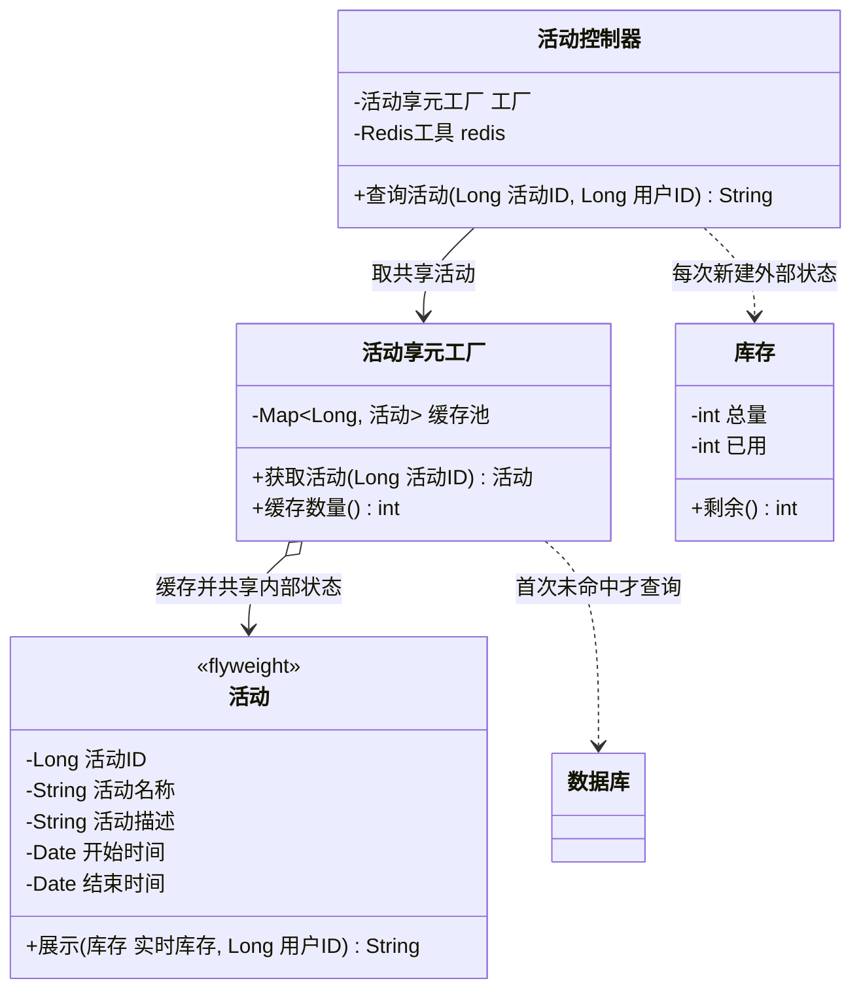

# 结构型 - 享元(Flyweight)（蝇量模式、轻量级模式）

> 本文用「电商下单」这条业务主线统一重构：一句话定义 → 业务痛点 → 结构（Mermaid 类图）→ 可运行代码 → 何时用/不用 → 优缺点 → 与相似模式对比 → 真实框架中的应用，便于理解。
> 来源：整理自 https://bugstack.cn ，本文重写示例与讲解。

---

## 一句话定义

**享元模式（Flyweight）**：当系统里存在**大量长得几乎一样的对象**时，把它们**相同的那部分**抽出来做成一份共享实例（放进"享元工厂"缓存起来反复用），把**每次都不一样的那部分**当作参数从外面传进去。用**共享**换**内存**。

一句大白话：**一万个人抢同一场秒杀活动，"活动标题、规则、起止时间"这些一模一样的东西，全服务器共用一份就够了；"你还剩多少库存能抢"这种每次都变的，才实时去查。**

> 别名提醒：享元模式又叫**蝇量模式**、**轻量级模式**。Flyweight 本是拳击的"蝇量级"，取"极轻"之意。核心口诀：**内部状态共享，外部状态外传。**

---

## 业务痛点：没有它会怎样

大促期间，电商 App 的活动页 QPS 打到 5 万。每次请求都要返回一个"活动信息 + 实时库存"给前端：

```java
// 反面教材：每次请求都 new 一个完整对象，还要查一次数据库
public 活动 查询活动(Long 活动ID) {
    活动 活动对象 = 活动DAO.查数据库(活动ID);   // ← 5 万 QPS 全打到 DB，直接打挂
    活动对象.设置库存(new 库存(1000, 已用库存));
    return 活动对象;
}
```

问题在哪？把一个"活动"对象拆开看：

| 字段 | 一万次请求里会变吗？ | 性质 |
|------|-------------------|------|
| 活动ID、活动名称、活动描述 | **永远不变** | 可共享 |
| 开始时间、结束时间、活动规则 | **永远不变** | 可共享 |
| 剩余库存、已抢数量 | **每秒都在变** | 不可共享 |
| 当前用户ID、是否已参与 | **每次请求都不同** | 不可共享 |

痛点：

| 问题 | 说明 |
|------|------|
| **内存浪费严重** | 5 万个活动对象，里面 90% 的字段内容一模一样，纯属复制粘贴 |
| **GC 压力大** | 短生命周期的大对象疯狂创建又疯狂回收，Young GC 频繁，STW 时间上涨 |
| **重复查询 DB/RPC** | 那些永远不变的字段，却被反复从数据库里捞出来，白白消耗连接和带宽 |
| **响应变慢** | 对象创建 + IO 查询叠加，接口 RT 居高不下 |

**享元模式的解法**：把活动对象拆成两半——

- **内部状态（Intrinsic）**：活动名称、描述、起止时间。与使用场景无关，**放进享元工厂缓存，全局共用一份**；
- **外部状态（Extrinsic）**：实时库存、当前用户。与场景强相关，**每次调用时从外面传进来，绝不存进享元对象**。

这样 5 万次请求只有 **1 个**活动享元对象常驻内存，DB 也只被查了 **1 次**。

---

## 结构（Mermaid 类图）



**角色职责**

| 角色 | 类图中对应 | 职责 |
|------|-----------|------|
| Flyweight（享元） | `活动` | 只保存**内部状态**（不变的部分），方法通过参数接收外部状态；**必须不可变** |
| FlyweightFactory（享元工厂） | `活动享元工厂` | 用 `Map` 维护享元池，**有则复用、无则创建**，是模式的核心枢纽 |
| ExtrinsicState（外部状态） | `库存`、`用户ID` | 随场景变化，**由调用方持有并传入**，绝不能存进享元对象 |
| Client（调用方） | `活动控制器` | 从工厂取享元，自己准备外部状态，组装出完整结果 |

**内部状态 vs 外部状态 —— 这是享元模式的全部关键**

| 对比项 | 内部状态（Intrinsic） | 外部状态（Extrinsic） |
|--------|---------------------|---------------------|
| 是否随环境变化 | 否，恒定不变 | 是，每次调用都可能不同 |
| 存放位置 | **存在享元对象内部**，被所有调用方共享 | **不存**，由调用方通过方法参数传入 |
| 本例 | 活动名称、描述、起止时间 | 实时库存、当前用户ID |
| 字体例子 | 字符编码、字体族、字号（同一个"A"字形） | 屏幕上的 x/y 坐标、颜色 |
| 线程安全 | 必须**只读/不可变**，否则会串数据 | 天然线程隔离（栈上参数） |

> **划分错了就是生产事故**：一旦把"库存"当成内部状态存进共享对象，A 用户的库存变化会立刻污染 B 用户看到的数据。**享元对象必须是不可变的（immutable）**，这是铁律。

---

## 代码实现（秒杀活动 + 实时库存）

**第一步：享元对象——只装内部状态，且不可变**

```java
import java.util.Date;
import java.util.Map;
import java.util.concurrent.ConcurrentHashMap;
import java.util.concurrent.atomic.AtomicInteger;

/**
 * Flyweight：活动享元。
 * 所有字段 final，构造后不可修改 —— 这是共享安全的前提。
 * 注意：这里没有 库存 字段！库存是外部状态。
 */
public final class 活动 {

    private final Long 活动ID;
    private final String 活动名称;
    private final String 活动描述;
    private final Date 开始时间;
    private final Date 结束时间;

    public 活动(Long 活动ID, String 活动名称, String 活动描述, Date 开始时间, Date 结束时间) {
        this.活动ID = 活动ID;
        this.活动名称 = 活动名称;
        this.活动描述 = 活动描述;
        this.开始时间 = new Date(开始时间.getTime());   // 防御性拷贝，杜绝外部改动
        this.结束时间 = new Date(结束时间.getTime());
    }

    /**
     * 关键方法：外部状态通过参数传进来，不保存到字段里。
     * @param 实时库存 外部状态
     * @param 用户ID   外部状态
     */
    public String 展示(库存 实时库存, Long 用户ID) {
        return "活动[" + 活动ID + "] " + 活动名称
                + " | " + 活动描述
                + " | 剩余库存=" + 实时库存.剩余()
                + " | 当前用户=" + 用户ID
                + " | 享元对象哈希=" + System.identityHashCode(this);
    }

    public Long 取活动ID() { return 活动ID; }
    public String 取活动名称() { return 活动名称; }
}
```

**第二步：外部状态——每次都不同，独立创建**

```java
/** 外部状态：库存实时变化，绝不能存进享元对象 */
public class 库存 {

    private final int 总量;
    private final int 已用;

    public 库存(int 总量, int 已用) {
        this.总量 = 总量;
        this.已用 = 已用;
    }

    public int 剩余() { return Math.max(总量 - 已用, 0); }
}
```

**第三步：享元工厂——模式的心脏**

```java
/**
 * FlyweightFactory：享元工厂。
 * 用 ConcurrentHashMap 做享元池，保证「同一个活动ID，全局只有一个对象」。
 */
public class 活动享元工厂 {

    /** 享元池：key = 活动ID，value = 共享的活动对象 */
    private static final Map<Long, 活动> 缓存池 = new ConcurrentHashMap<>();

    /** 统计真正查库次数，用于验证享元效果 */
    private static final AtomicInteger 查库次数 = new AtomicInteger(0);

    /**
     * 有则复用，无则创建 —— 这就是享元工厂的全部职责。
     * computeIfAbsent 保证并发下只会创建一次。
     */
    public static 活动 获取活动(Long 活动ID) {
        return 缓存池.computeIfAbsent(活动ID, id -> {
            查库次数.incrementAndGet();
            System.out.println(">>> 享元池未命中，第 " + 查库次数.get() + " 次查询数据库，活动ID=" + id);
            return 从数据库加载(id);
        });
    }

    /** 模拟一次昂贵的 DB / RPC 查询 */
    private static 活动 从数据库加载(Long 活动ID) {
        long 现在 = System.currentTimeMillis();
        return new 活动(活动ID,
                "618 图书嗨乐",
                "图书优惠券分享激励活动第二期",
                new Date(现在),
                new Date(现在 + 7 * 24 * 3600_000L));
    }

    public static int 缓存数量() { return 缓存池.size(); }
    public static int 取查库次数() { return 查库次数.get(); }
}
```

**第四步：调用方——组合内部状态与外部状态**

```java
/** 模拟 Redis：库存是实时变化的 */
class Redis工具 {
    private int 已用 = 0;
    public int 取已用库存() { return ++已用; }   // 每查一次就多卖出一件
}

public class 活动控制器 {

    private final Redis工具 redis = new Redis工具();

    public String 查询活动(Long 活动ID, Long 用户ID) {
        活动 共享活动 = 活动享元工厂.获取活动(活动ID);          // ① 内部状态：全局共享
        库存 实时库存 = new 库存(1000, redis.取已用库存());     // ② 外部状态：每次新建
        return 共享活动.展示(实时库存, 用户ID);                 // ③ 组装
    }

    public static void main(String[] args) {
        活动控制器 控制器 = new 活动控制器();

        // 模拟 5 个用户先后访问同一个活动
        for (long 用户ID = 10001L; 用户ID <= 10005L; 用户ID++) {
            System.out.println(控制器.查询活动(100L, 用户ID));
        }

        System.out.println("\n享元池对象数：" + 活动享元工厂.缓存数量());
        System.out.println("实际查库次数：" + 活动享元工厂.取查库次数());
    }
}
```

运行输出：

```java
// >>> 享元池未命中，第 1 次查询数据库，活动ID=100
// 活动[100] 618 图书嗨乐 | 图书优惠券分享激励活动第二期 | 剩余库存=999 | 当前用户=10001 | 享元对象哈希=1836019240
// 活动[100] 618 图书嗨乐 | 图书优惠券分享激励活动第二期 | 剩余库存=998 | 当前用户=10002 | 享元对象哈希=1836019240
// 活动[100] 618 图书嗨乐 | 图书优惠券分享激励活动第二期 | 剩余库存=997 | 当前用户=10003 | 享元对象哈希=1836019240
// 活动[100] 618 图书嗨乐 | 图书优惠券分享激励活动第二期 | 剩余库存=996 | 当前用户=10004 | 享元对象哈希=1836019240
// 活动[100] 618 图书嗨乐 | 图书优惠券分享激励活动第二期 | 剩余库存=995 | 当前用户=10005 | 享元对象哈希=1836019240
//
// 享元池对象数：1
// 实际查库次数：1
```

**结果解读：**

1. **`享元对象哈希` 五次完全相同** → 5 个用户共用同一个 `活动` 实例，内存里只有 1 份；
2. **`剩余库存` 每次都不同** → 外部状态独立，用户之间不会互相污染；
3. **查库次数 = 1** → 无论多少 QPS，数据库只被打了一次。

**附：另一个经典切面——字体享元**

```java
/** 内部状态：字体族 + 字号 + 粗细，可能只有几十种组合 */
public final class 字体 {
    private final String 字体族;
    private final int 字号;
    private final boolean 加粗;

    public 字体(String 字体族, int 字号, boolean 加粗) {
        this.字体族 = 字体族; this.字号 = 字号; this.加粗 = 加粗;
    }

    /** 外部状态：字符本身、坐标、颜色，每个字都不同 */
    public void 绘制(char 字符, int x, int y, String 颜色) {
        System.out.println("在(" + x + "," + y + ")用 " + 字体族 + "-" + 字号
                + (加粗 ? "-粗体" : "") + " " + 颜色 + " 绘制字符：" + 字符);
    }
}

public class 字体工厂 {
    private static final Map<String, 字体> 池 = new ConcurrentHashMap<>();

    public static 字体 获取(String 字体族, int 字号, boolean 加粗) {
        String key = 字体族 + "|" + 字号 + "|" + 加粗;
        return 池.computeIfAbsent(key, k -> new 字体(字体族, 字号, 加粗));
    }
}
```

一篇十万字的商品详情页，字符对象有十万个，但字体对象可能只有 5 个——这就是享元在渲染场景的价值。

---

## 什么时候该用 / 不该用

**该用：**

- 系统中存在**海量细粒度对象**，且它们**绝大部分状态相同**（活动配置、字典数据、地区编码、商品类目、字体/图元）；
- 对象的**创建代价高**（要查库、要走 RPC、要解析大文件），而内容又基本不变；
- 能清晰地把状态划分为**内部状态**和**外部状态**，且外部状态数量不大、传参不麻烦；
- 典型工程实现：**数据库连接池、线程池、字符串常量池、`Integer` 缓存、字典缓存**。

**不该用：**

- 对象数量本来就不多——加个享元工厂纯属自找麻烦，还多一层 Map 查找开销；
- **内部状态与外部状态难以剥离**，或者外部状态又多又复杂（传参列表长到离谱），代码可读性会急剧下降；
- 对象**本身就是可变的、需要独立生命周期**（比如每个订单对象），强行共享必然出数据串号事故；
- 缓存的数据**会失效或需要更新**，而你没有设计淘汰/刷新机制——享元池会变成一个永不过期的**内存泄漏点**（活动结束了对象还赖在 Map 里）。

---

## 优缺点

| 优点 | 缺点 |
|------|------|
| **大幅降低内存占用**，对象数从 N 降到常量级 | 系统复杂度上升，多了工厂与状态划分的心智负担 |
| **减少重复的 DB / RPC 查询**，提升响应速度 | **必须正确划分内外部状态**，划错就是数据串号事故 |
| 降低 GC 压力，减少 Young GC 频率与 STW | 享元对象**必须不可变**，牺牲了灵活性 |
| 享元池集中管理，便于统一监控与预热 | 外部状态需层层传参，**方法签名变长**，可读性下降 |
| 与组合、工厂等模式配合良好 | 池无淘汰策略会**内存泄漏**；池并发访问需保证线程安全 |

---

## 与相似模式的对比

| 对比项 | 享元(Flyweight) | 单例(Singleton) | 原型(Prototype) | 对象池(Object Pool) | 组合(Composite) |
|--------|----------------|----------------|----------------|-------------------|----------------|
| 核心目的 | **共享**大量细粒度对象省内存 | 全局**唯一**实例 | **克隆**避免重复构造 | **复用**昂贵资源 | **组织**成树 |
| 实例数量 | 每种内部状态一个（多个） | **全局仅 1 个** | 每次克隆产生新对象 | 池中若干个 | 任意 |
| 对象可变性 | **必须不可变** | 通常可变 | 可变 | 可变（用完归还重置） | 可变 |
| 用完是否归还 | 不需要，一直驻留 | 不需要 | 不需要 | **必须归还** | 不需要 |
| 是否区分内外部状态 | **是，这是核心** | 否 | 否 | 否 | 否 |
| 一句话记忆 | 共用一份 | 只有一个 | 复制一份 | 借了要还 | 一棵树 |

**最容易混的三组，重点说：**

- **享元 vs 单例**：单例是"整个系统就这一个对象"；享元是"**每一类**内部状态各有一个对象，可能有几十几百个"。享元工厂本身经常做成单例，但两者不是一回事。
- **享元 vs 原型**：思路正好相反。原型模式通过**克隆**避免昂贵的构造过程，得到的是**互相独立的新对象**；享元通过**共享**避免创建，得到的是**同一个对象**。两者都为了性能，一个"复制"，一个"共用"。
- **享元 vs 对象池（连接池/线程池）**：对象池强调**独占借用 + 用完归还**，池中对象是可变的、有状态的；享元强调**并发共享 + 无需归还**，享元对象是不可变的。数据库连接池严格说更接近对象池，但业界常把它当作享元思想的工程体现。
- **享元 + 组合**：两者常搭配。组合模式的树里若有大量重复叶子（同一个 SKU 挂在多个类目下），可以让叶子成为享元对象，**组合管结构，享元管实例复用**。

---

## 真实框架中的应用

**1. JDK：`Integer` 的 `IntegerCache`（面试必考）**

```java
Integer a = 127, b = 127;
System.out.println(a == b);      // true  ← 命中缓存，是同一个对象

Integer c = 128, d = 128;
System.out.println(c == d);      // false ← 超出缓存范围，各自 new
```

`Integer.valueOf()` 内部维护了 `-128 ~ 127` 的享元池：

```java
public static Integer valueOf(int i) {
    if (i >= IntegerCache.low && i <= IntegerCache.high) {
        return IntegerCache.cache[i + (-IntegerCache.low)];   // 共享
    }
    return new Integer(i);
}
```

因为小整数在程序中出现频率极高，缓存它们收益巨大。上界还可通过 `-XX:AutoBoxCacheMax=1000` 调整。`Byte`、`Short`、`Long`、`Character`、`Boolean` 都有类似缓存。**这也是为什么包装类比较必须用 `equals()` 而不是 `==`。**

**2. JDK：`String` 常量池**

```java
String s1 = "秒杀活动";
String s2 = "秒杀活动";
System.out.println(s1 == s2);            // true，共享常量池中同一份

String s3 = new String("秒杀活动");
System.out.println(s1 == s3);            // false
System.out.println(s1 == s3.intern());   // true，intern() 主动入池
```

字符串字面量是最典型的享元：内容（内部状态）不可变，全 JVM 共享一份。`String` 被设计成 `final` 且不可变，正是共享安全的前提。

**3. JDK：`Long.valueOf` / `Boolean.valueOf` / `Character.valueOf`**

`Boolean.valueOf(true)` 永远返回 `Boolean.TRUE` 这个静态常量，一个 JVM 里只有两个 `Boolean` 对象。

**4. 数据库连接池（HikariCP / Druid）与线程池**

创建一个数据库连接要走 TCP 三次握手 + 认证，代价极高。连接池把连接（内部状态：数据库地址、账号、驱动配置）缓存复用，SQL 语句和参数（外部状态）每次传入。线程池同理：线程的创建与销毁昂贵，池化后复用，`Runnable` 任务作为外部状态传入 `execute()`。

**5. Spring：单例 Bean 与 `singletonObjects` 一级缓存**

Spring 容器默认的 singleton 作用域，本质上是"按 beanName 共享实例"。`DefaultSingletonBeanRegistry` 内部就是一个 `Map<String, Object> singletonObjects` 享元池，`getBean()` 时先查缓存，没有才走完整的创建流程——和 `活动享元工厂.获取活动()` 的逻辑一模一样。这也解释了为什么**单例 Bean 不能有可变的实例字段**：共享对象必须无状态，否则线程间会串数据，这与享元的"不可变"铁律完全一致。

**6. MyBatis：`Configuration` 与 `TypeHandler` 注册表**

MyBatis 启动时解析 XML 得到一个 `Configuration` 对象，其中 `MappedStatement`（每条 SQL 的元信息）、`TypeHandler`（类型转换器）、`ResultMap` 都是内部状态固定的对象，被全局共享复用。执行 SQL 时传入的参数对象则是外部状态。若每次执行都重新解析一遍 XML，性能会灾难性下降。

**7. 游戏与图形渲染**

森林里十万棵树，`树` 对象只需要按"树种"缓存几个（模型网格、纹理是内部状态），每棵树的坐标、缩放、旋转角度作为外部状态传入渲染方法。这是享元模式在客户端最经典的应用，能把几百 MB 的显存占用压到几 MB。

**8. 业务缓存：本地字典缓存 / Redis 共享**

活动配置、地区编码、商品类目、汇率表这类"读多写极少"的数据，用 `ConcurrentHashMap` 或 Caffeine 在应用内做享元池是最常见的落地方式。若要跨节点共享，就把享元池换成 Redis——原文提到的正是这种做法：**享元的思想不变，只是存储介质从堆内存换成了远程缓存。** 但要记得配上过期时间或主动刷新机制，否则活动下线了对象还占着内存。

---

## 小结

享元模式是**用空间换时间之外的另一条路——用共享省空间**。它的全部功夫都在一件事上：**把对象拆成"永远不变的"和"每次都变的"两半，前者共享，后者外传。** 只要你在生产环境里看到"同一份配置被查了几万次""内存里塞满了内容雷同的对象"，就该考虑享元了。落地时死守两条纪律：**享元对象必须不可变**，**享元池必须有边界或过期策略**，否则省下的内存会以内存泄漏的形式加倍还回来。

---

> 参考来源：整理自 https://bugstack.cn 《重学 Java 设计模式：实战享元模式「基于 Redis 秒杀，提供活动与库存信息查询场景」》（著作权归 bugstack.cn 所有），并综合公开资料，本文重写示例与讲解。
