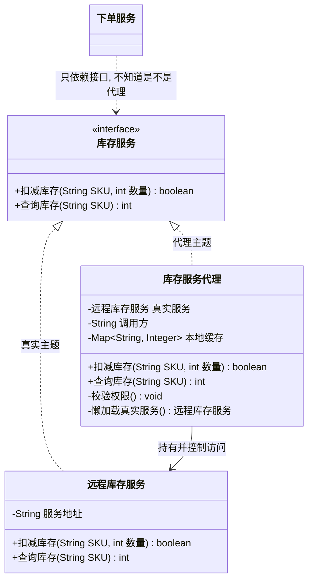

# 结构型 - 代理(Proxy)（委托模式、Surrogate 替身模式）

> 本文用「电商下单」这条业务主线统一重构：一句话定义 → 业务痛点 → 结构（Mermaid 类图）→ 可运行代码 → 何时用/不用 → 优缺点 → 与相似模式对比 → 真实框架中的应用，便于理解。
> 来源：整理自菜鸟教程 runoob.com 与公开资料，本文重写示例与讲解。

---

## 一句话定义

**代理模式（Proxy）**：给一个对象找一个**替身**站在它前面，所有对它的访问都**先经过替身**。替身和本体长得一模一样（实现同一个接口），所以调用方察觉不到差别，但替身可以在放行前后做点手脚——鉴权、记日志、走缓存、延迟创建、发远程调用。

一句大白话：**你不能直接找库存服务，得先过我这道门。我先看看你有没有权限、结果有没有缓存、要不要记一笔日志，然后才决定要不要真的去叫他。**

> 别名提醒：代理模式又叫**委托模式**、**替身模式（Surrogate）**。核心口诀：**接口不变，加的是"管控"，不是"功能"。**

---

## 业务痛点：没有它会怎样

电商下单要扣库存。库存服务是**独立部署的远程微服务**，调用它要考虑一堆非业务的事：

- **网络调用很贵**：不是每次都要真的发起 RPC，能懒加载就懒加载；
- **必须鉴权**：不是谁都能扣库存，得校验调用方身份；
- **要留痕**：每次扣减都要打日志、记耗时，方便排查线上问题；
- **要缓存**：查询类接口结果可以缓存几秒，扛住大促流量；
- **要熔断降级**：下游挂了要有兜底。

如果没有代理，这些逻辑只能塞进业务代码：

```java
// 反面教材：业务逻辑被非业务代码淹没
public void 下单(订单 订单) {
    long 开始 = System.currentTimeMillis();
    if (!当前用户.有权限("STOCK_DEDUCT")) {              // 鉴权
        throw new RuntimeException("无库存操作权限");
    }
    log.info("准备扣减库存 sku={}", 订单.取SKU());        // 日志
    try {
        库存服务.扣减(订单.取SKU(), 订单.取数量());        // ← 真正的业务只有这一行
    } catch (Exception e) {
        log.error("扣减库存失败", e);                     // 异常处理
        throw e;
    } finally {
        log.info("耗时={}ms", System.currentTimeMillis() - 开始);   // 埋点
    }
    // 后面还有支付、物流……每个都要重复上面这一坨
}
```

痛点：

| 问题 | 说明 |
|------|------|
| **业务代码被污染** | 10 行代码里只有 1 行是业务，其余全是鉴权/日志/埋点 |
| **横切逻辑到处复制** | 每个调远程服务的地方都抄一遍，改一次日志格式要改几十处 |
| **无法统一管控** | 想给所有远程调用加个限流？只能全局搜索逐个改 |
| **对象创建开销无法优化** | 有些重对象（大图片、远程连接）明明可能用不上，却在一开始就创建了 |
| **违反单一职责与开闭原则** | 业务类同时承担了业务和治理职责 |

**代理模式的解法**：造一个和库存服务**实现同一接口**的代理类，把这些横切逻辑收进代理里。调用方拿到的还是 `库存服务` 类型，写法一模一样，但所有管控自动生效。

---

## 结构（Mermaid 类图）



**角色职责**

| 角色 | 类图中对应 | 职责 |
|------|-----------|------|
| Subject（抽象主题） | `库存服务` | 真实对象与代理**共同的接口**，保证两者可互换——这是代理透明的前提 |
| RealSubject（真实主题） | `远程库存服务` | 真正干活的对象，只关心业务，**不掺任何治理逻辑** |
| Proxy（代理） | `库存服务代理` | 持有真实主题引用，在转发调用**前后**插入控制逻辑，也可决定**不转发** |
| Client（调用方） | `下单服务` | 面向 `库存服务` 接口编程，**不知道也不需要知道**自己拿的是代理 |

**代理的常见分类**

| 类型 | 解决什么问题 | 电商实例 |
|------|-------------|---------|
| **远程代理**（Remote） | 隐藏对象在另一台机器上的事实 | Dubbo/Feign 生成的接口代理，本地调用像调本地方法 |
| **虚拟代理**（Virtual） | 延迟创建开销大的对象 | 商品详情页的高清大图，滚动到才真正加载 |
| **保护代理**（Protection） | 按权限控制访问 | 只有运营角色才能调"改价"接口 |
| **缓存代理**（Cache） | 缓存结果，避免重复计算/查询 | 库存查询结果缓存 3 秒 |
| **智能引用代理**（Smart Reference） | 附加引用计数、日志、锁等额外动作 | 调用埋点、耗时统计 |
| **写时复制代理**（Copy-on-Write） | 真正修改时才复制 | `CopyOnWriteArrayList` 的思想 |
| **防火墙代理 / 同步代理** | 拦截非法请求 / 并发控制 | 网关限流、分布式锁包装 |

**静态代理 vs 动态代理**

| 对比项 | 静态代理 | JDK 动态代理 | CGLIB 动态代理 |
|--------|---------|-------------|---------------|
| 代理类产生时机 | **编译期**由程序员手写 | **运行期**由 JVM 生成字节码 | **运行期**用 ASM 生成子类 |
| 是否需要接口 | 需要（约定俗成） | **必须有接口** | **不需要接口**，靠继承 |
| 实现核心 | 手写转发代码 | `Proxy.newProxyInstance` + `InvocationHandler` | `Enhancer` + `MethodInterceptor` |
| 一个代理能管几个类 | 1 个（一对一） | **任意多个**（一对多） | 任意多个 |
| 局限 | 接口方法一多就写到手抽筋，类数量翻倍 | 只能代理接口方法 | 不能代理 `final` 类和 `final`/`private` 方法 |
| 性能 | 最快（无反射） | 早期慢，JDK 8 后已很快 | 创建慢、调用快 |

---

## 代码实现（库存服务远程调用代理）

**第一步：抽象主题——真实对象与代理的共同接口**

```java
/** Subject：库存服务接口，代理与真实实现都要实现它 */
public interface 库存服务 {
    /** 扣减库存 */
    boolean 扣减库存(String SKU, int 数量);
    /** 查询可用库存 */
    int 查询库存(String SKU);
}
```

**第二步：真实主题——只管业务，干净利落**

```java
/**
 * RealSubject：真正的远程库存服务。
 * 假设构造它需要建立连接池、加载路由表，开销很大。
 */
public class 远程库存服务 implements 库存服务 {

    private final String 服务地址;

    public 远程库存服务(String 服务地址) {
        this.服务地址 = 服务地址;
        // 模拟昂贵的初始化：建连接、拉配置
        System.out.println("[真实服务] 正在连接 " + 服务地址 + " ...（耗时操作）");
        睡(300);
        System.out.println("[真实服务] 连接建立完成");
    }

    @Override
    public boolean 扣减库存(String SKU, int 数量) {
        System.out.println("[真实服务] RPC 扣减库存 sku=" + SKU + " 数量=" + 数量);
        睡(50);
        return true;
    }

    @Override
    public int 查询库存(String SKU) {
        System.out.println("[真实服务] RPC 查询库存 sku=" + SKU);
        睡(50);
        return 999;
    }

    private static void 睡(long 毫秒) {
        try { Thread.sleep(毫秒); } catch (InterruptedException e) { Thread.currentThread().interrupt(); }
    }
}
```

**第三步：静态代理——延迟加载 + 权限校验 + 调用日志 + 结果缓存**

```java
import java.util.HashMap;
import java.util.Map;
import java.util.Set;

/**
 * Proxy：库存服务代理。
 * 一个类里同时演示四种代理职责：虚拟(懒加载)、保护(鉴权)、智能引用(日志)、缓存。
 * 真实项目中建议拆成多个代理层层包装，这里为了对照方便合在一起。
 */
public class 库存服务代理 implements 库存服务 {

    private 远程库存服务 真实服务;                  // 注意：一开始是 null，用到才创建
    private final String 服务地址;
    private final String 调用方;
    private final Set<String> 调用方权限;
    private final Map<String, Integer> 本地缓存 = new HashMap<>();

    public 库存服务代理(String 服务地址, String 调用方, Set<String> 调用方权限) {
        this.服务地址 = 服务地址;
        this.调用方 = 调用方;
        this.调用方权限 = 调用方权限;
        System.out.println("[代理] 代理对象已创建（此时尚未连接远程服务）");
    }

    /** ① 虚拟代理：第一次真正需要时才创建真实对象 */
    private 远程库存服务 懒加载真实服务() {
        if (真实服务 == null) {
            System.out.println("[代理] 首次调用，开始初始化真实服务");
            真实服务 = new 远程库存服务(服务地址);
        }
        return 真实服务;
    }

    /** ② 保护代理：权限校验，不通过直接拒绝，根本不转发 */
    private void 校验权限(String 需要的权限) {
        if (!调用方权限.contains(需要的权限)) {
            throw new SecurityException("调用方[" + 调用方 + "]缺少权限：" + 需要的权限);
        }
        System.out.println("[代理] 权限校验通过：" + 需要的权限);
    }

    @Override
    public boolean 扣减库存(String SKU, int 数量) {
        校验权限("STOCK_DEDUCT");                                  // 前置：鉴权
        long 开始 = System.currentTimeMillis();
        System.out.println("[代理] >>> 调用 扣减库存, sku=" + SKU + ", 数量=" + 数量);
        try {
            boolean 结果 = 懒加载真实服务().扣减库存(SKU, 数量);      // 转发给真实对象
            本地缓存.remove(SKU);                                   // 写操作后让缓存失效
            return 结果;
        } finally {
            // ③ 智能引用代理：后置埋点
            System.out.println("[代理] <<< 调用结束, 耗时=" + (System.currentTimeMillis() - 开始) + "ms");
        }
    }

    @Override
    public int 查询库存(String SKU) {
        校验权限("STOCK_QUERY");
        // ④ 缓存代理：命中缓存就不走远程了
        Integer 缓存值 = 本地缓存.get(SKU);
        if (缓存值 != null) {
            System.out.println("[代理] 缓存命中 sku=" + SKU + " -> " + 缓存值 + "（未发起 RPC）");
            return 缓存值;
        }
        int 库存 = 懒加载真实服务().查询库存(SKU);
        本地缓存.put(SKU, 库存);
        return 库存;
    }
}
```

**第四步：调用方——完全无感知**

```java
import java.util.HashSet;
import java.util.Arrays;

public class 下单服务 {

    private final 库存服务 库存;      // ← 声明为接口，不关心是代理还是真身

    public 下单服务(库存服务 库存) {
        this.库存 = 库存;
    }

    public void 下单(String SKU, int 数量) {
        int 可用 = 库存.查询库存(SKU);
        if (可用 < 数量) {
            System.out.println("库存不足，下单失败");
            return;
        }
        库存.扣减库存(SKU, 数量);
        System.out.println("下单成功：sku=" + SKU + " 数量=" + 数量);
    }

    public static void main(String[] args) {
        // 有全部权限的调用方
        库存服务 代理 = new 库存服务代理("stock-service://10.0.0.8:8080", "order-service",
                new HashSet<>(Arrays.asList("STOCK_QUERY", "STOCK_DEDUCT")));

        System.out.println("=== 代理已创建，但远程连接还没建立 ===\n");

        下单服务 服务 = new 下单服务(代理);
        服务.下单("SKU-8888", 2);

        System.out.println("\n=== 再查一次，走缓存 ===");
        代理.查询库存("SKU-8888");

        System.out.println("\n=== 无权限调用方 ===");
        库存服务 只读代理 = new 库存服务代理("stock-service://10.0.0.8:8080", "report-service",
                new HashSet<>(Arrays.asList("STOCK_QUERY")));
        try {
            只读代理.扣减库存("SKU-8888", 1);
        } catch (SecurityException e) {
            System.out.println("拦截成功：" + e.getMessage());
        }
    }
}
```

运行输出：

```java
// [代理] 代理对象已创建（此时尚未连接远程服务）
// === 代理已创建，但远程连接还没建立 ===
//
// [代理] 权限校验通过：STOCK_QUERY
// [代理] 首次调用，开始初始化真实服务
// [真实服务] 正在连接 stock-service://10.0.0.8:8080 ...（耗时操作）
// [真实服务] 连接建立完成
// [真实服务] RPC 查询库存 sku=SKU-8888
// [代理] 权限校验通过：STOCK_DEDUCT
// [代理] >>> 调用 扣减库存, sku=SKU-8888, 数量=2
// [真实服务] RPC 扣减库存 sku=SKU-8888 数量=2
// [代理] <<< 调用结束, 耗时=51ms
// 下单成功：sku=SKU-8888 数量=2
//
// === 再查一次，走缓存 ===
// [代理] 权限校验通过：STOCK_QUERY
// [真实服务] RPC 查询库存 sku=SKU-8888
//
// === 无权限调用方 ===
// [代理] 代理对象已创建（此时尚未连接远程服务）
// 拦截成功：调用方[report-service]缺少权限：STOCK_DEDUCT
```

**第五步：动态代理——不想为每个接口手写代理类**

静态代理有个致命缺点：**每个接口都要手写一个代理类**，接口一多就写到崩溃，而且日志、鉴权这类逻辑在每个代理里重复。JDK 动态代理可以在**运行时**生成代理类：

```java
import java.lang.reflect.InvocationHandler;
import java.lang.reflect.Method;
import java.lang.reflect.Proxy;

/** 通用调用处理器：所有接口共用这一套治理逻辑 */
public class 日志耗时处理器 implements InvocationHandler {

    private final Object 真实对象;

    public 日志耗时处理器(Object 真实对象) {
        this.真实对象 = 真实对象;
    }

    @Override
    public Object invoke(Object 代理对象, Method 方法, Object[] 参数) throws Throwable {
        long 开始 = System.currentTimeMillis();
        System.out.println("[动态代理] >>> " + 方法.getName() + " 入参=" + java.util.Arrays.toString(参数));
        try {
            Object 结果 = 方法.invoke(真实对象, 参数);     // 反射转发
            System.out.println("[动态代理] <<< " + 方法.getName() + " 返回=" + 结果);
            return 结果;
        } finally {
            System.out.println("[动态代理] 耗时=" + (System.currentTimeMillis() - 开始) + "ms");
        }
    }

    /** 工厂方法：给任意接口生成代理，一套逻辑管所有接口 */
    @SuppressWarnings("unchecked")
    public static <T> T 创建代理(T 真实对象, Class<T> 接口类型) {
        return (T) Proxy.newProxyInstance(
                接口类型.getClassLoader(),
                new Class[]{接口类型},
                new 日志耗时处理器(真实对象));
    }

    public static void main(String[] args) {
        库存服务 真身 = new 远程库存服务("stock-service://10.0.0.8:8080");
        库存服务 代理 = 创建代理(真身, 库存服务.class);
        代理.查询库存("SKU-8888");      // 自动带上日志和耗时统计
    }
}
```

**动态代理的价值**：`创建代理()` 这一个方法，可以给系统里**所有**接口套上日志、鉴权、事务、限流——这正是 Spring AOP 的底层原理。

---

## 什么时候该用 / 不该用

**该用：**

- 需要在**不改动原有类**的前提下，为访问加上**控制逻辑**：鉴权、限流、审计、缓存、事务、重试；
- 对象**创建代价高**且不一定会用到（大图、大文件、远程连接）→ 虚拟代理延迟加载；
- 目标对象在**另一个进程/另一台机器**上，想让远程调用看起来像本地调用 → 远程代理（RPC 框架的核心）；
- 需要为**大量类**统一添加相同的横切逻辑 → 用动态代理，别手写；
- 需要在对象生命周期上做手脚（引用计数、资源自动释放）→ 智能引用代理。

**不该用：**

- 只是想**增强业务功能**（多算一笔优惠、多加一层过滤）→ 那是**装饰器**的活，不是代理；
- 需要**改变接口**以适配另一套 API → 那是**适配器**的活；
- 逻辑简单、调用链短，加代理只会让调用栈变深、排查变难；
- 对**性能极度敏感**的热点路径——静态代理还好，动态代理有反射与字节码生成开销（虽然现代 JVM 已优化很多）；
- 团队没搞清楚"代理不该做业务决策"——一旦代理里塞进业务逻辑，它就变成了一个隐蔽的、谁都找不到的"暗箱"。

---

## 优缺点

| 优点 | 缺点 |
|------|------|
| **职责清晰**：业务类只管业务，治理逻辑收进代理 | 多一层间接，**请求处理速度变慢**（远程/反射代理尤甚） |
| 对调用方**完全透明**，接口不变，可无痛替换 | 类数量增加；静态代理需为每个接口手写一份 |
| 符合**开闭原则**：加管控不改真实对象 | 调用栈变深，**调试与异常定位困难** |
| 可实现延迟加载，**优化启动性能与内存** | 动态代理有**自调用失效**问题（详见下方 Spring AOP 说明） |
| 配合动态代理可实现**全局统一治理**（AOP） | 代理逻辑写错会影响所有被代理对象，**故障半径大** |
| 保护真实对象，隔离非法访问 | 实现复杂代理（如 CGLIB 字节码增强）门槛较高 |

---

## 与相似模式的对比

| 对比项 | 代理(Proxy) | 装饰(Decorator) | 适配器(Adapter) | 外观(Facade) | 桥接(Bridge) |
|--------|-------------|----------------|----------------|--------------|--------------|
| 核心目的 | **控制访问** | **增强功能** | **转换接口** | **简化入口** | **分离两个维度** |
| 接口是否变 | 不变 | 不变 | **变** | 变（更简单） | 不变 |
| 包装几个对象 | 1 个真实对象 | 1 个组件（可叠加多层） | 1 个被适配者 | **一组**子系统 | 抽象持 1 个实现 |
| 谁创建被包装对象 | **代理自己**创建/持有 | **调用方**从外部传入 | 外部传入 | 门面自己持有 | 外部注入 |
| 是否可能不转发 | **可能**（缓存命中、鉴权失败直接返回） | 一般都会转发 | 一定转发 | 一定转发 | 一定转发 |
| 叠加层数 | 通常 1 层 | **任意多层，顺序可变** | 1 层 | 1 层 | 1 层 |
| 一句话记忆 | 门卫 / 中介 | 套娃加料 | 转接头 | 前台总机 | 十字路口拆两条路 |

**最容易混的三组，重点说：**

- **代理 vs 装饰器**（最难分的一对）：结构上**完全一样**——都实现同一接口、都持有一个同接口对象。区别全在**意图**上：
  - **装饰器关注"加功能"**，被装饰对象由调用方从外部传入，强调**可任意叠加、顺序自由**（订单价格可以套五层装饰器）；
  - **代理关注"加管控"**，真实对象通常由代理**自己创建或独占持有**，调用方甚至不知道真身是谁，通常**只有一层**。
  - 记忆法：**装饰是"我帮你加点料"，代理是"想找他？先过我这关"。**

- **代理 vs 适配器**：代理**不改接口**（改了调用方就得改代码，就不透明了）；适配器**专门改接口**。原文的注意事项说得很准：*适配器模式主要改变所考虑对象的接口，而代理模式不能改变所代理类的接口。*

- **代理 vs 外观**：外观包的是**一堆**子系统，目的是让调用变简单；代理包的是**一个**对象，目的是加控制。数量和意图都不同。

---

## 真实框架中的应用

**1. Spring AOP —— 代理模式最重要的工业级应用**

Spring 的声明式事务、`@Async`、`@Cacheable`、`@Transactional`、日志切面，底层**全部**基于动态代理：

```java
@Service
public class 订单服务实现 implements 订单服务 {
    @Transactional                       // ← 事务不是你写的，是代理加的
    @Override
    public void 下单(订单 订单) {
        库存DAO.扣减(...);
        支付DAO.创建(...);
    }
}
```

容器启动时，`AbstractAutoProxyCreator`（一个 `BeanPostProcessor`）在 Bean 初始化后判断它是否匹配某个切面，若匹配就返回一个代理对象放进容器。你 `@Autowired` 注入的其实是代理，不是原始对象。

**代理方式的选择逻辑**（`DefaultAopProxyFactory`）：

| 条件 | 使用的代理 |
|------|-----------|
| 目标类实现了接口，且 `proxyTargetClass=false` | **JDK 动态代理**（`JdkDynamicAopProxy`） |
| 目标类没有实现接口 | **CGLIB**（`ObjenesisCglibAopProxy`） |
| 显式设置 `proxyTargetClass=true` | **强制 CGLIB** |

> Spring Boot 2.x 起默认 `proxyTargetClass=true`，即默认走 CGLIB，避免"注入接口才行"的坑。

**必须知道的坑——自调用失效**：

```java
@Service
public class 订单服务 {
    public void 外层方法() {
        this.内层方法();       // ← this 是原始对象，不是代理！@Transactional 不生效
    }
    @Transactional
    public void 内层方法() { }
}
```

因为代理只在**外部调用进入**时才生效，`this.xxx()` 绕过了代理。解决办法：注入自己、用 `AopContext.currentProxy()`、或把方法拆到另一个 Bean 里。**这个坑的根源就是代理模式的本质——代理只能拦截"经过它"的调用。**

**2. MyBatis —— Mapper 接口为什么不用写实现类**

```java
@Mapper
public interface 订单Mapper {
    @Select("select * from t_order where id = #{id}")
    订单 查询(Long id);
}
```

你只定义了接口，从没写过实现类，为什么能用？因为 MyBatis 用 `MapperProxyFactory` + JDK 动态代理在运行时生成了实现：

```java
// MapperProxyFactory 核心
public T newInstance(SqlSession sqlSession) {
    MapperProxy<T> mapperProxy = new MapperProxy<>(sqlSession, mapperInterface, methodCache);
    return (T) Proxy.newProxyInstance(
            mapperInterface.getClassLoader(), new Class[]{mapperInterface}, mapperProxy);
}
```

`MapperProxy.invoke()` 拿到方法名和参数后，去 `Configuration` 里找对应的 `MappedStatement`（也就是那条 SQL），交给 `SqlSession` 执行。**接口方法调用 → 代理拦截 → 转成 SQL 执行**，这就是 MyBatis 最核心的魔法。

MyBatis 还用代理做了**延迟加载**：配置 `lazyLoadingEnabled=true` 后，关联对象（如 `订单.取用户()`）会被包装成 CGLIB/Javassist 代理，只有真正访问时才发 SQL——标准的**虚拟代理**。

**3. Dubbo / OpenFeign —— 远程代理**

```java
@FeignClient(name = "stock-service")
public interface 库存客户端 {
    @GetMapping("/stock/{sku}")
    int 查询库存(@PathVariable String sku);
}
```

调用 `库存客户端.查询库存("SKU-8888")` 看起来是本地方法调用，实际上代理把它转成了 HTTP 请求发到另一台机器，再把响应反序列化成返回值。Dubbo 的 `ReferenceConfig#get()` 生成的 `Invoker` 代理同理。**远程代理让分布式调用拥有了本地调用的开发体验**，这是微服务能大规模落地的重要前提。

**4. JDK：`java.lang.reflect.Proxy` 与 RMI**

`Proxy.newProxyInstance()` 是 JDK 层面的动态代理设施，上述所有框架都建立在它之上。更早的 `java.rmi` 则是远程代理的鼻祖：客户端持有的 Stub 就是远程对象的代理。

**5. Hibernate / JPA 的延迟加载**

`session.load(用户.class, 1L)` 返回的不是真实的 `用户` 对象，而是一个 CGLIB 代理。只有当你调用 `用户.取姓名()` 时才会真正发 SQL。这也解释了那个著名的 `LazyInitializationException`——Session 关闭后代理再想去查库就没辙了。

**6. Spring Cloud Gateway / Nginx —— 架构层面的代理**

跳出代码层面，**反向代理**（Nginx、网关）在架构上做的事情和代理模式一模一样：客户端只认网关地址，网关负责鉴权、限流、路由、日志、灰度——设计模式的思想在不同尺度上是相通的。

---

## 小结

代理模式的判断标准只有一句话：**接口没变，加的是"管控"而不是"功能"，那就是代理。** 它在单机代码里表现为鉴权、缓存、懒加载，在分布式系统里表现为 RPC 与网关，在框架里表现为 Spring AOP 和 MyBatis Mapper——可以说现代 Java 后端，几乎每一行业务代码背后都站着一个代理。手写静态代理只适合演示，工程上一律用动态代理；同时务必记住代理"只拦截外部调用"的边界，否则 `@Transactional` 失效这类问题会反复咬你一口。

---

> 参考来源：整理自菜鸟教程 https://www.runoob.com/design-pattern/proxy-pattern.html （著作权归菜鸟教程所有），并综合 pdai.tech 与公开资料，本文重写示例与讲解。
