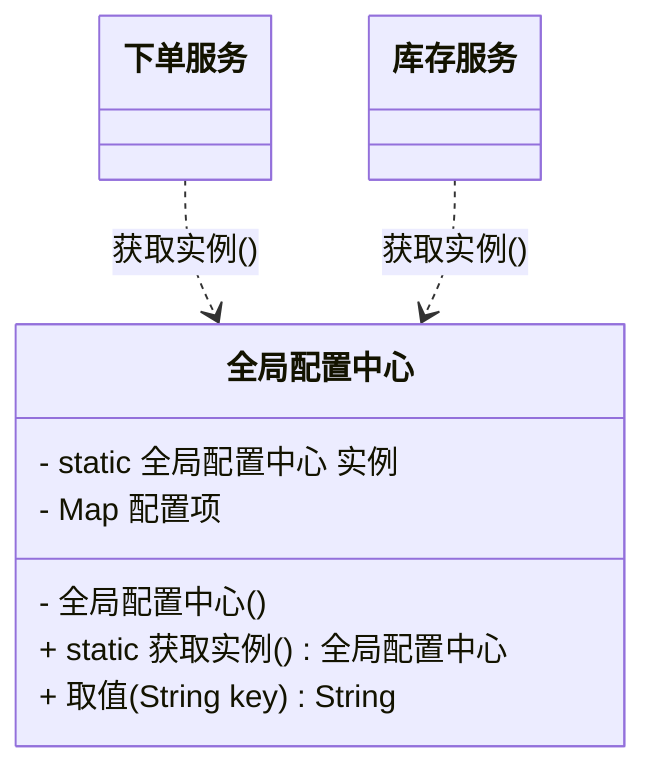

# 创建型 - 单例模式(Singleton)

> 本文用「电商下单」这条业务主线统一重构，便于理解：一句话定义 → 业务痛点 → 结构（Mermaid 类图）→ 代码实现 → 何时用/不用 → 优缺点 → 与相似模式对比 → 真实框架中的应用。来源：整理自 bugstack.cn。

---

## 一句话定义

**单例模式（Singleton）**：保证一个类**在整个 JVM 里只有一个实例**，并提供一个全局的获取入口。

说人话就是：这东西全世界只准有一份，谁要用都来找我拿，别自己 new。

---

## 业务痛点：没有它会怎样

在电商系统里，有些对象天生就该"只有一个"：

- **全局配置中心**：促销开关、限购规则、灰度名单，全站共用一份，改一次全站生效；
- **数据库连接池**：池子本身持有几十条物理连接，它自己被 new 出来第二个，连接数直接翻倍；
- **订单号生成器**：内部有个自增序列或雪花算法的 workerId，多个实例就会发号重复。

如果不做单例，下单链路上的代码大概会长这样：

```java
// 没有单例：每个调用点各 new 一份
public class 下单服务 {
    public void 下单(订单 order) {
        // 每次下单都重新加载一遍配置文件，几百毫秒没了
        全局配置中心 配置 = new 全局配置中心();
        boolean 促销开启 = 配置.取布尔值("promotion.enable");

        // 每次都新建一个连接池，池子里的连接根本没复用
        数据库连接池 连接池 = new 数据库连接池(50);
        连接池.取连接().执行("insert into t_order ...");
    }
}
```

痛点非常直接：

- **性能被反复创建拖垮**：配置要读文件、连接池要建 TCP 连接，这些都是重量级初始化，每次下单来一遍，接口 RT 直接爆炸；
- **状态对不上**：A 处改了配置中心的促销开关，B 处拿的是另一个实例，改动压根没生效，线上就出现"一半用户有优惠一半没有"的灵异事件；
- **资源泄漏**：连接池、线程池这种持有系统资源的对象被反复创建，连接数/线程数很快打满。

单例模式就是把这件事**从根上堵死**：构造方法私有化，你想 new 都 new 不出来。

---

## 结构（Mermaid 类图）



**角色职责**

| 角色 | 职责 |
|------|------|
| `全局配置中心`（单例类） | 私有构造方法禁止外部 new；自己持有唯一实例；对外暴露静态 `获取实例()` |
| 私有构造方法 | 唯一的"防线"，保证外部无法创建第二个实例 |
| 静态获取方法 | 全局访问点，负责"如果没有就创建，有就直接返回" |
| `下单服务` / `库存服务`（调用方） | 只调 `获取实例()`，不关心实例什么时候被创建的 |

---

## 代码实现（电商全局配置中心）

单例的写法不止一种，区别全在**线程安全**和**懒加载**这两个维度上。下面用同一个"全局配置中心"场景，把 7 种主流写法逐个过一遍——这部分是单例模式真正的技术含量所在。

### 写法 0：静态类（严格说不算单例，但最常用）

```java
/**
 * 纯静态类：适合"无状态、无需继承、必须全局共享"的缓存容器
 */
public class 配置缓存 {
    public static final Map<String, String> 缓存 = new ConcurrentHashMap<>();
}
```

- 类加载时就初始化好，不需要延迟加载；
- **仅用于全局访问、不维持复杂状态**时，静态类比单例更简单直接；
- 但它**不能被继承、不能实现接口、不能作为参数传递**，一旦需要面向接口编程（比如给配置中心做一个 Mock 实现用于单测），就必须换成真正的单例。

### 写法 1：懒汉模式（线程不安全）

```java
public class 配置中心懒汉 {
    private static 配置中心懒汉 实例;

    // 私有构造：禁止外部 new
    private 配置中心懒汉() {
        System.out.println("加载配置文件...耗时操作");
    }

    public static 配置中心懒汉 获取实例() {
        if (null != 实例) return 实例;
        实例 = new 配置中心懒汉();   // 多线程下这里会创建出多份
        return 实例;
    }
}
```

- 确实实现了懒加载：第一次用才创建；
- **但线程不安全**：想象一堆线程同时挤进 `if` 判空，就像一群人同时抢同一个厕所隔间，最后每人手里都拿到一个"自己 new 的"实例，单例名存实亡。

### 写法 2：懒汉模式 + 方法加锁（线程安全，但慢）

```java
public class 配置中心同步懒汉 {
    private static 配置中心同步懒汉 实例;

    private 配置中心同步懒汉() {}

    // 整个方法加锁
    public static synchronized 配置中心同步懒汉 获取实例() {
        if (null != 实例) return 实例;
        实例 = new 配置中心同步懒汉();
        return 实例;
    }
}
```

- 线程安全了，但**锁加在方法上，代价太大**：实例只在第一次创建，之后 99.99% 的调用都只是读一个引用，却每次都要抢锁；
- 配置中心是下单链路上的高频调用点，这么写等于给整条链路串了一把全局锁。**除非特殊情况，不建议用**。

### 写法 3：饿汉模式（线程安全，不懒加载）

```java
public class 配置中心饿汉 {
    // 类加载时就创建好，由 JVM 保证线程安全
    private static final 配置中心饿汉 实例 = new 配置中心饿汉();

    private 配置中心饿汉() {}

    public static 配置中心饿汉 获取实例() {
        return 实例;
    }
}
```

- 类加载阶段就完成初始化，由 JVM 的类加载机制天然保证线程安全，**没有任何锁开销**；
- 缺点是**不懒加载**：不管你用不用得到，程序一启动就创建。这就像你下了个手游，第一关都还没进，程序已经把所有地图资源全部实例化——内存直接满了，手机卡了。
- 对配置中心这种"必然会用到"的对象，饿汉其实很合适；对"可能一辈子都用不到"的重对象，就该换懒加载。

### 写法 4：静态内部类（线程安全 + 懒加载，推荐）

```java
public class 配置中心内部类 {

    // 静态内部类不会随外部类一起加载
    private static class 实例持有者 {
        private static final 配置中心内部类 实例 = new 配置中心内部类();
    }

    private 配置中心内部类() {}

    public static 配置中心内部类 获取实例() {
        // 第一次访问 实例持有者.实例 时，才触发内部类加载
        return 实例持有者.实例;
    }
}
```

- **既线程安全又懒加载，还完全没有加锁开销**，几乎是最优解；
- 原理是 JVM 保证一个类的初始化过程（`<clinit>`）在多线程下只会执行一次，加锁的活儿交给了虚拟机；
- 外部类 `配置中心内部类` 被加载时，静态内部类 `实例持有者` 并不会被加载，只有真正调用 `获取实例()` 时才加载，天然实现延迟初始化。**日常最推荐的写法之一。**

### 写法 5：双重锁校验 DCL（线程安全 + 懒加载）

```java
public class 配置中心双重锁 {
    // volatile 不可省略
    private static volatile 配置中心双重锁 实例;

    private 配置中心双重锁() {}

    public static 配置中心双重锁 获取实例() {
        // 第一次检查：绝大多数调用走这里直接返回，无锁
        if (null != 实例) return 实例;
        synchronized (配置中心双重锁.class) {
            // 第二次检查：防止多个线程同时闯过第一道判空
            if (null == 实例) {
                实例 = new 配置中心双重锁();
            }
        }
        return 实例;
    }
}
```

**为什么必须加 `volatile`？** 这是面试高频考点，值得展开：

`实例 = new 配置中心双重锁()` 这一行看着是一步，实际由三步组成：

1. 分配内存空间；
2. 初始化对象；
3. 把内存地址赋值给引用变量。

但**操作系统和 JIT 可以对指令重排序**，实际执行顺序可能变成：

1. 分配内存空间；
2. 把内存地址赋值给引用变量；
3. 初始化对象。

如果是这个顺序，线程 A 执行完第 2 步、还没执行第 3 步时，线程 B 在第一道判空处发现 `实例 != null`，直接把这个**还没初始化完的半成品对象**拿走用了，结果就是一堆莫名其妙的 NPE 和脏数据。`volatile` 的作用就是**禁止这段指令重排序**，同时保证写入对其他线程立即可见。

### 写法 6：CAS（AtomicReference，线程安全无锁）

```java
public class 配置中心CAS {

    private static final AtomicReference<配置中心CAS> 实例引用 = new AtomicReference<>();

    private 配置中心CAS() {}

    public static 配置中心CAS 获取实例() {
        for (; ; ) {
            配置中心CAS 实例 = 实例引用.get();
            if (null != 实例) return 实例;
            // CAS：只有当前值仍为 null 时才设置成功，失败的线程下轮拿到已有实例
            实例引用.compareAndSet(null, new 配置中心CAS());
            return 实例引用.get();
        }
    }
}
```

- Java 并发包提供了一系列原子类：`AtomicInteger`、`AtomicBoolean`、`AtomicLong`、`AtomicReference`。`AtomicReference` 可以原子地持有一个对象引用；
- 好处是**完全不加锁**，依赖底层 CPU 的 CAS 指令，没有线程切换和阻塞开销，高并发下吞吐量好；
- 缺点是**忙等**：极端情况下线程会在 `for(;;)` 里空转烧 CPU；而且失败的线程已经把对象 new 出来了，会产生一次无效创建（对配置中心这种重对象来说是浪费）。

### 写法 7：枚举单例（Effective Java 推荐）

```java
public enum 配置中心枚举 {

    实例;

    private final Map<String, String> 配置项 = new ConcurrentHashMap<>();

    public String 取值(String key) {
        return 配置项.get(key);
    }

    public void 设置(String key, String value) {
        配置项.put(key, value);
    }
}
```

调用方式：

```java
public class 下单服务 {
    public void 下单() {
        String 开关 = 配置中心枚举.实例.取值("promotion.enable");
        System.out.println("促销开关 = " + 开关);
    }
}
```

- 《Effective Java》作者 Joshua Bloch（曾任 Google 首席 Java 架构师）推荐的写法，一次性解决了**线程安全、自由序列化、绝对单一实例**三个问题；
- 它是**唯一能抵御反射攻击和反序列化攻击**的写法：普通单例可以通过反射调用私有构造方法强行 new 出第二个，枚举不行，JVM 层面禁止；
- 写法上比公有域方式更简洁，序列化机制是白送的。**缺点是不支持继承**，如果单例类需要继承某个父类或在框架里做扩展，枚举就用不了。

### 7 种写法横向对比

| 写法 | 线程安全 | 懒加载 | 性能 | 抗反射/反序列化 | 推荐度 |
|------|---------|-------|------|----------------|--------|
| 懒汉（不加锁） | ❌ | ✅ | 高 | ❌ | 不要用 |
| 懒汉 + synchronized 方法 | ✅ | ✅ | 差（每次抢锁） | ❌ | 不推荐 |
| 饿汉 | ✅ | ❌ | 最高（无锁） | ❌ | 对象轻、必用时推荐 |
| 静态内部类 | ✅ | ✅ | 最高（无锁） | ❌ | ⭐ 首推 |
| 双重锁校验 DCL | ✅（须 volatile） | ✅ | 高 | ❌ | ⭐ 推荐 |
| CAS AtomicReference | ✅ | ✅ | 高（但忙等） | ❌ | 特定高并发场景 |
| 枚举 | ✅ | ❌ | 最高 | ✅ | ⭐ 最安全，不可继承 |

**怎么选？** 一句话决策：

- 对象轻、启动就要用 → **饿汉**；
- 对象重、想懒加载、要能继承/实现接口 → **静态内部类**；
- 要绝对安全、不需要继承 → **枚举**；
- 需要在运行时传参决定初始化内容 → **DCL**（因为静态内部类没法传参）。

---

## 什么时候该用 / 不该用

**该用：**

- 对象**持有昂贵资源**：数据库连接池、线程池、HTTP 客户端、缓存客户端；
- 对象**必须全局状态一致**：配置中心、序列号生成器、全局计数器、注册表；
- 对象**创建成本高但无状态**：工具类、序列化器、正则 Pattern 缓存。

**不该用：**

- 对象**带可变业务状态**：比如把"当前订单"做成单例，多线程下会互相踩数据，这是灾难；
- 单纯为了"方便到处调"而做成单例：这会变成**变相的全局变量**，谁都能改，依赖关系全隐藏在代码里，单元测试根本没法 Mock；
- 在 Spring 环境里手写单例：Spring 的 bean 默认就是单例（容器级），再手写一套纯属重复造轮子，还破坏了依赖注入和可测试性。

---

## 优缺点

| 优点 | 缺点 |
|------|------|
| 避免重量级对象反复创建，节省内存与初始化耗时 | 违反单一职责：既管业务逻辑又管自己的生命周期 |
| 全局状态唯一，不会出现"改了没生效"的问题 | 本质是全局变量，隐藏依赖关系，代码可读性变差 |
| 提供统一访问入口，便于加日志、监控、埋点 | 单元测试难做：无法轻易替换成 Mock 实现 |
| 可以做懒加载，按需初始化 | 多线程环境下需要额外注意实现方式，写错就是隐蔽 Bug |
| 枚举写法天然防反射、防反序列化 | 在分布式环境下"单例"只是单 JVM 内唯一，跨节点不成立 |

> 特别提醒：单例是**单 JVM 内唯一**。在电商这种多节点部署的系统里，10 台机器就有 10 个"单例"。真要全局唯一（比如分布式锁、全局发号），得靠 Redis / ZooKeeper，别指望单例模式。

---

## 与相似模式的对比

| 对比项 | 单例(Singleton) | 静态工具类 | 享元(Flyweight) | 原型(Prototype) |
|--------|----------------|-----------|----------------|----------------|
| 实例数量 | 全局**恰好 1 个** | 0 个（不实例化） | 按 key 复用**若干个** | 每次克隆出**新的一个** |
| 能否继承/实现接口 | 能 | 不能 | 能 | 能 |
| 能否懒加载 | 能 | 类加载即初始化 | 能 | 不涉及 |
| 核心目的 | **控制实例个数** | 提供无状态函数 | **共享细粒度对象省内存** | **复制已有对象省创建成本** |
| 典型场景 | 配置中心、连接池 | `Math`、`Collections` | 字符串常量池、`Integer` 缓存 | SKU 模板克隆 |

> 最容易混的是**单例 vs 静态工具类**：判断标准很简单——你需要"一个对象"还是"一堆函数"？需要实现接口、需要多态、需要被注入，就用单例；纯粹的无状态计算函数，用静态工具类。
>
> 另一组是**单例 vs 享元**：单例是"全局就 1 个"，享元是"相同的复用、不同的各来一个"，比如 `Integer.valueOf(127)` 复用缓存，`valueOf(1000)` 就新建。

---

## 真实框架中的应用

### 1. Spring：默认作用域就是单例

Spring 容器里的 bean 默认 `scope="singleton"`，即**每个 BeanDefinition 在容器内只有一个实例**。注意它和 GoF 单例的区别：GoF 单例是"每个 JVM 一个"，Spring 单例是"**每个容器一个**"，同一个类在两个容器里可以有两个实例。

Spring 用**三级缓存 + 双重锁校验**来管理单例并解决循环依赖，核心在 `DefaultSingletonBeanRegistry#getSingleton`：

```java
protected Object getSingleton(String beanName, boolean allowEarlyReference) {
    // 一级缓存：完全初始化好的成品 bean
    Object singletonObject = this.singletonObjects.get(beanName);
    if (singletonObject == null && this.isSingletonCurrentlyInCreation(beanName)) {
        // 双重锁校验：只有确认缓存里没有、且该 bean 正在创建中，才加锁
        synchronized (this.singletonObjects) {
            // 二级缓存：提前暴露的半成品 bean（已实例化未填充属性）
            singletonObject = this.earlySingletonObjects.get(beanName);
            if (singletonObject == null && allowEarlyReference) {
                // 三级缓存：能产出 bean 的工厂，用于 AOP 代理的提前生成
                ObjectFactory<?> singletonFactory = (ObjectFactory) this.singletonFactories.get(beanName);
                if (singletonFactory != null) {
                    singletonObject = singletonFactory.getObject();
                    // 升级到二级缓存，并移除三级缓存
                    this.earlySingletonObjects.put(beanName, singletonObject);
                    this.singletonFactories.remove(beanName);
                }
            }
        }
    }
    return singletonObject;
}
```

流程是：先无锁读一级缓存 → 没有且正在创建中，才加锁 → 读二级缓存 → 还没有就从三级缓存的工厂里造一个并升级到二级。这就是标准的双重锁校验思路，只不过 Spring 把它扩展成了三级。

**踩坑提醒**：Spring 单例 bean 是被多线程共享的，所以 **bean 里不要放可变的成员变量**。经典事故是在 `@Service` 里加一个 `private Order currentOrder`，并发下线程互相覆盖，订单张冠李戴。需要保存请求级状态请用方法局部变量或 `ThreadLocal`。

### 2. JDK 中的单例

- **`java.lang.Runtime`**：标准的饿汉单例，`private static final Runtime currentRuntime = new Runtime();`，通过 `Runtime.getRuntime()` 获取；
- **`java.awt.Desktop`**、**`java.security.Security`**：也是单例；
- **`Collections.EmptyList` / `Collections.emptyList()`**：空集合的单例复用，避免反复创建空对象。

### 3. MyBatis / 数据库连接池

- **`SqlSessionFactory`** 在应用中通常做成单例：它内部持有解析好的 `Configuration`（所有 Mapper 映射、类型处理器、插件链），构建成本极高，每次请求重建等于自杀。而 `SqlSession` 恰恰相反，是**非线程安全**的，必须每次请求新建。这是"什么该单例、什么不该单例"的最好教材；
- **HikariCP / Druid 连接池**：`DataSource` 在容器里是单例 bean，池子里的物理连接被全局复用。这正是本文开头那个痛点的标准解法。

### 4. 日志框架

`LoggerFactory` 内部对每个 name 只创建一个 `Logger` 实例并缓存起来——严格说这是**享元**（按 name 复用），但底层的 `LoggerContext` 是实打实的单例。这也是区分单例和享元的一个好例子。

---

## 小结

单例模式看着简单，真正的功力全在"**用哪种写法**"上：懒汉、饿汉、静态内部类、DCL、CAS、枚举，背后牵扯类加载机制、指令重排序、内存可见性和序列化。日常开发的选择很朴素——**能确定必然会用且对象不重，就饿汉；需要懒加载就静态内部类；追求绝对安全且不需要继承就枚举**。最后别忘了：在 Spring 项目里，交给容器管就够了，不用自己造轮子；在分布式系统里，单例只保单机唯一，全局唯一得靠中间件。

---

> 参考来源：整理自 https://bugstack.cn 《重学 Java 设计模式：实战单例模式「7 种单例模式案例，Effective Java 作者推荐枚举单例模式」》，本文重写示例与讲解。
