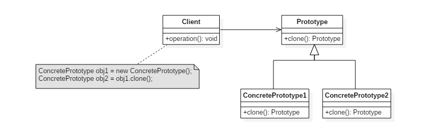

# 创建型 - 原型模式(Prototype)

> 本文主要分析设计模式 - 原型模式(Prototype)，使用原型实例指定要创建对象的类型，通过复制这个原型来创建新对象。 @pdai


## 意图

使用原型实例指定要创建对象的类型，通过复制这个原型来创建新对象。

## 类图



## 实现

比如JDK 中 java.lang.Object#clone()方法

```java
public abstract class Prototype {
    abstract Prototype myClone();
}
```

```java
public class ConcretePrototype extends Prototype {

    private String filed;

    public ConcretePrototype(String filed) {
        this.filed = filed;
    }

    @Override
    Prototype myClone() {
        return new ConcretePrototype(filed);
    }

    @Override
    public String toString() {
        return filed;
    }
}
```

```java
public class Client {
    public static void main(String[] args) {
        Prototype prototype = new ConcretePrototype("abc");
        Prototype clone = prototype.myClone();
        System.out.println(clone.toString());
    }
}
```

> 著作权归https://pdai.tech所有。   
> 链接：https://www.pdai.tech/md/dev-spec/pattern/7_prototype.html