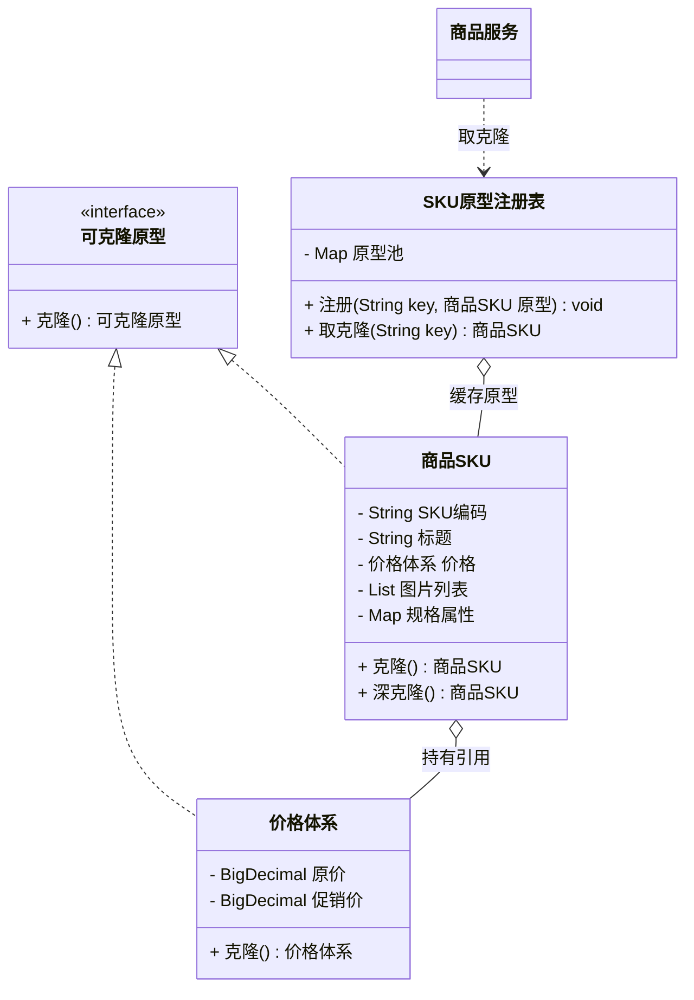
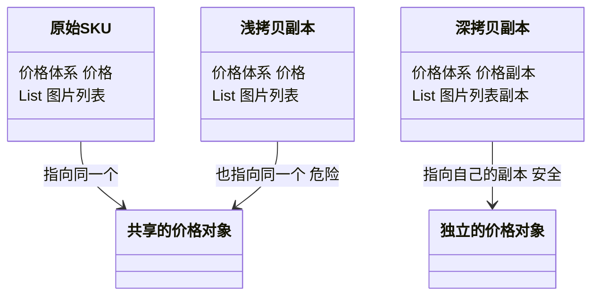

# 创建型 - 原型模式(Prototype)（又称克隆模式）

> 本文用「电商下单」这条业务主线统一重构，便于理解：一句话定义 → 业务痛点 → 结构（Mermaid 类图）→ 代码实现 → 何时用/不用 → 优缺点 → 与相似模式对比 → 真实框架中的应用。来源：整理自 pdai.tech。

---

## 一句话定义

**原型模式（Prototype）**：不通过 `new` 来创建对象，而是**拿一个已有的对象当模板，复制一份出来**，再按需改几个字段。

说人话：造一个新对象太贵？那就找个现成的照着复印一份。

---

## 业务痛点：没有它会怎样

电商的**商品 SKU 对象**是个不折不扣的大胖子。一个 SKU 装着：商品 ID、SKU 编码、标题、副标题、价格体系（原价/促销价/会员价/阶梯价）、库存信息、几十张图片 URL、规格属性表（颜色/尺码/材质…）、类目路径、品牌信息、物流模板、售后政策、详情富文本……

现在运营要做一件很常见的事：**批量铺货**。同一款 T 恤要上 5 个颜色 × 6 个尺码 = 30 个 SKU，除了颜色、尺码、编码、库存不同，**其余 90% 的字段完全一样**。

如果不用原型模式：

```java
public class 商品服务 {

    public List<商品SKU> 批量创建SKU(Long 商品ID) {
        List<商品SKU> 结果 = new ArrayList<>();
        for (String 颜色 : List.of("红", "蓝", "黑", "白", "灰")) {
            for (String 尺码 : List.of("S", "M", "L", "XL", "XXL", "XXXL")) {
                商品SKU sku = new 商品SKU();
                // 每造一个 SKU，都要重新查一次库、重新组装一遍
                sku.设置基础信息(商品服务.查数据库取商品(商品ID));    // 一次 DB 查询
                sku.设置类目路径(类目服务.查完整路径(商品ID));         // 又一次 RPC
                sku.设置品牌信息(品牌服务.查品牌(商品ID));            // 再一次 RPC
                sku.设置图片列表(图片服务.查图片列表(商品ID));         // 还有一次
                sku.设置规格属性(new HashMap<>());
                sku.设置物流模板(物流服务.查默认模板());
                sku.设置售后政策(售后服务.查默认政策());
                // ... 还有二十行赋值 ...

                // 真正不同的只有这四行
                sku.设置颜色(颜色);
                sku.设置尺码(尺码);
                sku.设置SKU编码(商品ID + "-" + 颜色 + "-" + 尺码);
                sku.设置库存(100);

                结果.add(sku);
            }
        }
        return 结果;
    }
}
```

痛点非常扎眼：

- **初始化成本被重复付了 30 遍**：4 次 DB/RPC 调用 × 30 次循环 = 120 次远程调用，接口直接超时。而这些数据**每次查出来都一模一样**；
- **组装代码又臭又长**：三十行赋值语句里，真正有意义的只有四行，其余全是噪音；
- **改一处要改多处**：SKU 新增一个字段，所有 new 的地方都要补一行，漏一个就是数据缺失；
- **调用方被迫知道所有依赖**：商品服务得认识类目服务、品牌服务、图片服务、物流服务、售后服务，耦合极重。

原型模式的解法很简单：**先花大代价造好一个"模板 SKU"，剩下 29 个全靠克隆。**

---

## 结构（Mermaid 类图）


```mermaid
classDiagram
    class 可克隆原型 {
        <<interface>>
        + 克隆() 可克隆原型
    }
    class 商品SKU {
        - String SKU编码
        - String 标题
        - 价格体系 价格
        - List 图片列表
        - Map 规格属性
        + 克隆() 商品SKU
        + 深克隆() 商品SKU
    }
    class 价格体系 {
        - BigDecimal 原价
        - BigDecimal 促销价
        + 克隆() 价格体系
    }
    class SKU原型注册表 {
        - Map 原型池
        + 注册(String key, 商品SKU 原型) void
        + 取克隆(String key) 商品SKU
    }
    class 商品服务

    可克隆原型 <|.. 商品SKU
    可克隆原型 <|.. 价格体系
    商品SKU o-- 价格体系 : 持有引用
    SKU原型注册表 o-- 商品SKU : 缓存原型
    商品服务 ..> SKU原型注册表 : 取克隆
```

**角色职责**

| 角色 | 职责 |
|------|------|
| `可克隆原型`（抽象原型） | 声明 `克隆()` 方法，让所有原型有统一的复制入口 |
| `商品SKU`（具体原型） | 实现克隆逻辑，决定哪些字段浅拷贝、哪些深拷贝 |
| `价格体系`（引用型成员） | SKU 内部持有的对象，是深浅拷贝的分界点 |
| `SKU原型注册表`（原型管理器） | **可选角色**，把造好的模板缓存起来，按 key 取克隆 |
| `商品服务`（调用方） | 只管取克隆改字段，不关心原型怎么造出来的 |

---

## 深拷贝 vs 浅拷贝：原型模式的核心命题

在写代码之前，必须先把这件事说清楚——**它是原型模式 90% 的坑所在**。

| 维度 | 浅拷贝（Shallow Copy） | 深拷贝（Deep Copy） |
|------|----------------------|-------------------|
| 基本类型字段 | 复制值 | 复制值 |
| 引用类型字段 | **只复制引用地址**，两个对象指向同一块内存 | **递归复制整个对象树**，各自独立 |
| 修改副本的引用字段 | **会影响原对象** ⚠️ | 不影响原对象 |
| 性能 | 快 | 慢（要递归复制或序列化） |
| `Object.clone()` 默认行为 | ✅ 就是浅拷贝 | ❌ 需要自己实现 |

用一张图理解：


```mermaid
classDiagram
    class 原始SKU {
        价格体系 价格
        List 图片列表
    }
    class 浅拷贝副本 {
        价格体系 价格
        List 图片列表
    }
    class 深拷贝副本 {
        价格体系 价格副本
        List 图片列表副本
    }
    class 共享的价格对象
    class 独立的价格对象

    原始SKU --> 共享的价格对象 : 指向同一个
    浅拷贝副本 --> 共享的价格对象 : 也指向同一个 危险
    深拷贝副本 --> 独立的价格对象 : 指向自己的副本 安全
```

**一句话记住**：浅拷贝复制的是"**遥控器**"，两个遥控器控的是同一台电视；深拷贝是"**连电视一起买了一台新的**"。

---

## 代码实现（商品 SKU 大对象克隆）

### 方式一：`Cloneable` + 浅拷贝（最快，但有陷阱）

```java
import java.math.BigDecimal;
import java.util.ArrayList;
import java.util.HashMap;
import java.util.List;
import java.util.Map;

/** 价格体系：SKU 内部持有的引用类型对象 */
public class 价格体系 implements Cloneable {

    private BigDecimal 原价;
    private BigDecimal 促销价;
    private BigDecimal 会员价;

    public 价格体系(BigDecimal 原价, BigDecimal 促销价, BigDecimal 会员价) {
        this.原价 = 原价;
        this.促销价 = 促销价;
        this.会员价 = 会员价;
    }

    public void 设置促销价(BigDecimal 促销价) {
        this.促销价 = 促销价;
    }

    @Override
    public 价格体系 clone() {
        try {
            // BigDecimal 本身不可变，所以这里浅拷贝就够了
            return (价格体系) super.clone();
        } catch (CloneNotSupportedException e) {
            throw new AssertionError(e);
        }
    }

    @Override
    public String toString() {
        return "原价=" + 原价 + " 促销价=" + 促销价 + " 会员价=" + 会员价;
    }
}
```

```java
/** 商品 SKU：一个初始化成本极高的大对象 */
public class 商品SKU implements Cloneable {

    private String SKU编码;
    private String 标题;
    private String 颜色;
    private String 尺码;
    private int 库存;

    // 以下都是引用类型 —— 深浅拷贝的关键所在
    private 价格体系 价格;
    private List<String> 图片列表;
    private Map<String, String> 规格属性;

    public 商品SKU(String 标题, 价格体系 价格, List<String> 图片列表) {
        // 假装这里做了 4 次 DB/RPC 调用，非常慢
        System.out.println("【昂贵操作】查库 + 3 次 RPC，耗时 200ms...");
        this.标题 = 标题;
        this.价格 = 价格;
        this.图片列表 = 图片列表;
        this.规格属性 = new HashMap<>();
    }

    /**
     * 浅拷贝：Object.clone() 的默认行为。
     * 基本类型复制值，引用类型只复制地址。
     */
    @Override
    public 商品SKU clone() {
        try {
            return (商品SKU) super.clone();
        } catch (CloneNotSupportedException e) {
            throw new AssertionError("商品SKU 必须实现 Cloneable", e);
        }
    }

    // ===== setter：只改差异字段 =====
    public void 设置颜色(String 颜色) { this.颜色 = 颜色; }
    public void 设置尺码(String 尺码) { this.尺码 = 尺码; }
    public void 设置编码(String 编码) { this.SKU编码 = 编码; }
    public void 设置库存(int 库存) { this.库存 = 库存; }
    public 价格体系 取价格() { return 价格; }
    public List<String> 取图片列表() { return 图片列表; }

    @Override
    public String toString() {
        return String.format("SKU[%s] %s %s/%s 库存=%d 图片数=%d 价格{%s}",
                SKU编码, 标题, 颜色, 尺码, 库存, 图片列表.size(), 价格);
    }
}
```

**浅拷贝的陷阱现场演示：**

```java
import java.math.BigDecimal;
import java.util.ArrayList;
import java.util.List;

public class 浅拷贝陷阱演示 {

    public static void main(String[] args) {
        List<String> 图片 = new ArrayList<>(List.of("主图.jpg", "细节图.jpg"));
        价格体系 价格 = new 价格体系(new BigDecimal("199"), new BigDecimal("159"), new BigDecimal("139"));

        商品SKU 模板 = new 商品SKU("纯棉圆领T恤", 价格, 图片);
        商品SKU 红色款 = 模板.clone();

        // 改基本类型字段：互不影响 ✅
        红色款.设置颜色("红");
        红色款.设置库存(50);

        // 改引用类型内部的值：灾难来了 ❌
        红色款.取价格().设置促销价(new BigDecimal("99"));   // 只想给红色款做特价
        红色款.取图片列表().add("红色实拍.jpg");             // 只想给红色款加张图

        System.out.println("模板  : " + 模板);
        System.out.println("红色款: " + 红色款);
        // 输出会发现：模板的促销价也变成了 99，图片也多了一张！
        // 因为两个对象的 价格 和 图片列表 指向的是同一块内存
    }
}
```

这就是浅拷贝的经典事故：**你以为在改副本，其实原型和所有已克隆出的对象都跟着变了**。在电商场景里，这意味着"给红色 T 恤设了特价，结果全部 30 个 SKU 都变成特价"——直接资损。

### 方式二：手写深拷贝（性能好，可控）

```java
import java.util.ArrayList;
import java.util.HashMap;

public class 商品SKU深拷贝版 implements Cloneable {

    private String SKU编码;
    private String 标题;
    private String 颜色;
    private int 库存;
    private 价格体系 价格;
    private java.util.List<String> 图片列表;
    private java.util.Map<String, String> 规格属性;

    /**
     * 深拷贝：先浅拷贝拿到对象骨架，
     * 再把每个引用类型字段逐个替换成独立的副本。
     */
    @Override
    public 商品SKU深拷贝版 clone() {
        try {
            商品SKU深拷贝版 副本 = (商品SKU深拷贝版) super.clone();

            // 关键：把引用字段一个个换成新对象
            副本.价格 = this.价格.clone();
            副本.图片列表 = new ArrayList<>(this.图片列表);
            副本.规格属性 = new HashMap<>(this.规格属性);

            return 副本;
        } catch (CloneNotSupportedException e) {
            throw new AssertionError(e);
        }
    }
}
```

- **优点**：性能最好，且能精确控制"哪些字段要深拷、哪些共享就行"（比如不可变的 `String`、`BigDecimal` 完全没必要深拷）；
- **缺点**：**字段一多就容易漏**。SKU 新增一个 `List<优惠券> 可用券` 字段，如果忘了在 `clone()` 里加一行，就埋下一颗定时炸弹，而且**编译器不会有任何提示**。

> 注意 `new ArrayList<>(原列表)` 只是**一层深拷贝**：列表本身是新的，但列表里的元素还是原来那些对象。如果元素是 `String` 这种不可变对象没问题；如果元素是可变的业务对象（比如 `List<规格项>`），还得逐个元素克隆。

### 方式三：序列化深拷贝（最省事，最慢）

```java
import java.io.*;

/** 通用序列化深拷贝工具：一行搞定任意层级的深拷贝 */
public class 深拷贝工具 {

    @SuppressWarnings("unchecked")
    public static <T extends Serializable> T 深拷贝(T 原对象) {
        try (ByteArrayOutputStream 字节输出 = new ByteArrayOutputStream();
             ObjectOutputStream 对象输出 = new ObjectOutputStream(字节输出)) {

            // 写出：把整个对象树序列化成字节数组
            对象输出.writeObject(原对象);
            对象输出.flush();

            // 读回：反序列化出一个完全独立的新对象树
            try (ByteArrayInputStream 字节输入 = new ByteArrayInputStream(字节输出.toByteArray());
                 ObjectInputStream 对象输入 = new ObjectInputStream(字节输入)) {
                return (T) 对象输入.readObject();
            }
        } catch (IOException | ClassNotFoundException e) {
            throw new IllegalStateException("深拷贝失败", e);
        }
    }
}
```

使用时不用写任何 `clone()` 逻辑：

```java
商品SKU 蓝色款 = 深拷贝工具.深拷贝(模板);   // 整棵对象树全是新的
蓝色款.设置颜色("蓝");
```

- **优点**：**一劳永逸**。不管对象嵌套多少层，全部自动深拷；新增字段也不用改任何代码；
- **缺点**：
  1. **慢**，比手写 clone 慢一到两个数量级（要走完整的序列化/反序列化）；
  2. 所有涉及的类**都必须实现 `Serializable`**，漏一个就抛 `NotSerializableException`；
  3. `transient` 字段会丢失，需要额外处理；
  4. JDK 原生序列化有安全隐患，生产环境更推荐用 **Jackson / Gson 转 JSON 再转回来**，或用 **Kryo**（性能好很多）：

```java
// 用 Jackson 做深拷贝，比 JDK 序列化快且不要求 Serializable
ObjectMapper 映射器 = new ObjectMapper();
商品SKU 副本 = 映射器.readValue(映射器.writeValueAsString(模板), 商品SKU.class);
```

### 方式四：拷贝构造 / 静态工厂（最推荐，不用 Cloneable）

`Cloneable` 接口设计得并不好（它是个空接口、`clone()` 还在 `Object` 上且是 `protected`），《Effective Java》明确建议**优先用拷贝构造方法或拷贝工厂**：

```java
public class 商品SKU优雅版 {

    private final String SKU编码;
    private final String 标题;
    private final String 颜色;
    private final 价格体系 价格;
    private final java.util.List<String> 图片列表;

    /** 拷贝构造：语义清晰，编译期就能看出哪些字段被复制了 */
    public 商品SKU优雅版(商品SKU优雅版 原型, String 新编码, String 新颜色) {
        this.SKU编码 = 新编码;
        this.颜色 = 新颜色;
        // 复用原型的昂贵字段
        this.标题 = 原型.标题;
        this.价格 = new 价格体系副本(原型.价格);
        this.图片列表 = java.util.List.copyOf(原型.图片列表);
    }
}
```

好处是：不依赖 `Cloneable`、不用处理 `CloneNotSupportedException`、支持 `final` 字段、能配合接口做多态复制。

### 完整方案：原型注册表（Prototype Registry）

把"造模板"和"取克隆"分开，是原型模式在工程上的标准用法：

```java
import java.util.Map;
import java.util.concurrent.ConcurrentHashMap;

/** SKU 原型注册表：昂贵的初始化只做一次，之后全靠克隆 */
public class SKU原型注册表 {

    private static final Map<String, 商品SKU> 原型池 = new ConcurrentHashMap<>();

    /** 系统启动时或首次访问时，把昂贵的模板造好放进池子 */
    public static void 注册(String 类目, 商品SKU 原型) {
        原型池.put(类目, 原型);
    }

    /** 取一份克隆，调用方拿到的永远是独立副本 */
    public static 商品SKU 取克隆(String 类目) {
        商品SKU 原型 = 原型池.get(类目);
        if (原型 == null) {
            throw new IllegalArgumentException("未注册的类目原型：" + 类目);
        }
        return 原型.clone();
    }
}
```

批量铺货的代码终于清爽了：

```java
import java.util.ArrayList;
import java.util.List;

public class 商品服务 {

    public List<商品SKU> 批量创建SKU(Long 商品ID) {
        List<商品SKU> 结果 = new ArrayList<>();
        for (String 颜色 : List.of("红", "蓝", "黑", "白", "灰")) {
            for (String 尺码 : List.of("S", "M", "L", "XL", "XXL", "XXXL")) {
                // 昂贵的初始化在注册模板时已经做完了，这里只是内存复制
                商品SKU sku = SKU原型注册表.取克隆("男装-T恤");
                sku.设置颜色(颜色);
                sku.设置尺码(尺码);
                sku.设置编码(商品ID + "-" + 颜色 + "-" + 尺码);
                sku.设置库存(100);
                结果.add(sku);
            }
        }
        return 结果;   // 4 次远程调用 → 变成了 1 次
    }
}
```

**效果对比**：原来 30 个 SKU 要 120 次远程调用，现在只要 4 次（造模板那一次），剩下 29 次全是纯内存复制。

### 四种克隆方式怎么选

| 方式 | 深/浅 | 性能 | 维护成本 | 适用场景 |
|------|-------|------|---------|---------|
| `Object.clone()` 默认 | 浅 | 最快 | 低 | 对象只含基本类型和不可变字段 |
| 手写 clone 逐字段深拷 | 深 | 快 | **高**（新增字段易漏） | 字段固定、性能敏感 |
| JDK 序列化 | 深 | 慢 | 极低 | 对象嵌套深、调用不频繁 |
| JSON / Kryo 序列化 | 深 | 中 | 极低 | 生产环境深拷贝首选 |
| 拷贝构造 / 拷贝工厂 | 可控 | 快 | 中 | ⭐ 新代码推荐，支持 final 字段 |

---

## 什么时候该用 / 不该用

**该用：**

- 对象**创建成本极高**：要查库、要走 RPC、要解析大文件、要做复杂计算，而这些结果是可复用的；
- 需要**大批量创建高度相似的对象**：批量铺货、批量生成报表、批量创建配置；
- 想**保护原始对象不被修改**：把内部对象克隆一份再返回给外部，防止调用方偷改（防御性拷贝）；
- 需要**保存对象快照**：撤销/回滚、审计留痕、A/B 测试的参数快照；
- 对象的**具体类型在运行期才确定**，但你手上恰好有一个实例可以照着复制。

**不该用：**

- 对象很轻，`new` 一下就完事——克隆的开销可能比 new 还大；
- 对象**内部结构极其复杂**（循环引用、持有文件句柄/数据库连接/线程）——这些资源根本没法克隆，硬克隆会出大问题；
- 对象是**不可变**的：不可变对象天然可共享，压根不需要复制；
- 对象带有**唯一标识**（主键 ID、订单号）：克隆出来会有两个相同 ID，必须记得重置，容易忘。

---

## 优缺点

| 优点 | 缺点 |
|------|------|
| 绕开昂贵的初始化过程，性能提升可能是数量级的 | **深浅拷贝极易搞错**，浅拷贝的坑非常隐蔽，测试还不一定能发现 |
| 调用方不需要知道对象的构造细节和依赖 | 每个类都要实现克隆逻辑，新增字段容易漏改 |
| 运行期动态增删原型，比编译期确定类型灵活 | `Cloneable` 接口设计有缺陷，`clone()` 与 `final` 字段冲突 |
| 可以保存和恢复对象状态（快照/回滚） | 循环引用、持有系统资源的对象无法安全克隆 |
| 配合注册表可实现"配置即对象模板" | 克隆出的对象需要手动重置唯一标识，否则会有脏数据 |
| 避免了工厂类层次结构的膨胀 | 序列化式深拷贝性能差，且要求全链路可序列化 |

---

## 与相似模式的对比

| 对比项 | 原型(Prototype) | 生成器(Builder) | 工厂方法 | 享元(Flyweight) | 备忘录(Memento) |
|--------|----------------|----------------|---------|----------------|----------------|
| 产出 | **已有对象的副本** | 分步组装的新对象 | 按类型创建的新对象 | **共享的同一个对象** | 对象状态的快照 |
| 前提 | 手上得**先有一个实例** | 知道各字段的值 | 知道要造哪个类型 | 对象可共享 | 需要恢复状态 |
| 创建成本 | 低（内存复制） | 中 | 中 | 最低（不创建） | 中 |
| 副本独立性 | **独立**（深拷贝时） | 独立 | 独立 | **不独立，共享** | 独立 |
| 核心目的 | **省掉昂贵的初始化** | 解决参数爆炸 | 解耦创建与使用 | **省内存** | 支持撤销 |

> 三点澄清：
>
> 1. **原型 vs 享元**：两者都在"复用已有对象"，但方向相反——享元是**让大家共用同一个对象**来省内存，原型是**给每个人复制一份独立的**来省创建时间。一个求共享，一个求隔离。
> 2. **原型 vs 工厂**：工厂是"根据类型信息**从零造**一个"，原型是"根据现有实例**复印**一个"。当创建逻辑复杂到工厂都写不动时，原型往往更划算。
> 3. **原型 vs 备忘录**：备忘录保存的是**为了将来恢复**的状态快照，通常对外不可见；原型产出的是**立即可用的新对象**。但实现上，备忘录内部经常就是用深拷贝做的。

---

## 真实框架中的应用

### 1. JDK：`Object.clone()` 与集合的拷贝构造

- **`Object#clone()`** 是原型模式在语言层面的支持。要用它必须实现 `Cloneable` 标记接口，否则调用时抛 `CloneNotSupportedException`。这个设计广受诟病：`Cloneable` 是个**空接口**（不含任何方法），`clone()` 却定义在 `Object` 上且是 `protected`，语义上非常别扭；
- **`ArrayList#clone()` / `HashMap#clone()`**：都是浅拷贝。`new ArrayList<>(原列表)` 效果相同，但语义更清晰，是更推荐的写法；
- **`Arrays.copyOf()`**：数组的浅拷贝；
- **`Calendar#clone()`**、**`Date#clone()`**：这类可变的日期对象在作为返回值时，标准做法就是先 clone 再返回（防御性拷贝），防止调用方改坏内部状态。

### 2. Spring：`@Scope("prototype")` 与 BeanDefinition 克隆

Spring 的 **prototype 作用域**用的就是原型思想（虽然实现上是每次重新创建而非克隆）：

```java
@Component
@Scope(ConfigurableBeanFactory.SCOPE_PROTOTYPE)
public class 购物车 {
    // 每次 getBean() 都返回全新实例，不同用户的购物车互不干扰
}
```

对比一下就明白设计意图：`@Service`、`@Repository` 这类无状态组件用 singleton（全局共享一个），而**带用户状态的对象必须用 prototype**（每人一份），否则多线程下会串数据。这正好和单例模式那篇的"bean 里不要放可变成员变量"呼应上。

Spring 内部的 **`AbstractBeanDefinition` 实现了 `Cloneable`**，`cloneBeanDefinition()` 用于在 bean 定义合并（父子 BeanDefinition）时复制配置。`RootBeanDefinition` 的拷贝构造方法也是同一思路。

### 3. MyBatis：`Configuration` 与缓存对象的拷贝

- **`SqlSessionFactory`** 每次 `openSession()` 都会新建 `SqlSession` 和 `Executor`，而共享同一份昂贵的 `Configuration`——这是"昂贵部分复用、轻量部分新建"的实用变体；
- MyBatis 的 **`CacheKey` 实现了 `Cloneable`**，在构建二级缓存 key 时需要克隆；
- **`MetaObject`** 反射元数据被缓存复用，避免每次都做昂贵的反射解析。

### 4. 实战场景：JSON 深拷贝在业务中的应用

生产环境里最常见的原型模式用法，其实不是 `clone()`，而是：

```java
// 场景：算价前先克隆一份订单，在副本上试算，不污染原对象
订单 试算副本 = JSON.parseObject(JSON.toJSONString(原订单), 订单.class);
优惠引擎.试算(试算副本);
if (试算副本.取实付().compareTo(阈值) < 0) {
    // 试算结果满意，才应用到真实订单
}
```

这类"**先复制一份，在副本上折腾，满意了再落地**"的模式，在优惠试算、规则引擎、数据回滚场景中极其常见。Apache Commons 的 `SerializationUtils.clone()` 和 Spring 的 `BeanUtils.copyProperties()`（注意：这是**浅拷贝**）都是这条路上的常用工具。

---

## 小结

原型模式的价值就一句话：**创建太贵，那就复制**。它把昂贵的初始化成本从"每个对象付一次"降到"整批只付一次"。但用它必须先想明白**深拷贝还是浅拷贝**——浅拷贝改副本会连原型一起改，这是原型模式最容易踩的坑，而且往往到线上才暴露。新写代码时优先用拷贝构造方法或 JSON 深拷贝，别硬套 `Cloneable`；对象层级深、调用不频繁时用序列化深拷贝最省心。

---

> 参考来源：整理自 https://pdai.tech/md/dev-spec/pattern/7_prototype.html ，本文重写示例与讲解。
