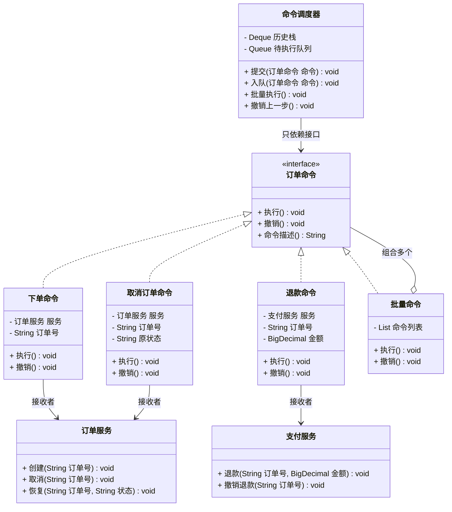

# 行为型 - 命令模式(Command)

> 本文用「电商下单」业务主线统一重构，便于理解。来源：整理自 pdai.tech / bugstack.cn / 菜鸟教程。

---

## 一句话定义

**命令模式（Command）**：把「一次操作请求」本身**打包成一个对象**，请求的发起方只管把命令丢出去，至于谁执行、什么时候执行、要不要排队、能不能撤销，都由命令对象和调用者去管。

大白话：你在餐厅点菜，写在**点菜单**上（命令对象）交给服务员（调用者），服务员送到后厨由厨师（接收者）做。你不用认识厨师，单子可以排队、可以撤单、可以留底查账——这就是把「请求」变成「对象」的好处。

---

## 业务痛点：没有它会怎样

电商后台要支持一系列订单操作：**下单**、**取消**、**退款**、**改地址**。而且运营提了几个要求：

- 操作要**记录操作日志**（谁在什么时候做了什么）；
- 误操作要能**一键撤销**；
- 大促期间操作量大，要能**丢进队列异步执行**；
- 失败的操作要能**自动重试**。

没有命令模式，Controller 通常这么写：

```java
@PostMapping("/order/op")
public String 操作订单(String 动作, String 订单号) {
    if ("下单".equals(动作)) {
        订单服务.创建订单(订单号);
        日志服务.记录("下单", 订单号);       // 每个分支都得手写一遍日志
    } else if ("取消".equals(动作)) {
        订单服务.取消订单(订单号);
        日志服务.记录("取消", 订单号);
    } else if ("退款".equals(动作)) {
        订单服务.退款(订单号);
        日志服务.记录("退款", 订单号);
    }
    // 撤销？重试？排队？—— 全都没地方挂
    return "ok";
}
```

痛点：

- **请求发起方（Controller）和执行方（各个 Service）死死绑在一起**，加一个操作就改一次 Controller；
- 日志、重试、审计这些**横切逻辑在每个分支里重复**；
- 「撤销」根本无从下手：`订单服务.取消订单()` 执行完就完了，**没有任何对象记住这次操作做了什么**，也就无法反向操作；
- 想把操作**异步化**，只能把一堆参数打包塞进 MQ 消息体，接收端再写一套 `if-else` 解析，等于把问题挪了个地方；
- 想做「批量操作」「宏命令」（比如一次性取消 100 个订单并统一回滚）几乎不可能。

命令模式的核心解法：**把「取消订单」这件事变成一个对象**。对象里既有执行逻辑 `执行()`，也有反向逻辑 `撤销()`，还能被放进 List、放进队列、序列化到数据库。

---

## 结构（Mermaid 类图）



**角色职责**

| 角色 | 对应类 | 职责 |
|------|--------|------|
| Command（抽象命令） | `订单命令` | 声明 `执行()` / `撤销()`，让所有操作长成同一个样子 |
| ConcreteCommand（具体命令） | `下单命令`、`取消订单命令`、`退款命令` | 持有接收者引用和执行参数，把「调用哪个方法、传什么参」固化下来；同时保存撤销所需的现场数据 |
| Receiver（接收者） | `订单服务`、`支付服务` | 真正干活的业务对象，完全不知道命令模式的存在 |
| Invoker（调用者） | `命令调度器` | 持有命令并触发执行；负责排队、记历史、重试、撤销等通用能力 |
| Client（客户端） | 业务代码 | 负责把「命令 + 接收者」组装好交给调用者 |
| MacroCommand（宏命令） | `批量命令` | 组合多个命令，一次执行/一次回滚 |

---

## 代码实现（电商订单操作命令）

**1）接收者：真正干活的业务服务**

```java
import java.math.BigDecimal;
import java.util.HashMap;
import java.util.Map;

/** 接收者：订单服务，它完全不知道"命令"是什么 */
public class 订单服务 {

    private final Map<String, String> 订单状态表 = new HashMap<>();

    public void 创建(String 订单号) {
        订单状态表.put(订单号, "待支付");
        System.out.println("  [订单服务] 创建订单 " + 订单号 + "，状态=待支付");
    }

    public void 删除(String 订单号) {
        订单状态表.remove(订单号);
        System.out.println("  [订单服务] 删除订单 " + 订单号);
    }

    public void 取消(String 订单号) {
        订单状态表.put(订单号, "已取消");
        System.out.println("  [订单服务] 取消订单 " + 订单号);
    }

    public void 恢复状态(String 订单号, String 状态) {
        订单状态表.put(订单号, 状态);
        System.out.println("  [订单服务] 订单 " + 订单号 + " 状态恢复为 " + 状态);
    }

    public String 查询状态(String 订单号) {
        return 订单状态表.get(订单号);
    }
}

/** 接收者：支付服务 */
public class 支付服务 {

    public void 退款(String 订单号, BigDecimal 金额) {
        System.out.println("  [支付服务] 订单 " + 订单号 + " 退款 " + 金额 + " 元");
    }

    public void 撤销退款(String 订单号) {
        System.out.println("  [支付服务] 订单 " + 订单号 + " 退款已冲正");
    }
}
```

**2）抽象命令**

```java
public interface 订单命令 {

    /** 正向执行 */
    void 执行();

    /** 反向撤销；不可撤销的命令抛异常或空实现 */
    void 撤销();

    /** 用于日志、审计、界面展示 */
    String 命令描述();
}
```

**3）具体命令：每个操作一个类，自带撤销能力**

```java
/** 下单命令：撤销 = 删除订单 */
public class 下单命令 implements 订单命令 {

    private final 订单服务 服务;
    private final String 订单号;

    public 下单命令(订单服务 服务, String 订单号) {
        this.服务 = 服务;
        this.订单号 = 订单号;
    }

    @Override
    public void 执行() {
        服务.创建(订单号);
    }

    @Override
    public void 撤销() {
        服务.删除(订单号);
    }

    @Override
    public String 命令描述() {
        return "下单(" + 订单号 + ")";
    }
}

/** 取消订单命令：执行前先记住原状态，撤销时才能还原 */
public class 取消订单命令 implements 订单命令 {

    private final 订单服务 服务;
    private final String 订单号;
    private String 原状态;   // 撤销所需的"现场快照"

    public 取消订单命令(订单服务 服务, String 订单号) {
        this.服务 = 服务;
        this.订单号 = 订单号;
    }

    @Override
    public void 执行() {
        this.原状态 = 服务.查询状态(订单号);   // 关键：先存现场
        服务.取消(订单号);
    }

    @Override
    public void 撤销() {
        if (原状态 != null) {
            服务.恢复状态(订单号, 原状态);
        }
    }

    @Override
    public String 命令描述() {
        return "取消订单(" + 订单号 + ")";
    }
}

/** 退款命令 */
public class 退款命令 implements 订单命令 {

    private final 支付服务 服务;
    private final String 订单号;
    private final java.math.BigDecimal 金额;

    public 退款命令(支付服务 服务, String 订单号, java.math.BigDecimal 金额) {
        this.服务 = 服务;
        this.订单号 = 订单号;
        this.金额 = 金额;
    }

    @Override
    public void 执行() {
        服务.退款(订单号, 金额);
    }

    @Override
    public void 撤销() {
        服务.撤销退款(订单号);
    }

    @Override
    public String 命令描述() {
        return "退款(" + 订单号 + ", " + 金额 + ")";
    }
}
```

**4）宏命令：把多个命令当成一个用（组合模式的味道）**

```java
import java.util.ArrayList;
import java.util.Collections;
import java.util.List;

/** 批量命令：一次执行多个，撤销时按相反顺序回滚 */
public class 批量命令 implements 订单命令 {

    private final List<订单命令> 命令列表 = new ArrayList<>();

    public 批量命令 添加(订单命令 命令) {
        命令列表.add(命令);
        return this;
    }

    @Override
    public void 执行() {
        for (订单命令 命令 : 命令列表) {
            命令.执行();
        }
    }

    @Override
    public void 撤销() {
        List<订单命令> 逆序 = new ArrayList<>(命令列表);
        Collections.reverse(逆序);   // 回滚必须逆序，否则依赖关系错乱
        for (订单命令 命令 : 逆序) {
            命令.撤销();
        }
    }

    @Override
    public String 命令描述() {
        return "批量命令(共 " + 命令列表.size() + " 条)";
    }
}
```

**5）调用者：排队、记历史、撤销，全部通用**

```java
import java.util.ArrayDeque;
import java.util.Deque;
import java.util.LinkedList;
import java.util.Queue;

public class 命令调度器 {

    /** 执行历史，用于撤销 */
    private final Deque<订单命令> 历史栈 = new ArrayDeque<>();

    /** 待执行队列，用于削峰异步执行 */
    private final Queue<订单命令> 待执行队列 = new LinkedList<>();

    /** 同步执行并记录历史 */
    public void 提交(订单命令 命令) {
        System.out.println("[调度器] 执行 " + 命令.命令描述());
        命令.执行();
        历史栈.push(命令);
        记录审计日志(命令);   // 横切逻辑只写一次
    }

    /** 异步排队 */
    public void 入队(订单命令 命令) {
        待执行队列.offer(命令);
        System.out.println("[调度器] 已入队 " + 命令.命令描述() + "，队列长度=" + 待执行队列.size());
    }

    /** 消费队列 */
    public void 批量执行() {
        System.out.println("[调度器] 开始消费队列");
        订单命令 命令;
        while ((命令 = 待执行队列.poll()) != null) {
            提交(命令);
        }
    }

    /** 撤销上一步 */
    public void 撤销上一步() {
        if (历史栈.isEmpty()) {
            System.out.println("[调度器] 没有可撤销的操作");
            return;
        }
        订单命令 命令 = 历史栈.pop();
        System.out.println("[调度器] 撤销 " + 命令.命令描述());
        命令.撤销();
    }

    private void 记录审计日志(订单命令 命令) {
        System.out.println("  [审计] " + System.currentTimeMillis() + " 执行了 " + 命令.命令描述());
    }
}
```

**6）运行**

```java
import java.math.BigDecimal;

public class 客户端 {
    public static void main(String[] args) {
        订单服务 订单服务实例 = new 订单服务();
        支付服务 支付服务实例 = new 支付服务();
        命令调度器 调度器 = new 命令调度器();

        // 1. 同步下单
        调度器.提交(new 下单命令(订单服务实例, "ORD-001"));

        // 2. 取消订单后反悔，一键撤销
        System.out.println();
        调度器.提交(new 取消订单命令(订单服务实例, "ORD-001"));
        调度器.撤销上一步();
        System.out.println("当前状态：" + 订单服务实例.查询状态("ORD-001"));

        // 3. 大促削峰：先入队，闲时统一消费
        System.out.println();
        调度器.入队(new 下单命令(订单服务实例, "ORD-002"));
        调度器.入队(new 下单命令(订单服务实例, "ORD-003"));
        调度器.批量执行();

        // 4. 宏命令：取消订单 + 退款，作为一个整体，可整体回滚
        System.out.println();
        批量命令 售后 = new 批量命令()
                .添加(new 取消订单命令(订单服务实例, "ORD-002"))
                .添加(new 退款命令(支付服务实例, "ORD-002", new BigDecimal("128.00")));
        调度器.提交(售后);
        System.out.println("-- 客服操作失误，整体回滚 --");
        调度器.撤销上一步();
    }
}
```

输出（节选）：

```
[调度器] 执行 下单(ORD-001)
  [订单服务] 创建订单 ORD-001，状态=待支付
  [审计] 1717000000000 执行了 下单(ORD-001)

[调度器] 执行 取消订单(ORD-001)
  [订单服务] 取消订单 ORD-001
[调度器] 撤销 取消订单(ORD-001)
  [订单服务] 订单 ORD-001 状态恢复为 待支付
当前状态：待支付
...
[调度器] 撤销 批量命令(共 2 条)
  [支付服务] 订单 ORD-002 退款已冲正
  [订单服务] 订单 ORD-002 状态恢复为 待支付
```

注意 `命令调度器` 从头到尾**只依赖 `订单命令` 接口**，新增一个「修改收货地址命令」，调度器一行都不用改，却自动获得了日志、排队、撤销三项能力。

---

## 什么时候该用 / 不该用

**该用：**

- 需要对操作做 **撤销/重做（Undo/Redo）**——编辑器、审批回退、订单反向操作；
- 需要把请求 **排队、延迟、异步、定时** 执行——任务队列、消息驱动；
- 需要 **记录操作日志/审计流水**，甚至系统崩溃后重放命令恢复状态（事件溯源）；
- 需要把 **多个操作组合成一个事务性动作**（宏命令）；
- 想彻底 **解耦请求方与执行方**：GUI 按钮、菜单项、快捷键绑定同一个命令。

**不该用：**

- 操作只有一两个、也不需要撤销和排队——直接调 Service 方法，套命令纯属绕圈；
- 操作数量巨大且各不相同，会**产生大量只有几行代码的命令类**，维护成本高于收益；
- 撤销逻辑本身不可实现（比如已经发出去的短信、已出库的货物），强行提供 `撤销()` 反而误导调用方。

---

## 优缺点

| 优点 | 缺点 |
|------|------|
| 请求方与执行方彻底解耦，符合开闭原则 | 每个操作一个类，**类膨胀**明显 |
| 操作变成对象，天然支持排队、异步、序列化 | 多了一层间接，简单场景显得过度设计 |
| 撤销/重做变得自然（命令自己保存现场） | 撤销逻辑需要命令自己维护"现场快照"，实现有难度 |
| 日志、审计、重试等横切逻辑在调用者里写一次即可 | 涉及外部系统的操作往往**无法真正撤销**，只能做补偿 |
| 可组合成宏命令，天然支持批量与整体回滚 | 宏命令的回滚顺序、部分失败处理容易出错 |

---

## 与相似模式的对比

| 对比项 | 命令(Command) | 策略(Strategy) | 责任链(Chain) | 备忘录(Memento) | 观察者(Observer) |
|--------|--------------|---------------|--------------|----------------|-----------------|
| 封装的是 | 一次**操作请求** | 一种**算法** | 一串**处理器** | 一份**状态快照** | 一组**订阅关系** |
| 关注点 | **做什么**、能否撤销/排队 | **怎么算** | **谁来处理** | **怎么回到过去** | **谁需要知道** |
| 对象数量 | 一个操作一个对象，可入队成列表 | 同时只用一个 | 串成链 | 一个状态一个快照 | 一对多广播 |
| 是否保存历史 | 常保存（用于撤销） | 不保存 | 不保存 | **就是为了保存** | 不保存 |
| 典型触发 | 用户点了个按钮 | 需要换算法 | 请求要过多道关 | 需要回滚 | 状态变了要通知 |

> **命令 vs 策略**：类图长得像（都是一个接口多个实现），但**语义完全不同**。策略的多个实现是「做同一件事的不同方法」，同一时刻只选一个；命令的多个实现是「不同的事情」，可以全部放进一个队列依次执行。判断标准：如果把两个实现放进同一个 List 依次执行是有意义的 → 命令；如果只能二选一 → 策略。
>
> **命令 + 备忘录**：实现撤销时经常配合使用。命令负责「做和反做」，备忘录负责「保存做之前的完整状态」。上面 `取消订单命令` 里的 `原状态` 字段，就是一个极简版的备忘录。
>
> **命令 + 组合**：`批量命令` 同时实现了 `订单命令` 接口又持有一组 `订单命令`，这就是组合模式，让「一个命令」和「一批命令」对调用者完全一样。

---

## 真实框架中的应用

**1）JDK `Runnable` / `Callable` + 线程池——最常用的命令模式**

`Runnable` 就是最简的命令接口，`run()` 就是 `执行()`。`ThreadPoolExecutor` 是调用者：它有一个 `BlockingQueue<Runnable> workQueue`（命令队列），有拒绝策略（队列满了怎么办），有 `Future`（执行结果）。你 `executor.submit(task)` 时，就是把一个命令对象丢给调用者，**什么时候执行、哪个线程执行，你完全不用管**——这正是命令模式的核心价值。

**2）`java.util.concurrent.FutureTask`**

`FutureTask` 包装 `Callable`，除了执行还提供 `cancel()`、`get()`、`isDone()`，把「一次调用」彻底对象化到可以查询状态、可以取消的程度。

**3）Spring `ApplicationEvent` + `@TransactionalEventListener`**

Spring 的事件对象本质上是「携带数据的命令」，`ApplicationEventPublisher` 是调用者。配合 `@TransactionalEventListener(phase = AFTER_COMMIT)`，事件会被暂存起来，等事务提交后再执行——这就是典型的「命令延迟执行」。

**4）Spring Batch 的 `Step` / `Tasklet`**

`Tasklet#execute()` 把一个批处理动作封装成对象，Spring Batch 框架负责调度、重试（`RetryTemplate`）、跳过（skip）、断点续跑。失败重跑靠的就是「命令对象可重复执行」这一特性。

**5）Netflix Hystrix 的 `HystrixCommand`**

Hystrix 直接以 Command 命名：你把一次远程调用写成 `HystrixCommand#run()`，框架负责给它加超时、熔断、隔离舱、降级 `getFallback()`。因为调用被对象化了，才有地方挂这些治理能力——如果你直接写一行 `restTemplate.getForObject()`，是没有任何切入点的。

**6）Swing `Action` / `AbstractAction`**

一个 `Action` 对象可以同时绑定到菜单项、工具栏按钮、快捷键上，三个入口触发同一个命令。这也是 GoF 书里命令模式最初的应用场景。

**7）MQ 消息与事件溯源（Event Sourcing）**

把「取消订单命令」序列化成 JSON 丢进 Kafka/RocketMQ，消费端反序列化后 `执行()`，就实现了跨进程的命令模式。再进一步，把所有命令按序持久化，通过重放命令重建系统状态，就是 CQRS/Event Sourcing 架构的基础。

---

## 小结

命令模式的关键动作是「**把动词变成名词**」——「取消订单」从一个方法调用，变成一个可以被存储、传递、排队、撤销的对象。一旦操作成了对象，日志、重试、异步、回滚这些能力就都有地方挂了。需要撤销、需要排队、需要审计，三者中命中任何一个，就该考虑命令模式。

---

> 参考来源：整理自 https://pdai.tech/md/dev-spec/pattern/18_command.html 、https://bugstack.cn 「重学 Java 设计模式：实战命令模式」与 https://www.runoob.com/design-pattern/command-pattern.html ，本文重写示例与讲解。
