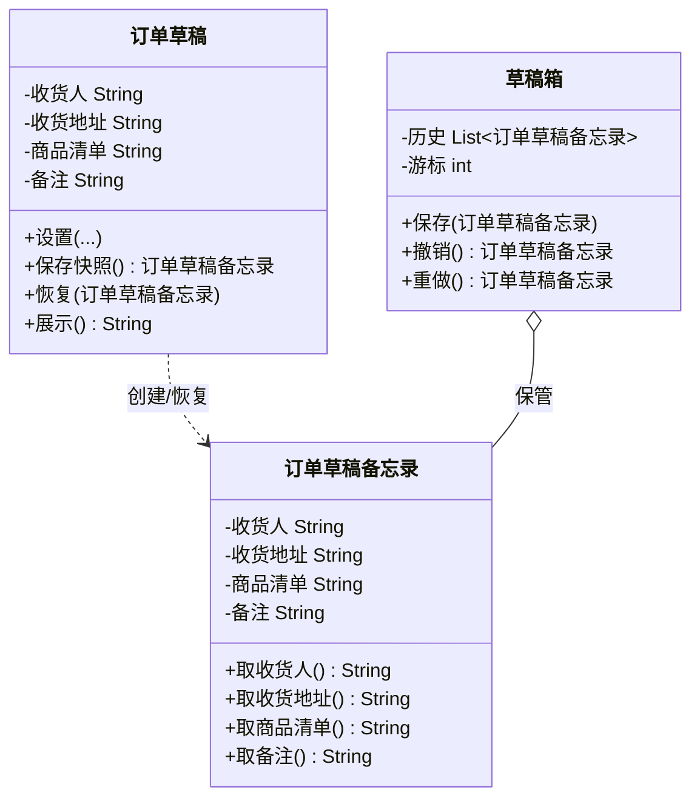

# 行为型 - 备忘录(Memento)

> 本文用「电商下单」业务主线统一重构，便于理解。来源：整理自 bugstack.cn。

## 一句话定义

备忘录模式：在不破坏对象封装的前提下，把对象某一时刻的内部状态"拍个快照"存起来，日后可以随时原样恢复——典型如草稿箱、撤销/重做、游戏存档。

## 业务痛点：没有它会怎样

用户在 APP 里填「下单草稿」：选收货人、填地址、加商品、写备注。填到一半去回消息，回来想「回到上一步」或者「刚才那版别丢」。

如果不用备忘录，常见的野路子是：

```java
// 直接把草稿对象的字段拷出来自己保管
String 备份收货人 = 草稿.收货人;
String 备份地址 = 草稿.收货地址;
// ...要恢复时再一个个塞回去
```

问题很明显：

- **破坏封装**：外部代码得知道草稿对象有哪些字段、怎么赋值，等于把人家的"内衣"翻出来。哪天草稿内部字段结构调整，所有备份代码全炸。
- **状态散落、易错**：字段一个一个手抄，漏一个就恢复出"残缺草稿"；多份备份满天飞，谁是谁的都说不清。
- **撤销/重做难做**：要支持多步撤销、重做，得自己维护一堆零散变量和游标，极易写错。

备忘录模式的解法：让草稿对象自己提供 `保存快照()` 和 `恢复(快照)`，把"怎么存、怎么取"封在自己肚子里；外部只拿到一个**看不懂内部、也不能改内部**的 `备忘录` 对象，交给「草稿箱」保管。这样既不破坏封装，又能随时整份恢复。

## 结构



| 角色 | 对应类 | 职责 |
| --- | --- | --- |
| 原发器(Originator) | `订单草稿` | 拥有状态；提供 `保存快照()` 产出备忘录、`恢复(备忘录)` 还原自己 |
| 备忘录(Memento) | `订单草稿备忘录` | 存储某一刻的状态快照；只暴露只读 getter，外部不能改 |
| 管理者(Caretaker) | `草稿箱` | 负责保管多个备忘录、维护游标，支持撤销/重做；**但不读取/修改备忘录内容** |

> 关键点：备忘录的字段是 `private` 且只有 getter，因此「草稿箱」只能存、不能看、不能改——这就保证了**原发器的封装不被破坏**。

## 代码实现

用「下单草稿」演示：编辑过程不断存快照，支持多步撤销(undo)与重做(redo)，且草稿内部结构对外完全隐藏。

```java
import java.util.*;

// 备忘录：只读快照，外部无法修改
class 订单草稿备忘录 {
    private final String 收货人;
    private final String 收货地址;
    private final String 商品清单;
    private final String 备注;

    订单草稿备忘录(String 收货人, String 收货地址, String 商品清单, String 备注) {
        this.收货人 = 收货人;
        this.收货地址 = 收货地址;
        this.商品清单 = 商品清单;
        this.备注 = 备注;
    }
    // 仅提供只读访问，原发器以外拿不到写入口
    String 取收货人() { return 收货人; }
    String 取收货地址() { return 收货地址; }
    String 取商品清单() { return 商品清单; }
    String 取备注() { return 备注; }
}

// 原发器：订单草稿
class 订单草稿 {
    private String 收货人 = "";
    private String 收货地址 = "";
    private String 商品清单 = "";
    private String 备注 = "";

    void 设置(String 收货人, String 收货地址, String 商品清单, String 备注) {
        this.收货人 = 收货人;
        this.收货地址 = 收货地址;
        this.商品清单 = 商品清单;
        this.备注 = 备注;
    }

    // 保存当前快照
    订单草稿备忘录 保存快照() {
        return new 订单草稿备忘录(收货人, 收货地址, 商品清单, 备注);
    }

    // 从快照恢复
    void 恢复(订单草稿备忘录 快照) {
        this.收货人 = 快照.取收货人();
        this.收货地址 = 快照.取收货地址();
        this.商品清单 = 快照.取商品清单();
        this.备注 = 快照.取备注();
    }

    void 展示(String 标签) {
        System.out.println(标签 + " => 收货人:" + 收货人
                + " 地址:" + 收货地址 + " 商品:" + 商品清单 + " 备注:" + 备注);
    }
}

// 管理者：草稿箱（只保管，不窥探内容）
class 草稿箱 {
    private final List<订单草稿备忘录> 历史 = new ArrayList<>();
    private int 游标 = 0;

    void 保存(订单草稿备忘录 快照) {
        历史.add(快照);
        游标 = 历史.size() - 1;
    }
    订单草稿备忘录 撤销() {
        if (游标 > 0) 游标--;
        return 历史.get(游标);
    }
    订单草稿备忘录 重做() {
        if (游标 < 历史.size() - 1) 游标++;
        return 历史.get(游标);
    }
}

// 演示
public class 备忘录演示 {
    public static void main(String[] args) {
        订单草稿 草稿 = new 订单草稿();
        草稿箱 箱子 = new 草稿箱();

        草稿.设置("张三", "北京", "键盘", "急送");
        箱子.保存(草稿.保存快照());
        草稿.展示("第1版");

        草稿.设置("张三", "北京海淀区", "键盘+鼠标", "急送");
        箱子.保存(草稿.保存快照());
        草稿.展示("第2版");

        草稿.设置("李四", "上海", "显示器", "周末送");
        箱子.保存(草稿.保存快照());
        草稿.展示("第3版");

        // 撤销两次
        草稿.恢复(箱子.撤销());
        草稿.展示("撤销后");
        草稿.恢复(箱子.撤销());
        草稿.展示("再撤销后");

        // 重做一次
        草稿.恢复(箱子.重做());
        草稿.展示("重做后");
    }
}
```

运行输出：

```
第1版 => 收货人:张三 地址:北京 商品:键盘 备注:急送
第2版 => 收货人:张三 地址:北京海淀区 商品:键盘+鼠标 备注:急送
第3版 => 收货人:李四 地址:上海 商品:显示器 备注:周末送
撤销后 => 收货人:张三 地址:北京海淀区 商品:键盘+鼠标 备注:急送
再撤销后 => 收货人:张三 地址:北京 商品:键盘 备注:急送
重做后 => 收货人:张三 地址:北京海淀区 商品:键盘+鼠标 备注:急送
```

注意：`草稿箱` 全程只 `保存()` 和取回备忘录，**从没读过备忘录里的字段**，草稿内部怎么变它都不关心——封装被完整守住。

## 什么时候该用 / 不该用

**该用：**

- 需要"后悔药"：撤销/重做、草稿箱、游戏存档、配置回滚。
- 想备份状态，但又**不想暴露**对象的内部字段（严守封装）。
- 需要保存多个历史版本并自由跳转。

**不该用：**

- 对象状态很大、快照很频繁：每个备忘录都深拷贝一份，内存开销高，需考虑增量快照或限制历史长度。
- 只需保存一两个简单值：直接存变量比造备忘录类更轻。
- 状态变化太频繁且长期持有：要注意清理历史，避免内存泄漏。

## 优缺点

| 维度 | 说明 |
| --- | --- |
| 优点 | 1. 不破坏封装：外部无法改对象内部状态；2. 恢复方便：整份状态原样还原；3. 支持多版本历史与自由跳转 |
| 缺点 | 1. 内存开销大：频繁/大对象快照会占用很多空间；2. 若备忘录可被外部修改则封装失效（需严格只读）；3. 管理者若长期持有历史易内存泄漏 |

## 与相似模式的对比

| 易混淆模式 | 关键区别 |
| --- | --- |
| 备忘录 vs 命令(Command) | 命令模式的"撤销"靠记录**操作**反向执行（如 `+金额` 的反向是 `-金额`）；备忘录的"撤销"靠保存**状态快照**直接覆盖。命令适合动作可反演，备忘录适合状态整体回滚 |
| 备忘录 vs 原型(Prototype) | 原型是克隆出一个新对象；备忘录是保存旧状态用于恢复，原对象继续存在 |
| 备忘录 vs 状态(State) | 状态模式关注"对象因状态不同表现不同行为"；备忘录关注"把状态存起来以后恢复" |

## 真实框架中的应用

- **IDE / 编辑器的撤销重做**：IntelliJ IDEA、VS Code 的编辑历史，底层就是备忘录 + 历史栈，每次改动存一份快照支持多级 undo/redo。
- **`java.io.Serializable` 快照**：把对象序列化到内存或磁盘即一份"备忘录"，常用于会话恢复、分布式状态迁移。
- **Spring `FileSystemXmlApplicationContext` / 事务回滚**：事务在开始前记录资源状态（连接、隔离级别等）作为备忘录，失败时整体回滚到事务前状态。
- **游戏 / 应用存档**：玩家进度序列化保存，读档即用备忘录恢复。
- **`java.util.Date` / 不可变快照**：把可变对象的关键状态封装成不可变值对象传递，避免外部修改，思想与只读备忘录一致。
- **React 时间旅行调试( redux-devtools )**：记录每一步 state 快照用于回放，是备忘录模式在前端的典型体现。

## 小结

备忘录模式用"只读快照"把对象状态安全地存起来，实现撤销/重做与草稿恢复，又不破坏原发器的封装。代价是快照的内存成本，生产中使用需注意历史长度与增量存储。

> 参考来源：整理自 bugstack.cn（https://bugstack.cn/itstack-demo-design/2020/06/28/重学-Java-设计模式-实战备忘录模式.html），本文重写示例与讲解（订单草稿快照场景）。
