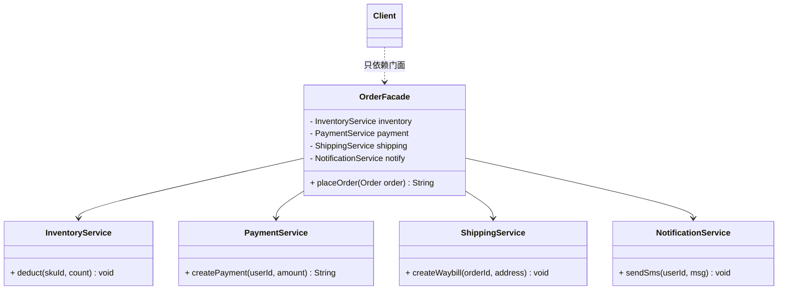

# 结构型 - 外观(Facade)（门面模式）

> 本文用「电商下单」这条主线，统一重构外观模式的讲解：一句话定义 → 业务痛点 → 结构（Mermaid 类图）→ 可运行代码 → 何时用/不用 → 优缺点 → 与相似模式对比 → 真实框架中的应用。
> 原内容整理自 https://pdai.tech ，本文在其基础上重写示例与讲解。

---

## 一句话定义

**外观模式（Facade）**：为一组复杂的子系统提供一个**统一、简单的入口**，让调用方不用关心内部有多少个类、调用顺序是什么，只跟这一个"门面"打交道。

> 别名提醒：外观模式 = 门面模式，是同一个 GoF 模式的不同译名。

---

## 业务痛点：没有门面会怎样

假设你是**电商下单**的调用方，下一笔订单其实要依次做完四件事：

1. **扣减库存**（InventoryService）
2. **创建支付单**（PaymentService）
3. **生成物流单**（ShippingService）
4. **发送通知**（NotificationService）

如果没有门面，你的业务代码得长这样：

```java
// 没有门面：调用方要和 4 个子系统逐个打交道
InventoryService inventory = new InventoryService();
PaymentService payment = new PaymentService();
ShippingService shipping = new ShippingService();
NotificationService notify = new NotificationService();

inventory.deduct(order.getSkuId(), order.getCount());
String payNo = payment.createPayment(order.getUserId(), order.getAmount());
shipping.createWaybill(order.getOrderId(), order.getAddress());
notify.sendSms(order.getUserId(), "下单成功");
```

痛点很明显：

- 调用方**必须知道所有子系统的存在和调用顺序**，耦合极重；
- 一旦某个子系统改名、换入参、调顺序，所有下单的地方都要改；
- 下单这段"胶水逻辑"散落在各处，无法复用，也无法统一加事务/日志/重试。

外观模式就是用来**收口**这件事的。

---

## 结构（Mermaid 类图）



**角色职责**

| 角色 | 职责 |
|------|------|
| `OrderFacade`（门面） | 持有各子系统引用，封装"下单"的完整流程，对外只暴露 `placeOrder()` |
| `InventoryService` 等（子系统） | 各自负责一块具体能力，不知道门面的存在，也不依赖彼此 |
| `Client`（调用方） | 只跟 `OrderFacade` 交互，完全不碰子系统 |

---

## 代码实现（电商下单）

四个子系统（只保留接口，真实实现可以是远程 RPC / DB 操作）：

```java
// 库存子系统
public class InventoryService {
    public void deduct(String skuId, int count) {
        System.out.println("扣减库存 sku=" + skuId + ", count=" + count);
    }
}

// 支付子系统
public class PaymentService {
    public String createPayment(Long userId, java.math.BigDecimal amount) {
        String payNo = "PAY" + System.nanoTime();
        System.out.println("创建支付单 " + payNo + " 金额=" + amount);
        return payNo;
    }
}

// 物流子系统
public class ShippingService {
    public void createWaybill(String orderId, String address) {
        System.out.println("生成物流单 order=" + orderId + " 收货地址=" + address);
    }
}

// 通知子系统
public class NotificationService {
    public void sendSms(Long userId, String msg) {
        System.out.println("给用户 " + userId + " 发短信：" + msg);
    }
}
```

门面类——把"胶水逻辑"收拢到一处：

```java
public class OrderFacade {
    private final InventoryService inventory = new InventoryService();
    private final PaymentService payment = new PaymentService();
    private final ShippingService shipping = new ShippingService();
    private final NotificationService notify = new NotificationService();

    /** 统一下单入口：调用方只需这一行 */
    public String placeOrder(Order order) {
        inventory.deduct(order.getSkuId(), order.getCount());
        String payNo = payment.createPayment(order.getUserId(), order.getAmount());
        shipping.createWaybill(order.getOrderId(), order.getAddress());
        notify.sendSms(order.getUserId(), "下单成功，支付单号：" + payNo);
        return order.getOrderId();
    }
}
```

调用方现在清爽了：

```java
public class Client {
    public static void main(String[] args) {
        Order order = new Order(/* skuId, count, userId, amount, address ... */);
        OrderFacade facade = new OrderFacade();
        facade.placeOrder(order);   // 只跟门面打交道
    }
}
```

---

## 什么时候该用 / 不该用

**该用：**

- 调用方需要按顺序协调**多个子系统**才能完成一件事（下单、导数据、发消息等）；
- 想给一个杂乱的遗留模块提供一个**干净的新接口**，逐步替换老代码；
- 想**降低层与层之间的耦合**（典型：Controller 不直接调多个 Service，而是调一个 ApplicationService 门面）。

**不该用：**

- 子系统本身只有一两个类，加门面只是多包一层，**徒增间接**；
- 调用方本来就需要精细控制子系统的每一步（比如支付要自己处理回调），门面反而挡住了细节；
- 别把门面写成**万能上帝类**——它只负责"编排流程"，具体逻辑仍在子系统里。

---

## 优缺点

| 优点 | 缺点 |
|------|------|
| 调用方依赖变少，耦合降低 | 门面可能变成"上帝类"，职责过重 |
| 子系统可独立演进，不影响调用方 | 不符合开闭原则：新增子系统流程可能要改门面 |
| 把易变的"编排逻辑"集中到一处，易维护 | 多了一层间接，极端性能敏感场景略有开销（通常可忽略） |

---

## 与相似模式的对比

| 对比项 | 外观(Facade) | 适配器(Adapter) | 代理(Proxy) |
|--------|--------------|----------------|-------------|
| 目的 | 给**一群子系统**提供统一简化入口 | 把**一个类**的接口转成另一个接口 | 控制对**单个对象**的访问 |
| 包装对象 | 多个子系统 | 单个被适配者 | 单个真实对象 |
| 关键区别 | 重点是"**简化与收口**" | 重点是"**接口转换兼容**" | 重点是"**访问控制**" |

> 注意：适配器、代理、装饰器都是"包一个对象"；外观是"包**一组**对象"。这是最直观的区分。

---

## 真实框架中的应用

- **Spring `JdbcUtils` / `JdbcTemplate`**：把 JDBC 那一大堆 `Connection / Statement / ResultSet` 的创建、异常转换、资源关闭收口成一个简单入口，业务代码只写 SQL，不用管连接生命周期——这就是典型门面。
- **`org.springframework.jdbc.support.JdbcUtils`**：对 JDBC API 的各类操作做了统一封装。
- **SLF4J**：`Logger` 门面屏蔽了底层是 logback 还是 log4j2 的实现细节，业务代码只依赖 SLF4J API。
- **MyBatis `SqlSessionFactory`**：把读取配置、构建 `Configuration`、创建 `Executor` 等复杂流程封装好，调用方一句 `sqlSessionFactory.openSession()` 即可。

---

## 小结

外观模式的价值不在"技术多巧妙"，而在**收口**：把一群子系统的协作流程，固化成一个稳定的统一入口。调用方只认门面，子系统随便改，系统边界立刻清晰。下笔前先问自己：是不是有一堆胶水逻辑散落在各处、每次改动都牵连大片？如果是，就该上门面了。

---

> 参考来源：整理自 https://pdai.tech/md/dev-spec/pattern/8_facade.html ，示例与讲解为本文重写。
