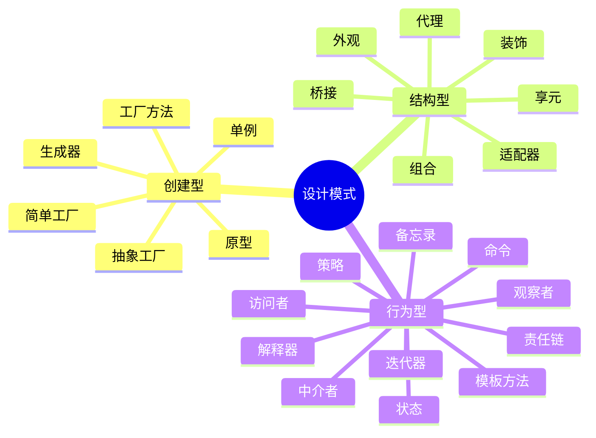
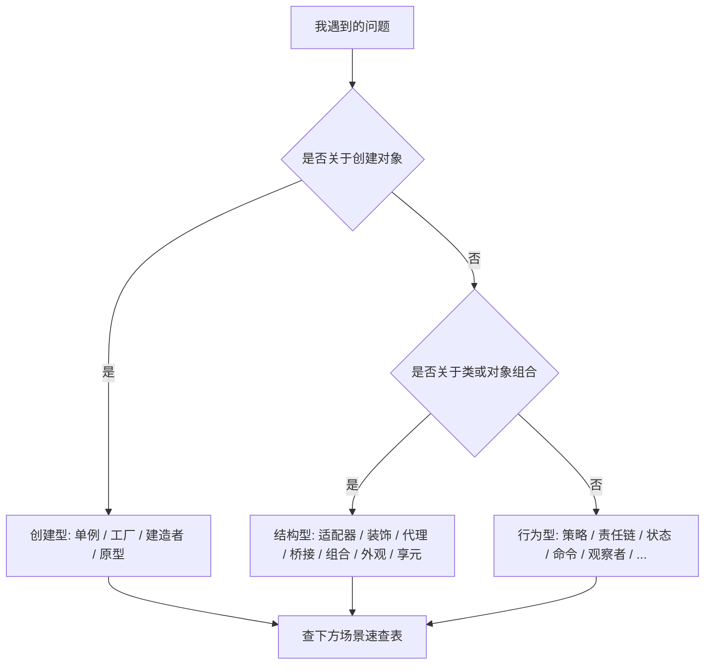

# 设计模式导读

> 三步走读懂设计模式：**先看全景结构 → 再按问题选型 → 最后用口诀记牢**。本页整合了模式全景图、按问题选模式、记忆法速查三块内容；每个模式名都可点进对应详解（含类图、可运行代码与框架实战）。

## 一、模式全景图

### 三大类在解决什么

| 类别 | 关注点 | 一句话 |
|------|--------|--------|
| 创建型 | 对象怎么生出来 | 把 `new` 这件事管住 |
| 结构型 | 类 / 对象怎么拼在一起 | 把「关系」理清楚 |
| 行为型 | 对象之间怎么协作 | 把「职责与通信」安排好 |

### 全景思维导图

> **图题**：设计模式 24 式 —— 创建型 6 + 结构型 7 + 行为型 11

### 易混家族提示

- **结构型 · 桥接 vs 适配器 vs 装饰**：桥接是「设计期就拆成两个维度」，适配器是「事后给不兼容的接口加转接头」，装饰是「运行时一层层套娃加料」。
- **行为型 · 策略 vs 状态**：类图几乎一模一样，差别在语义——策略是「换算法」，状态是「换阶段，行为跟着变」。
- **行为型 · 责任链 vs 装饰**：都是「一个套一个」，但责任链能短路中断（谁接手谁停），装饰每层都执行（功能叠加）。

## 二、按问题选模式（决策指南）

> 不知道该用哪个模式？别先背定义，先看你**遇到了什么信号**。下面按「问题 → 模式」反查。

### 一图决策（三大类入口）

> **图题**：先判断问题落在「创建 / 结构 / 行为」哪一层

### 场景 → 模式 速查表

**创建型：对象怎么来**

| 你遇到的信号 | 首选模式 | 一句话 |
|------|------|------|
| 全局只需一个实例（配置、连接池、日志器） | [单例](设计模式/md/单例模式.md) | 全剧只此一个 |
| 根据类型造不同对象，且类型还会加 | [简单工厂](设计模式/md/简单工厂.md) / [工厂方法](设计模式/md/工厂方法.md) | 把 `new` 收口到一个地方 |
| 要创建**一组互相配套**的对象（产品族） | [抽象工厂](设计模式/md/抽象工厂.md) | 一族产品一起造，保证搭配 |
| 构造步骤多、参数可选、容易写错 | [生成器](设计模式/md/生成器模式.md) | 分步拼装复杂对象 |
| 创建成本高，相似对象多用复制更划算 | [原型](设计模式/md/原型模式.md) | 照样品复制 |

**结构型：类 / 对象怎么拼**

| 你遇到的信号 | 首选模式 | 一句话 |
|------|------|------|
| 两个已有类接口对不上，却要一起用 | [适配器](设计模式/md/适配器模式.md) | 转接头 |
| 运行时想动态加功能，且能一层层叠 | [装饰](设计模式/md/装饰模式.md) | 套娃加料 |
| 要控制 / 增强对某对象的访问（懒加载、权限、远程） | [代理](设计模式/md/代理模式.md) | 替身门卫 |
| 整体-部分构成树形结构（菜单、文件树） | [组合](设计模式/md/组合模式.md) | 整体 = 部分的特例 |
| 子系统太复杂，调用方只想要一个简单入口 | [外观](设计模式/md/外观模式.md) | 统一前台一键办 |
| **两个维度各自独立变化**（渠道 × 类型），类要爆炸 | [桥接](设计模式/md/桥接模式.md) | 拆成两维各走各 |
| 大量细粒度对象，很多内部状态相同 | [享元](设计模式/md/享元模式.md) | 共享小对象省内存 |

**行为型：对象怎么协作**

| 你遇到的信号 | 首选模式 | 一句话 |
|------|------|------|
| 一大串 `if-else` 在选算法 / 业务规则 | [策略](设计模式/md/策略.md) | 换算法 |
| 多道校验 / 审批，顺序还可能变 | [责任链](设计模式/md/责任链.md) | 传一圈，谁行谁上 |
| 算法骨架固定，只少数步骤不同 | [模板方法](设计模式/md/模板方法.md) | 骨架定死，填空 |
| 要把「一次操作」封装成对象（撤销 / 队列 / 日志） | [命令](设计模式/md/命令模式.md) | 操作打包 |
| 一个变化要通知一堆对象（事件 / 监听） | [观察者](设计模式/md/观察者.md) | 一变多知 |
| 状态多、流转复杂、要防非法跳转 | [状态](设计模式/md/状态模式.md) | 换阶段行为变 |
| 要遍历聚合对象又不暴露内部 | [迭代器](设计模式/md/迭代器.md) | 挨个拿 |
| 对象间沟通太乱，要解耦 | [中介者](设计模式/md/中介者.md) | 总经理集中调度 |
| 要保存 / 恢复历史（撤销、redo） | [备忘录](设计模式/md/备忘录.md) | 存档读档 |
| 对固定结构加新操作，且封装不重要 | [访问者](设计模式/md/访问者.md) | 给结构加新能力 |
| 有自有「小语言 / 规则」要解释执行 | [解释器](设计模式/md/解释器.md) | 自定义语法 |

## 三、记忆法速查（Cheat Sheet）

> 每个模式一句**口诀** + **典型场景** + **最易混的对象**。记不住定义时靠口诀回想，搞混时看「易混」一列。

**创建型**

| 模式 | 一句话口诀 | 典型场景 | 最易混 |
|------|-----------|----------|--------|
| [单例](设计模式/md/单例模式.md) | 全剧只此一个 | 配置中心、连接池、日志器 | 和「全局变量」仅一步之遥，别滥用 |
| [简单工厂](设计模式/md/简单工厂.md) | 一个作坊按需造 | 根据类型返回不同子类 | 不是 GoF 模式，是工厂方法的前身 |
| [工厂方法](设计模式/md/工厂方法.md) | 子类决定造哪个 | 框架留扩展点让你造 | 抽象工厂（造一族 vs 造一个） |
| [抽象工厂](设计模式/md/抽象工厂.md) | 一族产品一起造 | 跨数据库 / 跨皮肤的整套组件 | 工厂方法（产品族 vs 单一产品） |
| [生成器](设计模式/md/生成器模式.md) | 分步拼装复杂对象 | SQL 构造器、报表生成 | 与「一堆 setter」区别在于分步且可校验 |
| [原型](设计模式/md/原型模式.md) | 照样品复制 | 昂贵对象的快速克隆 | 注意浅拷贝 / 深拷贝 |

**结构型**

| 模式 | 一句话口诀 | 典型场景 | 最易混 |
|------|-----------|----------|--------|
| [适配器](设计模式/md/适配器模式.md) | 转接头 | 老接口对接新系统 | 桥接（事后补救 vs 设计期拆维度） |
| [装饰](设计模式/md/装饰模式.md) | 套娃加料 | 流式 IO、缓存包装 | 代理（加功能 vs 控访问）、责任链 |
| [代理](设计模式/md/代理模式.md) | 替身门卫 | 懒加载、权限、RPC 桩 | 装饰（控访问 vs 加功能） |
| [组合](设计模式/md/组合模式.md) | 整体=部分的特例 | 菜单树、文件目录 | 与「继承树」注意区分 |
| [外观](设计模式/md/外观模式.md) | 统一前台一键办 | 复杂子系统的简易入口 | 中介者（对外封装 vs 对内协调） |
| [桥接](设计模式/md/桥接模式.md) | 拆成两维各走各 | JDBC、日志门面、多支付渠道 | 策略（两维 vs 一维）、适配器 |
| [享元](设计模式/md/享元模式.md) | 共享小对象省内存 | 字符 / 棋子 / 连接池对象 | 单例（共享池 vs 唯一实例） |

**行为型**

| 模式 | 一句话口诀 | 典型场景 | 最易混 |
|------|-----------|----------|--------|
| [策略](设计模式/md/策略.md) | 换算法 | 优惠计算、排序规则、支付渠道 | 状态（换算法 vs 换阶段） |
| [观察者](设计模式/md/观察者.md) | 一变多知 | 事件总线、监听、发布订阅 | 中介者（通知 vs 协调） |
| [模板方法](设计模式/md/模板方法.md) | 骨架定死，填空 | 流程固定仅步骤不同 | 策略（继承定制 vs 组合替换） |
| [责任链](设计模式/md/责任链.md) | 传一圈，谁行谁上 | 校验链、审批流、Filter | 装饰（可短路 vs 每层执行） |
| [命令](设计模式/md/命令模式.md) | 操作打包 | 撤销 / 重做、任务队列、宏 | 策略（做什么 vs 怎么算） |
| [状态](设计模式/md/状态模式.md) | 换阶段，行为变 | 订单 / 工单 / 审批流转 | 策略（最经典混淆对） |
| [迭代器](设计模式/md/迭代器.md) | 挨个拿出来 | 自定义集合遍历 | 与「for 循环」注意区分职责 |
| [中介者](设计模式/md/中介者.md) | 总经理集中调度 | 聊天室、航班调度、UI 组件解耦 | 外观（对内协调 vs 对外封装） |
| [备忘录](设计模式/md/备忘录.md) | 存档读档 | 编辑器撤销、游戏存档 | 与「直接存字段」注意封装边界 |
| [访问者](设计模式/md/访问者.md) | 给结构加新操作 | 语法树遍历、报表导出 | 与「在元素类里加方法」对比 |
| [解释器](设计模式/md/解释器.md) | 自定义小语言 | 规则引擎、表达式求值 | 实际项目较少手写 |

> 口诀只是助记，落地写法以各模式详解页为准。
