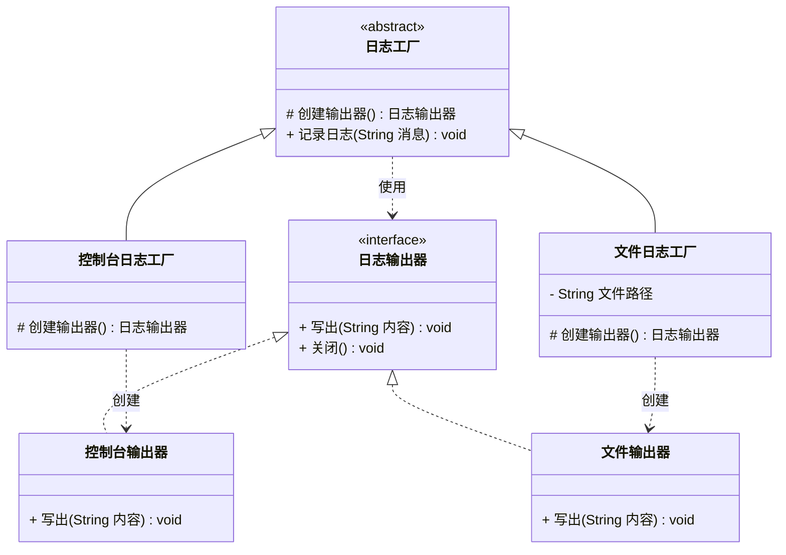

# 创建型 - 工厂方法(Factory Method)（又称虚拟构造器）

> 本文用「电商下单」这条业务主线统一重构，便于理解：一句话定义 → 业务痛点 → 结构（Mermaid 类图）→ 代码实现 → 何时用/不用 → 优缺点 → 与相似模式对比 → 真实框架中的应用。来源：整理自 pdai.tech。

---

## 一句话定义

**工厂方法（Factory Method）**：父类定义一个"造对象"的抽象方法，但**具体造哪个对象，交给子类决定**。父类只负责规定流程，子类负责填空。

一句话对比：简单工厂是"**一个工厂，内部 if-else 决定造谁**"；工厂方法是"**每种产品配一个工厂子类，谁造谁自己说了算**"。

---

## 业务痛点：没有它会怎样

电商系统的**下单链路日志**要落到不同地方：

- 开发环境：打到**控制台**，方便本地调试；
- 生产环境：写到**文件**，供 ELK 采集；
- 灰度环境：推到 **Kafka**，实时做异常检测。

不管落到哪，"写一条日志"的流程都是固定的三步：**格式化内容 → 写出去 → 刷新缓冲**。如果用简单工厂写，会变成这样：

```java
public class 日志服务 {

    public void 记录(String 目标, String 消息) {
        // 第一步：格式化（三种目标完全一样）
        String 内容 = "[" + System.currentTimeMillis() + "] " + 消息;

        // 第二步：写出去（这里开始分叉，一大坨 if-else）
        if ("控制台".equals(目标)) {
            System.out.println(内容);
        } else if ("文件".equals(目标)) {
            // 打开文件、写入、异常处理...一堆代码塞在这
        } else if ("Kafka".equals(目标)) {
            // 建 Producer、发消息、处理回调...又一堆
        }

        // 第三步：刷新（又要按目标分别处理）
        if ("文件".equals(目标)) {
            // flush 文件流
        }
    }
}
```

痛点比简单工厂那一版更严重：

- **公共流程和差异实现混成一团**：格式化是公共的、写出去是各不相同的，但它们被硬塞在同一个方法里，读代码要在 if-else 里跳来跳去；
- **每加一种输出目标，就要改这个类**：加 Kafka 要改、加数据库要改、加 SLS 要改，一个类被反复修改，改坏一次全链路日志都挂；
- **同一个判断分支散落在多个方法里**：写、刷新、关闭都要各判断一次目标类型，极易漏改。

工厂方法的思路是：**把"公共流程"留在父类，把"造具体 Appender"这一步抽象出来，让每个子类自己去实现。**

---

## 结构（Mermaid 类图）


```mermaid
classDiagram
    class 日志工厂 {
        <<abstract>>
        # 创建输出器() 日志输出器
        + 记录日志(String 消息) void
    }
    class 控制台日志工厂 {
        # 创建输出器() 日志输出器
    }
    class 文件日志工厂 {
        - String 文件路径
        # 创建输出器() 日志输出器
    }
    class 日志输出器 {
        <<interface>>
        + 写出(String 内容) void
        + 关闭() void
    }
    class 控制台输出器 {
        + 写出(String 内容) void
    }
    class 文件输出器 {
        + 写出(String 内容) void
    }

    日志工厂 <|-- 控制台日志工厂
    日志工厂 <|-- 文件日志工厂
    日志输出器 <|.. 控制台输出器
    日志输出器 <|.. 文件输出器
    日志工厂 ..> 日志输出器 : 使用
    控制台日志工厂 ..> 控制台输出器 : 创建
    文件日志工厂 ..> 文件输出器 : 创建
```

**角色职责**

| 角色 | 职责 |
|------|------|
| `日志工厂`（抽象工厂 / Creator） | 定义抽象的**工厂方法** `创建输出器()`，并在 `记录日志()` 里编排公共流程 |
| `控制台日志工厂` / `文件日志工厂`（具体工厂） | 各自实现工厂方法，决定 new 出哪个具体输出器 |
| `日志输出器`（抽象产品） | 定义所有输出器的统一接口 |
| `控制台输出器` / `文件输出器`（具体产品） | 各自实现一种真实的输出方式 |

> 关键点：抽象工厂类里的 `记录日志()` 是**模板方法**，它调用了抽象的 `创建输出器()`。工厂方法模式经常和模板方法模式一起出现，这不是巧合——它们都靠"父类定流程、子类填细节"。

---

## 代码实现（电商日志 Appender）

**第一步：抽象产品——日志输出器接口**

```java
/** 日志输出器：把一条已经格式化好的日志写到某个地方 */
public interface 日志输出器 {

    /** 写出一条日志 */
    void 写出(String 内容);

    /** 释放资源，比如关闭文件流 */
    default void 关闭() {
        // 默认什么都不做，需要的子类自己覆盖
    }
}
```

**第二步：具体产品——控制台 / 文件两种实现**

```java
/** 控制台输出器：本地开发用，直接打 stdout */
public class 控制台输出器 implements 日志输出器 {

    @Override
    public void 写出(String 内容) {
        System.out.println(内容);
    }
}
```

```java
import java.io.BufferedWriter;
import java.io.FileWriter;
import java.io.IOException;

/** 文件输出器：生产用，追加写到日志文件 */
public class 文件输出器 implements 日志输出器 {

    private final BufferedWriter 写入流;

    public 文件输出器(String 文件路径) {
        try {
            // true 表示追加模式，不覆盖已有日志
            this.写入流 = new BufferedWriter(new FileWriter(文件路径, true));
        } catch (IOException e) {
            throw new IllegalStateException("日志文件打开失败：" + 文件路径, e);
        }
    }

    @Override
    public void 写出(String 内容) {
        try {
            写入流.write(内容);
            写入流.newLine();
            写入流.flush();
        } catch (IOException e) {
            // 日志失败不能拖垮业务，降级打到控制台
            System.err.println("写日志失败，降级输出：" + 内容);
        }
    }

    @Override
    public void 关闭() {
        try {
            写入流.close();
        } catch (IOException ignored) {
        }
    }
}
```

**第三步：抽象工厂——公共流程写死，创建动作留空**

```java
import java.time.LocalDateTime;

/** 日志工厂：定义"记一条日志"的完整流程，但不决定往哪儿记 */
public abstract class 日志工厂 {

    /**
     * 工厂方法：造一个输出器出来。
     * 父类不知道要造哪个，交给子类决定 —— 这就是工厂方法模式的核心。
     */
    protected abstract 日志输出器 创建输出器();

    /**
     * 模板流程：所有子类共用，不需要重写。
     * 格式化 → 输出 → 收尾，三步固定。
     */
    public void 记录日志(String 订单号, String 消息) {
        日志输出器 输出器 = 创建输出器();
        try {
            String 内容 = 格式化(订单号, 消息);
            输出器.写出(内容);
        } finally {
            输出器.关闭();
        }
    }

    /** 公共的格式化逻辑，全系统统一日志格式 */
    private String 格式化(String 订单号, String 消息) {
        return String.format("[%s][订单:%s] %s", LocalDateTime.now(), 订单号, 消息);
    }
}
```

**第四步：具体工厂——每种输出目标一个子类**

```java
/** 控制台日志工厂：开发环境用 */
public class 控制台日志工厂 extends 日志工厂 {

    @Override
    protected 日志输出器 创建输出器() {
        return new 控制台输出器();
    }
}
```

```java
/** 文件日志工厂：生产环境用，可配置落盘路径 */
public class 文件日志工厂 extends 日志工厂 {

    private final String 文件路径;

    public 文件日志工厂(String 文件路径) {
        this.文件路径 = 文件路径;
    }

    @Override
    protected 日志输出器 创建输出器() {
        // 子类自己决定造哪个产品，还能带上自己的构造参数
        return new 文件输出器(文件路径);
    }
}
```

**第五步：调用方按环境选工厂**

```java
public class 下单服务 {

    private final 日志工厂 日志;

    // 依赖注入：调用方决定用哪个工厂，下单服务本身完全不感知
    public 下单服务(日志工厂 日志) {
        this.日志 = 日志;
    }

    public void 下单(String 订单号) {
        日志.记录日志(订单号, "开始下单");
        // ... 扣库存、建支付单 ...
        日志.记录日志(订单号, "下单成功");
    }

    public static void main(String[] args) {
        String 环境 = System.getProperty("env", "dev");

        // 只有这一处需要选择具体工厂
        日志工厂 工厂 = "prod".equals(环境)
                ? new 文件日志工厂("/var/log/order.log")
                : new 控制台日志工厂();

        new 下单服务(工厂).下单("ORD20260809001");
    }
}
```

**新增一种输出目标要做什么？** 只需要：

1. 新写一个 `Kafka输出器 implements 日志输出器`；
2. 新写一个 `Kafka日志工厂 extends 日志工厂`。

**一行已有代码都不用改**——这就是符合开闭原则的样子，也是工厂方法相比简单工厂最大的进步。

---

## 什么时候该用 / 不该用

**该用：**

- 父类**知道流程但不知道具体产品**：典型如框架代码，框架定义骨架，使用者通过继承来指定具体实现；
- 产品种类会**持续增加**，而你不想每次都去改一个中心化的工厂类；
- 每种产品的创建**需要不同的参数或前置准备**（文件工厂要路径、Kafka 工厂要 broker 地址），简单工厂的统一签名塞不下；
- 想给使用者留一个**扩展点**：只要继承并实现工厂方法，就能接入自己的实现。

**不该用：**

- 产品就两三种、且基本不会变——为此建一整套继承体系纯属过度设计，简单工厂甚至直接 new 都更好；
- 需要**成套创建相互关联的多个产品**（比如同时要 MySQL 版 UserDao 和 MySQL 版 OrderDao）——这时该用**抽象工厂**；
- 团队对继承体系不熟：工厂方法会让类的数量翻倍，滥用会让新人看不懂类图。

---

## 优缺点

| 优点 | 缺点 |
|------|------|
| **符合开闭原则**：新增产品只加类，不改老代码 | 类数量翻倍：每加一个产品就要配一个工厂子类 |
| 公共流程留在父类复用，差异部分下沉到子类 | 引入了继承层次，理解成本高于简单工厂 |
| 每个工厂只管一种产品，**符合单一职责** | 调用方需要知道"该用哪个工厂"，选择成本转移给了上层 |
| 创建参数可以各不相同，灵活性高 | 仅适用于单一产品等级，成套创建就力不从心 |
| 是框架留扩展点的标准手法 | 小项目里容易变成为了模式而模式 |

---

## 与相似模式的对比

| 对比项 | 工厂方法 | 简单工厂 | 抽象工厂 | 模板方法 |
|--------|---------|---------|---------|---------|
| 谁决定造哪个 | **子类（编译期确定）** | 工厂内部 if/switch（运行期） | 具体工厂族 | 不负责创建 |
| 复用手段 | **继承** | 组合/静态方法 | **组合** | 继承 |
| 产品数量 | 一个工厂造**一种**产品 | 一个工厂造多种 | 一个工厂造**一族**产品 | 不涉及 |
| 新增产品 | 加子类，不改老代码 ✅ | 改工厂 if-else ❌ | 改所有工厂族 ❌ | 不涉及 |
| 关注点 | **创建谁** | 创建谁 | **成套创建** | **流程怎么走** |

> 三点常见困惑澄清：
>
> 1. **工厂方法 vs 简单工厂**：简单工厂把选择逻辑放在**运行期的 if-else** 里；工厂方法把选择逻辑放在**编译期的类继承**里，用"选哪个子类"代替"传哪个参数"。
> 2. **工厂方法 vs 抽象工厂**：工厂方法是"一个工厂一个产品"，抽象工厂是"一个工厂一族产品"。实际上**抽象工厂内部的每个创建方法，都是一个工厂方法**——抽象工厂是工厂方法的组合升级版。
> 3. **工厂方法 vs 模板方法**：本文的 `记录日志()` 就是模板方法，`创建输出器()` 是工厂方法。区别在于模板方法抽象的是"**某个步骤怎么做**"，工厂方法抽象的是"**造哪个对象**"。工厂方法可以看作模板方法在"对象创建"这个特定场景下的应用。

---

## 真实框架中的应用

### 1. JDK：`Collection#iterator()` 是最经典的工厂方法

```java
public interface Collection<E> {
    Iterator<E> iterator();   // 这就是工厂方法
}
```

`Collection` 接口只规定"你得能给我一个迭代器"，但**具体给哪个迭代器由各个集合类自己决定**：`ArrayList` 返回内部类 `Itr`（基于数组下标），`LinkedList` 返回 `ListItr`（基于链表节点），`HashMap.keySet()` 返回 `KeyIterator`（基于哈希桶遍历）。

正因如此，`for-each` 循环才能用同一套语法遍历所有集合——JVM 编译后就是调 `iterator()` 拿工厂产物，再 `hasNext()/next()`。

其他例子还有 `URLStreamHandler#openConnection()`（http/https/ftp 各返回不同的 `URLConnection`）、`ThreadFactory#newThread()`（线程池用它来定制线程名、优先级、是否守护线程）。

### 2. Spring：`FactoryBean` 与 `AbstractApplicationContext`

- **`FactoryBean<T>#getObject()`** 就是标准工厂方法。Spring 容器发现某个 bean 实现了 `FactoryBean`，就不会把它本身当 bean，而是调用它的 `getObject()` 拿返回值当 bean。MyBatis 的 `MapperFactoryBean` 正是靠这个，把没有实现类的 Mapper 接口变成动态代理对象塞进容器；

- **`AbstractApplicationContext#refresh()`** 里调用了抽象方法 `createBeanFactory()` 和 `refreshBeanFactory()`，`refresh()` 本身是固定的十二步骤（模板方法），而"造一个什么样的 BeanFactory"由子类决定——`AnnotationConfigApplicationContext`、`ClassPathXmlApplicationContext`、`GenericWebApplicationContext` 各有各的造法。这是工厂方法 + 模板方法配合的教科书案例。

### 3. 日志框架：Logback 的 Appender 体系

本文的例子其实就是照着 Logback 的设计写的。Logback 里 `Appender` 是抽象产品，`ConsoleAppender`、`FileAppender`、`RollingFileAppender`、`SocketAppender` 是具体产品。`AppenderBase` 提供了 `doAppend()` 的公共流程（加锁、过滤器链判断、状态检查），把真正的输出动作留给子类的 `append()` 方法实现——完全是"父类定流程、子类填细节"。

自定义 Appender（比如把日志推到 Kafka）只需继承 `AppenderBase<ILoggingEvent>` 实现 `append()`，然后在 XML 里配上，一行框架代码都不用改。

### 4. MyBatis：`DataSourceFactory` 与 `TransactionFactory`

MyBatis 用 `DataSourceFactory` 接口抽象数据源创建，`UnpooledDataSourceFactory` 和 `PooledDataSourceFactory` 各自返回不同的 `DataSource`；`TransactionFactory` 同理，`JdbcTransactionFactory` 返回自己管理事务的 `JdbcTransaction`，`ManagedTransactionFactory` 返回交给容器管理的 `ManagedTransaction`。配置文件里写 `<transactionManager type="JDBC"/>` 就是在选具体工厂。

---

## 小结

工厂方法的精髓是**把"造哪个对象"这个决定权，从运行期的 if-else 挪到编译期的类继承上**。父类专心编排流程，子类专心提供产品，两边各司其职。它比简单工厂多了一层继承，换来的是真正的开闭原则——新增产品只加类不改代码。判断是否该用它很简单：如果你的工厂类正因为不断新增产品而反复被修改，就是时候把它拆成工厂方法了。

---

> 参考来源：整理自 https://pdai.tech/md/dev-spec/pattern/4_factory_method.html ，本文重写示例与讲解。
