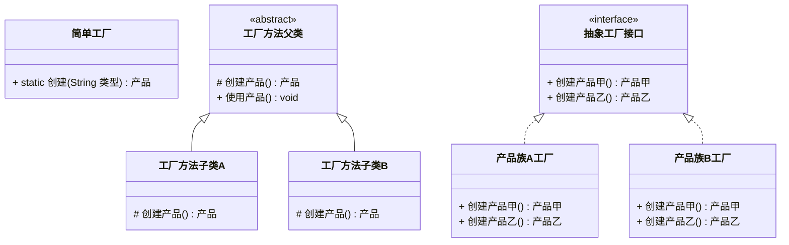
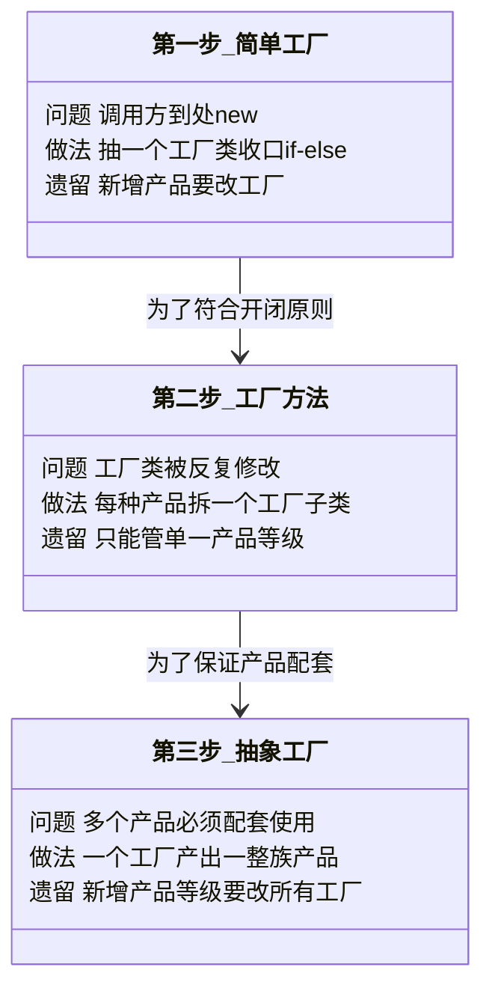
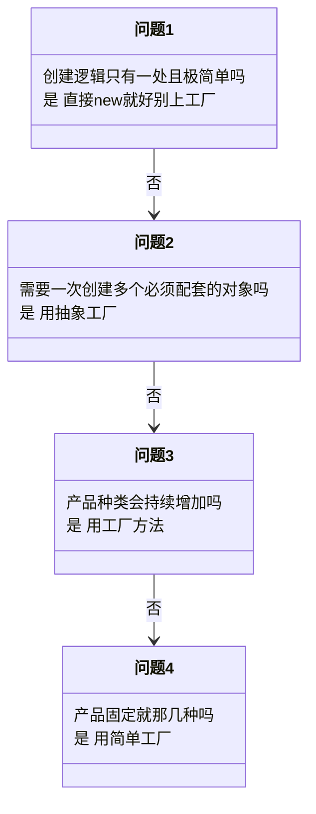

# 创建型 - 工厂模式(Factory Pattern)（三兄弟对比汇总页）

> 本文用「电商下单」这条业务主线统一重构，便于理解。本页是**简单工厂 / 工厂方法 / 抽象工厂**的对比汇总页——"工厂模式"这个叫法并非 GoF 正统模式名，它其实是三种模式的统称，放在创建型里做总览最合适。三者的完整讲解见各自单篇。来源：整理自公开资料（runoob.com）。

---

## 一句话定义

**工厂模式（Factory Pattern）**：把"创建对象"这件事从使用它的代码里抽出来，交给专门的角色去做，调用方只面向接口编程，不关心背后 new 的是哪个类。

它是一个**家族**，按"谁来决定造什么"的粒度从小到大排成三兄弟：

| 兄弟 | 一句话 | 是否 GoF 正统 |
|------|--------|--------------|
| **简单工厂** | 一个工厂类，内部 `if-else` 决定造谁 | ❌ 不是，算编程习惯 |
| **工厂方法** | 每种产品配一个工厂子类，造谁由子类说了算 | ✅ 是 |
| **抽象工厂** | 一个工厂造一整族配套产品 | ✅ 是 |

---

## 业务痛点：没有它会怎样

电商下单链路上，"根据条件创建对象"的场景到处都是：按优惠类型创建优惠策略、按环境创建日志输出器、按数据库类型创建 DAO、按渠道创建支付器。如果全都直接 `new`：

```java
public class 下单服务 {

    public void 下单(String 优惠类型, String 支付渠道, String 数据库类型) {
        // 痛点一：调用方被迫认识所有具体实现类
        优惠策略 优惠;
        if ("满减".equals(优惠类型)) {
            优惠 = new 满减策略();
        } else if ("折扣".equals(优惠类型)) {
            优惠 = new 折扣策略();
        } else {
            优惠 = new 无优惠策略();
        }

        // 痛点二：同一坨判断在预览页、提交页、详情页、对账系统各抄了一遍
        支付器 支付;
        if ("微信".equals(支付渠道)) {
            支付 = new 微信支付器("appId", "mchId", "证书路径");   // 构造参数还各不相同
        } else {
            支付 = new 支付宝支付器("appId", "私钥");
        }

        // 痛点三：配套关系没人保证，写成 MySQL用户Dao + Oracle订单Dao 也能编译通过
        用户Dao 用户访问 = "mysql".equals(数据库类型) ? new MySQL用户Dao() : new Oracle用户Dao();
        订单Dao 订单访问 = "mysql".equals(数据库类型) ? new MySQL订单Dao() : new Oracle订单Dao();

        // ... 真正的业务逻辑被淹没在创建代码里 ...
    }
}
```

三种痛点，恰好对应三兄弟各自要解决的问题：

| 痛点 | 表现 | 对应解法 |
|------|------|---------|
| 创建逻辑散落各处，改一处要改 N 处 | 同一坨 `if-else new` 被复制多份 | **简单工厂**：收口到一个类 |
| 每加一种产品就要改那个工厂类 | 工厂的 switch 越来越长，改到手软 | **工厂方法**：加子类不改老代码 |
| 一组对象必须配套，混搭会出事 | MySQL 的 Dao 配了 Oracle 的 Dao | **抽象工厂**：一次选定整族 |

---

## 结构（Mermaid 类图）

### 三兄弟的结构演进



**从"简单工厂"到"抽象工厂"的演进逻辑**



**角色职责总表**

| 角色 | 简单工厂 | 工厂方法 | 抽象工厂 |
|------|---------|---------|---------|
| **抽象产品** | 有（`优惠策略`） | 有（`日志输出器`） | 有多个（`用户Dao`、`订单Dao`） |
| **具体产品** | 有（满减/折扣/拼团） | 有（控制台/文件输出器） | 有（MySQL 族、Oracle 族） |
| **抽象工厂** | ❌ 无 | 有（`日志工厂` 抽象类） | 有（`DAO工厂` 接口） |
| **具体工厂** | 只有一个静态工厂类 | 每种产品一个子类 | 每个产品族一个 |
| **谁做决定** | 工厂内部的 if/switch | 调用方选哪个工厂子类 | 调用方选哪个工厂族 |
| **复用手段** | 静态方法 | **继承** | **组合** |

---

## 代码实现（同一个电商场景，三种写法）

为了让对比一目了然，下面用**同一个"支付渠道"场景**分别写三遍。

### 公共部分：抽象产品

```java
import java.math.BigDecimal;

/** 支付器：所有支付渠道的统一抽象 */
public interface 支付器 {
    String 发起支付(String 订单号, BigDecimal 金额);
}
```

```java
import java.math.BigDecimal;

/** 微信支付 */
public class 微信支付器 implements 支付器 {
    @Override
    public String 发起支付(String 订单号, BigDecimal 金额) {
        System.out.println("[微信] 调起 JSAPI 支付，订单=" + 订单号 + " 金额=" + 金额);
        return "WX" + System.nanoTime();
    }
}

/** 支付宝支付 */
public class 支付宝支付器 implements 支付器 {
    @Override
    public String 发起支付(String 订单号, BigDecimal 金额) {
        System.out.println("[支付宝] 调起手机网站支付，订单=" + 订单号 + " 金额=" + 金额);
        return "ALI" + System.nanoTime();
    }
}
```

### 写法一：简单工厂

```java
/** 简单工厂：一个类 + 一个 switch，把创建逻辑收口 */
public class 支付器简单工厂 {

    private 支付器简单工厂() {}

    public static 支付器 创建(String 渠道) {
        switch (渠道) {
            case "微信":
                return new 微信支付器();
            case "支付宝":
                return new 支付宝支付器();
            default:
                throw new IllegalArgumentException("不支持的支付渠道：" + 渠道);
        }
    }
}

// 调用
支付器 支付 = 支付器简单工厂.创建("微信");
支付.发起支付("ORD001", new BigDecimal("299"));
```

**新增"银联支付"要做什么？** 加一个 `银联支付器` 类 + **改工厂的 switch**。改老代码，违反开闭原则。

### 写法二：工厂方法

```java
import java.math.BigDecimal;

/** 抽象工厂类：定义支付的完整流程，但不决定用哪个渠道 */
public abstract class 支付工厂 {

    /** 工厂方法：造哪个支付器，交给子类决定 */
    protected abstract 支付器 创建支付器();

    /** 模板流程：所有渠道共用 —— 风控 → 支付 → 记账 */
    public String 支付(String 订单号, BigDecimal 金额) {
        风控校验(订单号, 金额);
        支付器 支付器实例 = 创建支付器();
        String 流水号 = 支付器实例.发起支付(订单号, 金额);
        记账(订单号, 流水号);
        return 流水号;
    }

    private void 风控校验(String 订单号, BigDecimal 金额) {
        if (金额.compareTo(new BigDecimal("50000")) > 0) {
            throw new IllegalStateException("单笔支付超过风控限额");
        }
    }

    private void 记账(String 订单号, String 流水号) {
        System.out.println("记账：订单 " + 订单号 + " 支付流水 " + 流水号);
    }
}
```

```java
/** 微信支付工厂 */
public class 微信支付工厂 extends 支付工厂 {
    @Override
    protected 支付器 创建支付器() {
        return new 微信支付器();
    }
}

/** 支付宝支付工厂 */
public class 支付宝支付工厂 extends 支付工厂 {
    @Override
    protected 支付器 创建支付器() {
        return new 支付宝支付器();
    }
}

// 调用：由上层决定注入哪个工厂
支付工厂 工厂 = new 微信支付工厂();
工厂.支付("ORD001", new BigDecimal("299"));
```

**新增"银联支付"要做什么？** 加一个 `银联支付器` + 一个 `银联支付工厂`。**一行老代码都不用改**，完全符合开闭原则。

### 写法三：抽象工厂

支付不是孤立的，一个渠道通常还要配套**退款器**和**对账器**——微信的支付必须配微信的退款和对账，绝不能混搭。这时就该上抽象工厂了。

```java
import java.math.BigDecimal;

/** 退款器：第二个产品等级 */
public interface 退款器 {
    void 发起退款(String 支付流水号, BigDecimal 金额);
}

/** 对账器：第三个产品等级 */
public interface 对账器 {
    void 拉取账单(String 日期);
}
```

```java
/** 支付渠道工厂：一次性产出该渠道配套的全部组件 */
public interface 支付渠道工厂 {
    支付器 创建支付器();
    退款器 创建退款器();
    对账器 创建对账器();
    String 渠道名();
}
```

```java
/** 微信渠道工厂：产出的全是微信家族的组件 */
public class 微信渠道工厂 implements 支付渠道工厂 {

    @Override
    public 支付器 创建支付器() {
        return new 微信支付器();
    }

    @Override
    public 退款器 创建退款器() {
        return new 微信退款器();
    }

    @Override
    public 对账器 创建对账器() {
        return new 微信对账器();
    }

    @Override
    public String 渠道名() {
        return "微信支付";
    }
}
```

```java
import java.math.BigDecimal;

/** 调用方：组合一个渠道工厂，配套关系由工厂保证 */
public class 支付服务 {

    private final 支付器 支付;
    private final 退款器 退款;
    private final 对账器 对账;

    public 支付服务(支付渠道工厂 工厂) {
        // 一次性拿到配套的三件套，不可能出现微信支付+支付宝退款的错配
        this.支付 = 工厂.创建支付器();
        this.退款 = 工厂.创建退款器();
        this.对账 = 工厂.创建对账器();
        System.out.println("已接入渠道：" + 工厂.渠道名());
    }

    public void 完成一次交易(String 订单号, BigDecimal 金额) {
        String 流水 = 支付.发起支付(订单号, 金额);
        // 假设用户申请退款
        退款.发起退款(流水, 金额);
        对账.拉取账单("2026-08-09");
    }
}
```

**新增"银联渠道"要做什么？** 加一个 `银联渠道工厂` + 三个银联组件，老代码零改动 ✅。
**但如果要新增一个"分账器"产品等级？** `支付渠道工厂` 接口要加方法，**所有渠道工厂都得跟着改** ❌——这是抽象工厂最大的软肋。

---

## 三兄弟核心对比表

这张表是本页的核心，建议收藏：

| 对比维度 | 简单工厂 | 工厂方法 | 抽象工厂 |
|---------|---------|---------|---------|
| **GoF 正统** | ❌ 编程习惯 | ✅ 是 | ✅ 是 |
| **工厂个数** | 1 个 | 每种产品 1 个 | 每个产品族 1 个 |
| **产品等级数** | 1 个 | 1 个 | **多个** |
| **产品族数** | 不涉及 | 不涉及 | **多个** |
| **谁决定造哪个** | 工厂内 if/switch（**运行期**） | 选哪个工厂子类（**编译期**） | 选哪个工厂族（编译期/配置） |
| **复用手段** | 静态方法 | **继承** | **组合** |
| **新增产品** | 改工厂 ❌ | 加子类 ✅ | 新增族 ✅ / 新增等级 ❌ |
| **类的数量** | 最少 | 中等（翻倍） | 最多（族 × 等级） |
| **理解难度** | ⭐ 极低 | ⭐⭐ 中等 | ⭐⭐⭐ 较高 |
| **典型场景** | 按类型码选策略 | 框架留扩展点 | 多数据库 / 多云 / 多渠道 |
| **本文档对应单篇** | 简单工厂.md | 工厂方法.md | 抽象工厂.md |

**三句话记住区别：**

1. **简单工厂**：一个工厂 + 一堆 if，**新增产品要改工厂**；
2. **工厂方法**：一个产品一个工厂，**用继承代替 if**；
3. **抽象工厂**：一个工厂一族产品，**保证配套不错配**。

**用图形记忆——按什么方向切分：**

|  | 用户Dao（等级1） | 订单Dao（等级2） |
|--|-----------------|-----------------|
| **MySQL 族** | MySQL用户Dao | MySQL订单Dao |
| **Oracle 族** | Oracle用户Dao | Oracle订单Dao |

- **工厂方法**按**列**切：一个工厂负责一列（一个产品等级的所有实现）；
- **抽象工厂**按**行**切：一个工厂负责一行（一个产品族的所有产品）；
- **简单工厂**不切：一个工厂类扛下整张表。

---

## 什么时候该用 / 不该用

### 选型决策路径



**该用（三者共通的信号）：**

- 同一坨 `if-else new` 在项目里被**复制了三遍以上**；
- 调用方**只需要接口能力**，完全不关心具体实现是哪个类；
- 创建对象需要**额外准备工作**：读配置、装配依赖、做校验；
- 未来**大概率要新增实现**，希望改动收敛在少数几个文件里。

**分别的适用信号：**

| 信号 | 选谁 |
|------|------|
| 产品就三五种，且基本稳定 | 简单工厂 |
| 你在写框架，要给使用者留扩展点 | 工厂方法 |
| 每种产品的创建参数各不相同 | 工厂方法 |
| 一组对象混搭会导致数据错乱/资损 | 抽象工厂 |
| 需要整套切换实现（换数据库、换云厂商） | 抽象工厂 |
| 工厂的 switch 分支已经涨到二三十个 | 工厂方法 或 注册表模式 |

**都不该用的情况：**

- 对象就是一行 `new`，没有任何构造复杂度——加工厂纯属增加间接层；
- 实现类只有一个，且看不到第二个的可能性——YAGNI，别为想象中的需求设计；
- 在 Spring 项目里：**先看框架有没有现成方案**。多实现选择可以直接注入 `Map<String, 接口>` 或 `List<接口>`，多数据源用 `AbstractRoutingDataSource`，比手写工厂省事得多。

---

## 优缺点

### 工厂家族共通的优缺点

| 优点 | 缺点 |
|------|------|
| 调用方与具体实现类**彻底解耦**，只依赖接口 | 引入额外的类和抽象层，**代码量增加** |
| 创建逻辑集中，改一处全局生效 | 类的数量膨胀，小项目里显得笨重 |
| 便于在创建时统一加日志、监控、缓存、代理 | 排查问题时调用链变长，要多跳几层才能找到真正的实现 |
| 支持运行期/配置期切换实现，便于灰度和回滚 | 过度使用会导致"为了模式而模式"，可读性反而下降 |
| 单元测试可轻松替换成 Mock 实现 | 需要团队对抽象层次有共识，否则新人看不懂 |

### 三者各自的优缺点速查

| 模式 | 最大优点 | 最大缺点 |
|------|---------|---------|
| **简单工厂** | 简单直白，收益立竿见影，新人五分钟就懂 | 违反开闭原则，工厂类容易膨胀成上帝类 |
| **工厂方法** | 完全符合开闭原则，是框架留扩展点的标准手法 | 类数量翻倍，只能管一个产品等级 |
| **抽象工厂** | 从编译期保证产品配套，杜绝错配事故 | 新增产品等级要改所有工厂，前期设计要求高 |

---

## 与相似模式的对比

工厂家族之外，还有几个模式经常和它混淆：

| 对比项 | 工厂家族 | 生成器(Builder) | 原型(Prototype) | 单例(Singleton) | 策略(Strategy) |
|--------|---------|----------------|----------------|----------------|---------------|
| 解决的问题 | **创建谁** | **怎么一步步组装** | **复制已有的** | **只准有一个** | **怎么算**（行为） |
| 创建步骤 | 一步 | **多步 + build** | 一步克隆 | 不创建，只取 | 不负责创建 |
| 产出数量 | 1 个或 1 族 | 1 个 | 1 个副本 | 全局唯一 1 个 | 不产出 |
| 前提条件 | 知道类型 | 知道各字段值 | **手上得先有实例** | 无 | 已有策略对象 |
| 典型信号 | 到处 `if-else new` | 构造参数超过 4 个 | 初始化成本极高 | 重量级共享资源 | 一堆同类算法 |

**几组最容易混的澄清：**

1. **工厂 vs 生成器**：一句话——**工厂解决"创建谁"，Builder 解决"怎么组装"**。工厂关心产品**类型**，Builder 关心产品**配置**。工厂一行返回成品，Builder 要链式调好几行。

2. **工厂 vs 策略**：这两个经常同时出现，容易看晕。看本文档的优惠场景就明白：**工厂负责"造出哪个优惠策略对象"（创建型），策略负责"这个对象怎么算钱"（行为型）**。它俩是配对使用的——工厂造策略。

3. **工厂 vs 原型**：工厂是"根据类型信息**从零造**"，原型是"照着现有实例**复印**"。当初始化成本高到工厂都扛不住时（要查库、要 RPC），原型更划算。

4. **抽象工厂 vs 工厂方法**：**抽象工厂内部的每个创建方法，单独看就是一个工厂方法**。所以抽象工厂可以理解为"工厂方法的组合升级版"。区别在视角：工厂方法用**继承**（子类决定造啥），抽象工厂用**组合**（客户端持有一个工厂对象）。

5. **工厂 vs 单例**：不冲突，反而常配对——**具体工厂通常做成单例**，因为工厂本身无状态，全局一个就够了。

---

## 真实框架中的应用

### 1. JDK：三兄弟全都能找到

| 模式 | JDK 中的例子 | 说明 |
|------|-------------|------|
| 简单工厂 | `Calendar.getInstance()` | 按 Locale 决定返回 `GregorianCalendar`/`BuddhistCalendar`/`JapaneseImperialCalendar` |
| 简单工厂 | `Integer.valueOf(int)` | -128~127 走缓存，否则 new，兼具享元 |
| 简单工厂 | `Executors.newFixedThreadPool(n)` | 把 `ThreadPoolExecutor` 的七个构造参数封装成语义化方法 |
| 简单工厂 | `Charset.forName("UTF-8")` | 按名字返回对应字符集实现 |
| 工厂方法 | `Collection#iterator()` | `ArrayList` 返回 `Itr`，`LinkedList` 返回 `ListItr`，`for-each` 靠它统一遍历 |
| 工厂方法 | `ThreadFactory#newThread()` | 线程池用它定制线程名、优先级、守护标志 |
| 工厂方法 | `URLStreamHandler#openConnection()` | http/https/ftp 各返回不同的 `URLConnection` |
| 抽象工厂 | `DocumentBuilderFactory` | 产出配套的 `DocumentBuilder`/`Document`/`Element`，底层可换 Xerces 等实现 |
| 抽象工厂 | `java.sql.Connection` | 产出配套的 `Statement`/`PreparedStatement`/`Blob`/`Clob`，全部来自同一驱动 |

### 2. Spring：`BeanFactory` 是工厂思想的集大成者

- **`BeanFactory#getBean(String name)`** 本质是**注册表式的简单工厂**：只不过"名字 → 实现类"的映射不是硬编码在 if-else 里，而是从 XML/注解扫描出来的 `BeanDefinition` 注册表里查的。这正是"用注册表干掉 switch"的工业级实现；

- **`FactoryBean<T>#getObject()`** 是标准的**工厂方法**：容器发现某个 bean 实现了 `FactoryBean`，就不把它本身当 bean，而是调 `getObject()` 拿返回值。MyBatis 的 `MapperFactoryBean` 靠它把没有实现类的 Mapper 接口变成动态代理塞进容器；

- **`AbstractApplicationContext#refresh()`** 是**工厂方法 + 模板方法**的教科书案例：`refresh()` 固定十二个步骤（模板方法），其中 `createBeanFactory()`、`refreshBeanFactory()` 是抽象的（工厂方法），由 `AnnotationConfigApplicationContext`、`ClassPathXmlApplicationContext`、`GenericWebApplicationContext` 各自决定造什么样的 BeanFactory；

- **`AbstractRoutingDataSource`** 是**抽象工厂思想**在多数据源场景的实用变体：持有 `Map<Object, DataSource>`，通过 `determineCurrentLookupKey()` 在运行期路由。

**Spring 里最实用的工厂替代方案**——很多时候你压根不用手写工厂：

```java
@Service
public class 优惠服务 {

    // Spring 自动把所有 优惠策略 类型的 bean 注入进来，key 就是 beanName
    private final Map<String, 优惠策略> 策略表;

    public 优惠服务(Map<String, 优惠策略> 策略表) {
        this.策略表 = 策略表;
    }

    public BigDecimal 计算(String 类型, BigDecimal 原价) {
        return 策略表.getOrDefault(类型, 默认策略).计算应付(原价);
    }
}
```

新增一种优惠，只要加个 `@Component("秒杀")` 的类，**连注册代码都不用写**。这是 Spring 项目里的首选做法。

### 3. MyBatis：工厂无处不在

- **`SqlSessionFactory`**（简单工厂 + 单例）：内部持有解析好的 `Configuration`，构建成本极高，应用中做成单例；`openSession()` 每次产出新的 `SqlSession`（非线程安全，必须每次新建）。这是"什么该单例、什么不该单例"的最好教材；

- **`SqlSessionFactoryBuilder#build()`**（生成器 + 工厂）：根据配置流造出 `SqlSessionFactory`；

- **`TypeHandlerRegistry`**（注册表式简单工厂）：维护 `Java 类型 → TypeHandler` 的映射，`StringTypeHandler`、`IntegerTypeHandler`、`DateTypeHandler` 按类型取用。加自定义类型只需 put 一条，不用改任何 if-else；

- **`DataSourceFactory` / `TransactionFactory`**（工厂方法）：`UnpooledDataSourceFactory` vs `PooledDataSourceFactory`、`JdbcTransactionFactory` vs `ManagedTransactionFactory`。配置里写 `<transactionManager type="JDBC"/>` 就是在选具体工厂；

- **`Configuration` 的 `newExecutor()` / `newStatementHandler()` / `newParameterHandler()` / `newResultSetHandler()`**（抽象工厂）：这四个组件必须配套——`SimpleExecutor` 配 `SimpleStatementHandler`、`BatchExecutor` 配批处理逻辑。`Configuration` 保证一致性，同时统一织入插件链，是抽象工厂 + 责任链的组合运用。

### 4. 日志框架：`LoggerFactory` 与 Appender 体系

- **SLF4J 的 `LoggerFactory.getLogger(Class)`**（简单工厂）：先做绑定探测，决定底层是 logback、log4j2 还是 JUL，返回对应实现。调用方全程只面向 `org.slf4j.Logger` 接口，换实现只需换 jar；

- **Logback 的 Appender 体系**（工厂方法 + 模板方法）：`AppenderBase#doAppend()` 提供公共流程（加锁、过滤器链、状态检查），真正的输出动作留给子类 `append()`。自定义 Appender 只需继承 `AppenderBase` 实现 `append()`，XML 配上即可，框架代码零改动。

### 5. 其他常见框架

| 框架 | 工厂应用 |
|------|---------|
| Hibernate | `SessionFactory` → `Session`，换数据库只需换方言和驱动 |
| Netty | `ChannelFactory`、`EventLoopGroup` 按 NIO/Epoll/KQueue 产出配套组件（抽象工厂） |
| Jackson | `JsonFactory` 产出配套的 `JsonParser` 和 `JsonGenerator`（抽象工厂） |
| Dubbo | SPI 机制 `ExtensionLoader.getExtension(name)` 是可扩展的注册表式工厂 |
| JDBC | `DriverManager.getConnection(url)` 按 URL 前缀路由到对应驱动（简单工厂） |

---

## 小结

"工厂模式"不是一个模式，而是**三兄弟的统称**：简单工厂用 if-else 收口创建逻辑，胜在简单，输在开闭原则；工厂方法用继承代替 if-else，符合开闭原则，代价是类数量翻倍；抽象工厂用一个工厂管一族产品，核心价值是**从编译期杜绝配套错配**，代价是新增产品等级要改所有工厂。

选型只需想清两件事：**未来变的是"产品种类"还是"整套实现"**，以及**这些对象需不需要配套**。日常业务里 80% 的场景用简单工厂或 Spring 的 `Map` 注入就够了，别一上来就抽象工厂。

三者的完整讲解，见 [简单工厂](简单工厂.md)、[工厂方法](工厂方法.md)、[抽象工厂](抽象工厂.md) 三篇单页。

---

> 参考来源：整理自公开资料（https://www.runoob.com/design-pattern/factory-pattern.html 及 GoF《设计模式》），本文重写示例与讲解。
