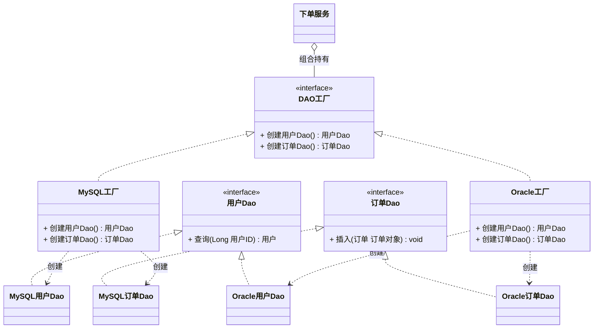

# 创建型 - 抽象工厂(Abstract Factory)（又称工具箱模式）

> 本文用「电商下单」这条业务主线统一重构，便于理解：一句话定义 → 业务痛点 → 结构（Mermaid 类图）→ 代码实现 → 何时用/不用 → 优缺点 → 与相似模式对比 → 真实框架中的应用。来源：整理自 pdai.tech / bugstack.cn。

---

## 一句话定义

**抽象工厂（Abstract Factory）**：提供一个接口，用来创建**一整族相关联的对象**，而不需要指定它们的具体类。

关键词是"**成套**"。工厂方法一次造一个产品，抽象工厂一次造**一整套配套的产品**，并且保证这套东西是同一个牌子的、能配合工作的。

---

## 业务痛点：没有它会怎样

电商系统要做**多数据库支持**：主站跑在 MySQL 上，但某个大客户私有化部署，要求必须用 Oracle。数据访问层至少涉及两张表：

- **用户表**：`用户Dao`，负责用户的增删改查；
- **订单表**：`订单Dao`，负责订单的增删改查。

MySQL 和 Oracle 的 SQL 方言不一样（分页、序列、日期函数、`ON DUPLICATE KEY` vs `MERGE INTO`），所以每张表都得有两套实现。如果不用抽象工厂，业务代码会长这样：

```java
public class 下单服务 {

    public void 下单(String 数据库类型, 订单 订单对象) {
        用户Dao 用户访问;
        订单Dao 订单访问;

        // 每个用到 Dao 的地方，都要把这套判断抄一遍
        if ("mysql".equals(数据库类型)) {
            用户访问 = new MySQL用户Dao();
            订单访问 = new MySQL订单Dao();
        } else {
            用户访问 = new Oracle用户Dao();
            订单访问 = new Oracle订单Dao();
        }

        用户访问.查询(订单对象.取用户ID());
        订单访问.插入(订单对象);
    }
}
```

痛点比前两种工厂更凶险：

- **配套关系没人保证**：最可怕的不是麻烦，是**写错组合**。有人一时手滑写成 `new MySQL用户Dao()` + `new Oracle订单Dao()`，代码能编译、能启动，跑到线上才发现两个 Dao 连的是不同的库，数据全乱。**编译器完全帮不上忙**；
- **判断逻辑指数级扩散**：现在有 2 张表，每处调用要写 2 行判断；等表涨到 30 张，每个服务都要写 30 行 if-else，而这样的服务有几十个；
- **新增数据库要地毯式改造**：客户要求支持人大金仓，你得把项目里所有 `if(mysql) else` 全找出来加一个分支，漏一处就是运行时崩溃。

抽象工厂的思路是：**把"同一个牌子的所有产品"打包到一个工厂里，你选牌子，剩下的配套由工厂保证。**

---

## 结构（Mermaid 类图）


```mermaid
classDiagram
    class DAO工厂 {
        <<interface>>
        + 创建用户Dao() 用户Dao
        + 创建订单Dao() 订单Dao
    }
    class MySQL工厂 {
        + 创建用户Dao() 用户Dao
        + 创建订单Dao() 订单Dao
    }
    class Oracle工厂 {
        + 创建用户Dao() 用户Dao
        + 创建订单Dao() 订单Dao
    }
    class 用户Dao {
        <<interface>>
        + 查询(Long 用户ID) 用户
    }
    class 订单Dao {
        <<interface>>
        + 插入(订单 订单对象) void
    }
    class MySQL用户Dao
    class Oracle用户Dao
    class MySQL订单Dao
    class Oracle订单Dao
    class 下单服务

    DAO工厂 <|.. MySQL工厂
    DAO工厂 <|.. Oracle工厂
    用户Dao <|.. MySQL用户Dao
    用户Dao <|.. Oracle用户Dao
    订单Dao <|.. MySQL订单Dao
    订单Dao <|.. Oracle订单Dao
    MySQL工厂 ..> MySQL用户Dao : 创建
    MySQL工厂 ..> MySQL订单Dao : 创建
    Oracle工厂 ..> Oracle用户Dao : 创建
    Oracle工厂 ..> Oracle订单Dao : 创建
    下单服务 o-- DAO工厂 : 组合持有
```

**角色职责**

| 角色 | 职责 |
|------|------|
| `DAO工厂`（抽象工厂） | 声明创建**整族产品**的方法：`创建用户Dao()`、`创建订单Dao()` |
| `MySQL工厂` / `Oracle工厂`（具体工厂） | 每个负责一个产品族，保证造出来的都是同一个牌子 |
| `用户Dao` / `订单Dao`（抽象产品） | 两个不同的**产品等级结构** |
| `MySQL用户Dao` 等（具体产品） | 位于"某个产品族 × 某个产品等级"的交叉点上 |
| `下单服务`（调用方） | **组合**一个 `DAO工厂`，只面向抽象编程 |

**两个核心概念一定要分清**

| 概念 | 含义 | 本例中 |
|------|------|--------|
| **产品等级结构** | 同一类产品的继承体系（纵向） | `用户Dao` 是一个等级，`订单Dao` 是另一个等级 |
| **产品族** | 同一个工厂产出的、配套使用的一组产品（横向） | MySQL 族 = {MySQL用户Dao, MySQL订单Dao} |

用一张表看得最清楚：

|  | 用户Dao（等级1） | 订单Dao（等级2） |
|--|-----------------|-----------------|
| **MySQL 族** | MySQL用户Dao | MySQL订单Dao |
| **Oracle 族** | Oracle用户Dao | Oracle订单Dao |

**抽象工厂是按"行"切的（一行 = 一个工厂），工厂方法是按"列"切的（一列 = 一个工厂）。** 记住这一句，两者再也不会混。

---

## 代码实现（跨数据库 DAO 工厂族）

**第一步：抽象产品——两个产品等级**

```java
/** 用户数据访问接口 */
public interface 用户Dao {
    用户 查询(Long 用户ID);
    void 更新余额(Long 用户ID, java.math.BigDecimal 金额);
}
```

```java
/** 订单数据访问接口 */
public interface 订单Dao {
    void 插入(订单 订单对象);
    java.util.List<订单> 分页查询(Long 用户ID, int 页码, int 每页条数);
}
```

**第二步：具体产品——MySQL 族**

```java
/** MySQL 版用户 Dao */
public class MySQL用户Dao implements 用户Dao {

    @Override
    public 用户 查询(Long 用户ID) {
        System.out.println("[MySQL] SELECT * FROM t_user WHERE id = " + 用户ID);
        return new 用户(用户ID, "张三");
    }

    @Override
    public void 更新余额(Long 用户ID, java.math.BigDecimal 金额) {
        // MySQL 方言：支持 ON DUPLICATE KEY UPDATE
        System.out.println("[MySQL] UPDATE t_user SET balance = balance - " + 金额 + " WHERE id = " + 用户ID);
    }
}
```

```java
import java.util.Collections;
import java.util.List;

/** MySQL 版订单 Dao */
public class MySQL订单Dao implements 订单Dao {

    @Override
    public void 插入(订单 订单对象) {
        System.out.println("[MySQL] INSERT INTO t_order (...) VALUES (...)");
    }

    @Override
    public List<订单> 分页查询(Long 用户ID, int 页码, int 每页条数) {
        // MySQL 方言：LIMIT offset, size
        int 偏移 = (页码 - 1) * 每页条数;
        System.out.println("[MySQL] SELECT * FROM t_order WHERE user_id = " + 用户ID
                + " LIMIT " + 偏移 + ", " + 每页条数);
        return Collections.emptyList();
    }
}
```

**第三步：具体产品——Oracle 族**

```java
/** Oracle 版用户 Dao */
public class Oracle用户Dao implements 用户Dao {

    @Override
    public 用户 查询(Long 用户ID) {
        System.out.println("[Oracle] SELECT * FROM T_USER WHERE ID = " + 用户ID);
        return new 用户(用户ID, "张三");
    }

    @Override
    public void 更新余额(Long 用户ID, java.math.BigDecimal 金额) {
        // Oracle 方言：用 MERGE INTO 代替 ON DUPLICATE KEY
        System.out.println("[Oracle] MERGE INTO T_USER ... AMOUNT = " + 金额);
    }
}
```

```java
import java.util.Collections;
import java.util.List;

/** Oracle 版订单 Dao */
public class Oracle订单Dao implements 订单Dao {

    @Override
    public void 插入(订单 订单对象) {
        // Oracle 方言：主键靠序列 SEQ_ORDER.NEXTVAL
        System.out.println("[Oracle] INSERT INTO T_ORDER (ID, ...) VALUES (SEQ_ORDER.NEXTVAL, ...)");
    }

    @Override
    public List<订单> 分页查询(Long 用户ID, int 页码, int 每页条数) {
        // Oracle 方言：ROWNUM 嵌套子查询分页
        int 起 = (页码 - 1) * 每页条数 + 1;
        int 止 = 页码 * 每页条数;
        System.out.println("[Oracle] SELECT * FROM (SELECT t.*, ROWNUM rn FROM T_ORDER t WHERE USER_ID = "
                + 用户ID + ") WHERE rn BETWEEN " + 起 + " AND " + 止);
        return Collections.emptyList();
    }
}
```

**第四步：抽象工厂 + 两个具体工厂**

```java
/** DAO 抽象工厂：一次性声明整族产品的创建方法 */
public interface DAO工厂 {

    用户Dao 创建用户Dao();

    订单Dao 创建订单Dao();

    /** 工厂自报家门，方便日志和监控 */
    String 数据库类型();
}
```

```java
/** MySQL 产品族工厂：造出来的一定全是 MySQL 版 */
public class MySQL工厂 implements DAO工厂 {

    @Override
    public 用户Dao 创建用户Dao() {
        return new MySQL用户Dao();
    }

    @Override
    public 订单Dao 创建订单Dao() {
        return new MySQL订单Dao();
    }

    @Override
    public String 数据库类型() {
        return "MySQL";
    }
}
```

```java
/** Oracle 产品族工厂 */
public class Oracle工厂 implements DAO工厂 {

    @Override
    public 用户Dao 创建用户Dao() {
        return new Oracle用户Dao();
    }

    @Override
    public 订单Dao 创建订单Dao() {
        return new Oracle订单Dao();
    }

    @Override
    public String 数据库类型() {
        return "Oracle";
    }
}
```

**第五步：调用方——只认工厂，不认具体 Dao**

```java
import java.math.BigDecimal;

public class 下单服务 {

    private final 用户Dao 用户访问;
    private final 订单Dao 订单访问;

    /**
     * 只在构造时选一次工厂，配套关系由工厂保证，
     * 绝无可能出现 MySQL用户Dao + Oracle订单Dao 的错配。
     */
    public 下单服务(DAO工厂 工厂) {
        this.用户访问 = 工厂.创建用户Dao();
        this.订单访问 = 工厂.创建订单Dao();
        System.out.println("数据访问层已切换到：" + 工厂.数据库类型());
    }

    public void 下单(Long 用户ID, BigDecimal 金额) {
        用户 买家 = 用户访问.查询(用户ID);
        用户访问.更新余额(用户ID, 金额);
        订单访问.插入(new 订单(用户ID, 金额));
        System.out.println("用户 " + 买家.取名字() + " 下单成功");
    }

    public static void main(String[] args) {
        // 整个系统只有这一行决定用哪个数据库
        String 部署环境 = System.getProperty("db", "mysql");
        DAO工厂 工厂 = "oracle".equals(部署环境) ? new Oracle工厂() : new MySQL工厂();

        new 下单服务(工厂).下单(1001L, new BigDecimal("299"));
    }
}
```

**切换数据库要改什么？** 只有 `main` 里那一行（工程上通常是一行配置）。业务代码一个字都不用动，这就是抽象工厂的威力。

---

## 什么时候该用 / 不该用

**该用：**

- 系统需要在**多套完整的实现方案之间切换**：多数据库、多云厂商（阿里云 OSS / 腾讯云 COS / AWS S3）、多支付渠道（微信 / 支付宝）、多套 UI 主题；
- 一组对象**必须配套使用**，混搭会出错——这是最强的判断信号。如果错配只是"不好看"，用不用无所谓；如果错配会导致**数据错乱、资金损失**，就必须用；
- 想让"选哪一套"这个决定**只出现一次**，并且能通过配置切换；
- 你希望**编译期就杜绝错配**：调用方拿到工厂后就只能造出同族产品，想错都错不了。

**不该用：**

- 只有一个产品等级（只有 `用户Dao`，没有 `订单Dao`）——直接用**工厂方法**，抽象工厂是杀鸡用牛刀；
- **产品等级会频繁增加**：这是抽象工厂最大的软肋。新增一个 `商品Dao`，意味着 `DAO工厂` 接口要加方法，**所有具体工厂都得跟着改**，严重违反开闭原则；
- 产品族之间差异很小，用几个 if 就能搞定——别为了模式而模式；
- 在 Spring 项目里做多数据源：直接用 `AbstractRoutingDataSource` 或多套 `@MapperScan` 更省事，框架已经把这活儿干了。

> **记牢这条规律**：抽象工厂对"**新增产品族**"是开放的（加一个 `人大金仓工厂` 即可，不改任何老代码），对"**新增产品等级**"是封闭的（加 `商品Dao` 要改所有工厂）。选型前先问自己：未来变的是"族"还是"等级"？

---

## 优缺点

| 优点 | 缺点 |
|------|------|
| **保证产品配套**，从编译期杜绝错配，这是它最核心的价值 | **难以新增产品等级**：加一个方法，所有具体工厂都要改 |
| 切换整套实现只需换一个工厂，调用方零改动 | 类数量爆炸：族数 × 等级数 个具体产品类 + N 个工厂类 |
| 调用方完全面向抽象编程，不认识任何具体类 | 抽象层次多，类图复杂，新人理解成本高 |
| 新增产品族完全符合开闭原则 | 前期设计要求高：产品族划分错了，后期重构成本极大 |
| 便于做多套实现的对比测试和灰度切换 | 小项目里明显过度设计 |

---

## 与相似模式的对比

| 对比项 | 抽象工厂 | 工厂方法 | 简单工厂 | 生成器(Builder) |
|--------|---------|---------|---------|----------------|
| 产出 | **一族配套产品** | 一个产品 | 一个产品 | **一个复杂产品** |
| 切分维度 | 按**产品族**（横向切） | 按**产品等级**（纵向切） | 不切分，全在一个类里 | 不切分 |
| 复用手段 | **组合**（调用方持有工厂） | **继承**（子类实现方法） | 静态方法 | 组合 |
| 创建步骤 | 一步到位 | 一步到位 | 一步到位 | **分多步逐个装配** |
| 开闭原则 | 新增族 ✅ / 新增等级 ❌ | 新增产品 ✅ | 都 ❌ | ✅ |
| 关注点 | **成套创建，保证兼容** | **创建谁** | 创建谁 | **怎么一步步造出来** |

> 三点澄清：
>
> 1. **抽象工厂内部就是一堆工厂方法**：`创建用户Dao()` 单独拿出来看，完全符合工厂方法的定义。所以抽象工厂可以理解为"工厂方法的集合版"。区别在于视角——工厂方法用**继承**（子类决定造啥），抽象工厂用**组合**（客户端组合一个工厂对象）。
> 2. **抽象工厂 vs 生成器**：抽象工厂关心"造出来的东西是不是一套的"，生成器关心"这一个复杂对象怎么分步装配出来"。前者产出多个对象，后者产出一个对象。
> 3. **抽象工厂常和单例配合**：具体工厂通常做成单例，因为它无状态，全局一个就够了。

---

## 真实框架中的应用

### 1. JDK：`DocumentBuilderFactory` 与 XML 解析族

`javax.xml.parsers.DocumentBuilderFactory` 是标准的抽象工厂：

```java
DocumentBuilderFactory 工厂 = DocumentBuilderFactory.newInstance();
DocumentBuilder 解析器 = 工厂.newDocumentBuilder();
Document 文档 = 解析器.parse(输入流);
```

你的代码只依赖 JAXP 接口，底层实现可以是 Xerces、Crimson 或 JDK 内置实现——换实现只需换 jar 包或改系统属性。同族的 `DocumentBuilder`、`Document`、`Element` 一定来自同一个实现，绝不会串。

同类的还有 `java.sql.Connection`：`Connection` 能创建 `Statement`、`PreparedStatement`、`CallableStatement`、`Blob`、`Clob`——这一整族对象都由同一个驱动实现产出，你不可能拿 MySQL 的 Connection 造出 Oracle 的 Statement。

### 2. Spring：`BeanFactory` 体系与 `AbstractRoutingDataSource`

- Spring 的 `BeanFactory` → `ApplicationContext` → `WebApplicationContext` 这条继承链，每一层都在扩展"能产出哪些东西"；
- **`AbstractRoutingDataSource`** 是抽象工厂思想在多数据源场景的实用变体：它持有一个 `Map<Object, DataSource>` 的目标数据源集合，通过 `determineCurrentLookupKey()` 在运行期决定路由到哪个数据源。虽然它路由的是"单个 DataSource"而非"一族对象"，但"选一次牌子、后续全部配套"的思路完全一致；
- Spring 对多种事务管理器（`DataSourceTransactionManager` / `JpaTransactionManager` / `JtaTransactionManager`）的抽象也是同一套逻辑：选定一个管理器，它产出的 `TransactionStatus`、`SavepointManager` 都是配套的。

### 3. MyBatis：`Configuration` 是隐藏的抽象工厂

`org.apache.ibatis.session.Configuration` 承担了抽象工厂的职责，它负责创建 MyBatis 运行时的一整族核心组件：

```java
// Configuration 里的一组 newXxx 方法，产出的是一整套配套组件
public Executor newExecutor(Transaction transaction, ExecutorType executorType) { ... }
public StatementHandler newStatementHandler(...) { ... }
public ParameterHandler newParameterHandler(...) { ... }
public ResultSetHandler newResultSetHandler(...) { ... }
```

这四个组件必须配套：`SimpleExecutor` 要配 `SimpleStatementHandler`、`BatchExecutor` 要配批处理逻辑。`Configuration` 保证了它们的一致性，同时还在这几个方法里统一织入了插件链（`interceptorChain.pluginAll(...)`），这是抽象工厂 + 责任链的组合运用。

另外 MyBatis 的 `Environment` 把 `TransactionFactory` 和 `DataSource` 捆在一起，也是"配套"思想：JDBC 事务管理器要配非托管数据源，MANAGED 事务要配容器数据源。

### 4. 实战：Redis 双集群升级的代理抽象

一个经典的生产案例是**Redis 集群升级**：老系统用的是 Redis 2.x 单机客户端，要平滑迁到 Redis Cluster。做法是定义一个 `缓存服务` 抽象工厂，产出 `字符串操作`、`哈希操作`、`集合操作` 等一族接口，老集群和新集群各实现一个工厂。上层业务代码不动，通过配置或代理类在两个工厂间灰度切换，出问题一键回滚。这比"到处改 Jedis 调用"安全一万倍。

---

## 小结

抽象工厂解决的核心问题不是"少写几个 new"，而是**保证一组对象的配套性**——让"MySQL 的 Dao 配 Oracle 的 Dao"这种错误在编译期就不可能发生。它的代价是类数量膨胀和"新增产品等级要改所有工厂"的硬伤。所以选型时只需想清楚一件事：**未来变化的是产品族（多一套实现）还是产品等级（多一种产品）？** 前者用抽象工厂如鱼得水，后者用它会痛不欲生。

---

> 参考来源：整理自 https://pdai.tech/md/dev-spec/pattern/5_abstract_factory.html 与 https://bugstack.cn 《实战抽象工厂模式「替换 Redis 双集群升级，代理类抽象场景」》，本文重写示例与讲解。
