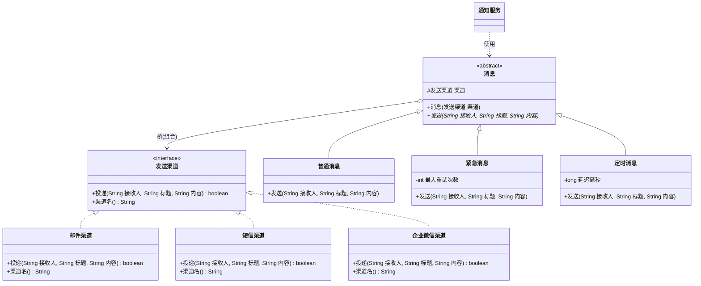

# 结构型 - 桥接(Bridge)（柄体模式 Handle-Body、接口模式）

> 本文用「电商下单」这条业务主线统一重构：一句话定义 → 业务痛点 → 结构（Mermaid 类图）→ 可运行代码 → 何时用/不用 → 优缺点 → 与相似模式对比 → 真实框架中的应用，便于理解。
> 来源：整理自 https://pdai.tech 与 https://bugstack.cn ，本文重写示例与讲解。

---

## 一句话定义

**桥接模式（Bridge）**：当一个东西有**两个（或多个）独立变化的维度**时，别用继承把它们拧成一团，而是把其中一个维度抽出来做成接口，让另一个维度**持有**它——这根"持有"的引用，就是所谓的**桥**。

一句大白话：**别写"紧急短信"这种类，要写"紧急消息"和"短信渠道"两个类，然后让前者拿着后者。**

> 别名提醒：桥接模式又叫**柄体模式（Handle-Body）**或**接口模式（Interface Pattern）**。核心口诀：**抽象与实现分离，各自独立变化。**

---

## 业务痛点：没有它会怎样

电商下单之后要发一堆通知：下单成功、支付成功、发货提醒、库存预警……

这些通知天然有**两个维度**：

- **维度 A —— 发送渠道**：邮件、短信、企业微信、App 推送……
- **维度 B —— 消息类型（发送策略）**：普通消息（直接发一次）、紧急消息（发送前加高优先级标记 + 失败自动重试三次）、定时消息（延迟到指定时间发）……

如果用继承硬怼，你会写出这样一棵树：

```java
// 反面教材：两个维度用继承交叉，类爆炸
abstract class 消息 { abstract void 发送(String 接收人, String 内容); }

class 邮件普通消息 extends 消息 { /* ... */ }
class 邮件紧急消息 extends 消息 { /* ... */ }
class 邮件定时消息 extends 消息 { /* ... */ }
class 短信普通消息 extends 消息 { /* ... */ }
class 短信紧急消息 extends 消息 { /* ... */ }
class 短信定时消息 extends 消息 { /* ... */ }
class 企微普通消息 extends 消息 { /* ... */ }
// ...还有 2 个，一共 3 × 3 = 9 个类
```

痛点非常直观：

| 问题 | 说明 |
|------|------|
| **类数量笛卡尔积爆炸** | m 个渠道 × n 种类型 = **m × n** 个类。现在 3×3=9 个，再加个"App 推送"渠道就要新增 3 个类，再加个"定时"类型又要新增 4 个 |
| **代码大量重复** | "邮件怎么发"这段逻辑，在 `邮件普通消息`、`邮件紧急消息`、`邮件定时消息` 里被抄了三遍。改一次 SMTP 配置要改三个文件 |
| **改动扩散** | 重试策略要从 3 次改成 5 次？所有 `XX紧急消息` 类全得改 |
| **违反单一职责** | 一个 `短信紧急消息` 类既管"怎么调短信网关"，又管"怎么重试"，两件事搅在一起 |

**根因**：把两个**本来毫不相干、各自独立变化**的维度，用"继承"这条死绑定绑到了一起。

桥接模式的解法是：**把 m × n 变成 m + n。** 3 个渠道类 + 3 个类型类 = 6 个类，而且新增渠道时类型侧一行都不用改，反之亦然。

---

## 结构（Mermaid 类图）



**角色职责**

| 角色 | 类图中对应 | 职责 |
|------|-----------|------|
| Abstraction（抽象化） | `消息` | 定义高层业务语义（"发一条消息"），**持有实现方接口的引用**，这个引用就是"桥" |
| RefinedAbstraction（扩充抽象化） | `普通消息` / `紧急消息` / `定时消息` | 在抽象层面扩展**发送策略**（重试、延迟、优先级），不关心具体走哪个渠道 |
| Implementor（实现化接口） | `发送渠道` | 定义底层原语操作（`投递`），只提供最基础的能力，**不含业务策略** |
| ConcreteImplementor（具体实现化） | `邮件渠道` / `短信渠道` / `企业微信渠道` | 各自实现"怎么把一条内容投递出去"，互不知道对方存在 |
| Client（调用方） | `通知服务` | 在运行时把"某个类型"和"某个渠道"**自由组合**起来 |

**关键理解：谁是抽象，谁是实现？**

| 维度 | 判断方法 | 本例 |
|------|---------|------|
| 抽象化（Abstraction） | 更贴近**业务语义**、面向调用方的那一侧 | 消息类型（普通/紧急/定时） |
| 实现化（Implementor） | 更贴近**技术平台/底层能力**、可被替换的那一侧 | 发送渠道（邮件/短信/企微） |

> 注意：这里的"实现（Implementor）"**不是**指"接口的实现类"，而是指"另一个变化维度"。这是初学者最容易误解的一点。

---

## 代码实现（电商消息通知）

**第一步：实现化接口——渠道维度（只管"怎么发出去"）**

```java
/** Implementor：发送渠道，只提供最原始的投递能力，不含任何业务策略 */
public interface 发送渠道 {
    /** @return true=投递成功 */
    boolean 投递(String 接收人, String 标题, String 内容);
    String 渠道名();
}

/** ConcreteImplementor 1：邮件 */
public class 邮件渠道 implements 发送渠道 {
    @Override
    public boolean 投递(String 接收人, String 标题, String 内容) {
        System.out.println("  [SMTP] to=" + 接收人 + " 主题《" + 标题 + "》 正文：" + 内容);
        return true;
    }
    @Override public String 渠道名() { return "邮件"; }
}

/** ConcreteImplementor 2：短信（标题会被忽略，短信没有标题） */
public class 短信渠道 implements 发送渠道 {
    @Override
    public boolean 投递(String 接收人, String 标题, String 内容) {
        System.out.println("  [短信网关] 手机号=" + 接收人 + " 内容：【商城】" + 内容);
        return true;
    }
    @Override public String 渠道名() { return "短信"; }
}

/** ConcreteImplementor 3：企业微信（模拟偶发失败，用于演示重试） */
public class 企业微信渠道 implements 发送渠道 {
    private int 调用次数 = 0;
    @Override
    public boolean 投递(String 接收人, String 标题, String 内容) {
        调用次数++;
        boolean 成功 = 调用次数 % 2 == 0;   // 第 1 次失败，第 2 次成功
        System.out.println("  [企微机器人] userId=" + 接收人 + " 内容：" + 内容
                + " -> " + (成功 ? "成功" : "失败"));
        return 成功;
    }
    @Override public String 渠道名() { return "企业微信"; }
}
```

**第二步：抽象化——消息类型维度（只管"用什么策略发"）**

```java
/** Abstraction：持有渠道引用，这个 protected 字段就是「桥」 */
public abstract class 消息 {

    protected final 发送渠道 渠道;   // ← 桥：连接两个维度

    protected 消息(发送渠道 渠道) {
        this.渠道 = 渠道;
    }

    /** 由子类定义发送策略 */
    public abstract void 发送(String 接收人, String 标题, String 内容);
}
```

```java
/** RefinedAbstraction 1：普通消息——发一次，成败随缘 */
public class 普通消息 extends 消息 {

    public 普通消息(发送渠道 渠道) { super(渠道); }

    @Override
    public void 发送(String 接收人, String 标题, String 内容) {
        System.out.println("【普通消息】走 " + 渠道.渠道名());
        渠道.投递(接收人, 标题, 内容);
    }
}
```

```java
/** RefinedAbstraction 2：紧急消息——加急标记 + 失败重试 */
public class 紧急消息 extends 消息 {

    private final int 最大重试次数;

    public 紧急消息(发送渠道 渠道) { this(渠道, 3); }

    public 紧急消息(发送渠道 渠道, int 最大重试次数) {
        super(渠道);
        this.最大重试次数 = 最大重试次数;
    }

    @Override
    public void 发送(String 接收人, String 标题, String 内容) {
        System.out.println("【紧急消息】走 " + 渠道.渠道名() + "，失败最多重试 " + 最大重试次数 + " 次");
        String 加急内容 = "[加急] " + 内容;
        for (int i = 1; i <= 最大重试次数; i++) {
            if (渠道.投递(接收人, "[加急] " + 标题, 加急内容)) {
                System.out.println("  第 " + i + " 次投递成功");
                return;
            }
            System.out.println("  第 " + i + " 次投递失败，准备重试...");
        }
        System.out.println("  重试耗尽，转入人工告警队列");
    }
}
```

```java
/** RefinedAbstraction 3：定时消息——延迟到指定时间再投递 */
public class 定时消息 extends 消息 {

    private final long 延迟毫秒;

    public 定时消息(发送渠道 渠道, long 延迟毫秒) {
        super(渠道);
        this.延迟毫秒 = 延迟毫秒;
    }

    @Override
    public void 发送(String 接收人, String 标题, String 内容) {
        System.out.println("【定时消息】走 " + 渠道.渠道名() + "，" + 延迟毫秒 + "ms 后投递");
        // 真实场景应交给延迟队列/调度中心，这里简化演示
        渠道.投递(接收人, 标题, 内容);
    }
}
```

**第三步：调用方——运行时自由组合两个维度**

```java
public class 通知服务 {

    public static void main(String[] args) {
        // 下单成功 -> 普通消息 + 短信
        new 普通消息(new 短信渠道())
                .发送("13800138000", "下单成功", "您的订单 ORD001 已提交，请及时支付");

        System.out.println("---");

        // 支付成功 -> 普通消息 + 邮件（换渠道，类型代码零改动）
        new 普通消息(new 邮件渠道())
                .发送("buyer@shop.com", "支付成功", "订单 ORD001 已支付 288.00 元");

        System.out.println("---");

        // 库存告警 -> 紧急消息 + 企业微信（换类型，渠道代码零改动）
        new 紧急消息(new 企业微信渠道())
                .发送("ops_group", "库存告警", "SKU-8888 库存不足 10 件");

        System.out.println("---");

        // 大促预热 -> 定时消息 + 邮件
        new 定时消息(new 邮件渠道(), 3600_000L)
                .发送("buyer@shop.com", "大促开始", "您关注的商品明日 10 点开抢");
    }
}
```

运行输出：

```java
// 【普通消息】走 短信
//   [短信网关] 手机号=13800138000 内容：【商城】您的订单 ORD001 已提交，请及时支付
// ---
// 【普通消息】走 邮件
//   [SMTP] to=buyer@shop.com 主题《支付成功》 正文：订单 ORD001 已支付 288.00 元
// ---
// 【紧急消息】走 企业微信，失败最多重试 3 次
//   [企微机器人] userId=ops_group 内容：[加急] SKU-8888 库存不足 10 件 -> 失败
//   第 1 次投递失败，准备重试...
//   [企微机器人] userId=ops_group 内容：[加急] SKU-8888 库存不足 10 件 -> 成功
//   第 2 次投递成功
// ---
// 【定时消息】走 邮件，3600000ms 后投递
//   [SMTP] to=buyer@shop.com 主题《大促开始》 正文：您关注的商品明日 10 点开抢
```

**收益对比**

| 方案 | 3 渠道 × 3 类型 | 再加 1 个"App推送"渠道 | 再加 1 个"批量"类型 |
|------|----------------|----------------------|-------------------|
| 继承硬怼 | 9 个类 | +3 个类（共 12） | +4 个类（共 16） |
| 桥接模式 | **3 + 3 = 6 个类** | **+1 个类**（共 7） | **+1 个类**（共 8） |

---

## 什么时候该用 / 不该用

**该用：**

- 一个系统存在**两个及以上独立变化的维度**，且两两组合有意义（渠道×类型、支付方式×支付模式、数据库×SQL方言、形状×颜色）；
- 用继承已经出现或即将出现**类爆炸**（类名里带"且"的，比如 `短信紧急消息`，基本都是信号）；
- 希望在**运行时动态切换**实现（比如根据配置决定走短信还是企微），继承是编译期绑定的，做不到；
- 想让抽象侧和实现侧由**不同团队/不同模块**独立演进、独立发版。

**不该用：**

- 只有**一个变化维度**——直接用策略模式或简单继承就够了，桥接是杀鸡用牛刀；
- 两个维度**不是正交的**（比如"短信"渠道根本不支持"富文本"类型），强行组合会产生大量无效搭配和运行时异常；
- 维度虽多但组合极少且**永远不会变**（比如就固定两种搭配），此时多两层抽象只会增加理解成本；
- 团队对"哪个是抽象、哪个是实现"分不清——**识别维度是桥接最难的一步**，划错了会比不用还乱。

---

## 优缺点

| 优点 | 缺点 |
|------|------|
| 把 **m × n 个类降为 m + n 个**，从根上消灭类爆炸 | **需要正确识别两个独立维度**，这是设计难点，划错就是灾难 |
| 抽象与实现**独立扩展**，各自新增互不影响，符合开闭原则 | 引入了额外的抽象层，系统理解与阅读成本上升 |
| 支持**运行时动态切换**实现（继承做不到） | 对小规模、单维度场景是过度设计 |
| 消除重复代码（渠道逻辑只写一份） | 抽象层与实现层的接口边界要精心设计，改动接口影响面大 |
| 符合合成复用原则（用组合代替继承） | 客户端需要自己组装两侧对象（可用工厂/DI 缓解） |

---

## 与相似模式的对比

| 对比项 | 桥接(Bridge) | 适配器(Adapter) | 装饰(Decorator) | 策略(Strategy) | 抽象工厂 |
|--------|-------------|----------------|----------------|---------------|---------|
| 核心目的 | **分离两个变化维度** | 转换不兼容的接口 | 动态叠加功能 | 替换算法实现 | 创建产品族 |
| 何时介入 | **设计之初**主动规划 | **事后补救**，东西已存在 | 运行时层层包裹 | 运行时替换 | 创建对象时 |
| 结构相似点 | 抽象持有实现接口 | 适配器持有被适配者 | 装饰器持有组件 | 上下文持有策略 | — |
| 关键区别 | 两侧**都能独立继承扩展** | 只有一侧需要改造 | 装饰者与被装饰者**同接口**，可无限套娃 | 只有**一个**维度在变 | 关注"造什么"而非"怎么用" |
| 一句话记忆 | 十字路口拆成两条路 | 转接头 | 套娃加料 | 换算法 | 造一整套 |

**最容易混的两组，重点说：**

- **桥接 vs 策略**：结构上几乎一模一样（都是持有一个接口引用），区别在**意图与规模**。策略模式只有**一个**变化维度——"算法可替换"，抽象侧通常只有一个 `Context` 类；桥接模式有**两个**维度，抽象侧自己也是一棵继承树（`普通消息`/`紧急消息`/`定时消息`）。**判断法：抽象侧有没有子类？有 → 桥接；没有 → 策略。**
- **桥接 vs 适配器**：桥接是**未雨绸缪**——设计时就预见到两个维度会变，主动把它们分开；适配器是**亡羊补牢**——两个东西已经存在且接口对不上，被迫加层翻译。时机完全不同。

---

## 真实框架中的应用

**1. JDBC —— 桥接模式最经典的教科书案例**

JDBC 有两个独立变化的维度：

- **抽象侧**：`java.sql.Driver`、`Connection`、`Statement`、`ResultSet` 等 JDK 定义的标准接口，业务代码只面向它们；
- **实现侧**：MySQL 的 `com.mysql.cj.jdbc.Driver`、Oracle 的 `oracle.jdbc.OracleDriver`、PostgreSQL 驱动……各厂商自己实现。

```java
// 业务代码只依赖 java.sql.* 抽象，换数据库只改配置
Class.forName("com.mysql.cj.jdbc.Driver");            // 加载具体实现
Connection 连接 = DriverManager.getConnection(url, user, pwd);
Statement 语句 = 连接.createStatement();
```

`DriverManager` 就是那座桥：它维护已注册的 `Driver` 列表，运行时根据 URL 挑一个具体驱动返回 `Connection`。JDK 侧可以持续增强 API（JDBC 4.0 加 `SPI` 自动加载、加 `try-with-resources` 支持），厂商侧可以持续优化驱动，**两边完全独立发版，互不阻塞**。

**2. Slf4j —— 门面 + 桥接的组合拳**

Slf4j 的官方文档里直接把那些 jar 叫做 "**bridging**"（桥接包）：

- **抽象侧**：`org.slf4j.Logger` / `LoggerFactory`，业务代码只 import 这个；
- **实现侧**：`logback-classic`、`slf4j-log4j12`、`slf4j-jdk14`、`log4j-slf4j-impl`……

```java
private static final Logger 日志 = LoggerFactory.getLogger(订单服务.class);
```

`LoggerFactory` 在启动时通过 SPI 找到类路径下的 `StaticLoggerBinder` / `SLF4JServiceProvider`，把抽象侧绑定到具体实现。换日志框架只需换一个 jar 依赖，**业务代码一行不改**。这也是"抽象与实现独立变化"的直观体现。

**3. Spring —— `JdbcTemplate` 与 `DataSource`**

Spring 的很多"模板类"都体现桥接思想。`JdbcTemplate`（抽象侧，负责 SQL 执行流程、异常转换、资源管理）持有一个 `DataSource`（实现侧，可以是 HikariCP、Druid、DBCP、C3P0）。你可以随意更换连接池实现，`JdbcTemplate` 的逻辑完全不受影响；反过来 Spring 增强 `JdbcTemplate` 的功能，也不需要连接池配合。

同理还有 Spring 的 `Resource` 体系：抽象侧是 `Resource` 接口，实现侧是 `ClassPathResource`、`FileSystemResource`、`UrlResource`、`ByteArrayResource`。

**4. MyBatis —— `Executor` 与 `Transaction` / `DataSource`**

MyBatis 的执行器有 `SimpleExecutor`、`ReuseExecutor`、`BatchExecutor`、`CachingExecutor` 几种（一个维度：执行策略），而事务管理有 `JdbcTransaction`、`ManagedTransaction`（另一个维度：事务托管方）。`Executor` 通过持有 `Transaction` 完成桥接，两个维度可以自由组合——`BatchExecutor + SpringManagedTransaction` 就是 MyBatis-Spring 的常见搭配。

**5. 业务实战：多支付渠道 × 多支付模式**

bugstack 那篇经典实战讲的正是这个场景：支付渠道（微信、支付宝）是一个维度，支付模式（刷脸、指纹、密码）是另一个维度。若用继承要写 2×3=6 个类；用桥接，`支付抽象类` 持有 `支付模式` 接口，只需 2+3=5 个类，且新增"银联"渠道只加 1 个类。

---

## 小结

桥接模式的全部功力，都花在**"看出这里有两个维度"**这一步上。一旦你在代码里看到 `短信紧急消息`、`微信刷脸支付` 这类"名词+名词"的类名，或者发现继承树在横向疯狂膨胀，就该停下来问一句：这真的是一棵树，还是两棵树被强行焊在了一起？把它们拆开，用一个引用连起来，m × n 就变成了 m + n。记住那句口诀——**抽象与实现分离，各自独立变化**。

---

> 参考来源：整理自 https://pdai.tech/md/dev-spec/pattern/10_bridge.html （著作权归 pdai.tech 所有）与 https://bugstack.cn 《重学 Java 设计模式：实战桥接模式「多支付渠道与多支付模式场景」》，并综合公开资料，本文重写示例与讲解。
