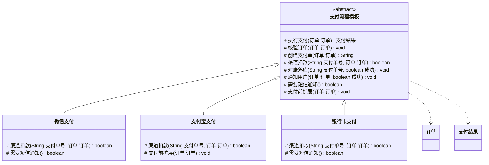

# 行为型 - 模板方法(Template Method)

> 本文用「电商下单」业务主线统一重构，便于理解。来源：整理自 pdai.tech。

---

## 一句话定义

**模板方法模式（Template Method）**：在父类里把一件事的**流程骨架**写死，把其中**会变的步骤**留成抽象方法交给子类实现，子类只能填空、不能改流程顺序。

大白话：公司规定的报销流程是「填单 → 上传发票 → 主管审批 → 财务打款」，四步顺序谁也不能改；但「上传发票」这一步，差旅贴机票、招待贴餐票——**骨架统一，细节各填各的**。

---

## 业务痛点：没有它会怎样

电商支付有多个渠道：**微信支付**、**支付宝**、**银行卡**。它们的流程其实高度一致：

1. 校验订单（金额、状态是否可支付）
2. 创建支付单
3. 调用渠道扣款 ← **只有这一步真正不同**
4. 对账落库
5. 通知用户

没有模板方法时，团队一般会为每个渠道写一个完整的 Service：

```java
public class 微信支付服务 {
    public void 支付(订单 订单) {
        // 1. 校验订单（和支付宝那份一模一样）
        if (订单.取金额().compareTo(BigDecimal.ZERO) <= 0) throw new RuntimeException("金额非法");
        // 2. 创建支付单（一模一样）
        String 支付单号 = "PAY" + System.nanoTime();
        // 3. 调微信 API  ← 唯一的差异
        调用微信统一下单(支付单号, 订单.取金额());
        // 4. 对账落库（一模一样）
        // 5. 通知用户（一模一样）
    }
}

public class 支付宝支付服务 {
    public void 支付(订单 订单) {
        // 1~2、4~5 全是复制粘贴，只有第 3 步换成支付宝 API
    }
}
```

痛点：

- **80% 的代码是复制粘贴**，改一处对账逻辑要在 N 个渠道里改 N 遍，漏一个就是资损事故；
- 新人加渠道时，直接 copy 一份改改，**很容易漏掉某一步**（比如忘了写对账）；
- 流程顺序无法被约束：某个渠道图省事把「校验」挪到了扣款后面，**没有任何机制拦住他**；
- 想给所有渠道统一加一步「支付前风控」，得挨个改。

模板方法的解法：把 1、2、4、5 写进父类的 `final` 模板方法里**锁死**，只把第 3 步开放给子类。

---

## 结构（Mermaid 类图）



**角色职责**

| 角色 | 对应类/方法 | 职责 |
|------|------------|------|
| AbstractClass（抽象模板） | `支付流程模板` | 定义算法骨架，把公共步骤实现掉，把可变步骤声明为抽象 |
| TemplateMethod（模板方法） | `执行支付()` | **声明为 `final`**，锁死步骤顺序，子类不可覆盖 |
| AbstractMethod（抽象步骤） | `渠道扣款()` | 每个子类**必须**实现的差异点 |
| ConcreteMethod（具体步骤） | `校验订单()`、`对账落库()` | 所有子类共用，父类直接实现 |
| HookMethod（钩子方法） | `需要短信通知()`、`支付前扩展()` | 有默认实现，子类**可选**覆盖，用来微调流程 |
| ConcreteClass（具体子类） | `微信支付` 等 | 只填自己的差异，完全不碰流程 |

---

## 代码实现（电商支付流程模板）

**1）领域对象**

```java
import java.math.BigDecimal;

public class 订单 {
    private String 订单号;
    private Long 用户编号;
    private BigDecimal 金额;
    private String 状态;   // 待支付 / 已支付

    public 订单(String 订单号, Long 用户编号, BigDecimal 金额, String 状态) {
        this.订单号 = 订单号;
        this.用户编号 = 用户编号;
        this.金额 = 金额;
        this.状态 = 状态;
    }

    public String 取订单号() { return 订单号; }
    public Long 取用户编号() { return 用户编号; }
    public BigDecimal 取金额() { return 金额; }
    public String 取状态() { return 状态; }
    public void 设状态(String 状态) { this.状态 = 状态; }
}

public class 支付结果 {
    private final boolean 成功;
    private final String 支付单号;
    private final String 消息;

    public 支付结果(boolean 成功, String 支付单号, String 消息) {
        this.成功 = 成功;
        this.支付单号 = 支付单号;
        this.消息 = 消息;
    }

    public boolean 是否成功() { return 成功; }
    public String 取支付单号() { return 支付单号; }
    public String 取消息() { return 消息; }

    @Override
    public String toString() {
        return "支付结果{成功=" + 成功 + ", 支付单号=" + 支付单号 + ", 消息=" + 消息 + "}";
    }
}
```

**2）抽象模板：骨架 + 钩子**

```java
import java.math.BigDecimal;

public abstract class 支付流程模板 {

    /**
     * 模板方法：支付的完整骨架，用 final 锁死，子类无法改顺序。
     * 下单 → 扣款 → 对账 → 通知
     */
    public final 支付结果 执行支付(订单 订单) {
        System.out.println("========== 开始支付：" + 渠道名称() + " ==========");

        // 步骤 1：公共 —— 校验订单
        校验订单(订单);

        // 钩子：给子类一个插手的机会（比如支付宝要先做实名校验）
        支付前扩展(订单);

        // 步骤 2：公共 —— 创建支付单
        String 支付单号 = 创建支付单(订单);

        // 步骤 3：差异 —— 各渠道自己实现
        boolean 扣款成功 = 渠道扣款(支付单号, 订单);

        // 步骤 4：公共 —— 对账落库
        对账落库(支付单号, 扣款成功);

        // 步骤 5：公共 —— 通知（是否发短信由钩子控制）
        通知用户(订单, 扣款成功);

        if (扣款成功) {
            订单.设状态("已支付");
        }
        return new 支付结果(扣款成功, 支付单号, 扣款成功 ? "支付成功" : "支付失败");
    }

    // ---------- 抽象步骤：必须实现 ----------

    /** 渠道名称，用于日志 */
    protected abstract String 渠道名称();

    /** 真正调用第三方扣款，各渠道差异最大的一步 */
    protected abstract boolean 渠道扣款(String 支付单号, 订单 订单);

    // ---------- 公共步骤：父类实现，子类共用 ----------

    protected void 校验订单(订单 订单) {
        if (!"待支付".equals(订单.取状态())) {
            throw new IllegalStateException("订单状态不可支付：" + 订单.取状态());
        }
        if (订单.取金额() == null || 订单.取金额().compareTo(BigDecimal.ZERO) <= 0) {
            throw new IllegalArgumentException("支付金额必须大于 0");
        }
        System.out.println("[1/5] 校验订单通过：" + 订单.取订单号());
    }

    protected String 创建支付单(订单 订单) {
        String 支付单号 = "PAY" + System.nanoTime();
        System.out.println("[2/5] 创建支付单：" + 支付单号 + "，金额=" + 订单.取金额());
        return 支付单号;
    }

    protected void 对账落库(String 支付单号, boolean 成功) {
        System.out.println("[4/5] 写入对账流水：" + 支付单号 + "，结果=" + (成功 ? "成功" : "失败"));
    }

    protected void 通知用户(订单 订单, boolean 成功) {
        System.out.println("[5/5] 站内信通知用户 " + 订单.取用户编号());
        if (需要短信通知()) {   // 钩子决定要不要多发一条短信
            System.out.println("[5/5] 额外发送短信通知用户 " + 订单.取用户编号());
        }
    }

    // ---------- 钩子方法：有默认值，子类可选覆盖 ----------

    /** 默认不发短信，需要的渠道自己打开 */
    protected boolean 需要短信通知() {
        return false;
    }

    /** 默认什么都不做，子类需要时插入自己的前置逻辑 */
    protected void 支付前扩展(订单 订单) {
        // 空实现
    }
}
```

**3）三个具体渠道：只填差异**

```java
public class 微信支付 extends 支付流程模板 {

    @Override
    protected String 渠道名称() { return "微信支付"; }

    @Override
    protected boolean 渠道扣款(String 支付单号, 订单 订单) {
        System.out.println("[3/5] 调用微信统一下单接口，支付单号=" + 支付单号);
        // 真实场景：HTTP 调 https://api.mch.weixin.qq.com/...
        return true;
    }

    /** 微信支付的用户习惯看短信，打开钩子 */
    @Override
    protected boolean 需要短信通知() {
        return true;
    }
}

public class 支付宝支付 extends 支付流程模板 {

    @Override
    protected String 渠道名称() { return "支付宝"; }

    /** 支付宝渠道要求先做实名校验，用钩子插入 */
    @Override
    protected void 支付前扩展(订单 订单) {
        System.out.println("[钩子] 支付宝渠道：校验用户 " + 订单.取用户编号() + " 实名信息");
    }

    @Override
    protected boolean 渠道扣款(String 支付单号, 订单 订单) {
        System.out.println("[3/5] 调用支付宝交易接口，支付单号=" + 支付单号);
        return true;
    }
}

public class 银行卡支付 extends 支付流程模板 {

    @Override
    protected String 渠道名称() { return "银行卡快捷支付"; }

    @Override
    protected boolean 渠道扣款(String 支付单号, 订单 订单) {
        System.out.println("[3/5] 调用银联代扣接口，支付单号=" + 支付单号);
        // 演示一次失败
        return false;
    }

    @Override
    protected boolean 需要短信通知() {
        return true;
    }
}
```

**4）运行**

```java
import java.math.BigDecimal;

public class 客户端 {
    public static void main(String[] args) {
        订单 订单A = new 订单("ORD-001", 1001L, new BigDecimal("128.00"), "待支付");
        订单 订单B = new 订单("ORD-002", 1002L, new BigDecimal("59.90"), "待支付");
        订单 订单C = new 订单("ORD-003", 1003L, new BigDecimal("999.00"), "待支付");

        System.out.println(new 微信支付().执行支付(订单A));
        System.out.println();
        System.out.println(new 支付宝支付().执行支付(订单B));
        System.out.println();
        System.out.println(new 银行卡支付().执行支付(订单C));
    }
}
```

输出（节选）：

```
========== 开始支付：微信支付 ==========
[1/5] 校验订单通过：ORD-001
[2/5] 创建支付单：PAY123456789，金额=128.00
[3/5] 调用微信统一下单接口，支付单号=PAY123456789
[4/5] 写入对账流水：PAY123456789，结果=成功
[5/5] 站内信通知用户 1001
[5/5] 额外发送短信通知用户 1001
支付结果{成功=true, 支付单号=PAY123456789, 消息=支付成功}

========== 开始支付：支付宝 ==========
[1/5] 校验订单通过：ORD-002
[钩子] 支付宝渠道：校验用户 1002 实名信息
[2/5] 创建支付单：PAY123456790，金额=59.90
[3/5] 调用支付宝交易接口，支付单号=PAY123456790
...
```

想给所有渠道统一加一步「支付后发优惠券」？只改父类模板方法一处，三个子类零改动。

---

## 什么时候该用 / 不该用

**该用：**

- 多个类的**流程完全一致、只有个别步骤不同**（支付渠道、导入导出、各类报表生成）；
- 想把**流程顺序固化**下来，防止后人乱改（用 `final` 模板方法强约束）；
- 需要给框架使用者留**扩展点**，但又不想开放整个流程（钩子方法）。

**不该用：**

- 各实现之间的流程**本身就不一样**，硬套模板会导致父类塞满 `if (是微信) ...`；
- 差异点特别多（5 个步骤里 4 个都是抽象方法），此时父类骨架已无意义，不如用策略模式组合；
- 需要**运行时切换**行为——继承在编译期就定死了，运行时换不了，该用策略；
- 已经有很深的继承层次，再加一层模板会让类关系难以理解（Java 单继承，一旦继承了模板就不能继承别的类了）。

---

## 优缺点

| 优点 | 缺点 |
|------|------|
| 公共代码只写一份，彻底消除复制粘贴 | 用继承实现，子类与父类强耦合，父类改动会波及所有子类 |
| 流程顺序被 `final` 锁死，防止被随意打乱 | Java 单继承，占用了子类唯一的继承名额 |
| 新增实现只需关注差异点，上手快、不易漏步骤 | 每加一种实现就多一个子类，类数量增长 |
| 钩子方法提供受控的扩展点，扩展不破坏封装 | 子类多了以后，阅读一个子类要来回跳父类，可读性下降 |
| 符合「好莱坞原则」：别调用我，我会调用你 | 无法在运行时切换算法（这点不如策略模式） |

---

## 与相似模式的对比

| 对比项 | 模板方法(Template Method) | 策略(Strategy) | 工厂方法(Factory Method) | 建造者(Builder) | 责任链(Chain) |
|--------|--------------------------|---------------|-------------------------|----------------|--------------|
| 复用手段 | **继承**（编译期定死） | **组合**（运行期可换） | 继承 | 组合 | 组合 |
| 控制流程的是 | **父类** | **调用方** | 父类 | Director/调用方 | 链条本身 |
| 变化的粒度 | 流程中的**某几个步骤** | **整个算法** | **创建哪个对象** | 构建的**部件与顺序** | **有多少道关卡** |
| 能否运行时切换 | 不能（除非换对象） | 能 | 能 | 能 | 能 |
| 典型信号 | 多个类流程雷同、局部不同 | `if` 在挑算法 | `new` 出不同子类 | 构造参数太多 | 一长串校验/过滤 |

> **模板方法 vs 策略**：这是最需要分清的一组。二者都在解决「大部分一样、小部分不同」，但模板方法是**父类调子类**（继承，编译期绑定），策略是**上下文调策略对象**（组合，运行期绑定）。经验法则：差异点少、流程强约束 → 模板方法；差异点是完整算法、需要动态换 → 策略。
>
> **模板方法 vs 工厂方法**：工厂方法其实是模板方法的一个**特例**——模板方法里那个"留给子类实现的步骤"恰好是"创建一个对象"，就成了工厂方法。

---

## 真实框架中的应用

**1）Spring `JdbcTemplate`——名字里就带 Template**

`JdbcTemplate#execute(StatementCallback)` 把「获取连接 → 创建 Statement → **执行 SQL** → 处理异常转换 → 释放资源」这套骨架写死，只有"执行 SQL 并处理结果"这一步通过 `StatementCallback` / `RowMapper` 交给调用方。你写业务时只提供 `RowMapper`，连接泄漏、异常转换这些坑框架全帮你兜了。类似的还有 `RedisTemplate`、`RestTemplate`、`TransactionTemplate`、`RabbitTemplate`——Spring 里凡是叫 `XxxTemplate` 的基本都是这个套路。

**2）Spring `AbstractApplicationContext#refresh()`——教科书级的模板方法**

`refresh()` 是 `final`（准确说是加了同步块的固定流程），内部按顺序调用了十几个步骤：

```java
public void refresh() {
    prepareRefresh();                       // 1 准备
    ConfigurableListableBeanFactory beanFactory = obtainFreshBeanFactory();  // 2 由子类实现如何加载 BeanDefinition
    prepareBeanFactory(beanFactory);        // 3 公共
    postProcessBeanFactory(beanFactory);    // 4 钩子，子类可覆盖
    invokeBeanFactoryPostProcessors(beanFactory);
    registerBeanPostProcessors(beanFactory);
    initMessageSource();
    initApplicationEventMulticaster();
    onRefresh();                            // 5 钩子，Web 容器在这里启动 Tomcat
    registerListeners();
    finishBeanFactoryInitialization(beanFactory);
    finishRefresh();
}
```

其中 `refreshBeanFactory()`、`onRefresh()`、`postProcessBeanFactory()` 都是留给子类的扩展点：`ClassPathXmlApplicationContext` 用它加载 XML，`AnnotationConfigApplicationContext` 用它扫描注解，`ServletWebServerApplicationContext` 用 `onRefresh()` 启动内嵌 Tomcat。**流程绝对不变，实现各不相同**。

**3）JDK `AbstractList` / `AbstractMap` 等骨架类**

`java.util.AbstractList` 实现了 `indexOf()`、`contains()`、`equals()` 等一堆方法，全部基于抽象的 `get(int)` 和 `size()`。你写一个自定义 List，只要实现这两个方法，就白捡了十几个方法的实现。`AbstractSet`、`AbstractQueue`、`AbstractCollection` 同理。

**4）JDK `InputStream#read(byte[], int, int)`**

`InputStream` 的批量读方法内部循环调用抽象的 `read()` 单字节方法，子类（`FileInputStream`、`ByteArrayInputStream`）只需实现最基础的 `read()`。`Collections.sort()` 内部固定用归并排序骨架，元素比较交给 `Comparable#compareTo()` 也是同一思路。

**5）Servlet `HttpServlet#service()`**

`HttpServlet` 的 `service()` 方法根据请求方法名分发到 `doGet()`、`doPost()`、`doPut()`……而这些 `doXxx` 默认返回 405，等着你去覆盖。流程（解析请求方法 → 分发 → 返回响应）是固定的，你只填自己关心的那个方法。

**6）MyBatis `BaseExecutor`**

`BaseExecutor#query()` 处理了一级缓存查询、缓存未命中、清空局部缓存等公共逻辑，真正查数据库的 `doQuery()` 是抽象的，由 `SimpleExecutor`、`ReuseExecutor`、`BatchExecutor` 分别实现。

---

## 小结

模板方法用一句话概括就是「**流程我定，细节你填**」。当你发现几个类的方法长得 80% 相似、只有中间一两步不同时，就把相同的部分提到父类模板方法里锁死，把不同的部分留成抽象方法。它是框架设计中最常见的模式——所有叫 `AbstractXxx` 和 `XxxTemplate` 的类，几乎都在用它。

---

> 参考来源：整理自 https://pdai.tech/md/dev-spec/pattern/17_template.html ，本文重写示例与讲解。
