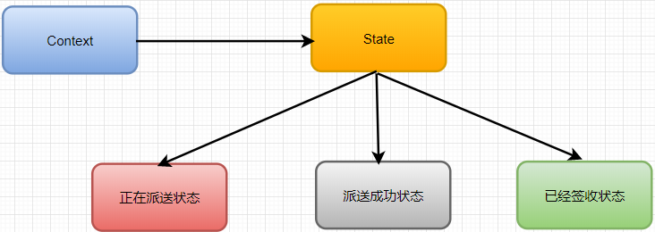
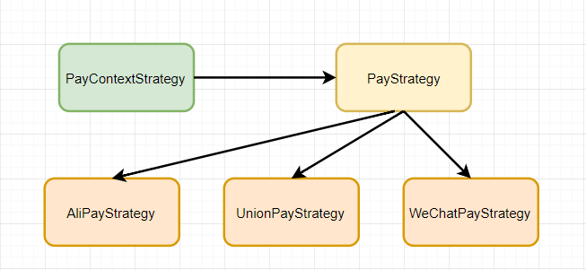

# 状态和策略的区别

状态模式是策略模式的孪生兄弟，是因为它们的UML图是一样的。但意图却完全不一样，策略模式是让用户指定更换的策略算法，而状态模式是状态在满足一定条件下的自动更换，用户无法指定状态，最多只能设置初始状态。

**状态模式:**

例如网购的商品订单，处于不同的状态，但是是针对同一订单的不同的状态。同一处理方法，状态切换了做的事情就不同。

**策略模式:**

例如聚合支付平台，有支付宝、微信支付、银联支付等，可以使用不同的支付策略。

## 区别

1、状态模式重点在各状态之间的切换，从而做不同的事情；而策略模式更侧重于根据具体情况选择策略，并不涉及切换。

2、状态模式不同状态下做的事情不同，而策略模式做的都是同一件事。例如，聚合支付平台，有支付宝、微信支付、银联支付，虽然策略不同，但最终做的事情都是支付，也就是说他们之间是可替换的。反观状态模式，各个状态的同一方法做的是不同的事，不能互相替换。

3、状态模式封装了对象的状态，而策略模式封装算法或策略。因为状态是跟对象密切相关的，它不能被重用；而策略模式通过从Context中分离出策略或算法，我们可以重用它们。

4、在状态模式中，每个状态通过**持有Context的引用**，来实现状态转移；但是每个策略都不持有Context的引用，它们**只是被Context使用**。

5、状态模式将各个状态所对应的操作分离开来，即对于不同的状态，由不同的子类实现具体操作，不同状态的切换由子类实现，当发现传入参数不是自己这个状态所对应的参数，则自己给Context类切换状态；这种转换是"自动"，"无意识"的。状态模式允许对象在内部状态改变时改变它的行为，对象看起来好像修改了它的类。而策略模式是直接依赖注入到Context类的参数进行策略选择，不存在切换状态的操作。

6、策略模式的客户端必须对所有的策略类相当了解，明确当前场景下各种策略的利弊，权衡在当前场景下应该使用哪种策略，也就是是说策略类对客户端是暴露的，**策略是外界给的，策略怎么变，是调用者考虑的事情，系统只是根据所给的策略做事情。**

状态模式依赖于其状态的变化时其内部的行为发生变化，将动作委托到代表当前状态的对象，对外表现为类发生了变化。**状态是系统自身的固有的，由系统本身控制，调用者不能直接指定或改变系统的状态转移。**

## 联系

状态模式和策略模式都是为具有多种可能情形设计的模式，把不同的处理情形抽象为一个相同的接口，符合对扩展开放，对修改封闭的原则。

还有就是，策略模式更具有一般性一些，在实践中，可以用策略模式来封装几乎任何类型的规则，只要在分析过程中听到需要在不同实践应用不同的业务规则，就可以考虑使用策略模式处理，在这点上策略模式是包含状态模式的功能的，策略模式是一个重要的设计模式。

> 文章来源：[知乎-状态模式和策略模式的区别与联系](https://zhuanlan.zhihu.com/p/91912672)

