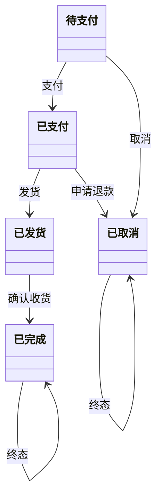
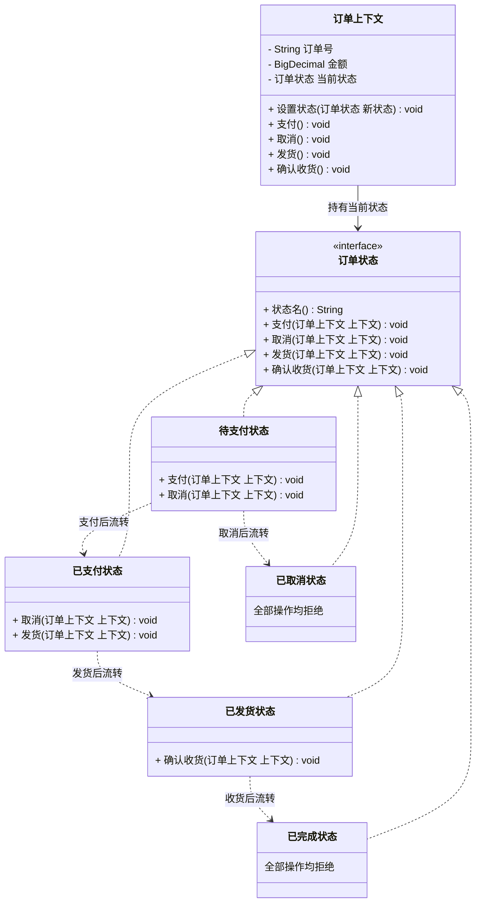

# 行为型 - 状态(State)

> 本文用「电商下单」业务主线统一重构，便于理解。来源：整理自 菜鸟教程 / bugstack.cn。

---

## 一句话定义

**状态模式（State）**：把对象的**每一种状态都做成一个独立的类**，对象在不同状态下的行为差异由这些状态类各自实现。状态一变，行为跟着变，看起来就像"对象换了个类"。

大白话：同一个订单，在「待支付」时你能付款和取消，在「已发货」时你只能确认收货、想取消得走售后。**同样是点"取消"按钮，行为完全不同——因为状态不同。**

---

## 业务痛点：没有它会怎样

电商订单的状态流转是这样的：



没有状态模式，代码几乎必然长成这样：

```java
public class 订单服务 {

    public void 取消订单(订单 订单) {
        String 状态 = 订单.取状态();
        if ("待支付".equals(状态)) {
            订单.设状态("已取消");
            释放库存(订单);
        } else if ("已支付".equals(状态)) {
            订单.设状态("已取消");
            释放库存(订单);
            发起退款(订单);           // 已支付要多退款一步
        } else if ("已发货".equals(状态)) {
            throw new RuntimeException("已发货订单不能直接取消，请走售后");
        } else if ("已完成".equals(状态)) {
            throw new RuntimeException("已完成订单不能取消");
        } else if ("已取消".equals(状态)) {
            throw new RuntimeException("订单已取消，请勿重复操作");
        }
    }

    public void 支付(订单 订单) {
        String 状态 = 订单.取状态();
        if ("待支付".equals(状态)) { ... }
        else if ("已支付".equals(状态)) { throw ... }
        else if ("已发货".equals(状态)) { throw ... }
        // 又是一整套 5 分支
    }

    public void 发货(订单 订单) { /* 又是 5 分支 */ }
    public void 确认收货(订单 订单) { /* 又是 5 分支 */ }
}
```

痛点：

- **状态数 × 操作数 = 分支爆炸**。5 个状态 × 4 个操作 = 20 个分支，散落在 4 个方法里；再加一个「已退款」状态，**4 个方法全要改**，漏一个就出现「已退款订单还能确认收货」这种线上事故；
- **状态流转规则没有任何地方能一眼看全**。想知道「已发货能转成什么」，得把 4 个方法通读一遍，靠脑补拼出状态机；
- **非法流转防不住**。新人在某个分支里少写一个 `else`，就可能让「已完成」的订单被重新支付；
- 每个方法都又臭又长，**单测要覆盖所有分支组合**，成本极高；
- 状态字符串到处硬编码，拼错一个字就是隐蔽 bug。

状态模式的解法：**一个状态一个类**，每个类只回答「我这个状态下，这 4 个操作分别该怎么办」。把「状态 × 操作」的二维表格，按**行**切开分给各个状态类。

---

## 结构（Mermaid 类图）



**角色职责**

| 角色 | 对应类 | 职责 |
|------|--------|------|
| State（抽象状态） | `订单状态` | 声明所有与状态相关的操作；用 `default` 方法统一实现「默认拒绝」 |
| ConcreteState（具体状态） | `待支付状态`、`已支付状态`、`已发货状态`、`已完成状态`、`已取消状态` | 只覆盖自己**允许**的操作，并在操作末尾把上下文推进到下一个状态 |
| Context（上下文） | `订单上下文` | 持有业务数据和「当前状态」引用，把所有操作**委派**给当前状态对象 |
| 状态流转 | 各状态类内部 | **由状态自己决定下一个状态是谁**——这是状态模式区别于策略模式的关键 |

---

## 代码实现（电商订单状态机）

**1）抽象状态：用 default 方法统一「默认不允许」**

```java
/**
 * 抽象状态。
 * 用 default 方法给出"默认拒绝"实现，这样每个具体状态只需覆盖自己允许的操作，
 * 非法流转自动被拦截——再也不会出现"漏写 else 导致非法操作放行"。
 */
public interface 订单状态 {

    String 状态名();

    default void 支付(订单上下文 上下文) {
        拒绝(上下文, "支付");
    }

    default void 取消(订单上下文 上下文) {
        拒绝(上下文, "取消");
    }

    default void 发货(订单上下文 上下文) {
        拒绝(上下文, "发货");
    }

    default void 确认收货(订单上下文 上下文) {
        拒绝(上下文, "确认收货");
    }

    default void 拒绝(订单上下文 上下文, String 操作) {
        throw new IllegalStateException(
                "订单 " + 上下文.取订单号() + " 当前为【" + 状态名() + "】，不允许执行【" + 操作 + "】");
    }
}
```

**2）五个具体状态：各自只管自己那一行**

```java
/** 待支付：可以支付，可以取消 */
public class 待支付状态 implements 订单状态 {

    @Override
    public String 状态名() { return "待支付"; }

    @Override
    public void 支付(订单上下文 上下文) {
        System.out.println("  调用支付网关，扣款 " + 上下文.取金额() + " 元");
        上下文.设置状态(new 已支付状态());   // 状态自己决定流向哪里
    }

    @Override
    public void 取消(订单上下文 上下文) {
        System.out.println("  未支付直接关单，释放库存");
        上下文.设置状态(new 已取消状态());
    }
    // 发货、确认收货 未覆盖 → 自动走 default 拒绝
}

/** 已支付：可以发货，也可以退款取消 */
public class 已支付状态 implements 订单状态 {

    @Override
    public String 状态名() { return "已支付"; }

    @Override
    public void 发货(订单上下文 上下文) {
        System.out.println("  生成运单，通知仓库出库");
        上下文.设置状态(new 已发货状态());
    }

    @Override
    public void 取消(订单上下文 上下文) {
        // 已支付的取消比待支付多一步退款，这个差异被封装在状态类里
        System.out.println("  发起退款 " + 上下文.取金额() + " 元，释放库存");
        上下文.设置状态(new 已取消状态());
    }
}

/** 已发货：只能确认收货 */
public class 已发货状态 implements 订单状态 {

    @Override
    public String 状态名() { return "已发货"; }

    @Override
    public void 确认收货(订单上下文 上下文) {
        System.out.println("  用户确认收货，货款结算给商家，发放购物积分");
        上下文.设置状态(new 已完成状态());
    }

    @Override
    public void 取消(订单上下文 上下文) {
        throw new IllegalStateException("订单已发货，请走【申请售后】流程，不能直接取消");
    }
}

/** 已完成：终态，什么都不能做 */
public class 已完成状态 implements 订单状态 {
    @Override
    public String 状态名() { return "已完成"; }
    // 全部操作走 default 拒绝
}

/** 已取消：终态 */
public class 已取消状态 implements 订单状态 {
    @Override
    public String 状态名() { return "已取消"; }
}
```

**3）上下文：只做委派，不做判断**

```java
import java.math.BigDecimal;

public class 订单上下文 {

    private final String 订单号;
    private final BigDecimal 金额;
    private 订单状态 当前状态;

    public 订单上下文(String 订单号, BigDecimal 金额) {
        this.订单号 = 订单号;
        this.金额 = 金额;
        this.当前状态 = new 待支付状态();   // 初始状态
    }

    /** 状态流转的唯一入口，方便统一记日志、发事件、落库 */
    public void 设置状态(订单状态 新状态) {
        System.out.println("  【状态流转】" + 当前状态.状态名() + " → " + 新状态.状态名());
        this.当前状态 = 新状态;
        // 真实项目在这里：update t_order set status=? ；发布状态变更事件
    }

    // ↓↓↓ 所有业务方法都只有一行：委派给当前状态。零 if 零 switch ↓↓↓

    public void 支付() {
        System.out.println("[操作] 支付 " + 订单号);
        当前状态.支付(this);
    }

    public void 取消() {
        System.out.println("[操作] 取消 " + 订单号);
        当前状态.取消(this);
    }

    public void 发货() {
        System.out.println("[操作] 发货 " + 订单号);
        当前状态.发货(this);
    }

    public void 确认收货() {
        System.out.println("[操作] 确认收货 " + 订单号);
        当前状态.确认收货(this);
    }

    public String 取订单号() { return 订单号; }
    public BigDecimal 取金额() { return 金额; }
    public String 取状态名() { return 当前状态.状态名(); }
}
```

**4）运行**

```java
import java.math.BigDecimal;

public class 客户端 {
    public static void main(String[] args) {
        System.out.println("===== 场景一：正常流程 =====");
        订单上下文 订单A = new 订单上下文("ORD-001", new BigDecimal("128.00"));
        订单A.支付();
        订单A.发货();
        订单A.确认收货();
        System.out.println("最终状态：" + 订单A.取状态名());

        System.out.println("\n===== 场景二：支付后取消（自动多一步退款）=====");
        订单上下文 订单B = new 订单上下文("ORD-002", new BigDecimal("59.90"));
        订单B.支付();
        订单B.取消();

        System.out.println("\n===== 场景三：非法操作被自动拦截 =====");
        订单上下文 订单C = new 订单上下文("ORD-003", new BigDecimal("299.00"));
        try {
            订单C.确认收货();   // 待支付状态下确认收货
        } catch (IllegalStateException e) {
            System.out.println("  被拦截：" + e.getMessage());
        }
        try {
            订单C.支付();
            订单C.发货();
            订单C.取消();      // 已发货状态下取消
        } catch (IllegalStateException e) {
            System.out.println("  被拦截：" + e.getMessage());
        }
    }
}
```

输出：

```
===== 场景一：正常流程 =====
[操作] 支付 ORD-001
  调用支付网关，扣款 128.00 元
  【状态流转】待支付 → 已支付
[操作] 发货 ORD-001
  生成运单，通知仓库出库
  【状态流转】已支付 → 已发货
[操作] 确认收货 ORD-001
  用户确认收货，货款结算给商家，发放购物积分
  【状态流转】已发货 → 已完成
最终状态：已完成

===== 场景二：支付后取消（自动多一步退款）=====
[操作] 支付 ORD-002
  ...
[操作] 取消 ORD-002
  发起退款 59.90 元，释放库存
  【状态流转】已支付 → 已取消

===== 场景三：非法操作被自动拦截 =====
[操作] 确认收货 ORD-003
  被拦截：订单 ORD-003 当前为【待支付】，不允许执行【确认收货】
...
  被拦截：订单已发货，请走【申请售后】流程，不能直接取消
```

现在新增一个「已退款」状态，只需**新建一个类**，并在需要流转过去的状态里加一行 `上下文.设置状态(new 已退款状态())`。其他状态类和上下文完全不用动，也**不可能出现"漏改某个方法导致非法流转"**——因为默认就是拒绝。

> 实践提示：上面每次流转都 `new` 一个状态对象。如果状态类是**无状态的**（只有行为没有字段，本例正是如此），推荐做成**单例或枚举**，避免频繁创建对象。用枚举实现状态机是 Java 里非常地道的写法：`enum 订单状态 { 待支付 { void 支付(上下文 c){...} }, ... }`。

---

## 什么时候该用 / 不该用

**该用：**

- 对象有**明确的、有限的状态集合**，且不同状态下同一个方法的行为差异很大（订单、工单、审批流、物流单、直播间）；
- 代码里出现**多个方法都在写同一套 `if (状态 == X)` 分支**；
- 状态流转规则复杂，需要**集中管理并防止非法流转**；
- 未来会持续**新增状态**（拼团中、待成团、已退款、部分发货……）。

**不该用：**

- 状态只有两三个、行为差异只有一两行——直接 `if` 或用枚举带方法即可，别搞五个类；
- 状态数量极多（几十上百）且流转关系是网状的——类会爆炸，此时该上**状态机框架**（Spring StateMachine、COLA StateMachine）或表驱动；
- 所谓的"状态"其实只是个数据标记，并不影响任何行为——那它就只是个字段，不需要模式；
- 状态流转规则需要**运营在后台随时配置**——硬编码在类里就不合适了，应该做成配置表驱动。

---

## 优缺点

| 优点 | 缺点 |
|------|------|
| 消灭「状态 × 操作」的分支爆炸，每个状态一个类 | 状态类数量随状态数线性增长，小场景显得重 |
| 状态流转规则集中在状态类内部，一眼看清 | 流转逻辑分散在各状态类中，想看全局图仍需通读所有类 |
| `default` 拒绝机制让**非法流转天然被拦截**，安全 | 状态类之间互相 `new`，产生耦合（可用工厂/枚举缓解） |
| 新增状态只加类，绝大多数已有代码不用改 | 对开闭原则支持不完美：新增流转关系仍要改相关状态类 |
| 上下文变薄，业务方法只剩一行委派，可读性极佳 | 频繁 new 状态对象有开销（用单例/枚举可解决） |
| 每个状态可独立单测，覆盖率容易做上去 | 状态需要持久化时，要额外维护「枚举值 ↔ 状态类」的映射 |

---

## 与相似模式的对比

| 对比项 | 状态(State) | 策略(Strategy) | 命令(Command) | 责任链(Chain) | 观察者(Observer) |
|--------|------------|---------------|--------------|--------------|-----------------|
| 变化的原因 | **对象内部状态改变** | **外部主动选择算法** | 外部发起一次操作 | 请求需要多道处理 | 状态变化要通知别人 |
| 谁决定下一步 | **状态对象自己**（知道后继状态） | 调用方/工厂 | 调用方 | 当前节点决定是否下传 | 无"下一步"概念 |
| 实现类之间是否相识 | **相识**（A 状态要 new B 状态） | **互不相识** | 互不相识 | 只认识下一个 | 互不相识 |
| 何时切换 | **运行中自动流转** | 调用前手动指定 | 不切换 | 沿链传递 | 不切换 |
| 客户端感知 | 通常不感知，只调 `订单.取消()` | 明确知道自己选了哪个策略 | 明确构造了哪个命令 | 只调链头 | 只发事件 |
| 典型信号 | `if (状态 == 待支付)` 遍布多个方法 | `if (类型 == 满减)` 在挑算法 | 需要撤销/排队 | 一长串校验 | 一变多响应 |

> **状态 vs 策略：本文最需要讲清的一组。**
>
> 两者的 UML 类图**几乎完全相同**（Context 持有一个接口引用，多个实现类），所以只能从**语义和使用方式**上区分：
>
> | | 策略 | 状态 |
> |---|---|---|
> | 谁来切换 | **客户端**：`上下文.设置策略(new 满减策略())` | **状态对象自己**：`上下文.设置状态(new 已支付状态())` |
> | 实现类之间 | 满减策略**不知道**折扣策略存在 | 待支付状态**必须知道**已支付状态存在 |
> | 切换时机 | 调用前决定，调用中一般不变 | 调用过程中**自动发生流转** |
> | 客户端认知 | 我知道有哪些策略，我来挑 | 我不管现在什么状态，我只管调 `取消()` |
> | 意图 | 同一件事的**不同算法**，可互换 | 同一个对象的**不同阶段**，行为不同 |
>
> 一句话：**策略是"横向可替换"，状态是"纵向会流转"。** 如果你的实现类里出现了 `context.setXxx(new 另一个实现())`，那基本就是状态模式。
>
> **状态 vs 命令**：命令的接口通常只有 `执行()` 一个方法（关注"做什么"），状态的接口通常有多个方法（关注"在这个阶段各种操作分别怎么办"）。

---

## 真实框架中的应用

**1）Spring StateMachine——工业级状态机框架**

Spring 官方提供的状态机实现，把状态模式做成了可配置的框架。用 `@EnableStateMachine` 定义状态枚举和事件枚举，用 `StateMachineConfigurerAdapter` 声明流转规则：

```java
@Configuration
@EnableStateMachine
public class 订单状态机配置 extends StateMachineConfigurerAdapter<订单状态枚举, 订单事件枚举> {

    @Override
    public void configure(StateMachineStateConfigurer<订单状态枚举, 订单事件枚举> states) throws Exception {
        states.withStates()
              .initial(订单状态枚举.待支付)
              .states(EnumSet.allOf(订单状态枚举.class));
    }

    @Override
    public void configure(StateMachineTransitionConfigurer<订单状态枚举, 订单事件枚举> transitions) throws Exception {
        transitions
            .withExternal().source(订单状态枚举.待支付).target(订单状态枚举.已支付).event(订单事件枚举.支付)
            .and()
            .withExternal().source(订单状态枚举.已支付).target(订单状态枚举.已发货).event(订单事件枚举.发货)
            .and()
            .withExternal().source(订单状态枚举.已发货).target(订单状态枚举.已完成).event(订单事件枚举.收货);
    }
}
```

它把「状态 → 事件 → 目标状态」变成声明式配置，还支持守卫条件（Guard）、进入/退出动作（Action）、状态持久化、嵌套状态机。适合状态多、流转复杂的场景。

**2）Spring Web Flow / Activiti / Flowable 工作流引擎**

工作流引擎本质上是把状态模式配置化：BPMN 里的每个节点就是一个状态，连线就是流转规则。审批流、退款流这类需要业务人员随时调整流程的场景，用引擎比硬编码状态类更合适。

**3）JDK `Thread.State` 与线程状态机**

`NEW → RUNNABLE → BLOCKED/WAITING/TIMED_WAITING → TERMINATED`，JVM 内部严格控制流转（比如 `TERMINATED` 不可能回到 `RUNNABLE`）。虽然 JDK 用的是枚举 + 内部判断而非典型的状态类，但设计思想完全一致。

**4）`java.util.concurrent.Future` 与 `CompletableFuture`**

`FutureTask` 内部维护 `NEW`、`COMPLETING`、`NORMAL`、`EXCEPTIONAL`、`CANCELLED`、`INTERRUPTING`、`INTERRUPTED` 七个状态，用 CAS 保证流转的原子性。调用 `cancel()` 在不同状态下行为完全不同——`NEW` 时能取消，已完成时直接返回 false。

**5）Netty 的 `ChannelState` 与 TCP 状态机**

Channel 的 `OPEN → ACTIVE → INACTIVE → CLOSED`；更经典的是 TCP 协议本身的状态机（`LISTEN`、`SYN_SENT`、`ESTABLISHED`、`FIN_WAIT_1`、`TIME_WAIT`……），这是状态模式在协议设计中的教科书应用。

**6）Spring 事务的 `TransactionStatus`、MyBatis 的 `Executor` 生命周期**、以及各类订单/工单/物流系统的核心域，都会用到状态模式或其变体。

**7）实践中的枚举状态机写法**

Java 里最轻量的状态模式实现是**带方法体的枚举**，兼具「类型安全 + 可持久化 + 单例」三大优点：

```java
public enum 订单状态枚举 {

    待支付 {
        @Override public 订单状态枚举 支付() { return 已支付; }
        @Override public 订单状态枚举 取消() { return 已取消; }
    },
    已支付 {
        @Override public 订单状态枚举 发货() { return 已发货; }
        @Override public 订单状态枚举 取消() { return 已取消; }
    },
    已发货 {
        @Override public 订单状态枚举 确认收货() { return 已完成; }
    },
    已完成,
    已取消;

    public 订单状态枚举 支付()     { throw new IllegalStateException(name() + " 不能支付"); }
    public 订单状态枚举 取消()     { throw new IllegalStateException(name() + " 不能取消"); }
    public 订单状态枚举 发货()     { throw new IllegalStateException(name() + " 不能发货"); }
    public 订单状态枚举 确认收货() { throw new IllegalStateException(name() + " 不能确认收货"); }
}
```

数据库里直接存枚举名，读出来就是状态对象，省掉了「字符串 ↔ 状态类」的映射代码。中小型状态机强烈推荐这种写法。

---

## 小结

状态模式的核心是把「**状态 × 操作**」这张二维表**按状态切行**，每行装进一个类。它最大的收益不是省代码，而是**让非法流转在设计层面就不可能发生**——默认拒绝，只有明确写了的流转才被允许。订单、工单、审批这类有明确生命周期的业务，用它能把最容易出事故的一块代码变得清晰可控。状态少时用枚举实现，状态多时上状态机框架。

---

> 参考来源：整理自 https://www.runoob.com/design-pattern/state-pattern.html 与 https://bugstack.cn 「重学 Java 设计模式：实战状态模式」，本文重写示例与讲解。
