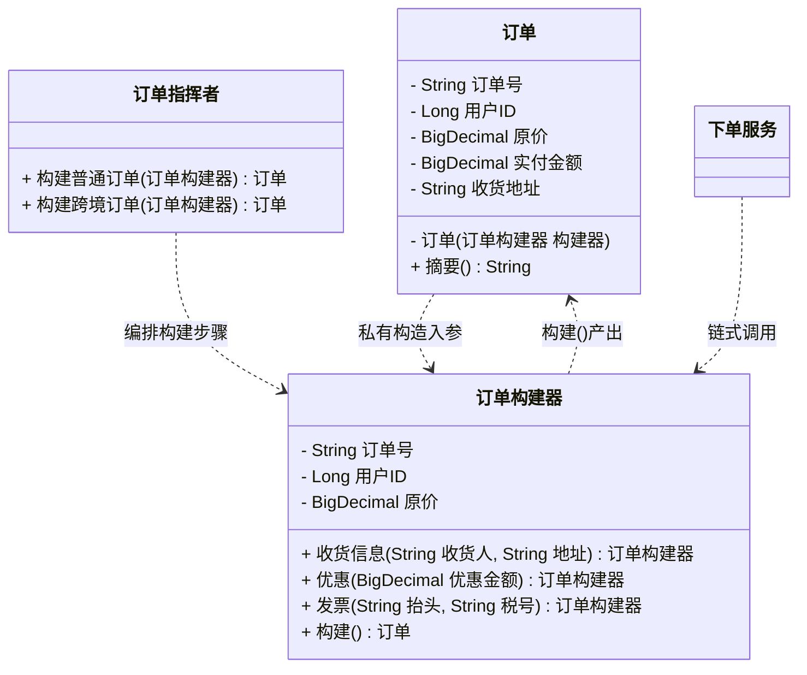

# 创建型 - 生成器(Builder)（又称建造者模式）

> 本文用「电商下单」这条业务主线统一重构，便于理解：一句话定义 → 业务痛点 → 结构（Mermaid 类图）→ 代码实现 → 何时用/不用 → 优缺点 → 与相似模式对比 → 真实框架中的应用。来源：整理自公开资料。

---

## 一句话定义

**生成器模式（Builder）**：把一个复杂对象的**构建过程**和它的**最终表示**分离开，用"分步设置 + 最后 build"的方式，让同样的构建流程能产出不同配置的对象。

说人话：不要一口气把二十个参数塞进构造方法，而是**一步一步告诉我你要什么，最后我一次性给你造出来**。

> 别名提醒：生成器模式 = 建造者模式 = Builder 模式，同一个 GoF 模式的不同译名。

---

## 业务痛点：没有它会怎样

电商的**订单对象**是出了名的胖。一个订单至少要装下：订单号、用户 ID、商品行、原价、优惠金额、运费、实付金额、收货人、收货地址、手机号、发票抬头、发票税号、买家留言、来源渠道、是否礼品包装、预约配送时间……

如果老老实实写构造方法，会演变成经典的**伸缩构造方法反模式（Telescoping Constructor）**：

```java
public class 订单 {
    // 4 个参数的版本
    public 订单(String 订单号, Long 用户ID, BigDecimal 原价, String 收货地址) { ... }

    // 加了发票，再来一个
    public 订单(String 订单号, Long 用户ID, BigDecimal 原价, String 收货地址,
              String 发票抬头) { ... }

    // 加了留言和礼品包装，再来一个
    public 订单(String 订单号, Long 用户ID, BigDecimal 原价, String 收货地址,
              String 发票抬头, String 买家留言, boolean 礼品包装) { ... }

    // ...重载到第 8 个版本，没人看得懂了
}
```

调用起来是这样的：

```java
// 灾难现场：谁能一眼看出这些参数分别是什么？
订单 order = new 订单("ORD001", 1001L, new BigDecimal("299"), "北京市朝阳区xx号",
        null, null, false, true, null, "APP", null, false);
```

痛点非常具体：

- **参数含义全靠数**：第 7 个 `false` 到底是"礼品包装"还是"是否开发票"？改一次顺序就是线上事故，**编译器还不会报错**（都是 boolean）；
- **可选参数被迫传 null**：一堆 `null` 占位，可读性归零；
- **无法保证对象不可变**：如果改用"空构造 + 一堆 setter"，对象在被 set 的过程中处于**半成品状态**，多线程下可能被别人拿到一个只填了一半的订单；
- **校验逻辑无处安放**：像"实付金额 = 原价 - 优惠 + 运费""开发票必须有税号"这类跨字段校验，写在哪个构造方法里都不合适，写在 setter 里又不完整。

生成器模式就是来收拾这个烂摊子的。

---

## 结构（Mermaid 类图）



**角色职责**

| 角色 | 职责 |
|------|------|
| `订单`（Product 产品） | 被构建的复杂对象，字段全部 `final`，构造方法私有 |
| `订单构建器`（Builder 建造者） | 持有所有可设置字段，提供链式设置方法，在 `构建()` 里做校验和组装 |
| `订单指挥者`（Director 指挥者） | **可选角色**，把常用的构建套路固化成模板（如"跨境订单必带报关信息"） |
| `下单服务`（Client 调用方） | 链式调用构建器，或直接使用指挥者提供的模板 |

> 注意：GoF 原版的 Builder 有 Director 角色，但**日常业务开发中 Director 常被省略**，由调用方直接驱动 Builder。只有当"构建顺序本身有复杂逻辑、需要复用"时才值得引入 Director。

---

## 代码实现（复杂订单的逐步构建）

### 基础版：链式 Builder 构建不可变订单

```java
import java.math.BigDecimal;
import java.time.LocalDateTime;

/**
 * 订单：一个典型的"胖对象"。
 * 所有字段 final，构造方法私有，对象一旦造出来就不可变。
 */
public class 订单 {

    // ===== 必选字段 =====
    private final String 订单号;
    private final Long 用户ID;
    private final BigDecimal 原价;

    // ===== 可选字段 =====
    private final BigDecimal 优惠金额;
    private final BigDecimal 运费;
    private final BigDecimal 实付金额;
    private final String 收货人;
    private final String 收货地址;
    private final String 手机号;
    private final String 发票抬头;
    private final String 发票税号;
    private final String 买家留言;
    private final boolean 礼品包装;
    private final LocalDateTime 预约送达时间;

    /** 私有构造：只能通过构建器创建 */
    private 订单(订单构建器 构建器) {
        this.订单号 = 构建器.订单号;
        this.用户ID = 构建器.用户ID;
        this.原价 = 构建器.原价;
        this.优惠金额 = 构建器.优惠金额;
        this.运费 = 构建器.运费;
        this.实付金额 = 构建器.实付金额;
        this.收货人 = 构建器.收货人;
        this.收货地址 = 构建器.收货地址;
        this.手机号 = 构建器.手机号;
        this.发票抬头 = 构建器.发票抬头;
        this.发票税号 = 构建器.发票税号;
        this.买家留言 = 构建器.买家留言;
        this.礼品包装 = 构建器.礼品包装;
        this.预约送达时间 = 构建器.预约送达时间;
    }

    /** 入口：从这里开始构建 */
    public static 订单构建器 构建器(String 订单号, Long 用户ID, BigDecimal 原价) {
        return new 订单构建器(订单号, 用户ID, 原价);
    }

    public String 摘要() {
        return String.format("订单[%s] 用户=%d 原价=%s 优惠=%s 运费=%s 实付=%s 收货=%s 礼品包装=%s",
                订单号, 用户ID, 原价, 优惠金额, 运费, 实付金额, 收货地址, 礼品包装);
    }

    // ==================== 静态内部构建器 ====================
    public static class 订单构建器 {

        // 必选字段：放在构建器的构造方法里，强制传入
        private final String 订单号;
        private final Long 用户ID;
        private final BigDecimal 原价;

        // 可选字段：给合理默认值，不传就用默认值
        private BigDecimal 优惠金额 = BigDecimal.ZERO;
        private BigDecimal 运费 = BigDecimal.ZERO;
        private BigDecimal 实付金额;
        private String 收货人;
        private String 收货地址;
        private String 手机号;
        private String 发票抬头;
        private String 发票税号;
        private String 买家留言 = "";
        private boolean 礼品包装 = false;
        private LocalDateTime 预约送达时间;

        private 订单构建器(String 订单号, Long 用户ID, BigDecimal 原价) {
            this.订单号 = 订单号;
            this.用户ID = 用户ID;
            this.原价 = 原价;
        }

        /** 每个设置方法都返回 this，从而支持链式调用 */
        public 订单构建器 收货信息(String 收货人, String 收货地址, String 手机号) {
            this.收货人 = 收货人;
            this.收货地址 = 收货地址;
            this.手机号 = 手机号;
            return this;
        }

        public 订单构建器 优惠(BigDecimal 优惠金额) {
            this.优惠金额 = 优惠金额;
            return this;
        }

        public 订单构建器 运费(BigDecimal 运费) {
            this.运费 = 运费;
            return this;
        }

        public 订单构建器 发票(String 抬头, String 税号) {
            this.发票抬头 = 抬头;
            this.发票税号 = 税号;
            return this;
        }

        public 订单构建器 买家留言(String 留言) {
            this.买家留言 = 留言;
            return this;
        }

        public 订单构建器 礼品包装() {
            this.礼品包装 = true;
            return this;
        }

        public 订单构建器 预约送达(LocalDateTime 时间) {
            this.预约送达时间 = 时间;
            return this;
        }

        /**
         * 最后一步：集中校验 + 派生字段计算 + 一次性产出对象。
         * 所有跨字段的业务规则都收拢在这里，再也不会散落各处。
         */
        public 订单 构建() {
            // 1. 必填校验
            if (订单号 == null || 用户ID == null || 原价 == null) {
                throw new IllegalArgumentException("订单号、用户ID、原价为必填项");
            }
            if (收货地址 == null || 手机号 == null) {
                throw new IllegalArgumentException("收货地址和手机号不能为空");
            }
            // 2. 跨字段规则校验
            if (发票抬头 != null && 发票税号 == null) {
                throw new IllegalArgumentException("开具发票必须提供税号");
            }
            if (优惠金额.compareTo(原价) > 0) {
                throw new IllegalArgumentException("优惠金额不能超过订单原价");
            }
            // 3. 派生字段计算：实付 = 原价 - 优惠 + 运费
            this.实付金额 = 原价.subtract(优惠金额).add(运费);

            return new 订单(this);
        }
    }
}
```

调用方现在读起来像说话一样：

```java
import java.math.BigDecimal;
import java.time.LocalDateTime;

public class 下单服务 {

    public static void main(String[] args) {
        // 每个参数都有名字，顺序随便调，多一个少一个都不影响
        订单 普通订单 = 订单.构建器("ORD20260809001", 1001L, new BigDecimal("299"))
                .收货信息("张三", "北京市朝阳区某某路1号", "13800138000")
                .优惠(new BigDecimal("30"))
                .运费(new BigDecimal("12"))
                .买家留言("工作日送")
                .构建();

        System.out.println(普通订单.摘要());

        // 礼品单：只多加两个链式调用，不用新写构造方法
        订单 礼品订单 = 订单.构建器("ORD20260809002", 1002L, new BigDecimal("888"))
                .收货信息("李四", "上海市浦东新区某某路2号", "13900139000")
                .礼品包装()
                .发票("某某科技有限公司", "91310000MA1K3XXXXX")
                .预约送达(LocalDateTime.now().plusDays(1))
                .构建();

        System.out.println(礼品订单.摘要());
    }
}
```

### 进阶版：加入 Director，固化常用构建套路

如果发现"跨境订单必须带报关信息 + 强制不允许礼品包装 + 运费固定按国际标准算"这类套路被反复复制，就该引入指挥者了：

```java
import java.math.BigDecimal;

/** 订单指挥者：把常用的构建套路固化成模板方法 */
public class 订单指挥者 {

    /** 普通国内订单：包邮 + 无发票 */
    public 订单 构建国内包邮订单(String 订单号, Long 用户ID, BigDecimal 原价,
                          String 收货人, String 地址, String 手机) {
        return 订单.构建器(订单号, 用户ID, 原价)
                .收货信息(收货人, 地址, 手机)
                .运费(BigDecimal.ZERO)
                .构建();
    }

    /** 跨境订单：固定国际运费 + 必须开发票（报关需要） */
    public 订单 构建跨境订单(String 订单号, Long 用户ID, BigDecimal 原价,
                        String 收货人, String 地址, String 手机,
                        String 发票抬头, String 税号) {
        return 订单.构建器(订单号, 用户ID, 原价)
                .收货信息(收货人, 地址, 手机)
                .运费(new BigDecimal("88"))      // 国际运费统一 88
                .发票(发票抬头, 税号)              // 报关强制开票
                .买家留言("跨境订单，需报关")
                .构建();
    }
}
```

调用方连链式调用都省了：

```java
订单指挥者 指挥者 = new 订单指挥者();
订单 跨境单 = 指挥者.构建跨境订单("ORD003", 1003L, new BigDecimal("1999"),
        "王五", "香港九龙xx道", "85212345678", "某某贸易", "TAX123456");
```

### 关于 Lombok 的 `@Builder`

现代 Java 项目里，上面那一大坨构建器代码可以用一个注解搞定：

```java
import lombok.Builder;
import lombok.Getter;

@Getter
@Builder
public class 报表 {
    private final String 报表名;
    private final String 统计周期;
    @Builder.Default
    private final boolean 含图表 = true;      // 指定默认值
    private final java.util.List<String> 指标列;
}

// 使用
报表 日报 = 报表.builder()
        .报表名("每日销售日报")
        .统计周期("2026-08-09")
        .指标列(java.util.List.of("GMV", "订单量", "客单价"))
        .build();
```

**什么时候用注解、什么时候手写？**

| 场景 | 建议 |
|------|------|
| 普通业务 DTO / VO / 配置对象 | 用 `@Builder`，省事 |
| build() 里需要复杂校验或派生计算 | 手写，或用 `@Builder` + 自定义 `build()` |
| 对外发布的 SDK / 工具库 | 手写，避免使用者被迫依赖 Lombok |
| 需要 Director 编排多种套路 | 手写 |

---

## 什么时候该用 / 不该用

**该用：**

- 构造参数**超过 4 个**，尤其是有多个同类型参数（多个 `String`、多个 `boolean`）容易传错顺序时；
- 大量字段是**可选的**，用重载构造方法会爆炸（n 个可选字段理论上要 2ⁿ 个重载）；
- 希望产出**不可变对象**（字段全 final），但又不想写一个二十参数的构造方法；
- 构建过程涉及**跨字段校验、默认值填充、派生字段计算**，希望集中管理；
- 在设计**链式 API**：配置类、请求对象、查询条件都是典型场景。

**不该用：**

- 字段少于 4 个且全是必填——直接构造方法更清晰，Builder 是纯粹的噪音；
- 对象需要**频繁创建、对性能极度敏感**：Builder 每次会多创建一个中间对象，在百万级 QPS 的热点路径上要掂量；
- 对象**创建后还要频繁修改**：Builder 的价值建立在"不可变"上，如果本来就是可变 JavaBean，用 setter 更直接；
- 只是为了"看起来高级"——Builder 会让类的代码量翻倍，没有实际收益就是负债。

---

## 优缺点

| 优点 | 缺点 |
|------|------|
| 参数语义清晰，调用代码自带文档效果 | 代码量翻倍，每个产品都要配一个 Builder（Lombok 可缓解） |
| 天然支持**不可变对象**，线程安全 | 每次构建多一个中间对象，有轻微性能与 GC 开销 |
| 可选参数随意组合，不用写 N 个重载构造方法 | 对简单对象是明显的过度设计 |
| 校验和派生计算集中在 `构建()`，不会遗漏 | 忘记调 `构建()` 时拿到的是 Builder 而非产品，需靠类型系统兜住 |
| 同一构建流程可产出不同配置的对象 | 若允许 Builder 复用，需注意状态残留导致的串数据 |
| 链式调用可读性极佳，IDE 自动补全友好 | Builder 与产品字段需同步维护，手写时容易漏改 |

---

## 与相似模式的对比

| 对比项 | 生成器(Builder) | 工厂方法 | 抽象工厂 | 原型(Prototype) |
|--------|----------------|---------|---------|----------------|
| 解决的问题 | **怎么一步步组装** | **创建哪一个** | **成套创建** | **复制已有的** |
| 创建步骤 | **多步，最后 build** | 一步到位 | 一步到位 | 一步克隆 |
| 产出 | 一个复杂对象 | 一个对象 | 一族对象 | 一个副本 |
| 关注差异 | 同类型对象的**不同配置** | **不同类型**的对象 | 不同**产品族** | 与原对象**内容相同** |
| 典型信号 | 构造参数太多 | 需要按条件选实现 | 一组对象要配套 | 创建成本高、想复用初始化结果 |

> 两点最容易混：
>
> 1. **Builder vs 工厂**：一句话——**工厂解决"创建谁"，Builder 解决"怎么组装"**。工厂关心产品的**类型**，Builder 关心产品的**配置**。工厂通常一行调用就返回成品，Builder 要链式调好几行。
> 2. **Builder vs 原型**：两者都能产出"配置不同的同类对象"。区别是 Builder 从零开始逐步搭，原型是拿一个已有对象复制后改几处。如果初始化成本极高（比如要查库、要解析大文件），原型更划算；如果每次配置差异很大，Builder 更清晰。

---

## 真实框架中的应用

### 1. JDK：`StringBuilder` 与 `Stream.Builder`

- **`StringBuilder`** 是最广为人知的例子，虽然它不完全符合 GoF 的 Builder 结构（没有独立的 Product 类），但"分步 `append()` 追加、最后 `toString()` 产出"的思想完全一致；
- **`Stream.builder()`**：`Stream.<String>builder().add("a").add("b").build()`，标准的链式构建；
- **`Calendar.Builder`**（Java 8 引入）：`new Calendar.Builder().setDate(2026, 7, 9).setTimeOfDay(10, 30, 0).build()`，就是为了取代 `Calendar` 那一堆 `set()` 调用；
- **`Locale.Builder`**、**`ProcessBuilder`**：后者虽然叫 Builder，但它更偏向配置容器，`start()` 才是真正的产出动作。

### 2. Spring：到处都是 Builder

- **`UriComponentsBuilder`**：拼 URL 的标准工具
  ```java
  String 地址 = UriComponentsBuilder.fromHttpUrl("https://api.shop.com/order")
          .queryParam("userId", 1001)
          .queryParam("status", "PAID")
          .build()
          .toUriString();
  ```
- **`BeanDefinitionBuilder`**：Spring 内部注册 bean 定义时用它逐步设置 beanClass、构造参数、属性值、作用域、初始化方法，最后 `getBeanDefinition()` 产出 `BeanDefinition`。很多框架（如 MyBatis 的 `@MapperScan`）就是靠它把 bean 动态塞进容器的；
- **Spring Security 的 `HttpSecurity`**：`http.authorizeRequests().antMatchers("/api/**").authenticated().and().formLogin()...` 是链式配置的极致体现；
- **`MockMvcRequestBuilders`**：写单测时的 `post("/order").contentType(...).content(...)`。

### 3. OkHttp / Retrofit：链式 API 的典范

```java
// OkHttp 的 Request.Builder —— 这几乎是 Builder 模式的教科书
Request 请求 = new Request.Builder()
        .url("https://api.shop.com/order")
        .header("Authorization", "Bearer xxx")
        .post(RequestBody.create(json, MediaType.get("application/json")))
        .build();

OkHttpClient 客户端 = new OkHttpClient.Builder()
        .connectTimeout(5, TimeUnit.SECONDS)
        .readTimeout(10, TimeUnit.SECONDS)
        .addInterceptor(new 日志拦截器())
        .build();
```

`OkHttpClient` 有三十多个配置项，如果用构造方法，参数列表能绕屏幕三圈。而且 OkHttp 还提供了 `client.newBuilder()`，可以基于现有配置克隆一份再改几处——这是 **Builder + 原型** 的组合技。

### 4. MyBatis：`SqlSessionFactoryBuilder` 与 `XxxBuilder` 家族

MyBatis 里有一整个 Builder 家族：`SqlSessionFactoryBuilder`、`XMLConfigBuilder`、`XMLMapperBuilder`、`XMLStatementBuilder`、`MapperAnnotationBuilder`、`SqlSourceBuilder`。它们的职责是把 XML/注解里的配置**逐层解析、逐步组装**成一个巨大的 `Configuration` 对象。

`MappedStatement.Builder` 尤其典型——一条 SQL 语句的元信息有二十多项（id、sqlSource、statementType、resultMaps、cache、flushCache、useCache、timeout……），只能靠 Builder 逐个装配，最后 `build()` 时统一做 `resultMaps` 的不可变包装。

### 5. Protobuf / gRPC

Protobuf 生成的 Java 类**全部是不可变对象 + Builder**：`Order.newBuilder().setOrderId("ORD001").setAmount(299).build()`。这是 Builder 模式在工业级序列化框架里的强制应用——因为不可变才能安全地跨线程传递和缓存。

---

## 小结

生成器模式治的是"**构造方法参数爆炸**"这个病：把一次性传二十个参数，改成分二十步优雅地说清楚，最后一次性产出不可变对象。判断要不要用它，只需看两点——**参数是不是多到记不住顺序**，以及**你是不是想要不可变对象**。两个都是"是"，那就上 Builder；日常业务对象直接用 Lombok 的 `@Builder`，需要复杂校验或对外发 SDK 时再手写。

---

> 参考来源：整理自公开资料（GoF《设计模式》、Effective Java 第 2 条"遇到多个构造器参数时要考虑使用构建器"），本文重写示例与讲解。
