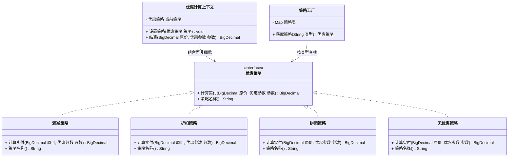

# 行为型 - 策略(Strategy)

> 本文用「电商下单」业务主线统一重构，便于理解。来源：整理自 pdai.tech / bugstack.cn。

---

## 一句话定义

**策略模式（Strategy）**：把一组「做同一件事的不同办法」各自封装成独立的类，让它们**可以互相替换**，调用方在运行时挑一个用，算法怎么变都不影响调用方。

大白话：从家到公司可以走路、骑车、打车、坐地铁——目的地一样，方式随便换。你（调用方）只需要说「我要去公司」，具体用哪种交通工具是可插拔的。

---

## 业务痛点：没有它会怎样

电商大促，优惠券五花八门：**满减券**（满 100 减 20）、**折扣券**（打 8 折）、**拼团价**（固定成团价）、**无优惠**（原价）。算实付金额的代码往往会长成这样：

```java
public BigDecimal 计算实付(String 券类型, BigDecimal 原价, ...) {
    if ("满减".equals(券类型)) {
        if (原价.compareTo(new BigDecimal("100")) >= 0) {
            return 原价.subtract(new BigDecimal("20"));
        }
        return 原价;
    } else if ("折扣".equals(券类型)) {
        return 原价.multiply(new BigDecimal("0.8"));
    } else if ("拼团".equals(券类型)) {
        return new BigDecimal("59.9");
    } else if ("直减".equals(券类型)) {
        // 上周新加的
    } else if ("N元N件".equals(券类型)) {
        // 这周新加的
    }
    return 原价;
}
```

痛点：

- **一个方法塞下所有算法**，每种优惠的规则一复杂，方法瞬间几百行，谁也不敢改；
- 加一种新优惠就要**改这个方法**，改动风险辐射到所有已上线的优惠类型，违反开闭原则；
- 各种优惠的**测试互相牵连**：改折扣券的逻辑，满减券的用例也得全跑一遍；
- 运营想在运行时「把某个活动的算法从满减换成折扣」，这种 `if-else` 结构**没法动态替换**；
- 相同的优惠算法在下单、购物车预览、订单详情三个地方各 copy 了一份，**规则不一致导致资损**。

策略模式的解法：**一种优惠 = 一个类**，共同实现同一个接口；用哪种，由调用方或工厂在运行时决定。

---

## 结构（Mermaid 类图）



**角色职责**

| 角色 | 对应类 | 职责 |
|------|--------|------|
| Strategy（抽象策略） | `优惠策略` | 定义所有算法的统一入参、统一出参，保证可互换 |
| ConcreteStrategy（具体策略） | `满减策略`、`折扣策略`、`拼团策略`、`无优惠策略` | 各自封装一种优惠算法，互不知晓对方存在 |
| Context（上下文） | `优惠计算上下文` | 持有一个策略引用，把请求委派给它；提供 `设置策略()` 支持运行时切换 |
| 策略选择器（可选） | `策略工厂` | 把「类型字符串 → 策略实例」的映射集中管理，替代 `if-else` 选择 |

---

## 代码实现（电商优惠计算）

**1）统一的策略接口与参数对象**

```java
import java.math.BigDecimal;
import java.math.RoundingMode;

/** 优惠计算所需的参数，各策略按需取用 */
public class 优惠参数 {
    private BigDecimal 门槛金额;   // 满减：满多少
    private BigDecimal 减免金额;   // 满减：减多少
    private BigDecimal 折扣率;     // 折扣：0.8 表示八折
    private BigDecimal 成团价;     // 拼团：固定成团价

    public 优惠参数 门槛(BigDecimal v) { this.门槛金额 = v; return this; }
    public 优惠参数 减免(BigDecimal v) { this.减免金额 = v; return this; }
    public 优惠参数 折扣(BigDecimal v) { this.折扣率 = v; return this; }
    public 优惠参数 成团(BigDecimal v) { this.成团价 = v; return this; }

    public BigDecimal 取门槛金额() { return 门槛金额; }
    public BigDecimal 取减免金额() { return 减免金额; }
    public BigDecimal 取折扣率() { return 折扣率; }
    public BigDecimal 取成团价() { return 成团价; }
}

/** 抽象策略：所有优惠算法必须长成这个样子，才能互换 */
public interface 优惠策略 {

    /** 传入原价，返回实付金额 */
    BigDecimal 计算实付(BigDecimal 原价, 优惠参数 参数);

    /** 策略标识，用于注册到工厂 */
    String 策略名称();
}
```

**2）四个具体策略**

```java
/** 满减：满 门槛 减 减免 */
public class 满减策略 implements 优惠策略 {
    @Override
    public BigDecimal 计算实付(BigDecimal 原价, 优惠参数 参数) {
        if (原价.compareTo(参数.取门槛金额()) >= 0) {
            BigDecimal 实付 = 原价.subtract(参数.取减免金额());
            // 保底不能算成负数
            return 实付.max(BigDecimal.ZERO).setScale(2, RoundingMode.HALF_UP);
        }
        return 原价.setScale(2, RoundingMode.HALF_UP);
    }

    @Override
    public String 策略名称() { return "满减"; }
}

/** 折扣：原价 × 折扣率 */
public class 折扣策略 implements 优惠策略 {
    @Override
    public BigDecimal 计算实付(BigDecimal 原价, 优惠参数 参数) {
        return 原价.multiply(参数.取折扣率()).setScale(2, RoundingMode.HALF_UP);
    }

    @Override
    public String 策略名称() { return "折扣"; }
}

/** 拼团：不看原价，直接按成团价卖 */
public class 拼团策略 implements 优惠策略 {
    @Override
    public BigDecimal 计算实付(BigDecimal 原价, 优惠参数 参数) {
        return 参数.取成团价().min(原价).setScale(2, RoundingMode.HALF_UP);
    }

    @Override
    public String 策略名称() { return "拼团"; }
}

/** 空对象策略：原价出售，避免调用方判 null */
public class 无优惠策略 implements 优惠策略 {
    @Override
    public BigDecimal 计算实付(BigDecimal 原价, 优惠参数 参数) {
        return 原价.setScale(2, RoundingMode.HALF_UP);
    }

    @Override
    public String 策略名称() { return "无优惠"; }
}
```

**3）上下文 + 工厂：把「选哪个」也收口**

```java
import java.util.HashMap;
import java.util.Map;

/** 策略工厂：类型 → 策略实例，替代满屏 if-else */
public class 策略工厂 {

    private static final Map<String, 优惠策略> 策略表 = new HashMap<>();

    static {
        注册(new 满减策略());
        注册(new 折扣策略());
        注册(new 拼团策略());
        注册(new 无优惠策略());
    }

    private static void 注册(优惠策略 策略) {
        策略表.put(策略.策略名称(), 策略);
    }

    /** 找不到就退化成"无优惠"，绝不返回 null */
    public static 优惠策略 获取策略(String 类型) {
        return 策略表.getOrDefault(类型, 策略表.get("无优惠"));
    }
}

/** 上下文：业务代码只跟它打交道 */
public class 优惠计算上下文 {

    private 优惠策略 当前策略 = new 无优惠策略();

    /** 运行时随时换算法 */
    public void 设置策略(优惠策略 策略) {
        this.当前策略 = 策略;
    }

    public BigDecimal 结算(BigDecimal 原价, 优惠参数 参数) {
        BigDecimal 实付 = 当前策略.计算实付(原价, 参数);
        System.out.println("优惠方式=" + 当前策略.策略名称()
                + "，原价=" + 原价 + "，实付=" + 实付);
        return 实付;
    }
}
```

**4）运行**

```java
public class 客户端 {
    public static void main(String[] args) {
        BigDecimal 原价 = new BigDecimal("128.00");
        优惠计算上下文 上下文 = new 优惠计算上下文();

        // 满 100 减 20
        上下文.设置策略(策略工厂.获取策略("满减"));
        上下文.结算(原价, new 优惠参数()
                .门槛(new BigDecimal("100"))
                .减免(new BigDecimal("20")));

        // 八折
        上下文.设置策略(策略工厂.获取策略("折扣"));
        上下文.结算(原价, new 优惠参数().折扣(new BigDecimal("0.8")));

        // 拼团价 59.9
        上下文.设置策略(策略工厂.获取策略("拼团"));
        上下文.结算(原价, new 优惠参数().成团(new BigDecimal("59.9")));

        // 运营配错了类型，自动兜底成原价
        上下文.设置策略(策略工厂.获取策略("不存在的活动"));
        上下文.结算(原价, new 优惠参数());
    }
}
```

输出：

```
优惠方式=满减，原价=128.00，实付=108.00
优惠方式=折扣，原价=128.00，实付=102.40
优惠方式=拼团，原价=128.00，实付=59.90
优惠方式=无优惠，原价=128.00，实付=128.00
```

现在新增一种「N 元 N 件」优惠，只需要**新写一个类 + 在工厂注册一行**，`优惠计算上下文` 和所有业务调用方一个字都不用改。

---

## 什么时候该用 / 不该用

**该用：**

- 同一件事有**多种平级的实现方式**，且未来还会继续加（优惠计算、支付渠道、运费模板、排序规则）；
- 代码里出现**大段 `if-else` / `switch` 在选算法**，且每个分支内部逻辑还不简单；
- 需要在**运行时动态切换**算法（灰度、AB 实验、按用户等级走不同规则）；
- 想让各个算法**独立测试、独立上线**。

**不该用：**

- 算法只有两三种、每种就一两行、且几乎不会变——直接 `if` 更省事；
- 各个"算法"的入参出参差异巨大，硬套一个接口会导致参数对象膨胀成大杂烩（这时更适合拆成不同服务）；
- 调用方必须了解每个策略的内部差异才能正确选择——这说明抽象没做对，策略并不真正"可互换"。

---

## 优缺点

| 优点 | 缺点 |
|------|------|
| 消灭大段 `if-else`，每种算法独立成类 | 类的数量明显增多，小项目显得啰嗦 |
| 新增算法只加类不改旧代码，符合开闭原则 | 调用方需要知道有哪些策略可选（可用工厂/枚举缓解） |
| 算法可运行时替换，支持灰度与 AB 实验 | 所有策略被迫共用一套入参出参，参数对象容易变臃肿 |
| 组合优于继承，避免为每种算法派生一个子类 | 策略之间无法直接复用代码（可抽公共抽象类缓解） |
| 每个策略可单独写单测，回归成本低 | 过度使用会让简单逻辑变得难以追踪 |

---

## 与相似模式的对比

| 对比项 | 策略(Strategy) | 状态(State) | 模板方法(Template Method) | 命令(Command) | 桥接(Bridge) |
|--------|---------------|-------------|--------------------------|--------------|-------------|
| 核心意图 | 一组**可互换的算法**，选一个用 | 对象**内部状态变了，行为跟着变** | 固定**算法骨架**，子类填空 | 把**一次操作**封装成对象 | 把**抽象与实现**两个维度解耦 |
| 谁决定切换 | **调用方/工厂**主动选 | **状态对象自己**在运行中流转到下一个状态 | 不切换，靠继承定制 | 调用方创建哪个命令就执行哪个 | 组装时决定，运行期一般不变 |
| 策略间是否知道彼此 | 完全不知道，互相独立 | **知道**，A 状态要指定下一个是 B | 无此概念 | 不知道 | 不知道 |
| 复用方式 | 组合 | 组合 | **继承** | 组合 | 组合 |
| 典型信号 | `if (类型 == X) 算法X()` | `if (状态 == 待支付) ...` | 流程一样、个别步骤不同 | 需要撤销/排队/日志 | 两个维度笛卡尔积爆炸 |

> **策略 vs 状态** 是最经典的混淆点：类图几乎一样（都是 Context 组合一个接口），区别在**语义**——策略的各个实现**互不相识**，由外部挑选；状态的各个实现**知道下一个状态是谁**，会在运行中自己把 Context 推到下一个状态。一句话：策略在「选」，状态在「转」。
>
> **策略 vs 模板方法**：都是"整体不变、局部可变"。但模板方法用**继承**在编译期定死，策略用**组合**在运行期可换。需要运行时切换就选策略。
>
> **策略 vs 命令**：策略回答「怎么算」（同一件事的不同算法），命令回答「做什么」（不同的动作），而且命令通常还要支持撤销、排队、记录日志。

---

## 真实框架中的应用

**1）JDK `Comparator`——最纯粹的策略**

`Collections.sort(list, comparator)` 中，排序骨架（归并/TimSort）是固定的，**比较规则**这个"算法"被抽成 `Comparator` 接口传进去。想按价格排就传价格比较器，想按销量排就传销量比较器，`sort` 方法本身一行都不用改。Java 8 之后 `Comparator.comparing(Order::getAmount)` 让策略的构造更加轻量，Lambda 本质上就是「匿名策略实现」。

**2）Spring `Resource` 与资源加载策略**

`ResourceLoader` 面对 `classpath:`、`file:`、`http:` 等不同前缀，会返回 `ClassPathResource`、`FileSystemResource`、`UrlResource` 等不同实现。加载资源的调用方只依赖 `Resource` 接口，具体从哪读是可替换的策略。

**3）Spring 事务的 `PlatformTransactionManager`**

`DataSourceTransactionManager`（JDBC）、`JpaTransactionManager`（JPA）、`JtaTransactionManager`（分布式）都是 `PlatformTransactionManager` 的不同策略实现。`@Transactional` 的处理逻辑完全不变，换个底层数据访问技术只需换一个 Bean。

**4）Spring 中用 `Map<String, Strategy>` 自动装配策略**

这是实战里最常用的技巧：把所有策略实现声明成 Bean，Spring 会自动把它们注入成一个 `Map`，key 是 Bean 名称：

```java
@Service
public class 优惠服务 {

    /** Spring 自动收集所有 优惠策略 类型的 Bean */
    private final Map<String, 优惠策略> 策略表;

    public 优惠服务(Map<String, 优惠策略> 策略表) {
        this.策略表 = 策略表;
    }

    public BigDecimal 结算(String 类型, BigDecimal 原价, 优惠参数 参数) {
        优惠策略 策略 = 策略表.get(类型);
        if (策略 == null) {
            throw new IllegalArgumentException("未知优惠类型：" + 类型);
        }
        return 策略.计算实付(原价, 参数);
    }
}
```

新增策略时只要加一个 `@Component("N元N件")` 的类，Spring 启动时自动注册进 Map，连工厂的注册代码都省了。

**5）Spring MVC 的 `HandlerMapping` 与 `ViewResolver`**

`DispatcherServlet` 持有一组 `HandlerMapping`（如何找到 Controller）和一组 `ViewResolver`（如何解析视图），它们都是可插拔的策略；换成 JSON 输出还是 Thymeleaf 模板，主流程逻辑不变。

**6）JDK 线程池的拒绝策略**

`ThreadPoolExecutor` 的 `RejectedExecutionHandler` 有 `AbortPolicy`（抛异常）、`CallerRunsPolicy`（调用者线程执行）、`DiscardPolicy`（丢弃）、`DiscardOldestPolicy`（丢最老的）四种内置策略，构造线程池时挑一个传进去即可，也可以自己实现一个入库告警的策略。

---

## 小结

策略模式的价值是把「**选择**」和「**实现**」分开：选择留在工厂或配置里，实现散落在各自独立的类中。当你看到一个方法里 `if-else` 在挑算法、并且这些分支还在不断增加时，把每个分支拉出来变成一个策略类，代码立刻从「不敢改」变成「随便加」。

---

> 参考来源：整理自 https://pdai.tech/md/dev-spec/pattern/16_strategy.html 与 https://bugstack.cn 「重学 Java 设计模式：实战策略模式」，本文重写示例与讲解。
