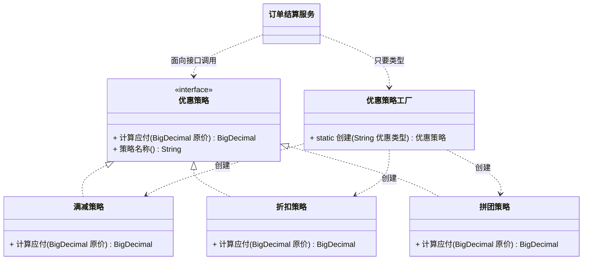

# 创建型 - 简单工厂(Simple Factory)（又称静态工厂方法）

> 本文用「电商下单」这条业务主线统一重构，便于理解：一句话定义 → 业务痛点 → 结构（Mermaid 类图）→ 代码实现 → 何时用/不用 → 优缺点 → 与相似模式对比 → 真实框架中的应用。来源：整理自 pdai.tech。

---

## 一句话定义

**简单工厂（Simple Factory）**：把"根据条件 new 哪个类"这段判断逻辑，从调用方**搬到一个专门的工厂类里**，调用方只说"我要什么类型"，工厂负责造出来。

> 说明：简单工厂**严格来说不是 GoF 的 23 种设计模式之一**，它更像一种编程习惯，但因为太常用、又是理解工厂方法/抽象工厂的基础，所以单独拿出来讲。

---

## 业务痛点：没有它会怎样

电商下单最后一步是**算优惠**。假设平台支持三种优惠：

- **满减券**：满 200 减 30；
- **折扣券**：全场 8.8 折；
- **拼团价**：直接用拼团价替换原价。

如果不做工厂，结算服务的代码会变成这样：

```java
public class 订单结算服务 {

    public BigDecimal 计算应付金额(String 优惠类型, BigDecimal 原价) {
        BigDecimal 应付;
        // 一大坨 if-else 直接写在业务代码里
        if ("满减".equals(优惠类型)) {
            应付 = 原价.compareTo(new BigDecimal("200")) >= 0
                    ? 原价.subtract(new BigDecimal("30")) : 原价;
        } else if ("折扣".equals(优惠类型)) {
            应付 = 原价.multiply(new BigDecimal("0.88"));
        } else if ("拼团".equals(优惠类型)) {
            应付 = new BigDecimal("99");
        } else {
            应付 = 原价;
        }
        return 应付;
    }
}
```

更要命的是，这段 `if-else` 不止一处：**下单预览页**要算一次、**提交订单**要算一次、**订单详情**回显还要算一次、**对账系统**也要算一次。于是同一坨判断逻辑被复制粘贴了四份。

痛点很清楚：

- **调用方被迫知道所有具体实现**：结算服务必须认识满减、折扣、拼团三个类的构造细节；
- **改一处要改 N 处**：运营新增一个"首单立减"活动，得把散落在四个地方的 `if-else` 全找出来加一遍，漏一个就是线上事故；
- **算法和业务流程搅在一起**：结算服务本该只关心"下单流程"，现在还得管每种优惠怎么算，职责严重超载。

简单工厂就是把这段"**该 new 谁**"的逻辑**收口到一个类**。

---

## 结构（Mermaid 类图）



**角色职责**

| 角色 | 职责 |
|------|------|
| `优惠策略`（抽象产品） | 定义所有优惠的统一接口，调用方只认它 |
| `满减策略` / `折扣策略` / `拼团策略`（具体产品） | 各自实现一种优惠算法，互不干扰 |
| `优惠策略工厂`（工厂） | 唯一知道"哪个类型对应哪个实现类"的地方，负责创建 |
| `订单结算服务`（调用方） | 只向工厂要对象，不 new、不认识具体实现类 |

---

## 代码实现（电商优惠策略）

**第一步：抽象产品——统一的优惠策略接口**

```java
import java.math.BigDecimal;

/** 优惠策略：所有优惠玩法的统一抽象 */
public interface 优惠策略 {

    /** 根据原价算出应付金额 */
    BigDecimal 计算应付(BigDecimal 原价);

    /** 策略名称，用于日志和账单展示 */
    String 策略名称();
}
```

**第二步：具体产品——三种优惠各自实现**

```java
import java.math.BigDecimal;

/** 满减：满 200 减 30 */
public class 满减策略 implements 优惠策略 {

    private static final BigDecimal 门槛 = new BigDecimal("200");
    private static final BigDecimal 减免 = new BigDecimal("30");

    @Override
    public BigDecimal 计算应付(BigDecimal 原价) {
        // 没到门槛就原价付
        if (原价.compareTo(门槛) < 0) {
            return 原价;
        }
        return 原价.subtract(减免);
    }

    @Override
    public String 策略名称() {
        return "满200减30";
    }
}
```

```java
import java.math.BigDecimal;
import java.math.RoundingMode;

/** 折扣：全场 8.8 折 */
public class 折扣策略 implements 优惠策略 {

    private static final BigDecimal 折扣率 = new BigDecimal("0.88");

    @Override
    public BigDecimal 计算应付(BigDecimal 原价) {
        // 金额计算统一保留两位小数，四舍五入
        return 原价.multiply(折扣率).setScale(2, RoundingMode.HALF_UP);
    }

    @Override
    public String 策略名称() {
        return "全场8.8折";
    }
}
```

```java
import java.math.BigDecimal;

/** 拼团：直接使用拼团一口价 */
public class 拼团策略 implements 优惠策略 {

    private final BigDecimal 拼团价;

    public 拼团策略(BigDecimal 拼团价) {
        this.拼团价 = 拼团价;
    }

    @Override
    public BigDecimal 计算应付(BigDecimal 原价) {
        // 拼团价永远不会高于原价，取二者较小值兜底
        return 拼团价.min(原价);
    }

    @Override
    public String 策略名称() {
        return "拼团价" + 拼团价;
    }
}
```

**第三步：工厂——把 if-else 收口到这一个地方**

```java
import java.math.BigDecimal;

/** 优惠策略工厂：全系统唯一知道"类型 → 实现类"映射关系的地方 */
public class 优惠策略工厂 {

    // 工具类不允许实例化
    private 优惠策略工厂() {}

    public static 优惠策略 创建(String 优惠类型) {
        if (优惠类型 == null) {
            return new 无优惠策略();
        }
        switch (优惠类型) {
            case "满减":
                return new 满减策略();
            case "折扣":
                return new 折扣策略();
            case "拼团":
                return new 拼团策略(new BigDecimal("99"));
            default:
                // 兜底：未知类型不抛异常，走"不打折"，保证下单链路不中断
                return new 无优惠策略();
        }
    }
}

/** 兜底策略：原价支付 */
class 无优惠策略 implements 优惠策略 {
    @Override
    public BigDecimal 计算应付(BigDecimal 原价) {
        return 原价;
    }

    @Override
    public String 策略名称() {
        return "无优惠";
    }
}
```

**第四步：调用方彻底清爽了**

```java
import java.math.BigDecimal;

public class 订单结算服务 {

    public BigDecimal 计算应付金额(String 优惠类型, BigDecimal 原价) {
        // 只要类型，不关心背后是哪个类
        优惠策略 策略 = 优惠策略工厂.创建(优惠类型);
        BigDecimal 应付 = 策略.计算应付(原价);
        System.out.println("优惠方式：" + 策略.策略名称() + "，原价 " + 原价 + " → 应付 " + 应付);
        return 应付;
    }

    public static void main(String[] args) {
        订单结算服务 服务 = new 订单结算服务();
        服务.计算应付金额("满减", new BigDecimal("299"));   // 应付 269
        服务.计算应付金额("折扣", new BigDecimal("299"));   // 应付 263.12
        服务.计算应付金额("拼团", new BigDecimal("299"));   // 应付 99
        服务.计算应付金额("未知", new BigDecimal("299"));   // 应付 299
    }
}
```

### 进阶：用注册表干掉 switch

上面的工厂虽然收了口，但新增优惠类型仍要改工厂代码（违反开闭原则）。工程上常用**注册表 + 反射/Supplier** 来改造：

```java
import java.math.BigDecimal;
import java.util.Map;
import java.util.concurrent.ConcurrentHashMap;
import java.util.function.Supplier;

public class 优惠策略工厂增强版 {

    private static final Map<String, Supplier<优惠策略>> 注册表 = new ConcurrentHashMap<>();

    static {
        注册("满减", 满减策略::new);
        注册("折扣", 折扣策略::new);
        注册("拼团", () -> new 拼团策略(new BigDecimal("99")));
    }

    /** 新增优惠类型只需注册一行，不用改工厂内部逻辑 */
    public static void 注册(String 类型, Supplier<优惠策略> 构造器) {
        注册表.put(类型, 构造器);
    }

    public static 优惠策略 创建(String 优惠类型) {
        return 注册表.getOrDefault(优惠类型, 无优惠策略::new).get();
    }
}
```

在 Spring 项目里更简单：把所有策略声明成 bean，然后注入 `Map<String, 优惠策略>`，Spring 会自动把 beanName 当 key 填好，连注册代码都省了。

### 【反例】千万别这么写

```java
public class 订单结算服务 {
    public void 结算(int 类型) {
        优惠策略 策略;
        // 实例化代码又跑回调用方了，工厂白建了
        if (类型 == 1) {
            策略 = new 满减策略();
        } else if (类型 == 2) {
            策略 = new 折扣策略();
        } else {
            策略 = new 无优惠策略();
        }
        // ...
    }
}
```

只要在调用方看到 `new 具体实现类()`，就说明这段实例化逻辑该挪进工厂了。

---

## 什么时候该用 / 不该用

**该用：**

- 有**一组同类型的实现**，需要按某个参数（类型码、枚举、配置项）来决定用哪个；
- 创建对象有一定复杂度（要读配置、要装配依赖、要拼参数），不想让调用方操心；
- 同一段"选实现"的判断逻辑在**多处重复出现**——这是最强的信号；
- 想让调用方**只依赖接口**，具体实现类可以随时替换。

**不该用：**

- 只有一两个实现类，且以后基本不会加——直接 new 更清楚，加工厂纯属绕弯；
- 产品种类**变化极其频繁**：简单工厂每次都要改工厂类，改到手软，这时应升级为**工厂方法**或**注册表模式**；
- 创建逻辑本身就是一行 `new`，没有任何额外工作——工厂没带来任何收益。

---

## 优缺点

| 优点 | 缺点 |
|------|------|
| 调用方与具体实现类彻底解耦，只依赖接口 | **违反开闭原则**：新增产品必须修改工厂类的 if/switch |
| "该 new 谁"的判断逻辑收口到一处，改一次全生效 | 工厂类职责集中，产品一多就变成"上帝类"，代码臃肿 |
| 隐藏创建细节，调用方不用关心构造参数 | 静态方法难以被继承和扩展，也不好 Mock（单测不友好） |
| 新人上手快，理解成本极低 | 严格说不是 GoF 正统模式，扩展性天花板较低 |

---

## 与相似模式的对比

| 对比项 | 简单工厂 | 工厂方法 | 抽象工厂 | 策略模式 |
|--------|---------|---------|---------|---------|
| 谁决定造哪个 | **工厂内部 if/switch** | **调用方选哪个工厂子类** | 调用方选哪个工厂族 | 调用方直接传策略对象 |
| 工厂数量 | 1 个 | 每类产品 1 个工厂 | 每个产品族 1 个工厂 | 不涉及工厂 |
| 新增产品 | **改工厂代码**（违反开闭） | 加一个工厂子类（符合开闭） | 要改所有工厂族接口（较重） | 加一个策略类 |
| 产品维度 | 单一产品等级 | 单一产品等级 | **多个产品等级（产品族）** | 单一算法族 |
| 解决的问题 | **创建谁** | **创建谁（延迟到子类）** | **成套创建** | **怎么算**（行为） |

> 最容易混的是**简单工厂 vs 策略模式**：本文的例子其实两者都沾——工厂负责"造出哪个优惠策略对象"，策略负责"这个对象怎么算钱"。**工厂关注创建，策略关注行为**，实际项目里它俩经常配对出现：工厂造策略。

---

## 真实框架中的应用

### 1. JDK：静态工厂方法遍地都是

- **`Calendar.getInstance()`**：根据当前 `Locale` 和时区，内部判断该返回 `GregorianCalendar`、`BuddhistCalendar` 还是 `JapaneseImperialCalendar`。调用方永远只写 `Calendar.getInstance()`，完全不知道背后有三个实现类；
- **`Integer.valueOf(int)`**：判断值是否在 -128~127 之间，在则返回缓存对象，不在则 new 一个。既是简单工厂，又顺带做了享元优化；
- **`Executors.newFixedThreadPool(n)` / `newCachedThreadPool()`**：本质是把 `ThreadPoolExecutor` 那七个构造参数的组合封装成几个语义化的静态方法，调用方不用背参数含义；
- **`Charset.forName("UTF-8")`**：按字符集名字返回对应的 `Charset` 实现。

### 2. Spring：`BeanFactory` 就是超级简单工厂

`BeanFactory#getBean(String name)` 是简单工厂思想的极致版本——只不过"类型 → 实现类"的映射不是硬编码在 if-else 里，而是从 XML/注解扫描出来的 `BeanDefinition` 注册表里查的。这正是前面"进阶：用注册表干掉 switch"的工业级实现。

另外 Spring 还提供了 `FactoryBean<T>` 接口，让你自定义某个 bean 的创建过程。典型如 MyBatis 的 `SqlSessionFactoryBean`、`MapperFactoryBean`——Mapper 接口没有实现类，全靠 `MapperFactoryBean` 在运行期生成动态代理返回。

### 3. MyBatis：`SqlSessionFactory` 与类型处理器

- **`SqlSessionFactoryBuilder#build()`**：根据传入的配置流/`Configuration` 造出 `SqlSessionFactory`；
- **`TypeHandlerRegistry`**：内部维护一张 `Java 类型 → TypeHandler` 的注册表，读写字段时按类型取出对应的处理器（`StringTypeHandler`、`IntegerTypeHandler`、`DateTypeHandler`……）。这是注册表式简单工厂的标准实现，加自定义类型只需往注册表里 put 一条，不用改任何 if-else。

### 4. 日志框架：`LoggerFactory.getLogger()`

SLF4J 的 `LoggerFactory.getLogger(Class)` 会先做一次绑定探测，决定底层是 logback、log4j2 还是 JUL，然后返回对应实现的 `Logger`。调用方全程只面向 `org.slf4j.Logger` 接口编程，换日志实现只需换 jar 包。

---

## 小结

简单工厂的价值就一句话：**把"该 new 谁"的判断从业务代码里揪出来，关进一个专门的房间**。它不是正统 GoF 模式，扩展性也有天花板（新增产品要改工厂），但胜在简单直白、收益立竿见影。当你发现同一坨 `if-else new` 在项目里被复制了三遍，就该上简单工厂了；当工厂里的 switch 分支涨到二三十个，就该考虑升级成注册表模式或工厂方法了。

---

> 参考来源：整理自 https://pdai.tech/md/dev-spec/pattern/3_simple_factory.html ，本文重写示例与讲解。
