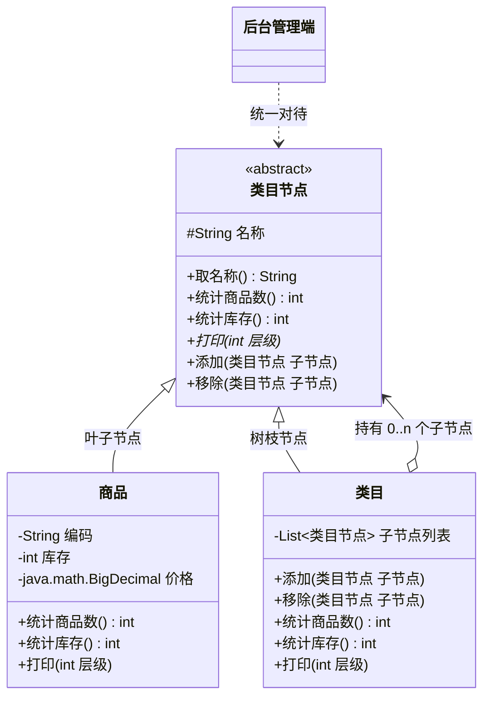

# 结构型 - 组合(Composite)（部分-整体模式、合成模式）

> 本文用「电商下单」这条业务主线统一重构：一句话定义 → 业务痛点 → 结构（Mermaid 类图）→ 可运行代码 → 何时用/不用 → 优缺点 → 与相似模式对比 → 真实框架中的应用，便于理解。
> 来源：整理自 https://pdai.tech ，本文重写示例与讲解。

---

## 一句话定义

**组合模式（Composite）**：把对象组织成**树形结构**来表示"整体 / 部分"关系，并让调用方**用完全相同的方式**去对待"单个对象"和"一组对象"，不用关心手里拿的到底是一片叶子还是一整棵树。

一句大白话：**不管你点的是一个商品，还是一整个"手机数码"大类目，我统一喊一声"报个数"，你们自己算清楚。**

> 别名提醒：组合模式又叫**部分-整体模式（Part-Whole）**、**合成模式**。核心口诀：**叶子和树枝，长成同一副面孔。**

---

## 业务痛点：没有它会怎样

电商后台有一棵**商品类目树**：

```
全部商品
├── 手机数码
│   ├── 手机通讯
│   │   ├── [商品] iPhone 17 Pro      库存 120
│   │   └── [商品] 小米 16 Ultra       库存 300
│   └── [商品] 蓝牙耳机                库存 800
└── 家用电器
    ├── 大家电
    │   └── [商品] 对开门冰箱           库存 45
    └── [商品] 电水壶                   库存 500
```

现在产品提了个需求："**给我算出任意一个节点下面的商品总数和库存总量**"——可能是整个"手机数码"，也可能就是单个"电水壶"。

如果不用组合模式，你会写出这种代码：

```java
// 反面教材：调用方被迫区分"商品"和"类目"
public int 统计商品数(Object 节点) {
    if (节点 instanceof 商品) {
        return 1;
    } else if (节点 instanceof 类目) {
        int 总数 = 0;
        类目 c = (类目) 节点;
        for (Object 子 : c.取子节点()) {
            总数 += 统计商品数(子);      // 递归里还得再判断一次类型
        }
        return 总数;
    }
    throw new IllegalArgumentException("未知节点类型");
}
```

痛点：

| 问题 | 说明 |
|------|------|
| **调用方被迫做类型判断** | 到处 `instanceof` + 强制类型转换，代码丑陋且脆弱 |
| **递归逻辑散落各处** | 统计商品数要写一遍递归，统计库存要再写一遍，打印目录树又写一遍 |
| **新增节点类型全站爆炸** | 哪天加个"虚拟组合商品"节点，所有 `instanceof` 的地方都要补一个分支 |
| **违反开闭原则** | 每加一种节点类型，就得改所有遍历它的代码 |

**根因**：调用方把"叶子"和"容器"当成了两种东西。

组合模式的解法是：**让它们实现同一个接口**。这样调用方只需要一句 `节点.统计商品数()`，至于这个节点是自己返回 1，还是把请求转发给它的一堆孩子再求和，那是节点自己的事——**递归被封装进了结构本身**。

---

## 结构（Mermaid 类图）



**角色职责**

| 角色 | 类图中对应 | 职责 |
|------|-----------|------|
| Component（抽象构件） | `类目节点` | 定义叶子与容器**共同的接口**（统计、打印），是调用方唯一需要认识的类型 |
| Leaf（叶子构件） | `商品` | 树的末端，**没有子节点**，直接返回自己的数据 |
| Composite（容器构件） | `类目` | 持有一个 `List<类目节点>`，把请求**递归转发**给所有子节点并汇总结果 |
| Client（调用方） | `后台管理端` | 只面向 `类目节点` 编程，不区分叶子和容器 |

**两种实现风格：透明式 vs 安全式**

| 风格 | 做法 | 优点 | 缺点 | 适用 |
|------|------|------|------|------|
| **透明式**（GoF 推荐） | `add/remove` 定义在抽象类 `类目节点` 上，叶子继承后抛 `UnsupportedOperationException` | 叶子与容器**完全同型**，调用方零判断，最"透明" | **不够安全**：对商品调 `add()` 编译期不报错，运行期才炸 | 强调统一性的场景（本文采用） |
| **安全式** | `add/remove` 只定义在 `类目` 上 | **类型安全**，编译期就杜绝误用 | 调用方想加子节点必须先判断类型/向下转型，透明性丢失 | 强调编译期安全的场景 |

> 两者是一对不可兼得的取舍：**透明性**与**安全性**只能选一个。JDK 的 `java.util.List#addAll` 走的是透明式思路，Swing 的 `JComponent#add` 也是。

---

## 代码实现（商品类目树）

**第一步：抽象构件——叶子和树枝的共同面孔**

```java
import java.math.BigDecimal;
import java.util.ArrayList;
import java.util.List;

/**
 * Component：抽象构件。
 * 采用「透明式」——把 添加/移除 也放在这里，叶子节点默认抛异常。
 */
public abstract class 类目节点 {

    protected final String 名称;

    protected 类目节点(String 名称) {
        this.名称 = 名称;
    }

    public String 取名称() { return 名称; }

    /** 统计该节点下的商品总数 */
    public abstract int 统计商品数();

    /** 统计该节点下的库存总量 */
    public abstract int 统计库存();

    /** 打印目录树，层级用于控制缩进 */
    public abstract void 打印(int 层级);

    /** 对外的便捷入口 */
    public void 打印() { 打印(0); }

    // ---- 默认不支持子节点操作，由 类目 覆写 ----
    public void 添加(类目节点 子节点) {
        throw new UnsupportedOperationException(名称 + " 是叶子节点，不能添加子节点");
    }

    public void 移除(类目节点 子节点) {
        throw new UnsupportedOperationException(名称 + " 是叶子节点，不能移除子节点");
    }

    /** 打印缩进的小工具 */
    protected String 缩进(int 层级) {
        StringBuilder sb = new StringBuilder();
        for (int i = 0; i < 层级; i++) sb.append("    ");
        return sb.toString();
    }
}
```

**第二步：叶子构件——商品**

```java
/** Leaf：叶子节点，树的末端，直接返回自己的数据 */
public class 商品 extends 类目节点 {

    private final String 编码;
    private final BigDecimal 价格;
    private final int 库存;

    public 商品(String 编码, String 名称, BigDecimal 价格, int 库存) {
        super(名称);
        this.编码 = 编码;
        this.价格 = 价格;
        this.库存 = 库存;
    }

    @Override
    public int 统计商品数() {
        return 1;                 // 我就是一个商品
    }

    @Override
    public int 统计库存() {
        return 库存;               // 直接返回自己的库存
    }

    @Override
    public void 打印(int 层级) {
        System.out.println(缩进(层级) + "└─ [商品] " + 名称
                + " (" + 编码 + ") ￥" + 价格 + " 库存=" + 库存);
    }
}
```

**第三步：容器构件——类目（递归的核心）**

```java
/** Composite：树枝节点，持有子节点，把请求递归转发下去再汇总 */
public class 类目 extends 类目节点 {

    private final List<类目节点> 子节点列表 = new ArrayList<>();

    public 类目(String 名称) {
        super(名称);
    }

    @Override
    public void 添加(类目节点 子节点) {
        子节点列表.add(子节点);
    }

    @Override
    public void 移除(类目节点 子节点) {
        子节点列表.remove(子节点);
    }

    @Override
    public int 统计商品数() {
        int 总数 = 0;
        for (类目节点 子 : 子节点列表) {
            总数 += 子.统计商品数();     // ← 递归：不关心子节点是商品还是类目
        }
        return 总数;
    }

    @Override
    public int 统计库存() {
        int 总库存 = 0;
        for (类目节点 子 : 子节点列表) {
            总库存 += 子.统计库存();     // ← 递归
        }
        return 总库存;
    }

    @Override
    public void 打印(int 层级) {
        System.out.println(缩进(层级) + "├─ 【类目】" + 名称
                + " (商品数=" + 统计商品数() + ", 库存=" + 统计库存() + ")");
        for (类目节点 子 : 子节点列表) {
            子.打印(层级 + 1);           // ← 递归
        }
    }
}
```

**第四步：调用方——组装并统一操作**

```java
public class 后台管理端 {

    public static void main(String[] args) {
        // ---- 组装类目树 ----
        类目 根 = new 类目("全部商品");

        类目 手机数码 = new 类目("手机数码");
        类目 手机通讯 = new 类目("手机通讯");
        手机通讯.添加(new 商品("SKU1001", "iPhone 17 Pro", new BigDecimal("8999"), 120));
        手机通讯.添加(new 商品("SKU1002", "小米 16 Ultra", new BigDecimal("6499"), 300));
        手机数码.添加(手机通讯);
        手机数码.添加(new 商品("SKU1003", "蓝牙耳机", new BigDecimal("299"), 800));

        类目 家用电器 = new 类目("家用电器");
        类目 大家电 = new 类目("大家电");
        大家电.添加(new 商品("SKU2001", "对开门冰箱", new BigDecimal("4599"), 45));
        家用电器.添加(大家电);
        家用电器.添加(new 商品("SKU2002", "电水壶", new BigDecimal("129"), 500));

        根.添加(手机数码);
        根.添加(家用电器);

        // ---- 统一处理：调用方完全不区分叶子和树枝 ----
        根.打印();

        System.out.println("\n=== 统一接口调用，无需 instanceof ===");
        统计并输出(根);                                    // 传一整棵树
        统计并输出(手机数码);                               // 传一个子树
        统计并输出(new 商品("SKU9999", "赠品挂件", BigDecimal.ONE, 10));  // 传一片叶子
    }

    /** 关键：入参类型是抽象构件，一视同仁 */
    private static void 统计并输出(类目节点 节点) {
        System.out.println("节点【" + 节点.取名称() + "】商品数="
                + 节点.统计商品数() + "，库存合计=" + 节点.统计库存());
    }
}
```

运行输出：

```java
// ├─ 【类目】全部商品 (商品数=5, 库存=1765)
//     ├─ 【类目】手机数码 (商品数=3, 库存=1220)
//         ├─ 【类目】手机通讯 (商品数=2, 库存=420)
//             └─ [商品] iPhone 17 Pro (SKU1001) ￥8999 库存=120
//             └─ [商品] 小米 16 Ultra (SKU1002) ￥6499 库存=300
//         └─ [商品] 蓝牙耳机 (SKU1003) ￥299 库存=800
//     ├─ 【类目】家用电器 (商品数=2, 库存=545)
//         ├─ 【类目】大家电 (商品数=1, 库存=45)
//             └─ [商品] 对开门冰箱 (SKU2001) ￥4599 库存=45
//         └─ [商品] 电水壶 (SKU2002) ￥129 库存=500
//
// === 统一接口调用，无需 instanceof ===
// 节点【全部商品】商品数=5，库存合计=1765
// 节点【手机数码】商品数=3，库存合计=1220
// 节点【赠品挂件】商品数=1，库存合计=10
```

注意 `统计并输出()` 这个方法：**它的入参是 `类目节点`，传一棵树和传一片叶子写法完全一样**——这就是组合模式最大的价值。

---

## 什么时候该用 / 不该用

**该用：**

- 数据天然是**树形/层次结构**：商品类目、组织架构、文件目录、菜单权限、地区级联、评论盖楼；
- 希望调用方**忽略"单个"与"组合"的差异**，用一致的方式处理；
- 需要对整棵树做**递归聚合运算**（求和、计数、校验、渲染），且希望递归逻辑封装在结构内部；
- 需要动态地在运行时增删树节点，且业务规则对"整体"和"部分"一致。

**不该用：**

- 数据结构本身是**扁平列表**，硬套树形只会增加复杂度；
- 叶子和容器的**行为差异非常大**（几乎没有共同方法可抽），强行抽出的公共接口会退化成一堆空实现；
- 树的**层级极深且节点巨多**，递归遍历有栈溢出和性能风险（此时应改用迭代 + 显式栈，或在数据库层用闭包表/路径枚举做聚合）；
- 需要**严格的类型约束**（如"促销活动下只能挂商品，不能再挂类目"），组合模式的透明性反而让编译器帮不上忙。

---

## 优缺点

| 优点 | 缺点 |
|------|------|
| 调用方**无需区分叶子与容器**，代码里彻底告别 `instanceof` | 抽象构件的接口设计难：既要满足叶子又要满足容器，容易做成"最大公约数" |
| 递归逻辑**封装在结构内部**，业务代码变成一句话 | 透明式实现**不够安全**（叶子上调 `add` 运行期才报错） |
| 符合**开闭原则**：新增节点类型（如"虚拟组合商品"）不影响已有代码 | 安全式实现又丢失透明性，二者不可兼得 |
| 树的构建与使用解耦，结构可在运行时动态调整 | 深树递归有**性能与栈深度**隐患，大数据量需谨慎 |
| 天然契合"整体-部分"的业务语义，代码即文档 | 难以对子节点类型施加**编译期约束** |

---

## 与相似模式的对比

| 对比项 | 组合(Composite) | 装饰(Decorator) | 享元(Flyweight) | 迭代器(Iterator) | 责任链 |
|--------|----------------|----------------|-----------------|-----------------|--------|
| 核心目的 | **组织**对象成树，统一处理整体与部分 | **增强**单个对象的功能 | **共享**对象以省内存 | 顺序访问集合元素 | 沿链传递请求 |
| 持有子对象数量 | **0..n 个**（容器持有多个孩子） | **恰好 1 个**被包装者 | 工厂持有共享池 | 持有集合引用 | 1 个后继 |
| 是否改变行为 | **不改**，只做转发与汇总 | **改**，在转发前后加逻辑 | 不改 | 不改 | 可能拦截 |
| 结构形状 | 树 | 链（一条线） | 池/表 | 线性 | 链 |
| 一句话记忆 | 一棵树，统一喊话 | 套娃加料 | 共用一份 | 挨个遍历 | 击鼓传花 |

**最容易混的两组，重点说：**

- **组合 vs 装饰**：结构上都是"对象里装对象"，看起来很像，区别在**数量与意图**。装饰器**只包一个**被装饰者，目的是**修改/增强方法调用**；组合的容器**可以包很多个**子节点，目的是**组织结构**，它通常**原样转发**调用而不修改语义。所以有句话：*组合关注"组织子对象"，装饰关注"修改方法调用"*。
- **组合 vs 享元**：两者常常一起用。组合树里如果有大量重复的叶子节点（比如同一个 SKU 出现在多个类目下），可以用享元让它们共享同一个对象实例，此时叶子节点变成了享元对象。**组合管结构，享元管实例复用**，职责不冲突。

---

## 真实框架中的应用

**1. JDK AWT / Swing：`Container#add(Component)`**

这是组合模式最直白的实现：

```java
// Component 是抽象构件；Button/Label 是叶子；Panel/Frame 是容器
Panel 面板 = new Panel();
面板.add(new Button("提交"));       // 加叶子
面板.add(new Label("用户名"));      // 加叶子

Frame 窗口 = new Frame();
窗口.add(面板);                     // 容器里加容器
```

`java.awt.Container` 继承自 `java.awt.Component`，内部维护 `Component[] component` 数组。当你调用 `窗口.paint(g)` 时，`Container` 会重写 `paint()` 递归调用所有子组件的 `paint()`——渲染整个界面和渲染一个按钮，调用方式完全一致。Swing 的 `JComponent#add` 同理。

**2. JDK 集合：`List#addAll(Collection)` / `Map#putAll(Map)`**

`addAll` 让"往集合里加一个元素"和"往集合里加一整个集合"具备了统一的语义，是组合思想的轻量体现。

**3. Spring Security：`ConfigAttribute` 与权限树 / `CompositeFilter`**

`org.springframework.web.filter.CompositeFilter` 把多个 `Filter` 组合成一个 `Filter`：

```java
CompositeFilter 组合过滤器 = new CompositeFilter();
组合过滤器.setFilters(Arrays.asList(过滤器A, 过滤器B, 过滤器C));
// 对外它就是一个普通 Filter，内部会依次执行子过滤器
```

调用方拿到的仍然是一个 `Filter`，完全不知道背后是 1 个还是 100 个——典型的组合模式。

**4. Spring：`CompositeCacheManager`、`CompositeUriComponentsContributor`**

Spring 中以 `Composite` 开头的类基本都是这个模式。`CompositeCacheManager` 把多个 `CacheManager`（Redis 缓存、Caffeine 本地缓存）组合成一个，按顺序查找缓存；对使用 `@Cacheable` 的业务代码来说，它就是一个普通的 `CacheManager`。

**5. MyBatis：`SqlNode` 动态 SQL 树**

MyBatis 解析 `<if>`、`<where>`、`<foreach>`、`<choose>` 等动态 SQL 标签时，构建的是一棵 `SqlNode` 树：

- 抽象构件：`SqlNode` 接口，只有一个方法 `boolean apply(DynamicContext context)`；
- 叶子：`StaticTextSqlNode`（纯文本 SQL）、`TextSqlNode`（含 `${}` 的文本）；
- 容器：`MixedSqlNode`（持有 `List<SqlNode>`）、`IfSqlNode`、`WhereSqlNode`、`ForEachSqlNode`。

```java
// MixedSqlNode 的核心实现就是递归转发
public boolean apply(DynamicContext context) {
    contents.forEach(node -> node.apply(context));   // 挨个让子节点拼 SQL
    return true;
}
```

最终执行 SQL 时，只需对根节点调一次 `apply()`，整棵树就把完整 SQL 拼好了。

**6. 前端 DOM / 各类菜单权限树**

浏览器 DOM 树、后台管理系统的菜单树、组织架构树，本质上都是组合模式在数据结构层面的应用。

---

## 小结

组合模式解决的是一个非常朴素的问题：**别让调用方去操心"这是一个还是一堆"**。只要业务数据长得像一棵树，而你又需要对任意节点做统一的递归处理，就把叶子和树枝抽到同一个接口下，把递归藏进容器里。代价是接口设计要做透明性与安全性的取舍——多数场景选透明式，让调用代码保持干净，比编译期那点安全感更值钱。

---

> 参考来源：整理自 https://pdai.tech/md/dev-spec/pattern/11_compsite.html （著作权归 pdai.tech 所有），并综合公开资料，本文重写示例与讲解。
