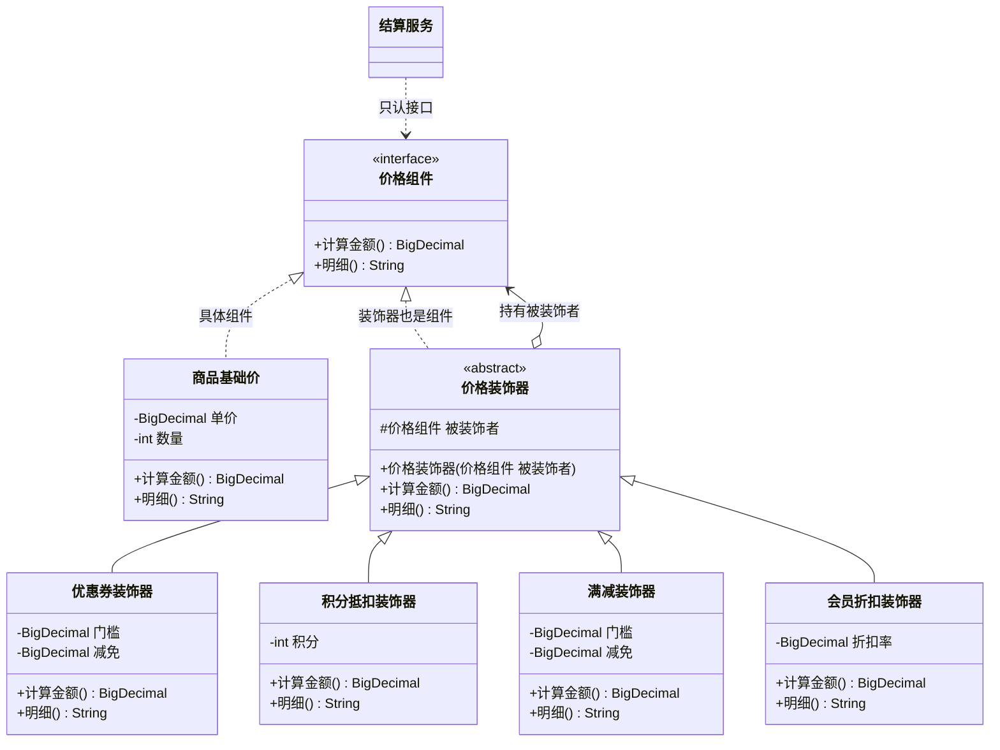

# 结构型 - 装饰(Decorator)（装饰者模式、包装器模式 Wrapper）

> 本文用「电商下单」这条业务主线统一重构：一句话定义 → 业务痛点 → 结构（Mermaid 类图）→ 可运行代码 → 何时用/不用 → 优缺点 → 与相似模式对比 → 真实框架中的应用，便于理解。
> 来源：整理自 https://pdai.tech ，本文重写示例与讲解。

---

## 一句话定义

**装饰模式（Decorator）**：在**不修改原有类、也不继承出一堆子类**的前提下，通过"一层套一层"的包装，动态地给对象**追加新职责**。包装前后**接口完全不变**，所以外面看起来还是同一个东西。

一句大白话：**订单原价 1000 块，套一层优惠券变 900，再套一层积分抵扣变 880，再套一层满减变 850——每套一层，还是那张"订单价格"，只是数字变了。**

> 别名提醒：装饰模式又叫**装饰者模式**、**包装器模式（Wrapper）**。注意适配器也自称 Wrapper，区别在于：**装饰不改接口，适配器改接口。**

---

## 业务痛点：没有它会怎样

电商结算页要算最终价格，规则会不断叠加：

- 基础价：商品单价 × 数量
- 优惠券：满 500 减 100
- 积分抵扣：100 积分抵 1 元
- 满减活动：满 800 再减 50
- 会员折扣：SVIP 再打 95 折
- 运费策略：不满 99 加 12 元运费

如果用**继承**来做，你会写出这种灾难：

```java
// 反面教材：为每种组合写一个子类，组合爆炸
class 订单价格 { }
class 带优惠券的订单价格 extends 订单价格 { }
class 带积分的订单价格 extends 订单价格 { }
class 带优惠券和积分的订单价格 extends 订单价格 { }
class 带优惠券和积分和满减的订单价格 extends 订单价格 { }
class 带优惠券和满减的会员订单价格 extends 订单价格 { }
// ... n 种规则会产生 2^n 种组合，彻底失控
```

如果用**一个大方法 + if**，同样难受：

```java
// 反面教材：所有规则挤在一个方法里
public BigDecimal 计算价格(订单 订单) {
    BigDecimal 价 = 订单.取原价();
    if (订单.有优惠券()) { 价 = 价.subtract(...); }
    if (订单.用积分()) { 价 = 价.subtract(...); }
    if (订单.命中满减()) { 价 = 价.subtract(...); }
    if (订单.是会员()) { 价 = 价.multiply(...); }
    // 每次大促加规则就往里塞 if，方法长到几百行，谁改谁背锅
    return 价;
}
```

痛点汇总：

| 问题 | 继承方案 | if 堆叠方案 |
|------|---------|------------|
| 组合爆炸 | n 个规则 → **2^n 个子类** | 无子类，但方法内分支爆炸 |
| 顺序无法调整 | 组合顺序写死在类名里 | 顺序写死在代码行序里，改顺序要挪代码 |
| 无法运行时装配 | 编译期就定死 | 只能靠开关变量硬控 |
| 违反开闭原则 | 加规则要加一堆类 | 加规则要改老方法，回归风险高 |
| 单一职责 | 一个类混了多种规则 | 一个方法混了全部规则 |

**装饰模式的解法**：把每条规则做成一个**独立的装饰器**，它们和"基础价格"实现**同一个接口**，可以**任意顺序、任意数量**地套在一起，运行时动态装配。

---

## 结构（Mermaid 类图）



**角色职责**

| 角色 | 类图中对应 | 职责 |
|------|-----------|------|
| Component（抽象组件） | `价格组件` | 定义统一接口，是"被装饰者"和"装饰者"共同的类型 |
| ConcreteComponent（具体组件） | `商品基础价` | 最里层的核心对象，**不依赖其它对象**，是装饰链的底座 |
| Decorator（抽象装饰器） | `价格装饰器` | 实现组件接口，**持有一个组件引用**，默认把调用原样转发下去 |
| ConcreteDecorator（具体装饰器） | `优惠券装饰器` 等 | 在转发调用的**前后**加入自己的逻辑，这才是"装饰"发生的地方 |
| Client（调用方） | `结算服务` | 按需层层包装，最终只调最外层的 `计算金额()` |

**装饰链的执行方向**

| 阶段 | 方向 | 说明 |
|------|------|------|
| 调用（请求进入） | 最外层 → 最内层 | `会员折扣.计算金额()` 先调 `满减.计算金额()`，一路调到 `商品基础价` |
| 返回（结果回溯） | 最内层 → 最外层 | 基础价先算出来，再依次被满减、积分、优惠券、会员折扣加工 |

> 所以：**最先被包上去的装饰器，最后一个拿到"原始值"；最外层的装饰器，最后一个加工结果。** 顺序不同，结果可能不同（先打折再满减 ≠ 先满减再打折），这也正是装饰模式灵活的地方。

---

## 代码实现（订单价格层层装饰）

**第一步：抽象组件——统一接口**

```java
import java.math.BigDecimal;
import java.math.RoundingMode;

/** Component：所有"价格能力"的统一接口 */
public interface 价格组件 {
    /** 计算当前金额 */
    BigDecimal 计算金额();
    /** 价格构成明细，便于展示给用户 */
    String 明细();
}
```

**第二步：具体组件——装饰链的底座**

```java
/** ConcreteComponent：商品基础价，不依赖任何其它对象 */
public class 商品基础价 implements 价格组件 {

    private final String 商品名;
    private final BigDecimal 单价;
    private final int 数量;

    public 商品基础价(String 商品名, BigDecimal 单价, int 数量) {
        this.商品名 = 商品名;
        this.单价 = 单价;
        this.数量 = 数量;
    }

    @Override
    public BigDecimal 计算金额() {
        return 单价.multiply(BigDecimal.valueOf(数量));
    }

    @Override
    public String 明细() {
        return "商品[" + 商品名 + "] " + 单价 + " × " + 数量 + " = " + 计算金额();
    }
}
```

**第三步：抽象装饰器——默认原样转发**

```java
/**
 * Decorator：抽象装饰器。
 * 它自己也是 价格组件，同时持有一个 价格组件 —— 这是装饰模式的灵魂。
 */
public abstract class 价格装饰器 implements 价格组件 {

    protected final 价格组件 被装饰者;

    protected 价格装饰器(价格组件 被装饰者) {
        this.被装饰者 = 被装饰者;
    }

    /** 默认行为：原样转发，什么都不做 */
    @Override
    public BigDecimal 计算金额() {
        return 被装饰者.计算金额();
    }

    @Override
    public String 明细() {
        return 被装饰者.明细();
    }

    /** 金额兜底：不允许算成负数，统一保留两位小数 */
    protected BigDecimal 规整(BigDecimal 金额) {
        if (金额.compareTo(BigDecimal.ZERO) < 0) {
            金额 = BigDecimal.ZERO;
        }
        return 金额.setScale(2, RoundingMode.HALF_UP);
    }
}
```

**第四步：具体装饰器——每条规则一个类**

```java
/** 优惠券：满 门槛 减 减免 */
public class 优惠券装饰器 extends 价格装饰器 {

    private final BigDecimal 门槛;
    private final BigDecimal 减免;

    public 优惠券装饰器(价格组件 被装饰者, BigDecimal 门槛, BigDecimal 减免) {
        super(被装饰者);
        this.门槛 = 门槛;
        this.减免 = 减免;
    }

    @Override
    public BigDecimal 计算金额() {
        BigDecimal 原金额 = 被装饰者.计算金额();      // ① 先拿到内层结果
        if (原金额.compareTo(门槛) >= 0) {            // ② 加自己的逻辑
            return 规整(原金额.subtract(减免));
        }
        return 规整(原金额);
    }

    @Override
    public String 明细() {
        BigDecimal 原金额 = 被装饰者.计算金额();
        boolean 命中 = 原金额.compareTo(门槛) >= 0;
        return 被装饰者.明细() + "\n  + 优惠券(满" + 门槛 + "减" + 减免 + ")："
                + (命中 ? "-" + 减免 : "未达门槛，不生效");
    }
}
```

```java
/** 积分抵扣：100 积分抵 1 元 */
public class 积分抵扣装饰器 extends 价格装饰器 {

    private static final int 兑换比例 = 100;
    private final int 使用积分;

    public 积分抵扣装饰器(价格组件 被装饰者, int 使用积分) {
        super(被装饰者);
        this.使用积分 = 使用积分;
    }

    @Override
    public BigDecimal 计算金额() {
        BigDecimal 抵扣 = BigDecimal.valueOf(使用积分 / 兑换比例);
        return 规整(被装饰者.计算金额().subtract(抵扣));
    }

    @Override
    public String 明细() {
        return 被装饰者.明细() + "\n  + 积分抵扣(" + 使用积分 + "分)："
                + "-" + (使用积分 / 兑换比例);
    }
}
```

```java
/** 满减活动 */
public class 满减装饰器 extends 价格装饰器 {

    private final BigDecimal 门槛;
    private final BigDecimal 减免;

    public 满减装饰器(价格组件 被装饰者, BigDecimal 门槛, BigDecimal 减免) {
        super(被装饰者);
        this.门槛 = 门槛;
        this.减免 = 减免;
    }

    @Override
    public BigDecimal 计算金额() {
        BigDecimal 原金额 = 被装饰者.计算金额();
        if (原金额.compareTo(门槛) >= 0) {
            return 规整(原金额.subtract(减免));
        }
        return 规整(原金额);
    }

    @Override
    public String 明细() {
        BigDecimal 原金额 = 被装饰者.计算金额();
        boolean 命中 = 原金额.compareTo(门槛) >= 0;
        return 被装饰者.明细() + "\n  + 满减活动(满" + 门槛 + "减" + 减免 + ")："
                + (命中 ? "-" + 减免 : "未达门槛，不生效");
    }
}
```

```java
/** 会员折扣 */
public class 会员折扣装饰器 extends 价格装饰器 {

    private final String 等级;
    private final BigDecimal 折扣率;   // 0.95 表示 95 折

    public 会员折扣装饰器(价格组件 被装饰者, String 等级, BigDecimal 折扣率) {
        super(被装饰者);
        this.等级 = 等级;
        this.折扣率 = 折扣率;
    }

    @Override
    public BigDecimal 计算金额() {
        return 规整(被装饰者.计算金额().multiply(折扣率));
    }

    @Override
    public String 明细() {
        return 被装饰者.明细() + "\n  + " + 等级 + "会员折扣：× " + 折扣率;
    }
}
```

```java
/** 运费：不满包邮门槛则加运费（注意这是「加钱」的装饰） */
public class 运费装饰器 extends 价格装饰器 {

    private final BigDecimal 包邮门槛;
    private final BigDecimal 运费;

    public 运费装饰器(价格组件 被装饰者, BigDecimal 包邮门槛, BigDecimal 运费) {
        super(被装饰者);
        this.包邮门槛 = 包邮门槛;
        this.运费 = 运费;
    }

    @Override
    public BigDecimal 计算金额() {
        BigDecimal 原金额 = 被装饰者.计算金额();
        if (原金额.compareTo(包邮门槛) < 0) {
            return 规整(原金额.add(运费));
        }
        return 规整(原金额);
    }

    @Override
    public String 明细() {
        BigDecimal 原金额 = 被装饰者.计算金额();
        boolean 包邮 = 原金额.compareTo(包邮门槛) >= 0;
        return 被装饰者.明细() + "\n  + 运费：" + (包邮 ? "满" + 包邮门槛 + "包邮" : "+" + 运费);
    }
}
```

**第五步：调用方——运行时自由装配**

```java
public class 结算服务 {

    public static void main(String[] args) {

        // ===== 场景一：普通用户，只有优惠券 =====
        价格组件 订单A = new 商品基础价("机械键盘", new BigDecimal("599"), 1);
        订单A = new 优惠券装饰器(订单A, new BigDecimal("500"), new BigDecimal("100"));
        订单A = new 运费装饰器(订单A, new BigDecimal("99"), new BigDecimal("12"));

        System.out.println("【订单A 明细】\n" + 订单A.明细());
        System.out.println("应付金额：" + 订单A.计算金额() + "\n");

        // ===== 场景二：SVIP 大促下单，规则全开 =====
        价格组件 订单B = new 商品基础价("显示器", new BigDecimal("1200"), 1);
        订单B = new 优惠券装饰器(订单B, new BigDecimal("500"), new BigDecimal("100"));   // 1200 -> 1100
        订单B = new 积分抵扣装饰器(订单B, 2000);                                          // 1100 -> 1080
        订单B = new 满减装饰器(订单B, new BigDecimal("800"), new BigDecimal("50"));       // 1080 -> 1030
        订单B = new 会员折扣装饰器(订单B, "SVIP", new BigDecimal("0.95"));                // 1030 -> 978.50
        订单B = new 运费装饰器(订单B, new BigDecimal("99"), new BigDecimal("12"));        // 满 99 包邮

        System.out.println("【订单B 明细】\n" + 订单B.明细());
        System.out.println("应付金额：" + 订单B.计算金额());
    }
}
```

运行输出：

```java
// 【订单A 明细】
// 商品[机械键盘] 599 × 1 = 599
//   + 优惠券(满500减100)：-100
//   + 运费：满99包邮
// 应付金额：499.00
//
// 【订单B 明细】
// 商品[显示器] 1200 × 1 = 1200
//   + 优惠券(满500减100)：-100
//   + 积分抵扣(2000分)：-20
//   + 满减活动(满800减50)：-50
//   + SVIP会员折扣：× 0.95
//   + 运费：满99包邮
// 应付金额：978.50
```

**注意三个细节：**

1. **规则顺序 = 包装顺序**。想让"先打折后满减"？把两行代码换个位置即可，不用改任何装饰器类。
2. **规则可选**。订单A 只套了两层，订单B 套了五层，同一套类支撑任意组合。
3. **新增规则零侵入**。要加"新人首单立减"？新写一个 `新人立减装饰器`，其它类一行不改——这就是**开闭原则**。

---

## 什么时候该用 / 不该用

**该用：**

- 需要给对象**动态、按需、可叠加**地添加职责，且组合方式在运行时才确定；
- 用继承会导致**子类组合爆炸**（类名里出现"带A和B的XXX"就是信号）；
- 被扩展的类**不能修改**（第三方 jar、`final` 类无法继承时可用组合式装饰）；
- 职责需要**可撤销**——不装那层就没有那个功能，比继承灵活得多；
- 典型场景：价格计算链、IO 流增强、请求过滤链、缓存/日志/限流的层层包装。

**不该用：**

- 只有**一两种固定组合**，且以后基本不变——直接写死更简单，装饰器反而绕；
- 各"装饰"之间**存在强依赖或顺序约束**（必须先 A 后 B，否则出错）——此时链式装配容易踩坑，改用责任链或显式编排的模板方法更安全；
- 装饰层数过多导致**调试困难**（栈里全是 `计算金额()`，看不出是哪一层出的问题）；
- 需要**判断对象的具体类型**——一旦被包装，`instanceof 商品基础价` 就失效了，`equals` 语义也可能被破坏。

---

## 优缺点

| 优点 | 缺点 |
|------|------|
| 比继承**灵活得多**，运行时动态增删职责 | 会产生**大量小类**，类数量膨胀 |
| 避免子类组合爆炸：n 个规则只需 **n 个装饰器**，而非 2^n 个子类 | 多层包装后**调试困难**，调用栈很深且方法名重复 |
| 完美符合**开闭原则**：加规则只加类，不改老代码 | 装饰器**顺序敏感**，装错顺序结果就错，且这种 bug 很隐蔽 |
| 每个装饰器职责单一，易测试、易复用 | 破坏对象标识：包装后 `instanceof` / `equals` 可能不符合预期 |
| 组件与装饰器同接口，调用方无感知 | 对于简单场景是**过度设计**，增加理解成本 |

---

## 与相似模式的对比

| 对比项 | 装饰(Decorator) | 代理(Proxy) | 适配器(Adapter) | 组合(Composite) | 责任链 | 策略 |
|--------|----------------|-------------|----------------|----------------|--------|------|
| 核心目的 | **增强功能** | **控制访问** | **转换接口** | **组织树结构** | 传递并处理请求 | 替换算法 |
| 接口是否变 | 不变 | 不变 | **变** | 不变 | 不变 | — |
| 持有对象数 | 1 个（可无限叠加） | 1 个 | 1 个 | **0..n 个** | 1 个后继 | 1 个策略 |
| 谁来创建被包装者 | **调用方**传入，外部装配 | **代理自己**创建/控制 | 外部传入 | 外部添加 | 外部编排 | 外部传入 |
| 是否会"拦截不往下走" | 一般都会往下调 | 可能直接返回（如缓存命中） | 一定往下调 | 往下转发 | **可能中断链条** | 不涉及 |
| 一句话记忆 | 套娃加料 | 门卫/中介 | 转接头 | 一棵树 | 击鼓传花 | 换算法 |

**最容易混的三组，重点说：**

- **装饰 vs 代理**：结构上几乎一模一样（都实现同接口 + 都持有一个同接口对象），区别在**意图**和**控制权**。
  - 装饰器**关注功能增强**，被装饰对象由**调用方**从外面传进来，且强调"可以套很多层、顺序自由"；
  - 代理**关注访问控制**（权限、缓存、延迟加载、远程调用），真实对象通常由**代理自己**持有甚至自己创建，调用方往往不知道真实对象是谁。
  - 一句话：**装饰是"我帮你加点料"，代理是"想找他？先过我这关"。**

- **装饰 vs 适配器**：都被叫做 Wrapper，但**装饰包完接口不变**（还是 `价格组件`），**适配器包完接口变了**（`老支付服务` → `支付网关`）。目的一个是加功能，一个是改兼容。

- **装饰 vs 组合**：结构上都是"对象里装对象"。**装饰器只装 1 个**，目的是**修改方法调用的结果**；**组合可以装 n 个**，目的是**组织子对象**，通常原样转发不做修改。经典总结：*组合对象不修改方法调用，着眼于组织子对象；装饰者存在的唯一目的就是修改方法调用。*

- **装饰 vs 责任链**：装饰链上每一环**都会执行**并把结果传下去；责任链上某一环**可以吃掉请求、终止传递**。

---

## 真实框架中的应用

**1. JDK IO 流 —— 装饰模式的活化石**

`java.io` 整个包就是装饰模式的教科书：

```java
// 一层层套：文件流 -> 缓冲 -> 数据类型解析
InputStream 输入 = new FileInputStream("order.dat");   // ConcreteComponent：核心数据源
输入 = new BufferedInputStream(输入);                   // 装饰1：加缓冲，提升性能
输入 = new GZIPInputStream(输入);                       // 装饰2：加解压能力
DataInputStream 数据流 = new DataInputStream(输入);      // 装饰3：加基本类型读取能力
long 订单号 = 数据流.readLong();
```

角色对应关系一目了然：

| 装饰模式角色 | java.io 中对应 |
|-------------|---------------|
| Component | `InputStream` / `OutputStream` / `Reader` / `Writer` |
| ConcreteComponent | `FileInputStream`、`ByteArrayInputStream`（真正的数据源） |
| Decorator | `FilterInputStream` / `FilterOutputStream`（内部持有 `protected volatile InputStream in`） |
| ConcreteDecorator | `BufferedInputStream`、`DataInputStream`、`PushbackInputStream`、`ZipOutputStream` |

`FilterInputStream` 的实现就是标准的抽象装饰器——默认所有方法都转发给 `in`，子类只覆写自己关心的那几个。这也解释了为什么 Java IO 的类那么多、用起来要套好几层：这是装饰模式"类数量膨胀"缺点的真实体现，但换来了极高的组合灵活性。

**2. JDK 集合：`Collections#synchronizedList` / `unmodifiableList` / `checkedList`**

```java
List<订单> 列表 = new ArrayList<>();
List<订单> 线程安全列表 = Collections.synchronizedList(列表);      // 装饰：加同步
List<订单> 只读列表 = Collections.unmodifiableList(线程安全列表);   // 再装饰：加只读
```

返回的仍然是 `List`，接口没变，但行为被增强了。`SynchronizedList` 内部持有原 `list`，每个方法加 `synchronized` 后转发；`UnmodifiableList` 则把所有写方法改成抛异常。

**3. Spring：`TransactionAwareCacheDecorator`、`BeanDefinitionDecorator`**

Spring 中带 `Decorator` 字样的类基本都是这个模式。`TransactionAwareCacheDecorator` 包装一个普通 `Cache`，让缓存的写操作延迟到事务提交后才真正执行——接口还是 `Cache`，但多了事务感知能力。

**4. Spring MVC：`HttpServletRequestWrapper` / `HttpServletResponseWrapper`**

Servlet 规范直接提供了装饰器基类。最典型的用法是"可重复读取请求体"：

```java
public class 可重复读请求包装器 extends HttpServletRequestWrapper {
    private final byte[] 请求体;

    public 可重复读请求包装器(HttpServletRequest 原请求) throws IOException {
        super(原请求);
        this.请求体 = StreamUtils.copyToByteArray(原请求.getInputStream());
    }

    @Override
    public ServletInputStream getInputStream() {
        // 每次都返回一个新的流，从而支持多次读取
        ByteArrayInputStream 流 = new ByteArrayInputStream(请求体);
        return new ServletInputStream() {
            @Override public int read() { return 流.read(); }
            @Override public boolean isFinished() { return 流.available() == 0; }
            @Override public boolean isReady() { return true; }
            @Override public void setReadListener(ReadListener l) { }
        };
    }
}
```

在 Filter 里 `chain.doFilter(new 可重复读请求包装器(request), response)`，后续所有代码拿到的仍然是标准的 `HttpServletRequest`，但已经能重复读 body 了。这是日志打印、签名校验、XSS 过滤的标准做法。

**5. MyBatis：`Cache` 装饰器链**

MyBatis 的二级缓存把装饰模式用得淋漓尽致。核心实现只有 `PerpetualCache`（一个 `HashMap`），其余全是装饰器：

```java
// CacheBuilder 构建时层层包装
Cache 缓存 = new PerpetualCache("order-cache");     // 核心：HashMap 存储
缓存 = new LruCache(缓存);                           // 装饰：LRU 淘汰
缓存 = new ScheduledCache(缓存);                     // 装饰：定时清空
缓存 = new SerializedCache(缓存);                    // 装饰：序列化存取
缓存 = new LoggingCache(缓存);                       // 装饰：命中率日志
缓存 = new SynchronizedCache(缓存);                  // 装饰：线程安全
```

`org.apache.ibatis.cache.decorators` 包下还有 `BlockingCache`、`FifoCache`、`SoftCache`、`WeakCache`、`TransactionalCache`。你在 `<cache eviction="LRU" flushInterval="60000"/>` 里配的每个属性，本质上都是决定要不要套某一层装饰器。

**6. Dubbo / Netty 的 Filter 与 Handler 链**

Dubbo 的 `ProtocolFilterWrapper` 把一串 `Filter` 包装成一个 `Invoker`，Netty 的 `ChannelPipeline` 让 `ChannelHandler` 层层处理数据——都是装饰思想的工程化应用（严格说 Netty 更接近责任链，但包装式增强的味道是相通的）。

---

## 小结

装饰模式的精髓是一句话：**用组合代替继承，把"可选功能"做成可插拔的一层皮。** 只要你发现自己在为"功能A+功能B+功能C"的各种排列组合写子类，或者在一个方法里堆了十几个 `if (开启了某功能)`，那就该把每个功能拆成装饰器了。代价是类会变多、调用栈会变深，但换来的是**任意组合、任意顺序、加功能不改老代码**——在规则频繁变化的电商营销场景里，这笔买卖非常划算。

---

> 参考来源：整理自 https://pdai.tech/md/dev-spec/pattern/12_decorator.html （著作权归 pdai.tech 所有），并综合公开资料，本文重写示例与讲解。
