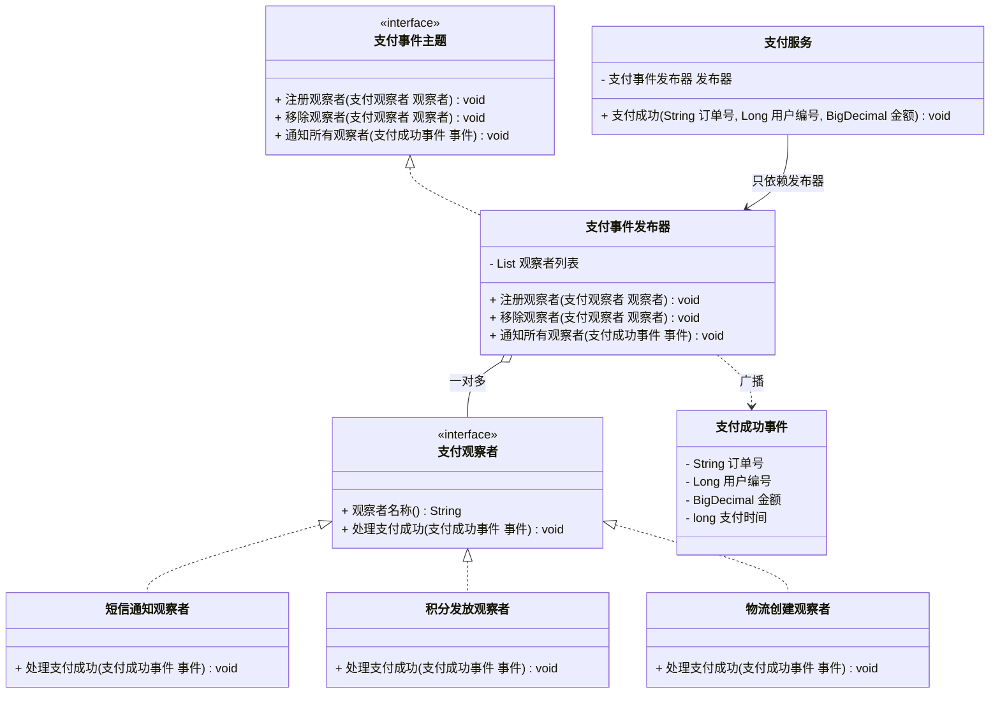

# 行为型 - 观察者(Observer)

> 本文用「电商下单」业务主线统一重构，便于理解。来源：整理自 pdai.tech。

---

## 一句话定义

**观察者模式（Observer）**：定义对象之间的**一对多**依赖关系。当被观察的那个对象（主题）状态一变，**所有订阅它的对象都会自动收到通知**并各自处理，主题完全不需要知道订阅者是谁、有几个。

大白话：你在 App 上点了「到货提醒」，商家不认识你，也不知道有多少人点了；货一到，系统挨个给订阅者发消息。加人减人，商家那边一行代码都不用改。

---

## 业务痛点：没有它会怎样

用户**支付成功**后，需要连锁触发一堆事：

1. 发**短信**告诉用户「支付成功」
2. 给用户**加积分**
3. 通知**物流**系统创建发货单
4. 更新**营销**系统的活动核销数据
5. 给**数据中台**推一条埋点

没有观察者模式，支付服务通常写成这样：

```java
public class 支付服务 {
    // 支付服务被迫认识全世界
    private 短信服务 短信;
    private 积分服务 积分;
    private 物流服务 物流;
    private 营销服务 营销;
    private 数据服务 数据;

    public void 支付成功(String 订单号) {
        更新支付状态(订单号);

        短信.发送(订单号);       // 硬编码调用
        积分.增加(订单号);
        物流.创建发货单(订单号);
        营销.核销(订单号);
        数据.埋点(订单号);
        // 下周产品说"再加个开发票"...继续往下加
    }
}
```

痛点：

- **支付这个核心链路被下游业务绑架**：加一个下游就要改一次支付服务，核心代码越来越危险；
- **一个下游挂了，整个支付都失败**：短信服务超时 5 秒，用户支付接口就卡 5 秒，甚至抛异常导致主流程回滚——这是典型的**强耦合导致的稳定性事故**；
- 支付服务**被迫依赖 5 个下游的 jar 包**，编译期依赖爆炸；
- 各下游的**执行顺序被硬编码**，想让积分先于短信，得改支付服务；
- 没法按需订阅：测试环境不想发真短信，只能加 `if (环境 == 生产)`。

观察者模式的解法：支付服务只负责**广播一个「支付成功」事件**，谁想干活谁自己来订阅。支付服务从此只认识一个 `事件发布器`。

---

## 结构（Mermaid 类图）



**角色职责**

| 角色 | 对应类 | 职责 |
|------|--------|------|
| Subject（抽象主题） | `支付事件主题` | 定义注册、移除、通知观察者的接口 |
| ConcreteSubject（具体主题） | `支付事件发布器` | 维护观察者列表，状态变化时遍历通知；**只认识接口，不认识具体观察者** |
| Observer（抽象观察者） | `支付观察者` | 定义收到通知后的回调方法 |
| ConcreteObserver（具体观察者） | `短信通知观察者`、`积分发放观察者`、`物流创建观察者` | 各自实现自己的响应逻辑，互不知晓对方 |
| Event（事件对象） | `支付成功事件` | 承载通知内容，避免观察者反过来查询主题（推模型） |
| 触发方 | `支付服务` | 状态变更后调用发布器广播，不关心谁在听 |

---

## 代码实现（支付成功事件通知）

**1）事件对象与观察者接口**

```java
import java.math.BigDecimal;

/** 事件对象：把通知所需的数据一次性带给观察者（推模型） */
public class 支付成功事件 {

    private final String 订单号;
    private final Long 用户编号;
    private final BigDecimal 金额;
    private final long 支付时间;

    public 支付成功事件(String 订单号, Long 用户编号, BigDecimal 金额) {
        this.订单号 = 订单号;
        this.用户编号 = 用户编号;
        this.金额 = 金额;
        this.支付时间 = System.currentTimeMillis();
    }

    public String 取订单号() { return 订单号; }
    public Long 取用户编号() { return 用户编号; }
    public BigDecimal 取金额() { return 金额; }
    public long 取支付时间() { return 支付时间; }
}

/** 抽象观察者 */
public interface 支付观察者 {

    /** 用于日志和排序 */
    String 观察者名称();

    /** 收到支付成功通知后各自处理 */
    void 处理支付成功(支付成功事件 事件);
}
```

**2）抽象主题与具体主题**

```java
import java.util.ArrayList;
import java.util.List;
import java.util.concurrent.CopyOnWriteArrayList;

public interface 支付事件主题 {
    void 注册观察者(支付观察者 观察者);
    void 移除观察者(支付观察者 观察者);
    void 通知所有观察者(支付成功事件 事件);
}

/**
 * 具体主题：只维护一个观察者列表，不认识任何具体下游。
 * 用 CopyOnWriteArrayList 避免"通知过程中有人注册/注销"导致的并发修改异常。
 */
public class 支付事件发布器 implements 支付事件主题 {

    private final List<支付观察者> 观察者列表 = new CopyOnWriteArrayList<>();

    @Override
    public void 注册观察者(支付观察者 观察者) {
        观察者列表.add(观察者);
        System.out.println("[发布器] 注册观察者：" + 观察者.观察者名称());
    }

    @Override
    public void 移除观察者(支付观察者 观察者) {
        观察者列表.remove(观察者);
        System.out.println("[发布器] 移除观察者：" + 观察者.观察者名称());
    }

    @Override
    public void 通知所有观察者(支付成功事件 事件) {
        System.out.println("[发布器] 广播支付成功事件，订单=" + 事件.取订单号()
                + "，订阅者数量=" + 观察者列表.size());
        for (支付观察者 观察者 : 观察者列表) {
            try {
                观察者.处理支付成功(事件);
            } catch (Exception e) {
                // 关键：单个观察者失败不能影响其他观察者，更不能影响主流程
                System.out.println("  [发布器] 观察者 " + 观察者.观察者名称()
                        + " 处理失败，已隔离：" + e.getMessage());
            }
        }
    }
}
```

**3）三个具体观察者**

```java
public class 短信通知观察者 implements 支付观察者 {

    @Override
    public String 观察者名称() { return "短信通知"; }

    @Override
    public void 处理支付成功(支付成功事件 事件) {
        System.out.println("  [短信] 向用户 " + 事件.取用户编号()
                + " 发送：您的订单 " + 事件.取订单号() + " 已支付 " + 事件.取金额() + " 元");
    }
}

public class 积分发放观察者 implements 支付观察者 {

    @Override
    public String 观察者名称() { return "积分发放"; }

    @Override
    public void 处理支付成功(支付成功事件 事件) {
        // 消费 1 元得 1 积分
        int 积分 = 事件.取金额().intValue();
        System.out.println("  [积分] 用户 " + 事件.取用户编号() + " 增加 " + 积分 + " 积分");
    }
}

public class 物流创建观察者 implements 支付观察者 {

    @Override
    public String 观察者名称() { return "物流建单"; }

    @Override
    public void 处理支付成功(支付成功事件 事件) {
        System.out.println("  [物流] 为订单 " + 事件.取订单号() + " 创建发货单");
    }
}

/** 演示"下游故障不影响主流程" */
public class 营销核销观察者 implements 支付观察者 {

    @Override
    public String 观察者名称() { return "营销核销"; }

    @Override
    public void 处理支付成功(支付成功事件 事件) {
        throw new RuntimeException("营销系统超时");
    }
}
```

**4）支付服务：只依赖发布器**

```java
import java.math.BigDecimal;

public class 支付服务 {

    private final 支付事件发布器 发布器;

    public 支付服务(支付事件发布器 发布器) {
        this.发布器 = 发布器;
    }

    public void 支付成功(String 订单号, Long 用户编号, BigDecimal 金额) {
        // 1. 核心逻辑：更新支付状态（这才是支付服务该干的事）
        System.out.println("[支付服务] 订单 " + 订单号 + " 支付状态更新为：已支付");

        // 2. 广播事件，之后发生什么与我无关
        发布器.通知所有观察者(new 支付成功事件(订单号, 用户编号, 金额));
    }
}
```

**5）运行**

```java
import java.math.BigDecimal;

public class 客户端 {
    public static void main(String[] args) {
        支付事件发布器 发布器 = new 支付事件发布器();

        // 按需订阅，顺序即注册顺序
        发布器.注册观察者(new 短信通知观察者());
        发布器.注册观察者(new 积分发放观察者());
        发布器.注册观察者(new 物流创建观察者());
        发布器.注册观察者(new 营销核销观察者());   // 这个会抛异常

        支付服务 服务 = new 支付服务(发布器);

        System.out.println();
        服务.支付成功("ORD-001", 1001L, new BigDecimal("128.00"));

        // 运行时动态退订：大促期间临时关闭短信，省钱
        System.out.println();
        短信通知观察者 短信 = new 短信通知观察者();
        发布器.移除观察者(短信);
    }
}
```

输出：

```
[发布器] 注册观察者：短信通知
[发布器] 注册观察者：积分发放
[发布器] 注册观察者：物流建单
[发布器] 注册观察者：营销核销

[支付服务] 订单 ORD-001 支付状态更新为：已支付
[发布器] 广播支付成功事件，订单=ORD-001，订阅者数量=4
  [短信] 向用户 1001 发送：您的订单 ORD-001 已支付 128.00 元
  [积分] 用户 1001 增加 128 积分
  [物流] 为订单 ORD-001 创建发货单
  [发布器] 观察者 营销核销 处理失败，已隔离：营销系统超时
```

重点看最后一行：**营销系统炸了，支付主流程和其它三个观察者完全不受影响**。这就是解耦带来的稳定性收益。新增「开发票观察者」时，支付服务一个字都不用改。

---

## 什么时候该用 / 不该用

**该用：**

- 一个状态变化要触发**多个互不相关的后续动作**，且这些动作还会持续增加（支付成功、订单完成、用户注册）；
- 希望**核心链路不被下游拖累**：下游只是"顺带做的事"，失败可以补偿，不该阻塞主流程；
- 需要**运行时动态增删订阅者**（灰度开关、按环境开启）；
- 想实现**发布-订阅式的模块解耦**，让核心域不依赖支撑域。

**不该用：**

- 只有一个固定的后续动作、且永远不变——直接调用更清晰，套观察者只是增加理解成本；
- 后续动作是**主流程的必要组成部分**，必须成功、必须在同一事务内（比如扣库存），此时用观察者会让事务边界变得模糊、异常难以传播；
- 观察者之间**有严格的先后依赖**（B 必须用到 A 的结果）——观察者模式不保证也不应该依赖通知顺序，这种场景该用编排（中介者/流程引擎）；
- 通知链路很深（A 通知 B，B 又通知 C，C 又改了 A），会形成**循环通知**，调试时堆栈能吓死人。

---

## 优缺点

| 优点 | 缺点 |
|------|------|
| 主题与观察者松耦合，主题只认接口 | 通知顺序不确定，不能依赖顺序编程 |
| 新增观察者不改主题代码，符合开闭原则 | 观察者过多时，同步通知会拖慢主流程 |
| 支持运行时动态订阅/退订 | 调试困难：一个事件触发一串回调，堆栈难追踪 |
| 单个观察者异常可隔离，提升主流程稳定性 | 若观察者忘记注销，会造成**内存泄漏**（尤其长生命周期主题） |
| 天然适合演进为异步、跨进程（MQ） | 可能出现循环通知，甚至无限递归 |
| 支持一对多广播，扩展性好 | 事件对象设计不当（字段不够）会导致观察者反查数据库 |

---

## 与相似模式的对比

| 对比项 | 观察者(Observer) | 中介者(Mediator) | 责任链(Chain) | 命令(Command) | 发布订阅(Pub/Sub) |
|--------|-----------------|-----------------|--------------|--------------|------------------|
| 通信方向 | **一对多广播** | **多对多，全走中心** | 一条链，依次传递 | 一对一调用 | 一对多，**经由中间人** |
| 谁知道谁 | 观察者知道主题（要注册），主题只知接口 | 同事只知道中介者 | 每个节点只知道下一个 | 调用者只知命令接口 | 双方**互相都不知道**，只知 Topic |
| 能否中断 | 不能，所有人都会收到 | 由中介者决定 | **能，任一棒可短路** | 不涉及 | 不能 |
| 意图 | **状态变了通知你们** | **协调你们别互相调** | **找到能处理的那个** | **把操作变成对象** | 跨进程解耦 |
| 耦合度 | 低 | 中（中介者变胖） | 低 | 低 | 最低 |

> **观察者 vs 中介者**：最容易混。观察者是**广播**——「我状态变了，你们爱干嘛干嘛」，观察者之间互不影响；中介者是**协调**——「你们别互相调，都听我指挥」，中介者知道完整的业务编排逻辑，会决定先调 A 再调 B、A 失败就不调 B。判断标准：**如果后续动作之间有编排关系、需要控制流程和回滚，用中介者；如果只是各自独立地"顺带做点事"，用观察者。**
>
> **观察者 vs 发布订阅**：教科书上的观察者，观察者要**直接向主题注册**（双方有引用）；真正的发布订阅在中间加了一层 Broker/Topic，发布者和订阅者**彼此完全不可见**。Spring 的 `ApplicationEventPublisher`、Guava `EventBus`、MQ 都属于后者，是观察者的进化版。

---

## 真实框架中的应用

**1）Spring 事件机制：`ApplicationEvent` + `@EventListener`**

Spring 内置了完整的观察者实现，是实际项目里最常用的方案：

```java
// 事件对象
public class 支付成功事件 extends ApplicationEvent {
    private final String 订单号;
    public 支付成功事件(Object source, String 订单号) {
        super(source);
        this.订单号 = 订单号;
    }
    public String 取订单号() { return 订单号; }
}

// 发布方：支付服务只依赖 Spring 的发布器
@Service
public class 支付服务 {
    @Autowired
    private ApplicationEventPublisher 发布器;

    public void 支付成功(String 订单号) {
        // 核心逻辑...
        发布器.publishEvent(new 支付成功事件(this, 订单号));
    }
}

// 订阅方：加个注解就订阅上了，支付服务毫不知情
@Component
public class 积分监听器 {

    @Async  // 异步执行，彻底不阻塞主流程
    @TransactionalEventListener(phase = TransactionPhase.AFTER_COMMIT)  // 事务提交后才发
    public void 发放积分(支付成功事件 事件) {
        System.out.println("给订单 " + 事件.取订单号() + " 发放积分");
    }
}
```

三个关键点：`@EventListener` 让订阅零成本；`@Async` 解决同步阻塞；`@TransactionalEventListener(AFTER_COMMIT)` 解决「事务还没提交就发通知，下游查不到数据」这个经典坑。底层由 `ApplicationEventMulticaster` 负责维护监听器列表并广播。

**2）Spring 容器内部的生命周期回调**

`ApplicationListener<ContextRefreshedEvent>`、`ContextClosedEvent`、Spring Boot 的 `ApplicationReadyEvent`，都是 Spring 自己在用观察者模式暴露扩展点。你想在容器启动完成后做点事，只需要监听事件，不用改 Spring 一行源码。

**3）JDK `java.util.Observable` / `Observer`（已废弃，但值得一看）**

JDK 1.0 就自带的观察者实现。`Observable#setChanged()` + `notifyObservers()` 触发广播。Java 9 起标记为 `@Deprecated`，原因很有教育意义：`Observable` 是**类**不是接口（占用继承名额）、`setChanged()` 是 protected（不好用）、不支持泛型（要强转）、序列化和线程安全都有问题。这提醒我们：**观察者模式很好，但 JDK 那个实现别用**。

**4）Guava `EventBus`**

`eventBus.register(listener)` 注册，`eventBus.post(event)` 发布，监听方法上加 `@Subscribe` 注解并根据参数类型自动匹配事件。`AsyncEventBus` 提供异步版本。API 极简，进程内事件总线的首选。

**5）Netty 的 `ChannelFutureListener`**

`channel.writeAndFlush(msg).addListener(future -> {...})`，IO 操作完成后自动回调所有注册的监听器。异步编程里的回调本质上就是观察者。

**6）Servlet 监听器与 MyBatis 插件**

`HttpSessionListener`、`ServletContextListener` 监听容器生命周期事件；MyBatis 虽然主要用责任链做插件，但其 `Configuration` 中的各类回调也带有观察者色彩。

**7）RxJava / Reactor——观察者模式的极致演化**

`Observable`/`Flux` 是主题，`Subscriber` 是观察者，在此基础上加了背压、操作符链、线程调度。响应式编程的根，就是观察者模式。

---

## 小结

观察者模式做的事就是「**把主动调用改成被动订阅**」：核心链路只管喊一嗓子，谁想听谁自己来。它是解耦核心域与支撑域最有效的手段，但用之前务必想清楚两件事——**通知是否需要异步**（否则等于没解耦）、**通知是否需要在事务提交后**（否则下游查不到数据）。这两点没处理好，观察者反而会变成线上故障的源头。

---

> 参考来源：整理自 https://pdai.tech/md/dev-spec/pattern/19_observer.html ，本文重写示例与讲解。
