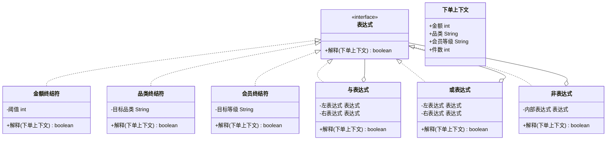

# 行为型 - 解释器(Interpreter)

> 本文用「电商下单」业务主线统一重构，便于理解。来源：整理自 菜鸟教程（runoob.com）。

## 一句话定义

解释器模式：把一个「固定的小语言」（比如一段促销规则、一个判断表达式）定义成一套文法，再用代码造出对应的「解释器」，让程序能读懂并计算这些句子。

## 业务痛点：没有它会怎样

电商大促时，运营想配一堆优惠规则：「订单金额满 100 且品类是数码，减 20」「是 VIP 会员或下单满 3 件，送赠品」。

如果没有解释器模式，最常见的写法是把这些规则硬编码成一大坨 `if-else`：

```java
if (订单金额 >= 100 && "数码".equals(品类)) { 减20 }
if (isVip || 件数 >= 3) { 送赠品 }
```

坏处很明显：

- **规则一变就要改代码、重新发版**：运营想临时加一条「满 200 减 50」，开发得改 `if`、测试、上线，慢得要命。
- **规则散落各处、看不懂**：几十个 `if` 嵌套，没人说得清到底配了哪些规则。
- **没法复用和组合**：「满足 A 且 B，或者满足 C」这种组合逻辑，用 `if` 写既丑又容易写错。

解释器模式的解法是：把规则看成一种「迷你语言」，定义好它的单词（终结符）和连接词（非终结符：与/或/非），然后用同一套解释器去读懂任意组合的句子。运营在后台配字符串，系统把它解析成一棵语法树，解释执行即可，**改规则不用改代码**。

> 小提醒：解释器适合「文法小而稳定、重复出现」的场景。业务规则引擎如果很复杂，生产里更常用专门的规则引擎（如 Drools），但理解解释器是看懂它们的地基。

## 结构



| 角色 | 对应类 | 职责 |
| --- | --- | --- |
| 抽象表达式 | `表达式` | 定义 `解释()` 方法，所有节点都实现它 |
| 终结符表达式 | `金额终结符`、`品类终结符`、`会员终结符` | 文法里最基本的「单词」，直接对上下文做判断 |
| 非终结符表达式 | `与表达式`、`或表达式`、`非表达式` | 文法里的「连接词」，组合子表达式得到结果 |
| 上下文 | `下单上下文` | 被解释的对象（一次订单的相关信息） |
| 客户端 | 演示类 | 把规则拼成一棵语法树，再调用根节点的 `解释()` |

## 代码实现

下面用「订单金额满 100 且品类是数码 → 该规则命中」为例，搭一套可运行的促销规则解释器。

```java
import java.util.*;

// 上下文：一次下单的信息，给解释器读
class 下单上下文 {
    int 金额;
    String 品类;
    String 会员等级;
    int 件数;

    下单上下文(int 金额, String 品类, String 会员等级, int 件数) {
        this.金额 = 金额;
        this.品类 = 品类;
        this.会员等级 = 会员等级;
        this.件数 = 件数;
    }
}

// 抽象表达式
interface 表达式 {
    boolean 解释(下单上下文 上下文);
}

// 终结符：金额满阈值
class 金额终结符 implements 表达式 {
    private final int 阈值;
    金额终结符(int 阈值) { this.阈值 = 阈值; }
    @Override public boolean 解释(下单上下文 上下文) {
        return 上下文.金额 >= 阈值;
    }
}

// 终结符：品类等于目标
class 品类终结符 implements 表达式 {
    private final String 目标品类;
    品类终结符(String 目标品类) { this.目标品类 = 目标品类; }
    @Override public boolean 解释(下单上下文 上下文) {
        return 目标品类.equals(上下文.品类);
    }
}

// 终结符：会员等级等于目标
class 会员终结符 implements 表达式 {
    private final String 目标等级;
    会员终结符(String 目标等级) { this.目标等级 = 目标等级; }
    @Override public boolean 解释(下单上下文 上下文) {
        return 目标等级.equals(上下文.会员等级);
    }
}

// 非终结符：与（两个条件都满足）
class 与表达式 implements 表达式 {
    private final 表达式 左;
    private final 表达式 右;
    与表达式(表达式 左, 表达式 右) { this.左 = 左; this.右 = 右; }
    @Override public boolean 解释(下单上下文 上下文) {
        return 左.解释(上下文) && 右.解释(上下文);
    }
}

// 非终结符：或（满足其一）
class 或表达式 implements 表达式 {
    private final 表达式 左;
    private final 表达式 右;
    或表达式(表达式 左, 表达式 右) { this.左 = 左; this.右 = 右; }
    @Override public boolean 解释(下单上下文 上下文) {
        return 左.解释(上下文) || 右.解释(上下文);
    }
}

// 非终结符：非（取反）
class 非表达式 implements 表达式 {
    private final 表达式 内部;
    非表达式(表达式 内部) { this.内部 = 内部; }
    @Override public boolean 解释(下单上下文 上下文) {
        return !内部.解释(上下文);
    }
}

// 演示：拼规则 + 解释执行
public class 解释器演示 {
    // 规则：金额满100 且 品类是数码
    static 表达式 满减规则() {
        return new 与表达式(
                new 金额终结符(100),
                new 品类终结符("数码")
        );
    }

    // 规则：是VIP会员 或 件数满3
    static 表达式 赠品规则() {
        return new 或表达式(
                new 会员终结符("VIP"),
                new 金额终结符(0) { // 这里借用不到件数，演示用金额替代，真实可加「件数终结符」
                    @Override public boolean 解释(下单上下文 上下文) {
                        return 上下文.件数 >= 3;
                    }
                }
        );
    }

    public static void main(String[] args) {
        下单上下文 订单1 = new 下单上下文(150, "数码", "普通", 1);
        下单上下文 订单2 = new 下单上下文(80, "服饰", "VIP", 2);

        System.out.println("订单1 命中满减规则? " + 满减规则().解释(订单1)); // true
        System.out.println("订单2 命中满减规则? " + 满减规则().解释(订单2)); // false
        System.out.println("订单1 命中赠品规则? " + 赠品规则().解释(订单1)); // false
        System.out.println("订单2 命中赠品规则? " + 赠品规则().解释(订单2)); // true（VIP）
    }
}
```

运行输出：

```
订单1 命中满减规则? true
订单2 命中满减规则? false
订单1 命中赠品规则? false
订单2 命中赠品规则? true
```

如果运营想加「满 200 减 50」，只要再拼一个 `new 金额终结符(200)` 的子树即可，无需改动已有表达式类的代码——这就是解释器"可扩展文法"的价值。

## 什么时候该用 / 不该用

**该用：**

- 有一类问题反复出现，且能用一句「简单的语言」表达（促销规则、校验规则、查询条件）。
- 文法相对稳定、规模不大，值得为它写一套解释器。
- 希望非程序员（运营/产品）也能用规则字符串配置行为。

**不该用：**

- 文法很复杂、变化频繁：解释器会导致类膨胀、递归深、难维护，应上规则引擎（Drools）或 DSL 工具。
- 性能敏感的热点路径：解释执行反复递归，比直接写代码慢；高频计算不适合。
- 只是一次性判断：杀鸡用牛刀，直接写 `if` 更清楚。

## 优缺点

| 维度 | 说明 |
| --- | --- |
| 优点 | 1. 易扩展：加新规则类型只需加终结符/非终结符类；2. 文法清晰：规则以语法树形式存在，可读、可组合；3. 改动规则不用改执行代码 |
| 缺点 | 1. 可利用场景少；2. 复杂文法难维护、类容易膨胀；3. 采用递归调用，深层表达式有栈溢出风险；4. 解释执行性能不如硬编码 |

## 与相似模式的对比

| 易混淆模式 | 关键区别 |
| --- | --- |
| 解释器 vs 组合(Composite) | 组合模式重在"表示部分-整体树形结构"，解释器重在"遍历树并解释执行语义"；解释器的语法树常借组合结构实现，但目的不同 |
| 解释器 vs 策略(Strategy) | 策略是选一个算法去执行；解释器是把"一句话"翻译成可执行逻辑，自身会递归组合多个子判断 |
| 解释器 vs 访问者(Visitor) | 两者都常用在树形结构上；解释器关注"求值"，访问者关注"对结构中每个节点做某种操作（如导出/统计）" |

## 真实框架中的应用

- **SQL 解析 / 符号处理引擎**：数据库、规则引擎内部常把 SQL 或表达式先解析成抽象语法树（AST），再逐节点解释执行，这正是解释器思想的体现。
- **`java.util.regex.Pattern`**：正则引擎把正则字符串编译成内部"语法树/状态机"，匹配时逐节点解释，属于解释器模式的实际应用。
- **SpEL（Spring Expression Language）**：Spring 的表达式语言 `(#order.amount > 100)` 由 `SpelExpressionParser` 解析成语法树再求值，广泛用于注解鉴权、配置取值。
- **规则引擎 Drools / MVEL**：把业务规则写成类自然语言，底层编译/解释执行，是解释器模式在复杂场景的升级版。
- **`javax.el` / 模板引擎（Freemarker、Thymeleaf）**：模板里的 `${user.age > 18}` 这类表达式，都会被解析成语法树后解释。

## 小结

解释器模式把"反复出现的业务规则"抽象成一套可组合的迷你语言，用终结符与非终结符拼出语法树并解释执行，让改规则不再改代码。它适合小而稳定的文法；复杂场景请交给专业规则引擎。

> 参考来源：整理自 菜鸟教程（https://www.runoob.com/design-pattern/interpreter-pattern.html），本文重写示例与讲解（促销规则表达式场景）。
