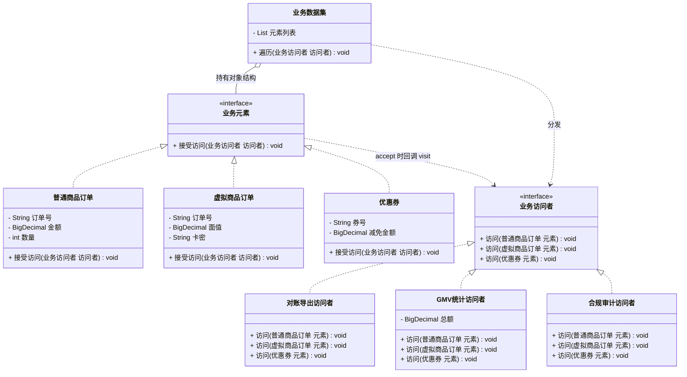
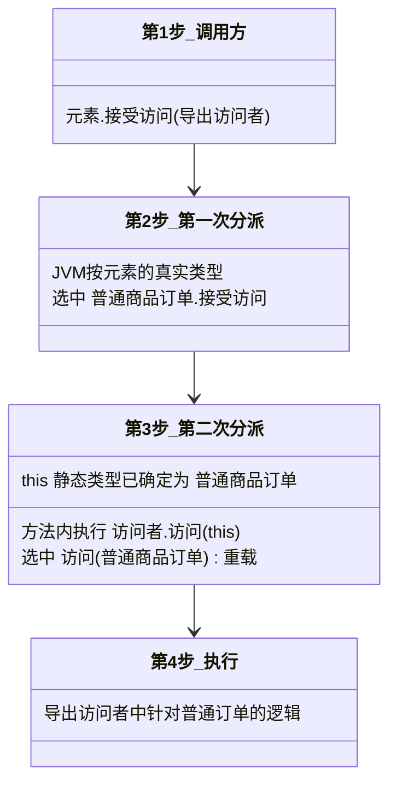

# 行为型 - 访问者(Visitor)

> 本文用「电商下单」业务主线统一重构，便于理解。来源：整理自 bugstack.cn / 菜鸟教程。

---

## 一句话定义

**访问者模式（Visitor）**：当**数据结构很稳定**（类的种类基本不变），但**作用在这些数据上的操作经常变**时，把操作抽出来放进「访问者」里，数据类只需要提供一个 `接受访问()` 的口子，就能不断长出新操作而不用改自己。

大白话：一批固定的展品（订单、商品、优惠券）摆在那儿不动，来的人不同看到的东西不同——财务来算钱、运营来看销量、审计来查合规。**展品不变，参观者随便换**。

---

## 业务痛点：没有它会怎样

电商系统里有几类稳定的业务实体：**普通商品订单**、**虚拟商品订单**（充值卡、会员）、**优惠券**。这些实体的结构几年都不会变。

但是作用在它们上面的操作**每个月都在加**：

- 财务要**导出对账文件**
- 运营要**统计 GMV 和销量**
- 风控要**做合规审计**
- 数据组要**生成 BI 报表**

没有访问者模式，通常有两种糟糕写法。

**写法一：把操作全塞进实体类**

```java
public class 普通商品订单 {
    private String 订单号;
    private BigDecimal 金额;

    public String 导出对账行() { ... }   // 财务的需求
    public void 统计GMV(统计上下文 ctx) { ... }   // 运营的需求
    public String 审计检查() { ... }     // 风控的需求
    public String 生成BI行() { ... }     // 数据的需求
    // 每来一个部门，订单类就胖一圈
}
```

结果：订单这个**核心领域对象被各种边缘操作污染**，几千行，改导出逻辑要动核心类，风险极高；而且订单类被迫依赖财务、风控、BI 各种 jar 包。

**写法二：在操作里用 `instanceof` 判类型**

```java
public class 导出服务 {
    public String 导出(Object 实体) {
        if (实体 instanceof 普通商品订单) {
            普通商品订单 o = (普通商品订单) 实体;
            return o.取订单号() + "," + o.取金额();
        } else if (实体 instanceof 虚拟商品订单) {
            ...
        } else if (实体 instanceof 优惠券) {
            ...
        }
        // 统计服务、审计服务里又是一模一样的三段 if
    }
}
```

结果：**每个操作类里都要重写一遍类型判断**，四个操作就是四份 `instanceof` 链；新增一种实体，四个地方全要改，漏一个就静默出错（走进 else 返回 null）。

访问者模式的解法：用 **双分派（Double Dispatch）** 干掉 `instanceof`——实体调 `accept(访问者)`，访问者里为每种实体准备一个重载方法 `visit(普通商品订单)`、`visit(虚拟商品订单)`。**加操作只加一个访问者类，实体类零改动。**

---

## 结构（Mermaid 类图）



**双分派过程**（这是理解访问者的关键）：



**角色职责**

| 角色 | 对应类 | 职责 |
|------|--------|------|
| Element（抽象元素） | `业务元素` | 只声明一个 `接受访问(访问者)`，把自己交出去 |
| ConcreteElement（具体元素） | `普通商品订单`、`虚拟商品订单`、`优惠券` | 实现 `接受访问()`，内部固定写 `访问者.访问(this)`——这一行完成第二次分派 |
| Visitor（抽象访问者） | `业务访问者` | 为**每一种**具体元素声明一个重载的 `访问()` 方法 |
| ConcreteVisitor（具体访问者） | `对账导出访问者`、`GMV统计访问者`、`合规审计访问者` | 一个访问者 = 一个完整的业务操作，内部可以攒状态（如累计总额） |
| ObjectStructure（对象结构） | `业务数据集` | 持有元素集合，提供遍历入口，把访问者依次分发给每个元素 |

---

## 代码实现（订单/商品上执行导出、统计、审计）

**1）抽象元素与抽象访问者**

```java
/** 抽象元素：所有能被访问的业务对象 */
public interface 业务元素 {
    /**
     * 接受访问者。实现里永远只写一行：访问者.访问(this)
     * 这一行是访问者模式的灵魂——第二次分派在此发生。
     */
    void 接受访问(业务访问者 访问者);
}

/**
 * 抽象访问者：为每种元素准备一个重载方法。
 * 新增操作 = 新增一个实现类；新增元素类型 = 这个接口要加方法（这是它的代价）。
 */
public interface 业务访问者 {
    void 访问(普通商品订单 元素);
    void 访问(虚拟商品订单 元素);
    void 访问(优惠券 元素);
}
```

**2）三个具体元素：结构稳定，只多一个 accept 方法**

```java
import java.math.BigDecimal;

/** 实物商品订单 */
public class 普通商品订单 implements 业务元素 {

    private final String 订单号;
    private final BigDecimal 金额;
    private final int 数量;
    private final String 收货地址;

    public 普通商品订单(String 订单号, BigDecimal 金额, int 数量, String 收货地址) {
        this.订单号 = 订单号;
        this.金额 = 金额;
        this.数量 = 数量;
        this.收货地址 = 收货地址;
    }

    @Override
    public void 接受访问(业务访问者 访问者) {
        访问者.访问(this);   // this 的静态类型是 普通商品订单，因此选中对应重载
    }

    public String 取订单号() { return 订单号; }
    public BigDecimal 取金额() { return 金额; }
    public int 取数量() { return 数量; }
    public String 取收货地址() { return 收货地址; }
}

/** 虚拟商品订单：充值卡、会员，无需物流 */
public class 虚拟商品订单 implements 业务元素 {

    private final String 订单号;
    private final BigDecimal 面值;
    private final String 卡密;

    public 虚拟商品订单(String 订单号, BigDecimal 面值, String 卡密) {
        this.订单号 = 订单号;
        this.面值 = 面值;
        this.卡密 = 卡密;
    }

    @Override
    public void 接受访问(业务访问者 访问者) {
        访问者.访问(this);
    }

    public String 取订单号() { return 订单号; }
    public BigDecimal 取面值() { return 面值; }
    public String 取卡密() { return 卡密; }
}

/** 优惠券 */
public class 优惠券 implements 业务元素 {

    private final String 券号;
    private final BigDecimal 减免金额;
    private final boolean 已核销;

    public 优惠券(String 券号, BigDecimal 减免金额, boolean 已核销) {
        this.券号 = 券号;
        this.减免金额 = 减免金额;
        this.已核销 = 已核销;
    }

    @Override
    public void 接受访问(业务访问者 访问者) {
        访问者.访问(this);
    }

    public String 取券号() { return 券号; }
    public BigDecimal 取减免金额() { return 减免金额; }
    public boolean 是否已核销() { return 已核销; }
}
```

**3）三个具体访问者：一个访问者 = 一个完整操作**

```java
import java.math.BigDecimal;

/** 操作一：财务对账导出（CSV 行） */
public class 对账导出访问者 implements 业务访问者 {

    private final StringBuilder 文件内容 = new StringBuilder("类型,单号,金额\n");

    @Override
    public void 访问(普通商品订单 元素) {
        文件内容.append("实物订单,").append(元素.取订单号())
                .append(",").append(元素.取金额()).append("\n");
    }

    @Override
    public void 访问(虚拟商品订单 元素) {
        文件内容.append("虚拟订单,").append(元素.取订单号())
                .append(",").append(元素.取面值()).append("\n");
    }

    @Override
    public void 访问(优惠券 元素) {
        // 优惠券在对账里记为负数（减少收入）
        文件内容.append("优惠券,").append(元素.取券号())
                .append(",-").append(元素.取减免金额()).append("\n");
    }

    public String 取结果() { return 文件内容.toString(); }
}

/** 操作二：GMV 与销量统计（访问者内部可以累计状态） */
public class GMV统计访问者 implements 业务访问者 {

    private BigDecimal 实物GMV = BigDecimal.ZERO;
    private BigDecimal 虚拟GMV = BigDecimal.ZERO;
    private BigDecimal 优惠总额 = BigDecimal.ZERO;
    private int 商品件数 = 0;

    @Override
    public void 访问(普通商品订单 元素) {
        实物GMV = 实物GMV.add(元素.取金额());
        商品件数 += 元素.取数量();
    }

    @Override
    public void 访问(虚拟商品订单 元素) {
        虚拟GMV = 虚拟GMV.add(元素.取面值());
    }

    @Override
    public void 访问(优惠券 元素) {
        if (元素.是否已核销()) {
            优惠总额 = 优惠总额.add(元素.取减免金额());
        }
    }

    public void 打印报表() {
        System.out.println("实物GMV=" + 实物GMV
                + "，虚拟GMV=" + 虚拟GMV
                + "，已核销优惠=" + 优惠总额
                + "，实物销量=" + 商品件数 + " 件"
                + "，净GMV=" + 实物GMV.add(虚拟GMV).subtract(优惠总额));
    }
}

/** 操作三：合规审计——不同实体的检查规则完全不同 */
public class 合规审计访问者 implements 业务访问者 {

    @Override
    public void 访问(普通商品订单 元素) {
        if (元素.取收货地址() == null || 元素.取收货地址().isEmpty()) {
            System.out.println("  [审计告警] 实物订单 " + 元素.取订单号() + " 缺少收货地址");
        } else {
            System.out.println("  [审计通过] 实物订单 " + 元素.取订单号());
        }
    }

    @Override
    public void 访问(虚拟商品订单 元素) {
        // 虚拟商品的审计重点是卡密不能明文
        if (元素.取卡密() != null && !元素.取卡密().contains("*")) {
            System.out.println("  [审计告警] 虚拟订单 " + 元素.取订单号() + " 卡密未脱敏！");
        } else {
            System.out.println("  [审计通过] 虚拟订单 " + 元素.取订单号());
        }
    }

    @Override
    public void 访问(优惠券 元素) {
        if (元素.取减免金额().compareTo(new BigDecimal("500")) > 0) {
            System.out.println("  [审计告警] 大额优惠券 " + 元素.取券号() + " 需人工复核");
        } else {
            System.out.println("  [审计通过] 优惠券 " + 元素.取券号());
        }
    }
}
```

**4）对象结构：持有数据，负责分发**

```java
import java.util.ArrayList;
import java.util.List;

public class 业务数据集 {

    private final List<业务元素> 元素列表 = new ArrayList<>();

    public 业务数据集 添加(业务元素 元素) {
        元素列表.add(元素);
        return this;
    }

    /** 把访问者依次交给每个元素——这里没有任何 instanceof */
    public void 遍历(业务访问者 访问者) {
        for (业务元素 元素 : 元素列表) {
            元素.接受访问(访问者);
        }
    }
}
```

**5）运行**

```java
import java.math.BigDecimal;

public class 客户端 {
    public static void main(String[] args) {
        业务数据集 数据集 = new 业务数据集()
                .添加(new 普通商品订单("ORD-001", new BigDecimal("128.00"), 2, "北京市海淀区"))
                .添加(new 普通商品订单("ORD-002", new BigDecimal("59.90"), 1, ""))       // 缺地址
                .添加(new 虚拟商品订单("ORD-003", new BigDecimal("100.00"), "8888-9999")) // 未脱敏
                .添加(new 虚拟商品订单("ORD-004", new BigDecimal("30.00"), "****-1234"))
                .添加(new 优惠券("CPN-001", new BigDecimal("20.00"), true))
                .添加(new 优惠券("CPN-002", new BigDecimal("800.00"), false));           // 大额

        System.out.println("===== 财务视角：对账导出 =====");
        对账导出访问者 导出 = new 对账导出访问者();
        数据集.遍历(导出);
        System.out.print(导出.取结果());

        System.out.println("\n===== 运营视角：GMV 统计 =====");
        GMV统计访问者 统计 = new GMV统计访问者();
        数据集.遍历(统计);
        统计.打印报表();

        System.out.println("\n===== 风控视角：合规审计 =====");
        数据集.遍历(new 合规审计访问者());
    }
}
```

输出：

```
===== 财务视角：对账导出 =====
类型,单号,金额
实物订单,ORD-001,128.00
实物订单,ORD-002,59.90
虚拟订单,ORD-003,100.00
虚拟订单,ORD-004,30.00
优惠券,CPN-001,-20.00
优惠券,CPN-002,-800.00

===== 运营视角：GMV 统计 =====
实物GMV=187.90，虚拟GMV=130.00，已核销优惠=20.00，实物销量=3 件，净GMV=297.90

===== 风控视角：合规审计 =====
  [审计通过] 实物订单 ORD-001
  [审计告警] 实物订单 ORD-002 缺少收货地址
  [审计告警] 虚拟订单 ORD-003 卡密未脱敏！
  [审计通过] 虚拟订单 ORD-004
  [审计通过] 优惠券 CPN-001
  [审计告警] 大额优惠券 CPN-002 需人工复核
```

三个完全不同的业务视角，**订单类和优惠券类一个字都没改**。数据组明天要加 BI 报表？再写一个 `BI报表访问者` 即可。

---

## 什么时候该用 / 不该用

**该用：**

- **元素类型稳定、操作频繁新增**——这是访问者唯一的甜蜜区（编译器 AST、报表引擎、导出引擎、规则校验）；
- 想把**互不相关的操作从领域对象里剥离**，保持核心模型纯净；
- 一个操作需要**跨多种元素类型累计状态**（比如上面的 GMV 统计横跨三种实体累加）；
- 要消灭散落在多个服务里的**重复 `instanceof` 判断链**。

**不该用：**

- **元素类型经常增加**——每加一种元素，`业务访问者` 接口就要加一个方法，**所有已存在的访问者实现类全部编译报错**，这是访问者最大的坑；
- 元素类型只有一两种，直接写方法更简单；
- 元素的内部状态需要**大量对外暴露** getter 才能被访问者使用，会破坏封装、违反迪米特法则；
- 团队对双分派不熟悉——这个模式的**理解成本在 GoF 23 个模式里排前三**，滥用会让新人完全看不懂调用流程。

---

## 优缺点

| 优点 | 缺点 |
|------|------|
| 新增操作只加一个访问者类，元素零改动（对操作开闭） | **新增元素类型是灾难**：访问者接口和所有实现类都要改（对元素封闭失败） |
| 相关操作聚集在一个访问者里，职责单一、便于复用 | 元素必须暴露足够的 getter，**破坏封装**，违反迪米特法则 |
| 彻底消除 `instanceof` 类型判断链 | 双分派机制绕，代码可读性差，新人上手门槛高 |
| 访问者可跨元素累计状态，天然适合统计/汇总 | 访问者依赖具体元素类，违反依赖倒置原则 |
| 元素类保持纯净，不被边缘操作污染 | 元素与访问者互相引用，形成循环依赖，类关系复杂 |

> 一句话记住取舍：**访问者用「新增元素困难」换来了「新增操作容易」。** 所以务必确认你的元素类型真的很稳定。

---

## 与相似模式的对比

| 对比项 | 访问者(Visitor) | 迭代器(Iterator) | 策略(Strategy) | 装饰器(Decorator) | 组合(Composite) |
|--------|----------------|-----------------|---------------|------------------|----------------|
| 核心意图 | 在**稳定结构**上加**易变操作** | **顺序遍历**集合，不暴露内部结构 | 一组**可互换算法** | 动态**叠加功能** | 树形结构，**部分-整体一致对待** |
| 关心元素类型吗 | **非常关心**，每种类型一个方法 | **完全不关心**，一视同仁 | 不涉及元素 | 不关心 | 不关心 |
| 遍历谁负责 | 对象结构或访问者自己 | **迭代器负责** | 无 | 无 | 常配合迭代器 |
| 加新类型的代价 | 极大（改接口+所有实现） | 极小 | 无关 | 小 | 小 |
| 典型信号 | 到处 `instanceof` + 操作在增加 | 想统一遍历方式 | `if` 在挑算法 | 想加功能又不想改类 | 树/嵌套结构 |

> **访问者 vs 迭代器**：两者经常一起出现但目标不同。迭代器解决「**怎么把元素一个个拿出来**」，它对元素类型一视同仁；访问者解决「**拿出来之后针对不同类型做不同的事**」。实际项目里常见组合：用迭代器遍历，用访问者处理——上面的 `业务数据集.遍历()` 就是简化版迭代 + 访问者分发。
>
> **访问者 vs 策略**：策略是「同一件事的不同做法」，只挑一个；访问者是「针对不同数据类型的一整套做法」，一个访问者内部包含了对所有类型的处理。
>
> **访问者 + 组合**：这是 GoF 明确推荐的搭配。对树形结构（如 AST、菜单树、组织架构）做遍历处理时，组合负责结构，访问者负责操作，`accept()` 里递归调用子节点的 `accept()` 即可。

---

## 真实框架中的应用

**1）Java 编译器 API：`javax.lang.model.element.ElementVisitor`**

注解处理器（APT）的标准玩法。Java 源码的元素类型是**极其稳定**的——就那么几种：`TypeElement`（类/接口）、`ExecutableElement`（方法）、`VariableElement`（字段/参数）、`PackageElement`（包）。而你想对它们做的事千变万化：生成代码、校验注解合规、输出文档。JDK 提供了 `SimpleElementVisitor8`、`AbstractElementVisitor8` 等骨架类，你只需覆盖关心的 `visitType()`、`visitExecutable()` 方法。Lombok、MapStruct、Dagger 全靠这套机制工作。

同一体系下还有 `TypeVisitor`（访问类型镜像）和 `AnnotationValueVisitor`（访问注解值）。

**2）ASM 字节码框架：`ClassVisitor` / `MethodVisitor` / `FieldVisitor`**

字节码的结构由 JVM 规范定死（类、字段、方法、注解），**十年不变**，完美符合访问者的适用条件。ASM 读取 class 文件时，会依次回调你的 `ClassVisitor#visit()`、`visitField()`、`visitMethod()`。CGLIB、Spring 的 `ASM ClassReader`（用于扫描 `@Component` 而无需加载类）、各类 APM 探针（SkyWalking、Arthas）都建立在这套访问者之上。

```java
// ASM 风格示意：统计一个类里有多少方法
ClassReader reader = new ClassReader("com.example.OrderService");
reader.accept(new ClassVisitor(Opcodes.ASM9) {
    @Override
    public MethodVisitor visitMethod(int access, String name, String desc,
                                     String signature, String[] exceptions) {
        System.out.println("发现方法：" + name);
        return super.visitMethod(access, name, desc, signature, exceptions);
    }
}, 0);
```

注意 `reader.accept(visitor)` 这个方法名——和我们的 `接受访问()` 完全一致。

**3）`java.nio.file.FileVisitor` + `Files.walkFileTree()`**

遍历目录树时，`FileVisitor` 为四种情况提供回调：`preVisitDirectory`（进入目录前）、`visitFile`（访问文件）、`visitFileFailed`（访问失败）、`postVisitDirectory`（离开目录后）。文件系统的元素类型（目录、文件）绝对稳定，而你要做的事（统计大小、批量改名、查找、删除）千变万化。`SimpleFileVisitor` 是官方提供的适配器基类。

**4）Spring 的 `BeanDefinitionVisitor`**

`PropertyPlaceholderConfigurer` 处理 `${}` 占位符时，用 `BeanDefinitionVisitor` 遍历每个 `BeanDefinition` 的属性值、构造参数、Map/List/Set 等各种结构，对不同类型的值节点做不同的字符串替换——元素类型（各种 `TypedStringValue`、`BeanReference`、集合类型）稳定，操作（占位符替换）可扩展。

**5）Antlr / Calcite 等 SQL 与语法解析**

Antlr 生成的语法树访问器 `XxxBaseVisitor<T>` 为每个语法规则生成一个 `visitXxx()` 方法。Apache Calcite 的 `SqlVisitor`、`RexVisitor` 用于遍历 SQL 抽象语法树做优化和改写。所有编译器、SQL 引擎的 AST 处理，几乎都用访问者——因为**语法节点类型由语法定义死了，而对 AST 的操作（类型检查、优化、翻译、格式化）源源不断**。

**6）Jackson 的 `JsonNodeVisitor`、Elasticsearch 的查询树遍历** 也是同类应用。

---

## 小结

访问者模式是 GoF 里最"偏科"的一个：它在「元素类型稳定 + 操作频繁扩展」这个特定象限里效果拔群（编译器、字节码、AST、报表），离开这个象限则得不偿失。用它之前先自问一句：**我的元素类型未来一年会新增吗？** 如果会，请慎重；如果不会，它能让你的领域模型保持干净，同时让新操作的加入变得毫不费力。

---

> 参考来源：整理自 https://bugstack.cn 「重学 Java 设计模式：实战访问者模式」与 https://www.runoob.com/design-pattern/visitor-pattern.html ，本文重写示例与讲解。
