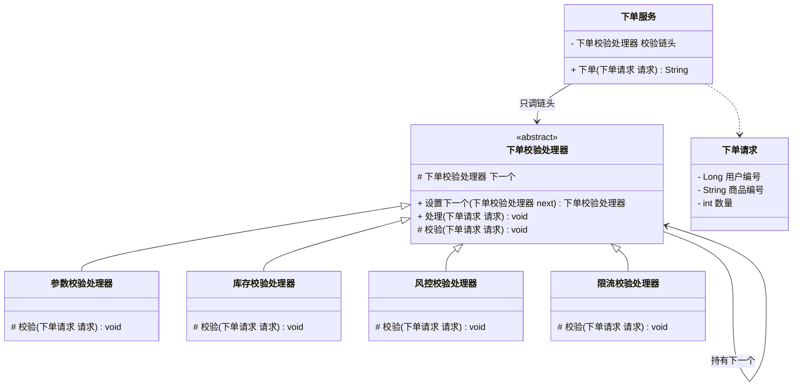
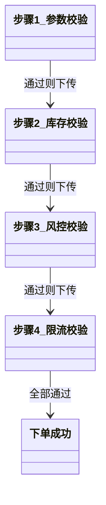

# 行为型 - 责任链(Chain of Responsibility)

> 本文用「电商下单」业务主线统一重构，便于理解。来源：整理自 pdai.tech / bugstack.cn。

---

## 一句话定义

**责任链模式（Chain of Responsibility）**：把多个处理器串成一条链，请求沿着链子一个一个往下传，**谁能处理谁处理，处理不了就交给下一个**，发送请求的人完全不知道最终是谁干的活。

大白话：就像公司报销单，你交给组长，组长权限不够递给经理，经理不够递给总监——你只管交给第一个人，不用操心到底谁批的。

---

## 业务痛点：没有它会怎样

电商下单前要做一串「关卡校验」，顺序是固定的：

1. **参数校验**：收货地址、SKU、数量填了没
2. **库存校验**：这个 SKU 还有货吗
3. **风控校验**：这个用户是不是黑名单、是不是刷单号
4. **限流校验**：这个活动是不是被抢爆了

没有责任链，代码通常长这样：

```java
public String createOrder(OrderRequest req) {
    // 一坨 if 从上到下，越写越长
    if (req.getSkuId() == null || req.getCount() <= 0) {
        return "参数不合法";
    }
    if (inventoryService.query(req.getSkuId()) < req.getCount()) {
        return "库存不足";
    }
    if (riskService.isBlack(req.getUserId())) {
        return "风控拦截";
    }
    if (!rateLimiter.tryAcquire(req.getActivityId())) {
        return "活动太火爆，请稍后再试";
    }
    // ... 真正的下单逻辑埋在 50 行 if 后面
}
```

痛点非常具体：

- **一个方法承担了所有校验职责**，动辄两三百行，改一处得通读全文；
- 新增一条「实名认证校验」，就得**改这个方法**，违反开闭原则；
- 不同渠道要求不同：普通下单要 4 道关，秒杀下单只要 2 道关，**没法灵活组装**，只能再 copy 一份加 `if (isSeckill)`；
- 校验顺序被硬编码，想把风控提到库存前面，得手工挪代码块，容易挪错。

责任链就是把每道关卡**独立成一个类**，再按需要串成链子。想加关卡就加一个类，想换顺序就换组装代码，主流程一行都不用动。

---

## 结构（Mermaid 类图）



链条运行时的传递方向（时序示意）：



**角色职责**

| 角色 | 对应类 | 职责 |
|------|--------|------|
| Handler（抽象处理器） | `下单校验处理器` | 定义处理接口，持有 `下一个` 引用，封装「自己处理完就往下传」的模板逻辑 |
| ConcreteHandler（具体处理器） | `参数校验处理器`、`库存校验处理器`、`风控校验处理器`、`限流校验处理器` | 各自只关心一件事，通过就放行，不通过就抛异常中断 |
| Request（请求对象） | `下单请求` | 沿链传递的数据载体，携带各处理器需要的字段 |
| Client（调用方） | `下单服务` | 负责把链条组装好，只调用链头，不关心链上有几个节点 |

---

## 代码实现（电商下单校验链）

**1）请求对象与业务异常**

```java
/** 沿着责任链传递的下单请求 */
public class 下单请求 {
    private Long 用户编号;
    private String 商品编号;
    private int 数量;
    private String 收货地址;
    private String 活动编号;

    public 下单请求(Long 用户编号, String 商品编号, int 数量, String 收货地址, String 活动编号) {
        this.用户编号 = 用户编号;
        this.商品编号 = 商品编号;
        this.数量 = 数量;
        this.收货地址 = 收货地址;
        this.活动编号 = 活动编号;
    }

    public Long 取用户编号() { return 用户编号; }
    public String 取商品编号() { return 商品编号; }
    public int 取数量() { return 数量; }
    public String 取收货地址() { return 收货地址; }
    public String 取活动编号() { return 活动编号; }
}

/** 校验不通过时抛出，直接中断整条链 */
public class 校验异常 extends RuntimeException {
    public 校验异常(String 原因) {
        super(原因);
    }
}
```

**2）抽象处理器：链式传递的骨架**

```java
public abstract class 下单校验处理器 {

    /** 下一个处理器；为 null 表示自己是链尾 */
    protected 下单校验处理器 下一个;

    /** 组装链条用，返回 next 方便写成流式调用 */
    public 下单校验处理器 设置下一个(下单校验处理器 next) {
        this.下一个 = next;
        return next;
    }

    /**
     * 模板逻辑：先做自己那道校验，通过后自动往下传。
     * 子类只需要实现「校验」，不用重复写传递代码。
     */
    public final void 处理(下单请求 请求) {
        校验(请求);                 // 不通过会抛 校验异常，链条自然中断
        if (下一个 != null) {
            下一个.处理(请求);       // 通过则交给下一棒
        }
    }

    /** 每个具体处理器只关心自己这一道关 */
    protected abstract void 校验(下单请求 请求);
}
```

**3）四个具体处理器：各扫门前雪**

```java
/** 第一关：参数是否合法 */
public class 参数校验处理器 extends 下单校验处理器 {
    @Override
    protected void 校验(下单请求 请求) {
        System.out.println("[参数校验] 开始");
        if (请求.取商品编号() == null || 请求.取商品编号().isEmpty()) {
            throw new 校验异常("商品编号不能为空");
        }
        if (请求.取数量() <= 0) {
            throw new 校验异常("购买数量必须大于 0");
        }
        if (请求.取收货地址() == null) {
            throw new 校验异常("收货地址不能为空");
        }
        System.out.println("[参数校验] 通过");
    }
}

/** 第二关：库存够不够 */
public class 库存校验处理器 extends 下单校验处理器 {
    @Override
    protected void 校验(下单请求 请求) {
        System.out.println("[库存校验] 开始");
        int 剩余库存 = 查询库存(请求.取商品编号());
        if (剩余库存 < 请求.取数量()) {
            throw new 校验异常("库存不足，仅剩 " + 剩余库存 + " 件");
        }
        System.out.println("[库存校验] 通过，剩余 " + 剩余库存);
    }

    private int 查询库存(String 商品编号) {
        return 100; // 真实场景走库存服务 / Redis
    }
}

/** 第三关：风控黑名单 */
public class 风控校验处理器 extends 下单校验处理器 {
    @Override
    protected void 校验(下单请求 请求) {
        System.out.println("[风控校验] 开始");
        if (是黑名单用户(请求.取用户编号())) {
            throw new 校验异常("命中风控黑名单，下单失败");
        }
        System.out.println("[风控校验] 通过");
    }

    private boolean 是黑名单用户(Long 用户编号) {
        return 用户编号 != null && 用户编号 == 666L; // 演示：666 是坏人
    }
}

/** 第四关：活动限流 */
public class 限流校验处理器 extends 下单校验处理器 {
    @Override
    protected void 校验(下单请求 请求) {
        System.out.println("[限流校验] 开始");
        if (请求.取活动编号() != null && !尝试获取令牌(请求.取活动编号())) {
            throw new 校验异常("活动太火爆，请稍后再试");
        }
        System.out.println("[限流校验] 通过");
    }

    private boolean 尝试获取令牌(String 活动编号) {
        return true; // 真实场景接 Sentinel / Guava RateLimiter
    }
}
```

**4）调用方：组装链条并只调链头**

```java
public class 下单服务 {

    private final 下单校验处理器 校验链头;

    public 下单服务(下单校验处理器 校验链头) {
        this.校验链头 = 校验链头;
    }

    public String 下单(下单请求 请求) {
        校验链头.处理(请求);   // 一行搞定所有校验
        String 订单号 = "ORD" + System.currentTimeMillis();
        System.out.println("下单成功，订单号=" + 订单号);
        return 订单号;
    }

    /** 普通下单：走完整 4 道关 */
    public static 下单校验处理器 构建标准校验链() {
        下单校验处理器 头 = new 参数校验处理器();
        头.设置下一个(new 库存校验处理器())
          .设置下一个(new 风控校验处理器())
          .设置下一个(new 限流校验处理器());
        return 头;
    }

    /** 秒杀下单：为了性能只保留参数 + 限流两道关，主流程零改动 */
    public static 下单校验处理器 构建秒杀校验链() {
        下单校验处理器 头 = new 参数校验处理器();
        头.设置下一个(new 限流校验处理器());
        return 头;
    }
}
```

**5）运行**

```java
public class 客户端 {
    public static void main(String[] args) {
        下单服务 服务 = new 下单服务(下单服务.构建标准校验链());

        System.out.println("=== 正常用户下单 ===");
        服务.下单(new 下单请求(1001L, "SKU-9527", 2, "北京市海淀区", "ACT-618"));

        System.out.println();
        System.out.println("=== 黑名单用户下单 ===");
        try {
            服务.下单(new 下单请求(666L, "SKU-9527", 2, "北京市海淀区", "ACT-618"));
        } catch (校验异常 e) {
            System.out.println("下单被拦截：" + e.getMessage());
        }
    }
}
```

输出：

```
=== 正常用户下单 ===
[参数校验] 开始
[参数校验] 通过
[库存校验] 开始
[库存校验] 通过，剩余 100
[风控校验] 开始
[风控校验] 通过
[限流校验] 开始
[限流校验] 通过
下单成功，订单号=ORD1717000000000

=== 黑名单用户下单 ===
[参数校验] 开始
[参数校验] 通过
[库存校验] 开始
[库存校验] 通过，剩余 100
[风控校验] 开始
下单被拦截：命中风控黑名单，下单失败
```

注意黑名单那次，链条在风控这一棒就断了，后面的限流根本没执行——这正是责任链「短路」的价值。

---

## 什么时候该用 / 不该用

**该用：**

- 一个请求要经过**多道处理/过滤**，且步骤数量、顺序会随业务变化（校验链、审批链、过滤器链）；
- 需要**动态组装**流程：不同渠道、不同活动走不同的关卡组合；
- 想让**发送者和处理者解耦**：调用方不需要知道到底有几个处理器、谁最终处理了。

**不该用：**

- 只有两三个固定判断且永远不会变——直接写 `if` 更直白，别为了模式而模式；
- 链条很长又必须**每次都走完全部节点**，会有明显的调用栈开销和调试困难；
- 请求**必须被处理**、不允许「走到链尾没人管」的场景，需要额外补一个兜底处理器，否则会静默失败。

---

## 优缺点

| 优点 | 缺点 |
|------|------|
| 每个处理器只干一件事，符合单一职责 | 链条过长时性能有损耗，且不易调试（栈很深） |
| 新增处理器只加类不改主流程，符合开闭原则 | 请求可能走到链尾都没被处理，需要兜底逻辑 |
| 链条顺序、成员可运行时动态组装，灵活度高 | 链条组装代码本身容易出错（漏接、接错顺序、成环） |
| 发送者与接收者彻底解耦 | 排查问题时要跟着链走，不如一坨 if 一眼看全 |

---

## 与相似模式的对比

| 对比项 | 责任链(Chain) | 装饰器(Decorator) | 策略(Strategy) | 命令(Command) |
|--------|--------------|------------------|---------------|--------------|
| 核心意图 | 请求沿链传递，**找到能处理的那个就停** | 层层包装，**给对象叠加新功能** | 一组可互换算法，**选一个用** | 把请求**封装成对象**，可排队/撤销 |
| 是否都执行 | 可以中途短路，不保证全走完 | 每层都必须执行（都要调 `super`/内层） | 只执行选中的那一个 | 每个命令独立执行 |
| 链上节点关系 | 平级、可断开 | 嵌套包裹，一定回到内层 | 无链，平铺可选 | 无链，可入队成列表 |
| 关注点 | **谁来处理** | **增强什么** | **怎么算** | **做什么动作** |

> 最容易混的是**责任链 vs 装饰器**：结构都是「一个套一个」，但装饰器**每层都会执行并把结果往内传**（关注功能叠加），责任链**任何一棒都可能拦下来不往后传**（关注归属判定）。Servlet 的 `Filter` 之所以叫过滤器链，就是因为它兼具两者的味道：既能加工请求，也能直接 `return` 中断。

> 另一组容易和策略搞混的是**责任链 vs 策略**：两者都"手里握着多个可选对象"，但意图完全不同。**策略**是一组**平等的算法，由调用方挑一个来执行**（关注"怎么算"，各策略互不相识、没有先后）；**责任链**是把请求沿着一条**有先后次序的链**往下传，直到某个处理器接手（关注"谁来处理"，处理器之间有明确前后依赖，可能多个参与、也可能走到链尾都没人管）。一句话总结：**策略是"选一个"，责任链是"传一圈"。**

---

## 真实框架中的应用

**1）Servlet `Filter` / `FilterChain`——最经典的责任链**

`javax.servlet.Filter#doFilter(request, response, chain)` 的第三个参数就是链本身。每个 Filter 处理完自己的逻辑后，**必须显式调用 `chain.doFilter(req, resp)`** 才会往下传；如果不调用（比如登录校验失败直接 `resp.sendRedirect`），链条立刻中断，后面的 Filter 和 Servlet 都不会执行。这和上面的 `参数校验处理器` 抛异常中断是同一个思路，只不过 Servlet 把「是否下传」的决定权交给了开发者。

**2）Spring MVC `HandlerInterceptor` + `HandlerExecutionChain`**

`HandlerExecutionChain` 内部持有一个 `interceptorList`。请求进来时按顺序执行所有拦截器的 `preHandle()`，只要有一个返回 `false`，`DispatcherServlet` 就会调用 `triggerAfterCompletion()` 倒序回滚已执行的拦截器，然后直接返回——同样是「短路 + 链式传递」。区别是它比 Filter 多了 `postHandle`/`afterCompletion` 的**双向回溯**能力。

**3）Spring Security 的 `FilterChainProxy`**

Spring Security 本质上就是一条超长的责任链：`SecurityContextPersistenceFilter` → `UsernamePasswordAuthenticationFilter` → `ExceptionTranslationFilter` → `FilterSecurityInterceptor` ……十几个 Filter 依次处理认证、鉴权、异常转换。想加自定义认证方式，只需要写一个 Filter 并用 `addFilterBefore()` 插到链上的合适位置，完全不用改动框架已有代码——这就是责任链带来的开闭优势。

**4）MyBatis 的 `InterceptorChain`**

MyBatis 插件机制中，`InterceptorChain#pluginAll(Object target)` 会把 `Executor`、`StatementHandler` 等四大对象依次交给所有已注册的 `Interceptor` 包一层代理。分页插件 PageHelper 就是往这条链上挂一个拦截器，改写 SQL 后再放行。

**5）Netty 的 `ChannelPipeline`**

Netty 把入站/出站的 `ChannelHandler` 串成双向链表，数据从网卡进来后依次经过解码器、业务处理器、编码器。`ctx.fireChannelRead(msg)` 就是「传给下一棒」，不调用就等于把消息吃掉了——教科书级的责任链实现。

**6）Apache Commons Chain**

一个专门把责任链做成通用框架的库，`Command#execute(Context)` 返回 `true` 表示「我处理完了，链条结束」，返回 `false` 表示「继续往下」。适合把流程编排配置化。

---

## 小结

责任链的精髓是**把「一长串 if」拆成「一串对象」**：每个对象只负责一道关卡，链条的组装权交给调用方。当你发现某个方法里的校验/过滤逻辑越堆越长、每次加需求都要在中间插一段 `if`，就该考虑把它拉成一条链了。

---

> 参考来源：整理自 https://pdai.tech/md/dev-spec/pattern/15_chain.html 与 https://bugstack.cn 「重学 Java 设计模式：实战责任链模式」，本文重写示例与讲解。
