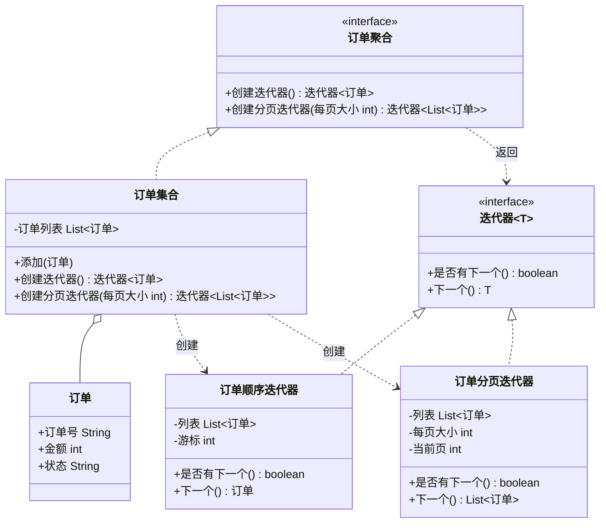

# 行为型 - 迭代器(Iterator)

> 本文用「电商下单」业务主线统一重构，便于理解。来源：整理自 pdai.tech。

## 一句话定义

迭代器模式：提供一种方法，让你**顺序访问一个聚合对象里的每个元素，却不用暴露这个聚合对象内部的存储结构**（是数组、链表还是数据库分页，调用方一概不关心）。

## 业务痛点：没有它会怎样

假设订单系统里有一个 `订单集合`，底层可能是 `ArrayList`，也可能是从数据库按页捞出来的。如果调用方要遍历所有订单做统计，最常见的写法是直接扒开集合内部：

```java
for (int i = 0; i < 订单集合.size(); i++) {
    订单 o = 订单集合.get(i); // 调用方被迫依赖"数组下标"这种内部细节
}
```

这种写法有三个坑：

- **调用方被内部实现绑死**：今天底层是 `ArrayList` 用下标遍历，明天改成 `LinkedList` 或"按页从数据库拉"，遍历代码就得跟着改，牵一发动全身。
- **多种遍历方式没法共存**：有时要「一条条顺序处理」，有时要「每 100 单分一页批量推送」，有时要「倒序回放」。把这些逻辑散在业务代码里，到处重复。
- **职责混乱**：遍历这件事本该属于"集合自己最清楚怎么走"，却让外部业务代码去操心下标、游标、边界判断，容易越界或漏元素。

迭代器模式把"怎么走"这件事从业务代码里抽出来，交给集合自己提供一个 `迭代器` 对象。业务方只管问"还有没有下一个""给我下一个"，完全不碰集合的内部结构。换存储结构、加新的遍历方式，都只改集合这一侧，**调用方一行不用动**。

## 结构



| 角色 | 对应类 | 职责 |
| --- | --- | --- |
| 迭代器接口 | `迭代器<T>` | 定义 `是否有下一个()`、`下一个()`，统一遍历契约 |
| 聚合接口 | `订单聚合` | 定义 `创建迭代器()`、`创建分页迭代器()`，对外提供"给我一个遍历器" |
| 具体聚合 | `订单集合` | 持有订单数据，负责生产对应的具体迭代器 |
| 具体迭代器 | `订单顺序迭代器`、`订单分页迭代器` | 实现遍历逻辑（顺序走 / 按页走），封装游标与边界 |
| 元素 | `订单` | 被遍历的对象 |

## 代码实现

下面用「订单集合」演示：既能一条条顺序遍历，也能按页（每页 10 单）批量遍历，调用方都不碰内部 `List`。

```java
import java.util.*;

// 元素：订单
class 订单 {
    String 订单号;
    int 金额;
    String 状态;

    订单(String 订单号, int 金额, String 状态) {
        this.订单号 = 订单号;
        this.金额 = 金额;
        this.状态 = 状态;
    }

    @Override
    public String toString() {
        return 订单号 + "(¥" + 金额 + "," + 状态 + ")";
    }
}

// 迭代器接口（泛型）
interface 迭代器<T> {
    boolean 是否有下一个();
    T 下一个();
}

// 聚合接口
interface 订单聚合 {
    迭代器<订单> 创建迭代器();
    迭代器<List<订单>> 创建分页迭代器(int 每页大小);
}

// 具体聚合：订单集合
class 订单集合 implements 订单聚合 {
    private final List<订单> 订单列表 = new ArrayList<>();

    void 添加(订单 o) { 订单列表.add(o); }
    int 大小() { return 订单列表.size(); }

    @Override
    public 迭代器<订单> 创建迭代器() {
        return new 订单顺序迭代器(订单列表);
    }

    @Override
    public 迭代器<List<订单>> 创建分页迭代器(int 每页大小) {
        return new 订单分页迭代器(订单列表, 每页大小);
    }
}

// 具体迭代器：一条条顺序遍历
class 订单顺序迭代器 implements 迭代器<订单> {
    private final List<订单> 列表;
    private int 游标 = 0;

    订单顺序迭代器(List<订单> 列表) { this.列表 = 列表; }

    @Override
    public boolean 是否有下一个() { return 游标 < 列表.size(); }

    @Override
    public 订单 下一个() { return 列表.get(游标++); }
}

// 具体迭代器：按页遍历（每页 N 单）
class 订单分页迭代器 implements 迭代器<List<订单>> {
    private final List<订单> 列表;
    private final int 每页大小;
    private int 当前页 = 0;

    订单分页迭代器(List<订单> 列表, int 每页大小) {
        this.列表 = 列表;
        this.每页大小 = 每页大小;
    }

    @Override
    public boolean 是否有下一个() {
        return 当前页 * 每页大小 < 列表.size();
    }

    @Override
    public List<订单> 下一个() {
        int 起点 = 当前页 * 每页大小;
        int 终点 = Math.min(起点 + 每页大小, 列表.size());
        List<订单> 页 = new ArrayList<>(列表.subList(起点, 终点));
        当前页++;
        return 页;
    }
}

// 演示
public class 迭代器演示 {
    public static void main(String[] args) {
        订单集合 集合 = new 订单集合();
        for (int i = 1; i <= 25; i++) {
            集合.添加(new 订单("NO" + i, i * 10, i % 2 == 0 ? "已支付" : "待支付"));
        }

        System.out.println("=== 顺序遍历（逐单打印）===");
        迭代器<订单> it = 集合.创建迭代器();
        while (it.是否有下一个()) {
            System.out.println(it.下一个());
        }

        System.out.println("\n=== 分页遍历（每页 10 单，批量推送）===");
        迭代器<List<订单>> 页迭代器 = 集合.创建分页迭代器(10);
        int 页号 = 1;
        while (页迭代器.是否有下一个()) {
            List<订单> 页 = 页迭代器.下一个();
            System.out.println("第" + (页号++) + "页，共" + 页.size() + "单：" + 页);
        }
    }
}
```

运行输出（节选）：

```
=== 顺序遍历（逐单打印）===
NO1(¥10,待支付)
NO2(¥20,已支付)
...
NO25(¥250,待支付)

=== 分页遍历（每页 10 单，批量推送）===
第1页，共10单：[NO1(¥10,待支付), ... NO10(¥100,已支付)]
第2页，共10单：[NO11(¥110,待支付), ... NO20(¥200,已支付)]
第3页，共5单：[NO21(¥210,待支付), ... NO25(¥250,待支付)]
```

你看，业务方遍历时完全不知道 `订单集合` 内部是 `ArrayList` 还是别的容器；想换成"并行分批给多个 worker 处理"，只需再加一个 `创建并行迭代器()` 返回把列表按段切分的迭代器，调用方代码一字不改。

## 什么时候该用 / 不该用

**该用：**

- 需要统一、隐藏地遍历一个聚合对象，又不暴露它的内部表示。
- 同一个聚合要支持多种遍历方式（顺序、逆序、分页、跳着取）且希望彼此独立。
- 希望遍历逻辑与集合数据结构解耦，便于单独变化和测试。

**不该用：**

- 遍历极其简单、只在一处用一次，直接 `for` 循环更直观，没必要单独抽迭代器。
- 数据集极其巨大且需流式处理：手写迭代器不如直接用 Stream / 数据库游标。
- 语言已内建（Java 的 `for-each`、Stream API）：优先用内建，必要时才自定义。

## 优缺点

| 维度 | 说明 |
| --- | --- |
| 优点 | 1. 解耦：调用方不依赖集合内部存储结构；2. 多种遍历方式可并存、互不影响；3. 符合单一职责与开闭原则，加新遍历方式只加新迭代器类 |
| 缺点 | 1. 简单集合引入迭代器会增加类与对象数量；2. 某些语言已原生支持遍历，自定义显得多余；3. 与集合强耦合时，迭代过程中结构变更易出并发修改问题 |

## 与相似模式的对比

| 易混淆模式 | 关键区别 |
| --- | --- |
| 迭代器 vs 访问者(Visitor) | 迭代器负责"把元素一个个取出来"；访问者负责"对每个取出来的元素做什么操作（统计/导出）"。常配合：迭代器遍历，访问者处理 |
| 迭代器 vs 组合(Composite) | 组合用于表达"整体-部分"树结构；迭代器用于遍历。组合结构常提供迭代器来遍历整棵树 |
| 迭代器 vs 工厂方法(Factory) | 聚合接口里的 `创建迭代器()` 本质是工厂方法：把"造哪种迭代器"的决定交给具体聚合 |

## 真实框架中的应用

- **`java.util.Iterator` / `Iterable`**：Java 集合框架的核心。任何实现 `Iterable` 的类都能用 `for-each` 遍历，`ArrayList`、`HashSet`、`LinkedList` 各自提供不同迭代器实现，调用方完全无感内部是数组还是哈希桶。
- **`java.util.Enumeration`**：早期的迭代器（如 `Vector.elements()`），后来被 `Iterator` 取代，但思想一致。
- **`java.util.ListIterator`**：`Iterator` 的增强版，支持双向遍历、索引访问、安全删除，是"同一聚合多种迭代器"的典型。
- **`java.util.Spliterator`**：Java 8 引入，专为**并行遍历**设计（配合 Stream 的 `parallel()`），把大集合切成多段交给多线程处理——正是"并行迭代"思路的内建实现。
- **数据库游标 / MyBatis `ResultHandler`**：处理超大结果集时按批 fetch，本质也是迭代器式的"逐页/逐批取"，避免一次性把百万数据装进内存。
- **Spring `Resource` 遍历、Hadoop `InputSplit`**：对文件、分片数据的顺序/分块遍历，都用迭代器思想隔离"数据从哪来、怎么走"。

## 小结

迭代器模式把"怎么遍历"从业务代码里抽走，交给集合自己提供遍历器，调用方只问"下一个是谁"。它解耦了集合内部结构、支持多种遍历方式并存；在 Java 里早已内建为 `Iterator`/`Iterable`，理解它才能真正用好 `for-each`、Stream 与大数据分批处理。

> 参考来源：整理自 pdai.tech（https://www.pdai.tech/md/dev-spec/pattern/23_iterator.html），本文重写示例与讲解（订单集合分页/顺序迭代场景）。
