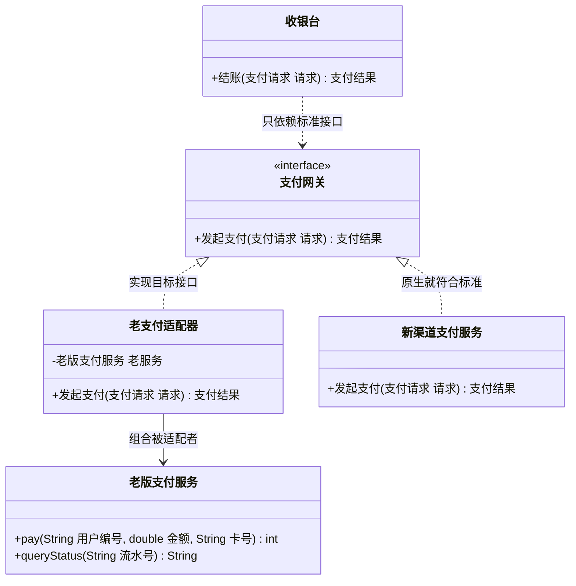

# 结构型 - 适配器(Adapter)（转换器模式、包装器模式 Wrapper）

> 本文用「电商下单」这条业务主线统一重构：一句话定义 → 业务痛点 → 结构（Mermaid 类图）→ 可运行代码 → 何时用/不用 → 优缺点 → 与相似模式对比 → 真实框架中的应用，便于理解。
> 来源：整理自 https://pdai.tech ，本文重写示例与讲解。

---

## 一句话定义

**适配器模式（Adapter）**：在两个**接口对不上**的类之间加一层"转换插头"，把已有类的接口，翻译成调用方期望的接口，让原本无法一起工作的两个东西合作无间。

一句大白话：**你的插头是两脚的，插座是三孔的，不改插头也不改插座，中间加个转接头就行。**

> 别名提醒：适配器模式又叫**转换器模式**、**包装器模式（Wrapper）**。注意"Wrapper"这个词装饰器模式也在用，两者不是一回事，后面对比章节会讲清楚。

---

## 业务痛点：没有它会怎样

电商系统里最典型的场景就是**支付**。

假设你们平台跑了五年，收银台一直调的是一个老掉牙的支付服务 `老版支付服务`，它的接口长这样：

```java
// 遗留系统：接口风格老旧，参数是散的，返回值是魔法数字
public class 老版支付服务 {
    public int pay(String 用户编号, double 金额, String 银行卡号) { /* ... */ return 1; }
    public String queryStatus(String 流水号) { /* ... */ return "SUCCESS"; }
}
```

现在公司要接入一个**新支付网关**，新网关定义了统一的行业标准接口：入参是一个 `支付请求` 对象，出参是一个 `支付结果` 对象，还带错误码和错误描述。

于是你面前有三条路：

1. **改老支付服务**——它被 30 多个老模块引用，一改全站回归测试，风险爆炸，而且很可能它还是别的团队维护的 jar 包，你**根本改不了**。
2. **改收银台**——在收银台里写一堆 `if (是老渠道) { 用老参数调 } else { 用新参数调 }`，条件分支会像癌细胞一样扩散，每接一个新渠道就多一坨。
3. **加一层适配器**——写一个类，对外长成新网关要求的样子，对内偷偷调老服务，顺手把参数和返回值翻译一下。

第 3 条就是适配器模式。它的价值在于：**在你无权修改、或不敢修改的旧代码之外，做一层无侵入的接口翻译。**

---

## 结构（Mermaid 类图）



**角色职责**

| 角色 | 类图中对应 | 职责 |
|------|-----------|------|
| Target（目标接口） | `支付网关` | 调用方**期望**看到的接口，是标准，不可妥协 |
| Adaptee（被适配者） | `老版支付服务` | 已经存在、功能可用、但接口对不上的老代码，**不修改它** |
| Adapter（适配器） | `老支付适配器` | 实现目标接口，内部持有被适配者，负责**参数翻译 + 返回值翻译** |
| Client（调用方） | `收银台` | 只面向 `支付网关` 编程，完全不知道背后是老服务还是新服务 |

**两种实现方式的区别**

| 方式 | 实现手段 | 优点 | 缺点 |
|------|---------|------|------|
| **对象适配器**（推荐） | 适配器**组合**一个被适配者实例 | 符合合成复用原则；一个适配器可适配多个子类 | 需要多写一个成员变量与转发代码 |
| **类适配器** | 适配器**继承**被适配者 + 实现目标接口 | 代码略少，可覆写被适配者方法 | Java 单继承，被适配者只能有一个；耦合更死 |

> Java 没有多重继承，所以业界几乎清一色使用**对象适配器**，下面的代码也用这种。

---

## 代码实现（电商支付渠道适配）

**第一步：定义调用方期望的标准接口（Target）**

```java
/** 支付请求：新网关的标准入参 */
public class 支付请求 {
    private String 订单号;
    private String 用户编号;
    private java.math.BigDecimal 金额;
    private String 支付账号;

    public 支付请求(String 订单号, String 用户编号, java.math.BigDecimal 金额, String 支付账号) {
        this.订单号 = 订单号;
        this.用户编号 = 用户编号;
        this.金额 = 金额;
        this.支付账号 = 支付账号;
    }
    public String 取订单号() { return 订单号; }
    public String 取用户编号() { return 用户编号; }
    public java.math.BigDecimal 取金额() { return 金额; }
    public String 取支付账号() { return 支付账号; }
}

/** 支付结果：新网关的标准出参 */
public class 支付结果 {
    private boolean 成功;
    private String 错误码;
    private String 错误描述;

    public 支付结果(boolean 成功, String 错误码, String 错误描述) {
        this.成功 = 成功;
        this.错误码 = 错误码;
        this.错误描述 = 错误描述;
    }
    public boolean 是否成功() { return 成功; }
    @Override public String toString() {
        return "支付结果{成功=" + 成功 + ", 错误码=" + 错误码 + ", 描述=" + 错误描述 + "}";
    }
}

/** Target：调用方期望的统一支付网关接口 */
public interface 支付网关 {
    支付结果 发起支付(支付请求 请求);
}
```

**第二步：被适配者——不能改的老支付服务（Adaptee）**

```java
/**
 * 遗留系统：参数散、返回魔法数字、命名是拼音/英文混搭。
 * 假设它来自一个外部 jar 包，我们无权修改。
 */
public class 老版支付服务 {

    /** @return 1=成功, 0=余额不足, -1=系统异常 */
    public int pay(String userNo, double money, String cardNo) {
        System.out.println("[老支付] 用户=" + userNo + " 卡号=" + cardNo + " 扣款=" + money);
        if (money > 10000) {
            return 0; // 老系统单笔限额 1 万
        }
        return 1;
    }
}
```

**第三步：适配器——核心翻译层（Adapter）**

```java
/**
 * 对象适配器：对外长成 支付网关 的样子，对内调用 老版支付服务。
 * 它只干两件事：把入参翻译过去，把出参翻译回来。
 */
public class 老支付适配器 implements 支付网关 {

    private final 老版支付服务 老服务;

    public 老支付适配器(老版支付服务 老服务) {
        this.老服务 = 老服务;
    }

    @Override
    public 支付结果 发起支付(支付请求 请求) {
        // ① 入参翻译：BigDecimal -> double，对象拆成散参数
        double 金额 = 请求.取金额().doubleValue();
        int 返回码 = 老服务.pay(请求.取用户编号(), 金额, 请求.取支付账号());

        // ② 出参翻译：魔法数字 -> 标准结果对象
        switch (返回码) {
            case 1:
                return new 支付结果(true, "0000", "支付成功");
            case 0:
                return new 支付结果(false, "1001", "余额不足或超出单笔限额");
            default:
                return new 支付结果(false, "9999", "支付系统异常");
        }
    }
}
```

**第四步：新渠道原生实现（不需要适配）**

```java
/** 新渠道天然符合标准接口，直接实现即可 */
public class 新渠道支付服务 implements 支付网关 {
    @Override
    public 支付结果 发起支付(支付请求 请求) {
        System.out.println("[新网关] 订单=" + 请求.取订单号() + " 金额=" + 请求.取金额());
        return new 支付结果(true, "0000", "支付成功");
    }
}
```

**第五步：调用方——只认标准接口**

```java
public class 收银台 {

    private final 支付网关 网关;

    public 收银台(支付网关 网关) {
        this.网关 = 网关;   // 面向接口，注入谁都行
    }

    public void 结账(支付请求 请求) {
        支付结果 结果 = 网关.发起支付(请求);
        System.out.println("结账完成 -> " + 结果);
    }

    public static void main(String[] args) {
        支付请求 请求 = new 支付请求("ORD20260809001", "U10086",
                new java.math.BigDecimal("288.00"), "6222***8888");

        // 走老支付：靠适配器套一层
        new 收银台(new 老支付适配器(new 老版支付服务())).结账(请求);

        // 走新网关：原生支持
        new 收银台(new 新渠道支付服务()).结账(请求);
    }
}
```

运行输出：

```java
// [老支付] 用户=U10086 卡号=6222***8888 扣款=288.0
// 结账完成 -> 支付结果{成功=true, 错误码=0000, 描述=支付成功}
// [新网关] 订单=ORD20260809001 金额=288.00
// 结账完成 -> 支付结果{成功=true, 错误码=0000, 描述=支付成功}
```

**关键点**：收银台的代码从头到尾**一个 if 都没有**，新增或替换渠道时它一行都不用改——这就是适配器带来的收益。

---

## 什么时候该用 / 不该用

**该用：**

- 要复用一个**功能没问题、但接口对不上**的老类，而你不能（或不敢）修改它；
- 对接**第三方 SDK / 外部系统**，想让它们统一到自家的领域接口上，隔离外部变化；
- 系统重构过渡期：新老两套接口并存，用适配器把老实现"挂"到新接口上，实现平滑迁移；
- 多个来源的数据结构不同，需要统一转换成内部标准模型（如各渠道支付回调报文归一化）。

**不该用：**

- 你**有权修改**被适配的类，且改动成本可控——那就直接改，别多套一层；
- 系统设计阶段就能预见接口，**一开始就把接口定统一**，不要预留一堆适配器"以防万一"；
- 适配器里塞进了大量业务逻辑——那已经不是适配器了，它应该只做**格式与协议的翻译**，不该做业务决策；
- 需要适配的接口差异巨大（比如同步转异步、单条转批量），硬适配会写出难以维护的怪物，此时应考虑重新设计防腐层（ACL）。

---

## 优缺点

| 优点 | 缺点 |
|------|------|
| 复用现有代码，不改动老类，**零侵入** | 多了一层间接，链路变长，排查问题时要多跳一步 |
| 调用方与被适配者彻底解耦，符合**依赖倒置** | 适配器数量可能膨胀，一个渠道一个适配器 |
| 满足**开闭原则**：加新渠道只加类，不改调用方 | 若强行适配语义差异过大的接口，会写出难懂的转换逻辑 |
| 可作为遗留系统改造的**过渡桥梁**，风险可控 | 类适配器受 Java 单继承限制，灵活性差 |

---

## 与相似模式的对比

| 对比项 | 适配器(Adapter) | 装饰(Decorator) | 代理(Proxy) | 外观(Facade) | 桥接(Bridge) |
|--------|----------------|----------------|-------------|--------------|--------------|
| 核心目的 | **转换接口**，让不兼容的能协作 | **增强功能**，接口不变 | **控制访问**，接口不变 | **简化入口**，收口一堆子系统 | **解耦两个变化维度** |
| 接口是否变化 | **变**（转成新接口） | 不变 | 不变 | 变（提供更简单的新接口） | 不变 |
| 包装几个对象 | 1 个被适配者 | 1 个组件（可层层叠加） | 1 个真实对象 | **一组**子系统 | 抽象持有 1 个实现 |
| 何时确定关系 | 事后补救（东西已经存在） | 运行时动态叠加 | 事前设计，通常固定 | 事后收口 | **事前设计** |
| 一句话记忆 | 转接头 | 套娃加料 | 门卫/中介 | 前台总机 | 十字路口拆成两条路 |

**最容易混的三组，重点说：**

- **适配器 vs 装饰器**：两者都"包一个对象"，但**装饰器包完之后接口不变**（`Beverage` 包完还是 `Beverage`，只是价格变了）；**适配器包完之后接口变了**（`老版支付服务` 包完变成了 `支付网关`）。目的也不同：装饰是"加功能"，适配是"改接口"。
- **适配器 vs 代理**：代理和真实对象**实现同一个接口**，代理不改接口，只在调用前后加控制（权限、缓存、日志、延迟加载）；适配器的两端**接口本来就不一样**。
- **适配器 vs 外观**：外观是把**一堆**子系统收成一个简单入口，重点是"少"；适配器是把**一个**类的接口翻译成另一个，重点是"兼容"。

---

## 真实框架中的应用

**1. JDK：`Arrays#asList()`**

```java
List<String> 列表 = Arrays.asList("A", "B", "C");
```

数组和 `List` 是两套完全不同的 API。`asList()` 返回的是 `Arrays` 的私有内部类 `ArrayList`（注意不是 `java.util.ArrayList`），它内部持有原数组引用 `private final E[] a`，把 `get/set/size` 全部翻译成对数组的下标访问——这是教科书级的对象适配器。也正因为它只是"套了个壳"，底层还是定长数组，所以调 `add()` 会抛 `UnsupportedOperationException`。

**2. JDK：`Collections#enumeration()` 与 `Collections#list()`**

老的 `Enumeration`（JDK 1.0）和新的 `Iterator`（JDK 1.2）是两代遍历接口。这两个方法互为适配器：前者把 `Collection` 适配成 `Enumeration` 供老 API 使用，后者把 `Enumeration` 适配回 `ArrayList`。典型的新老接口过渡场景。

**3. Spring MVC：`HandlerAdapter`**

这是 Spring MVC 的核心扩展点。Controller 的写法有好几代：实现 `Controller` 接口的、实现 `HttpRequestHandler` 的、用 `@RequestMapping` 注解的、还有函数式路由的。`DispatcherServlet` 不可能为每种写法写一个 `if`，于是它只依赖统一的 `HandlerAdapter#handle(request, response, handler)`：

```java
// DispatcherServlet 核心逻辑（简化）
HandlerAdapter 适配器 = getHandlerAdapter(处理器);
ModelAndView mv = 适配器.handle(请求, 响应, 处理器);
```

`SimpleControllerHandlerAdapter`、`HttpRequestHandlerAdapter`、`RequestMappingHandlerAdapter` 各自适配一种写法。想支持新的 Controller 风格？注册一个新的 `HandlerAdapter` 即可，`DispatcherServlet` 一行不改——完美的开闭原则实践。

**4. Spring：`WebMvcConfigurerAdapter` / `*Adapter` 缺省适配器**

早期 Spring 大量使用 `XxxAdapter` 抽象类为接口提供空实现，你只需覆写关心的方法。这属于适配器模式的变体——**缺省适配器（Default Adapter）**。JDK 1.8 有了接口默认方法后，这类适配器被 `default` 方法取代（如 `WebMvcConfigurerAdapter` 已废弃）。

**5. MyBatis：`Log` 日志适配**

MyBatis 要兼容 Log4j、Log4j2、SLF4J、JDK Logging、Commons Logging 等一堆日志框架，它们的 API 各不相同。MyBatis 定义了自己的 `org.apache.ibatis.logging.Log` 接口，然后为每种框架写一个适配器：`Log4j2Impl`、`Slf4jImpl`、`JakartaCommonsLoggingImpl`、`StdOutImpl` 等，`LogFactory` 按顺序尝试加载可用实现。MyBatis 内部只面向 `Log` 编程，底层换日志框架毫无感知。

**6. `javax.xml.bind.annotation.adapters.XmlAdapter`**

JAXB 用它把 Java 中不方便直接序列化的类型（如 `LocalDate`、自定义值对象）适配成 XML 可表达的类型，`marshal()` 与 `unmarshal()` 就是双向翻译。

---

## 小结

适配器模式是**面向历史包袱的模式**：它不追求设计得多优雅，而是在"接口对不上又改不动"的现实里，用一层薄薄的翻译把两边接起来。判断标准很简单——如果你的目的是**改接口**，那就是适配器；如果是**加功能**，那是装饰器；如果是**加管控**，那是代理。写适配器时切记让它保持"薄"，只做格式翻译，不掺业务逻辑，它才不会变成新的技术债。

---

> 参考来源：整理自 https://pdai.tech/md/dev-spec/pattern/9_adapter.html （著作权归 pdai.tech 所有），并综合公开资料，本文重写示例与讲解。
